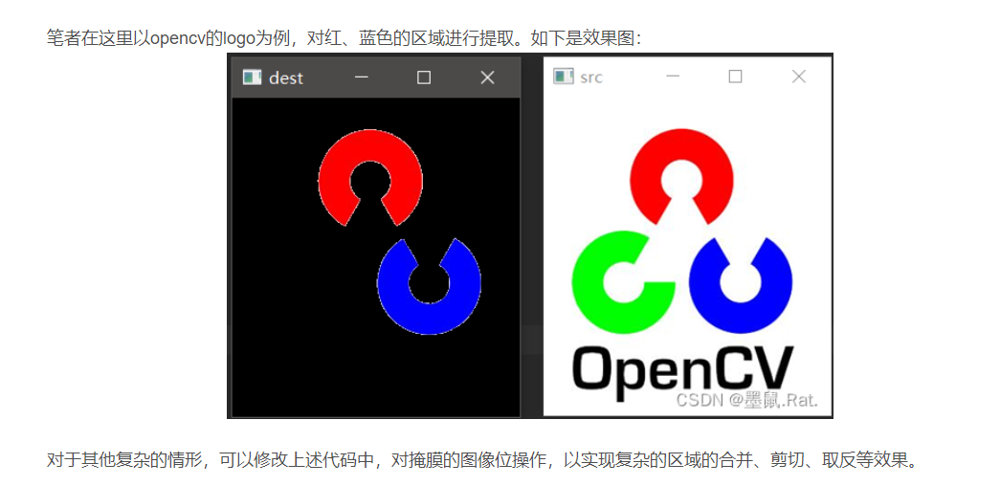
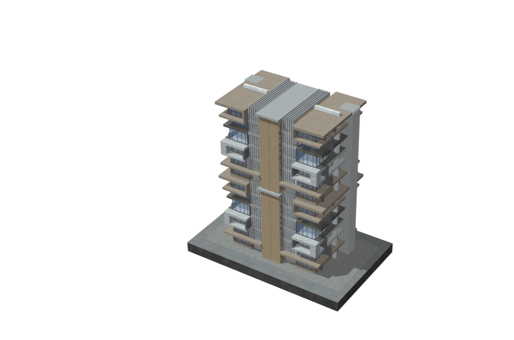

# 3D创意

## 简介

目的是将人**手绘**的场景图形，变成3D立体场景呈现在网页，需要一套规则规定不同地形的颜色，采用（购买）不同的模型进行建模；

## 需求设计

### 详细的色彩到建筑类型的映射

1. **住宅区**
   - 浅蓝色：公寓楼
   - 深蓝色：独立别墅
2. **商业区**
   - 红色：购物中心
   - 橙色：办公楼
3. **工业区**
   - 灰色：工厂
   - 黑色：仓库
4. **公共设施**
   - 紫色：学校
   - 粉红色：医院
5. **娱乐和休闲**
   - 绿色：公园
   - 黄色：体育设施
6. **基础设施**
   - 白色：道路
   - 褐色：桥梁

### 交互性

根据提供的规则进行绘制图形，拍照上传，而后形成记录，当点击记录后呈现一个三维城市模型场景，可以实现缩放、拖动操作。

其它的交互设计

1. 点击建筑可以进行高度调整、层数调整
2. 对不同的建筑实现外观颜色的可选编辑
3. 对建筑区域的点击删除、修改操作

### 大屏设备

由于拍照识别缺乏准确度和约束，产出的模型不一定可靠，当有条件直接在屏幕上直接进行绘制：

1. 提供基本的几何图形供用户拖拽编辑
2. 依然使用颜色代表不同的建筑类型，此时使用网页提供的画笔工具
3. 在不同色块内的区域中设置一些可调节参数，用于确定模型的高度、大小等

## 技术设计

- SVG
- HSV
- THREEJS
- CV库
- 轮廓识别
- 掩膜

### [色彩提取](https://blog.csdn.net/m0_50616665/article/details/124810344)

#### HSV色彩空间:

HSV(Hue,Saturation,Value)是根据颜色的直观特性由A.R.Smith在1978年创建的一种颜色空间，也称六角锥体模型(Hexcone Model)。

1. 这个模型中颜色的参数分别是：色调(H),饱和度(S),亮度(V)。
   1. 色调H:用角度度量，取值范围为0°~360°，从红色开始按逆时针方向计算，红色为0°，绿色为120°，蓝色为240°。它们的补色是：黄色为60°，青色为180°，品红为300°；
   2. 饱和度S:取值范围为0.0~1.0；
   3. 亮度V:取值范围为0.0（黑色）~1.0（白色）。

在图像处理中，选择使用HSV（Hue, Saturation, Value）色彩空间而不是RGB（Red, Green, Blue）色彩空间的主要原因是HSV更接近于人类感知颜色的方式，这使得在处理颜色相关的任务时更为直观和有效。下面是一些具体的原因：

##### 颜色的直观分离
- **色调（Hue）**：在HSV色彩空间中，颜色的“种类”或“色调”是由单一的通道（H）表示的，这使得对特定颜色的搜索和识别变得更加简单。例如，要找到所有的绿色区域，只需查找色调在绿色范围内的所有像素。
- **饱和度（Saturation）**：表示颜色的纯度，纯色至暗色的过渡。
- **亮度（Value）**：颜色的亮度或强度，可以独立于颜色本身来调整。

##### 更好的颜色分割
- 在许多图像处理应用中，尤其是在颜色分割和物体追踪方面，HSV色彩空间提供了更稳定的特性。比如在**不同光照条件**下，HSV能更一致地表示相同的颜色，而RGB在处理阴影和光照变化时颜色的表示会有很大差异。

#####  对光照变化的鲁棒性
- RGB模型中，每个颜色通道的变化直接受到光照强度的影响，这意味着光照的变化会改变三个颜色分量的值，影响颜色识别的准确性。相比之下，HSV中的色调（H）和饱和度（S）在很大程度上独立于光照强度，主要是亮度（V）受光照影响，使得在不同光照条件下色彩的识别更为一致。

##### 更易于阈值操作
- 在HSV空间中，通过简单地设置色调和饱和度的阈值，可以更容易地隔离特定的颜色。这在需要识别或标记图像中特定颜色的应用（如交通标志识别、植物病害检测等）中非常有用。

#### 轮廓识别+色彩提取——opencv+svg图形

将JPG图片转换为HSV色彩空间，对不同颜色给予一个**阈值范围的掩膜**，利用cv库已有的函数进行色块轮廓识别，产出为svg图形，每一种色彩范围对应一种3D模型，前端据此进行绘制建模，呈现在网页中。

##### 图像掩膜

简单来说，掩膜是用一幅二值化图片对另外一幅图片进行局部的遮挡，一般将二值化图称为掩模图像。

比如下图中，用左边的二值化图对中间的彩图进行掩模，掩模的结果如右图所示。

### 区域分割

### 数据库——持久化（可选）

#### 图像表 (Images)

| 字段名           | 数据类型 | 描述                 | 键类型 |
| ---------------- | -------- | -------------------- | ------ |
| ImageID          | INT      | 唯一标识每张图片     | 主键   |
| ProjectID/UserID | INT      | 关联到项目或者用户表 | 外键   |
| ImagePath        | VARCHAR  | 图像文件的存储路径   |        |
| UploadDate       | DATE     | 图像上传日期         |        |

#### SVG区域表 (SVGAreas)

| 字段名       | 数据类型 | 描述                                    | 键类型 |
| ------------ | -------- | --------------------------------------- | ------ |
| SVGAreaID    | INT      | 唯一标识每个SVG区域                     | 主键   |
| ImageID      | INT      | 关联到图像表，表示SVG区域属于哪一张图片 | 外键   |
| BuildingType | VARCHAR  | 建筑类型（如住宅、商业、工业等）        |        |
| SVGPath      | TEXT     | 存储SVG路径数据，用于绘制该区域         |        |
| Color        | VARCHAR  | 表示SVG区域的颜色                       |        |
| PositionX    | FLOAT    | SVG区域在模型中的X坐标                  |        |
| PositionY    | FLOAT    | SVG区域在模型中的Y坐标                  |        |
| PositionZ    | FLOAT    | SVG区域在模型中的Z坐标（如果有3D视图）  |        |

#### **关联和数据处理**

- **图像与SVG区域关系**：一个图像可以关联多个SVG区域，这种一对多的关系通过`ImageID`在`SVGAreas`表中作为外键来实现。
- **数据查询**：当需要获取某张图片的所有SVG区域数据时，可以通过`ImageID`进行查询，这允许系统快速地检索和显示所有相关的建筑区域信息。

### 前端

采取网页/APP形式

**采用网页可以继承现有的三维网页建模展示成果**

需要采购合适风格的3D model——根据性能需求进行减面处理等等

### [模型格式](https://juejin.cn/post/6990182616460722189)

#### OBJ

[OBJ](https://link.juejin.cn?target=https%3A%2F%2Fdocs.fileformat.com%2F3d%2Fobj%2F) 由 Alias|Wavefront 公司为 3D 建模和动画软件 Advanced Visualizer 开发的一种标准，适合用于 3D 软件模型之间的互相转换，目前几乎所有知名的3D软件都支持OBJ文件的读写。**OBJ 格式非常通用**，因为 OBJ 格式描述了三维模型的几何体数据特征，如 点、线、纹理顶点、面、曲线、曲面等。对于 OBJ 格式中材质颜色、纹理信息等，需要通过与之关联的 MTL(Material Template Library) 标准进行描述，MTL 标准通过使用 Phong 反射模型描述物体表面的光反射特性，尽管 MTL 材质标准也已被许多三维软件供应商所支持，但 MTL 格式似乎有点过时，因为它不支持最新的材质模型，比如 specular 高光。此外，**OBJ 标准也不支持对于灯光、动画等场景元素的描述。**

#### glTF

[gITF](https://link.juejin.cn?target=https%3A%2F%2Fwww.khronos.org%2Fgltf%2F) 即 GL Transmission Format，是一种高效传输和加载 3D 场景的规范，由工业界组织 [Khronos Group](https://link.juejin.cn?target=https%3A%2F%2Fen.wikipedia.org%2Fwiki%2FKhronos_Group) 共同提出并维护，旨在统一包括 WebGL、OpenGL ES、OpenGL等在内的所有 GL 相关应用中三维模型资产数据描述规范。 Khronos 组织的发起公司包含 AMD、Apple、ARM、EPIC、Goggle、Intel、IVIDIA、三星、Sony等众多工业界巨头公司，这些公司的许多产品、软件和工具也都支持 glTF 标准的导入导出。glTF 2.0 标准更新于 2017 年 6 月，支持对 3D 场景所需元素的完整描述，如节点、材质、相机、网格、动画、灯光及其它结构。

目前 glTF 已经成为 **Web3D 模型资产标准**，可谓是 3D 领域的 JPEG，主流 Web3D 引擎如THREEJS、Babylon、PlayCanvas、Cocos3D、都支持glTF模型标准。同时，得益于 **glTF 标准具有文件小、加载快、和运行时引擎环境无关**、对 3D 场景的描述完整且全面、灵活可扩展、可写协作等众多优势，在Web3D 实践中大多数人最终选择使用 glTF 模型标准工作流。

##### glTF 标准介绍

###### glTF 模型文件组成

一个 glTF 模型资产通常包含 JSON文件、二进制文件和图片文件：

- **.gltf 模型文件**，JSON 格式的文本文件，用于描述场景中节点层次结构、网格描述信息、材质、相机等，可使用文本编辑器自由编辑，通常会引用外部文件，例如纹理贴图、二进制网格数据等；
- .**bin 二进制文件**，描述 3D 几何体数据、动画、及其它基于缓冲区的数据，.bin 文件可以直接加载到 GPU 的缓冲区中从而不需要额外的解析，因此能够高效传输并快速加载；
- **贴图文件**，用作贴图或法线贴图的图片文件，常见如 .jpg、.png 等格式。

​                           glTF 模型资产文件组成

###### glTF 模型构成元素

如上文所述，glTF 标准描述了一个三维模型场景中的全部内容，包含了对场景结构及场景构成元素的完整描述，如下图所示，为 glTF 模型标准的顶级元素构成及关系概览。

​                       glTF 标准构成元素及关系概览

###### glTF Extensions 扩展

除上文所介绍 glTF 支持的内容外，glTF 标准允许通过增加扩展的方式，来将核心格式中未考虑到的信息纳入其中。[文中](https://link.juejin.cn?target=https%3A%2F%2Fgithub.com%2FKhronosGroup%2FglTF%2Fblob%2Fmaster%2Fextensions%2FREADME.md)列举了 glTF 现有扩展，这些扩展对核心标准中定义的网格、灯光、材质、纹理贴图等进行扩展，其中以 KHR 前缀开头的扩展为 Khronos 官方通过和批准的扩展，以 EXT 前缀开头的为供应商提出和发起的扩展。如下为目前已通过的官方扩展：

- [KHR_draco_mesh_compression](https://link.juejin.cn?target=https%3A%2F%2Fgithub.com%2FKhronosGroup%2FglTF%2Fblob%2Fmaster%2Fextensions%2F2.0%2FKhronos%2FKHR_draco_mesh_compression%2FREADME.md)
- [KHR_lights_punctual](https://link.juejin.cn?target=https%3A%2F%2Fgithub.com%2FKhronosGroup%2FglTF%2Fblob%2Fmaster%2Fextensions%2F2.0%2FKhronos%2FKHR_lights_punctual%2FREADME.md)
- [KHR_materials_clearcoat](https://link.juejin.cn?target=https%3A%2F%2Fgithub.com%2FKhronosGroup%2FglTF%2Fblob%2Fmaster%2Fextensions%2F2.0%2FKhronos%2FKHR_materials_clearcoat%2FREADME.md)
- [KHR_materials_ior](https://link.juejin.cn?target=https%3A%2F%2Fgithub.com%2FKhronosGroup%2FglTF%2Fblob%2Fmaster%2Fextensions%2F2.0%2FKhronos%2FKHR_materials_ior%2FREADME.md)
- [KHR_materials_pbrSpecularGlossiness](https://link.juejin.cn?target=https%3A%2F%2Fgithub.com%2FKhronosGroup%2FglTF%2Fblob%2Fmaster%2Fextensions%2F2.0%2FKhronos%2FKHR_materials_pbrSpecularGlossiness%2FREADME.md)
- [KHR_materials_sheen](https://link.juejin.cn?target=https%3A%2F%2Fgithub.com%2FKhronosGroup%2FglTF%2Fblob%2Fmaster%2Fextensions%2F2.0%2FKhronos%2FKHR_materials_sheen%2FREADME.md)
- [KHR_materials_specular](https://link.juejin.cn?target=https%3A%2F%2Fgithub.com%2FKhronosGroup%2FglTF%2Fblob%2Fmaster%2Fextensions%2F2.0%2FKhronos%2FKHR_materials_specular%2FREADME.md)
- [KHR_materials_transmission](https://link.juejin.cn?target=https%3A%2F%2Fgithub.com%2FKhronosGroup%2FglTF%2Fblob%2Fmaster%2Fextensions%2F2.0%2FKhronos%2FKHR_materials_transmission%2FREADME.md)
- [KHR_materials_unlit](https://link.juejin.cn?target=https%3A%2F%2Fgithub.com%2FKhronosGroup%2FglTF%2Fblob%2Fmaster%2Fextensions%2F2.0%2FKhronos%2FKHR_materials_unlit%2FREADME.md)
- [KHR_materials_variants](https://link.juejin.cn?target=https%3A%2F%2Fgithub.com%2FKhronosGroup%2FglTF%2Fblob%2Fmaster%2Fextensions%2F2.0%2FKhronos%2FKHR_materials_variants%2FREADME.md)
- [KHR_materials_volume](https://link.juejin.cn?target=https%3A%2F%2Fgithub.com%2FKhronosGroup%2FglTF%2Fblob%2Fmaster%2Fextensions%2F2.0%2FKhronos%2FKHR_materials_volume%2FREADME.md)
- [KHR_mesh_quantization](https://link.juejin.cn?target=https%3A%2F%2Fgithub.com%2FKhronosGroup%2FglTF%2Fblob%2Fmaster%2Fextensions%2F2.0%2FKhronos%2FKHR_mesh_quantization%2FREADME.md)
- [KHR_texture_basisu](https://link.juejin.cn?target=https%3A%2F%2Fgithub.com%2FKhronosGroup%2FglTF%2Fblob%2Fmaster%2Fextensions%2F2.0%2FKhronos%2FKHR_texture_basisu%2FREADME.md)
- [KHR_texture_transform](https://link.juejin.cn?target=https%3A%2F%2Fgithub.com%2FKhronosGroup%2FglTF%2Fblob%2Fmaster%2Fextensions%2F2.0%2FKhronos%2FKHR_texture_transform%2FREADME.md)
- [KHR_xmp](https://link.juejin.cn?target=https%3A%2F%2Fgithub.com%2FKhronosGroup%2FglTF%2Fblob%2Fmaster%2Fextensions%2F2.0%2FKhronos%2FKHR_xmp%2FREADME.md)

#### 3D模型

