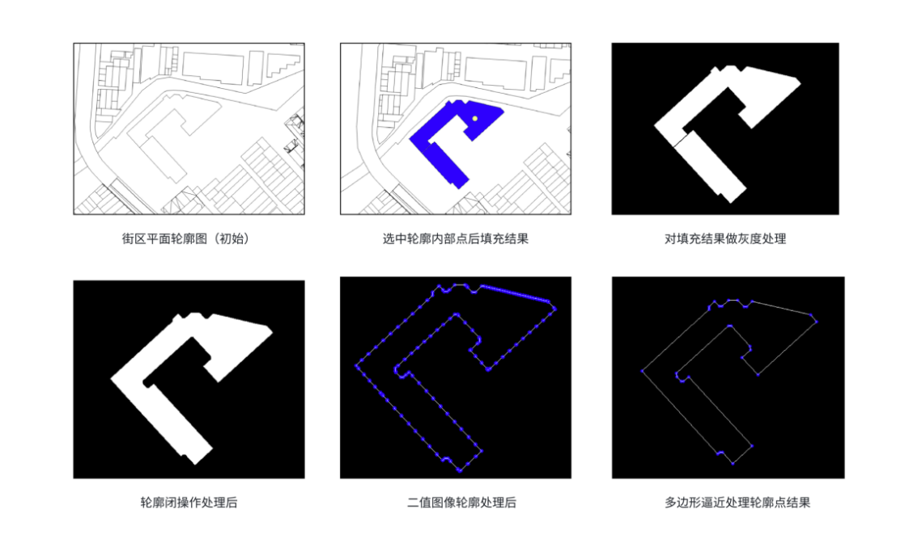

## 设计方向

### 方向一

直接从平面到模型建立，不同的区域由用户调整参数（高度、切割等等），构建出形状各异的白模模型，而后位置也相对确定，直接映射到平面设计图中，每个（组）轮廓构建出独立的模型，而后进行选中编辑（可以单个模型也可以实现拓展反复利用）

#### 我认为存在的问题

1. 如果想要以任意水平（年龄、专业性不同）用户画出的建筑轮廓进行轮廓识别，并且直接从一张固定完整的轮廓图中选择某一片区域进行构建：
   1. 随手的画出的轮廓，不能保证（合理限度的，算法能够精确处理的）的不规则、抖动，轮廓无交叉接触、断点。
   2. 由于a中存在的问题或其他原因，当用户画完轮廓图之后，模型构建了一半，其想要修改某一部分的轮廓图底座，对瑕疵手动调整，该如何有效执行？
2. 如果用户由需求如下：我为什么不可以选中一大块区域，这个地方为什么不可以批量放置我想要的模型（譬如小区存在多个单元楼）？
   1. 通过轮廓图直接拔地而起，并不合适，缺少一个缓冲地带
   2. 如果用户拖出来一个已经构建好的模型，在已有基础上进行修改，拉伸等操作，似乎更加便捷
   3. 批量构建情境下，参数化构建困难

### 方向二

基于色块，进行网格划分，模型事先预制，参照植物大战僵尸的植物放置，简单高效。

#### 我认为存在的问题

1. 网格化划分，降低难度，但是模型底座网格划分难以将空间充分利用
2. 网格的利用方式未明确
   1. 只是做为模型参照
   2. 固定不同颜色对应的不同模型放置其中
   3. 只是填充一个box，后续加载白模甚至精细模型，由用户来选择

### 方向三——糅合

整体思路，将单个建筑模型生成构建和城市（建筑群）模型渲染隔离进行。

1. 单个模型的构建：由用户提前生成，不是利用一整个区域轮廓，而是提供单个建筑轮廓图，进行调整并固化为一个模型
2. 城市的组织：
   1. 色块-模型对应，进行简单的色块网格划分，批量模型填充放置，但是仍然保留切换模型的选择
   2. 直接拖动模型放在指定位置，这个过程可以只显示模型的原生底座即可
   3. 在组织过程，默认不进行模型渲染，只显示模型底部轮廓内部嵌入模型名称，减轻设备负担；组织完成后，用户可以选择一次性渲染，此时基于底座直接进行城市模型的拔地而起
3. 模型的编辑：
   1. 基于轮廓的单个模型参数化构建（师兄有现成算法）
   2. 如果，能利用js模型编辑，可以考虑基于模型的调整然后再生成新模型，用于城市组织