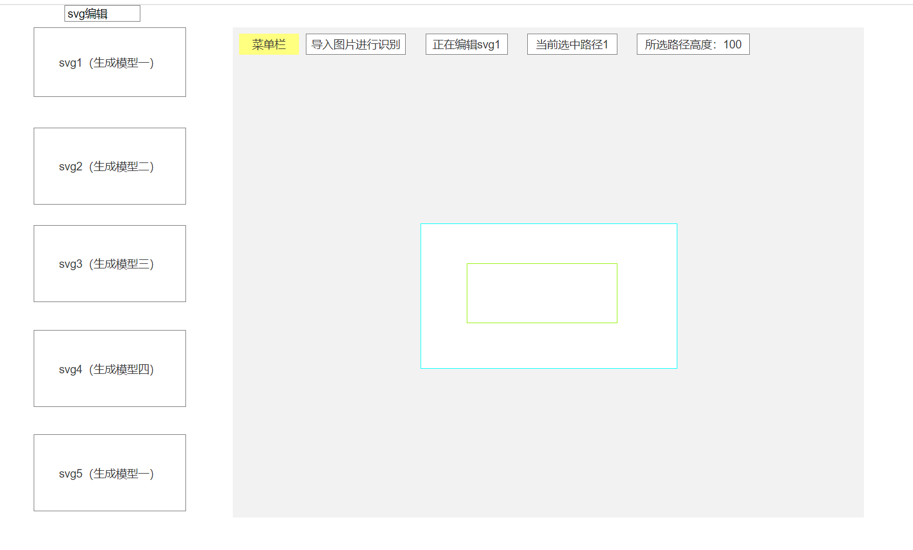
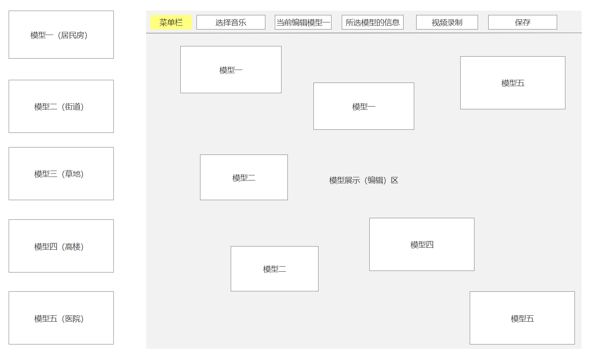
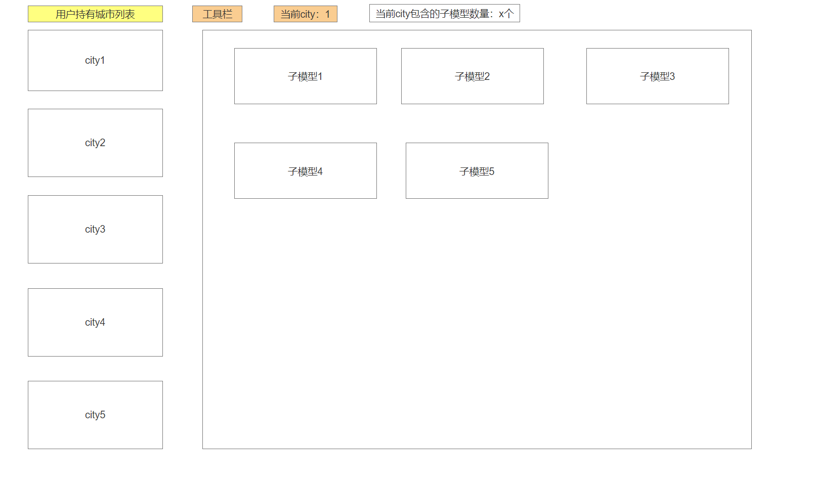
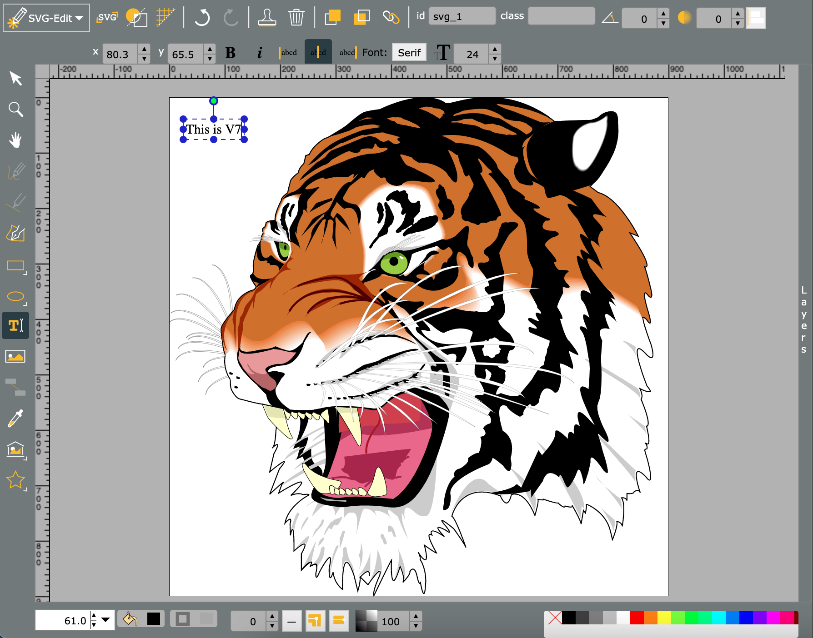
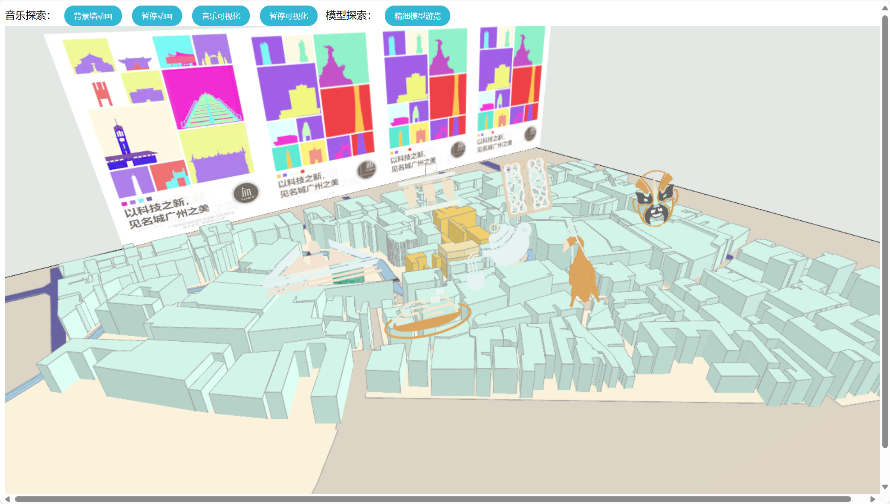
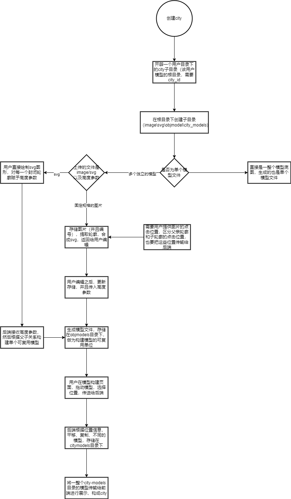

[TOC]

# 3d建模业务流程以及技术参照

## 业务场景概述

1. 用户提交单个模型的轮廓底图和高度参数

2. 构建出一个个独立模型

3. 用户组织模型构建city

4. 为城市city选择音乐——音乐可视化

5. 录制视频（通过相机移动等操作）

   

## 前端demo（线框图）

1. 用户上传图片或者提供直接构建svg

   

2. 模型编辑（城市构建）

   

3. 用户的city记录生成

   

## [svg编辑——开源库](https://github.com/SVG-Edit/svgedit)

### 项目简介

是一个轻量级且功能强大的纯前端SVG图形编辑工具。它允许用户直接在浏览器中创建、编辑和保存SVG（可缩放矢量图形）文件，无需安装任何桌面应用。该项目基于Web技术，如HTML5 Canvas与SVG，实现了图形绘制、修改和导出的一系列功能。

### 技术分析

#### 核心特性

1. Web技术驱动 - SVG-Editor 利用HTML5的技术栈，包括Canvas用于绘图操作，SVG用于图形呈现，以及Web Storage或IndexedDB实现数据持久化。
2. 实时预览 - 用户的每次更改都会立即反映在预览窗口，提供无缝的创作体验。
3. API支持 - 提供了丰富的JavaScript API，可以方便地进行扩展和集成到其他系统中，例如自定义工具、调整界面等。
4. 可配置性 - 通过设置JSON配置文件，用户可以根据需要调整工具栏布局和默认选项。

#### 技术架构

项目采用模块化设计，主要由以下几个部分组成：

1. UI框架 - 使用React进行界面组件的构建。
2. 图形操作 - 基于svg.js库处理SVG图形的生成和修改，提供了一套直观的接口。
3. 存储管理 - 利用localStorage或indexedDB本地存储用户的SVG代码，支持在线编辑和离线工作。
4. 通信协议 - 提供WebSocket接口，支持与其他服务进行实时协作。

### 在本项目中的参与环节

1. 从图片png上传后端扫描出轮廓svg，交付此处进行编辑
   1. 优势：用户绘画更加自由
   2. 技术环节：根据师兄的代码，从图像到轮廓需要对不同的连通区域提供**点击位置**，每次点击位置识别最外层（父）轮廓，最后进行组合，而后**需要高度参数**（目前是基于一整条轮廓点高度进行白膜构建），同时返回的轮廓也需要一定的可编辑性（借助svg-edit）,交互环节偏多
2. 直接利用svg-edit编辑器构建底层
   1. 优势：省去轮廓识别环节，结合高度参数可以直接构建白模
   2. 探索：利用svg-edit直接进行svg构建，高效，功能丰富，非常好用

## 技术选型

1. Vue（前端核心）——师兄的恩宁路成果、3D-loader777，**挂载React框架的svg-edit子模块**
2. Media-Record库
3. Actix-Web框架+Diesel

### [已有技术成果](http://106.53.212.120:9000/vite_test/)

师兄的恩宁路可视化：该系统基于three.js与vue框架搭建，白模构建的过程采用了轮廓提取以及三角剖分的相关技术（此 部分的技术文档放置在文末资料中，本文档主要介绍可视化相关的技术），文化图标（粤剧，烧鹅，脸 谱等）则使用blender渲染得到，可视化部分的技术则主要使用到了Web Audio，Video Texture，Ray caster等。

#### 可借鉴元素

1. 音乐律动效果（音乐可视化）
2. 模型加载
3. 射线拾取，选中单个模型进行互动
4. 视频纹理

#### 缺失

1. 就模型加载功能，师兄将模型文件放在项目中，做为静态资源，无法实现动态加载生成。
2. 没有模型编辑功能。

### [svg-edit外部库](https://svgedit.netlify.app/editor/index.html)

1. 做为一个子模块，挂载到最外层vue框架项目下即可
2. 原版是“单机版”，额外需要做到针对用户的后端存储
3. 需要熟悉React框架，添加高度参数的输入功能，以提供给后端进行处理

### 模型加载展示（简单编辑功能）

1. 借鉴师兄已有代码（vue）框架

   1. 音乐律动
   2. 射线拾取等等

2. 一个小型开源组件[3d—loader](https://king2088.github.io/vue-3d-loader-docs/zh/guide/event.html)（vue），功能实用，目前代码量较少，方便拓展阅读：

   1. vue-3d-loader是vueJS + threeJS整合的一个3d展示组件。

      支持.dae/.fbx/.gltf/.glb/.obj/.ply/.stl/.json，并支持同一个场景导入多个不同3D模型，支持mtl材质以及jpg/png等图片纹理

   2. 加载多个模型并单独设置模型位置

   3. 播放/停止动画

   4. 克隆相同模型

   5. 点光源跟随相机移动

   6. ....

### [视频录制](https://juejin.cn/post/7005113182247190541)

应用：为了供使用者进行展示拓展，也是为游览街区体验留下记录，提供给家长或者学生进行分享，考虑结合音乐律动、相机移动进行视频录制

#### MediaRecorder

1. 基本功能：可以录制任何的媒体形式标签，例如`<audio>`, `<video>`, `<canvas>`。`<audio>`, `<video>`可以是网络上的媒体文件，也可以是本机的设备采集（麦克风和摄像头）。 `<canvas>`的内容更自由，任何绘制在**画布上的用户操作，2d或3d图像**，都可以进行录制。录制结果是`标准编码后的媒体数据流`，该流可以注入`<video>`标签，也可以打包成为文件，甚至可以进一步进行流级别的数据处理（例如：画面识别，动态插入内容，播放跳转等）。引用至[MediaRecord](https://link.juejin.cn?target=https%3A%2F%2Fcloud.tencent.com%2Fdeveloper%2Farticle%2F1366886)。媒体数据流的编码过程由浏览器实现，因此依赖于浏览器的能力。
2. 支持平台：**Chrome和firefox支持性好。移动端兼容安卓内置的chrome内核浏览器。ios和ie不支持。**

### 后端框架

已有部分实现（搭建了数据库表以及核心功能代码的转换（python->rust）），项目结构类似spring boot，较为易用

1. Actix-web
   1. rust_高性能
2. Orm——Diesel

