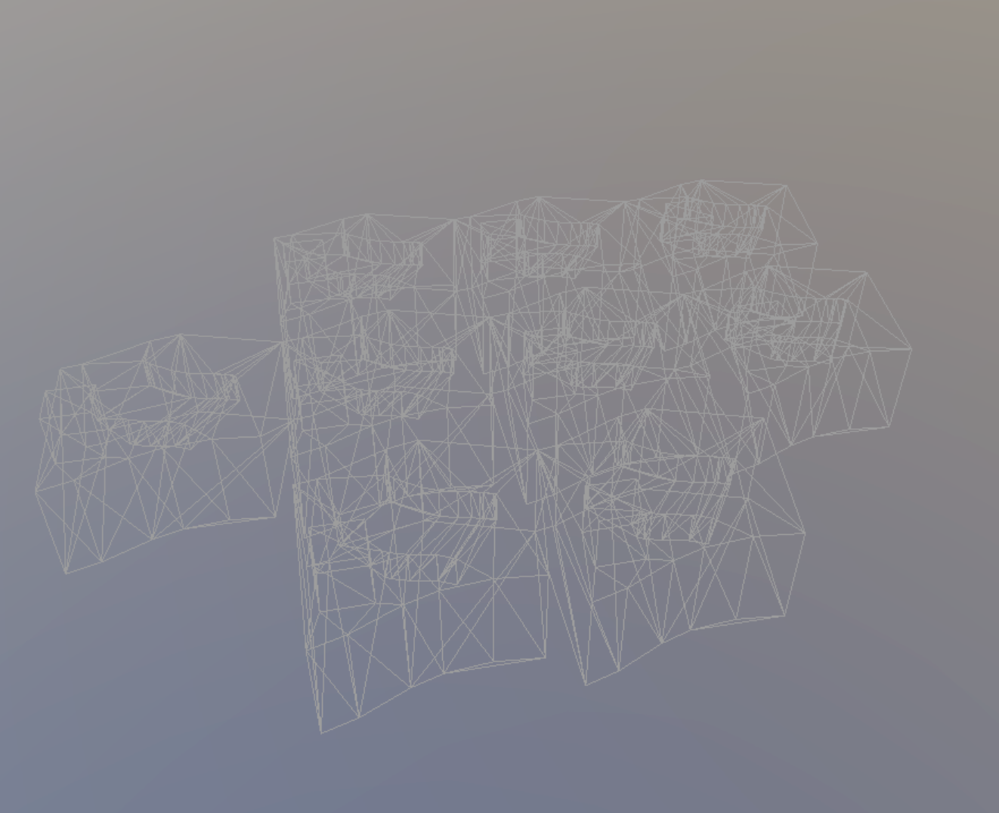
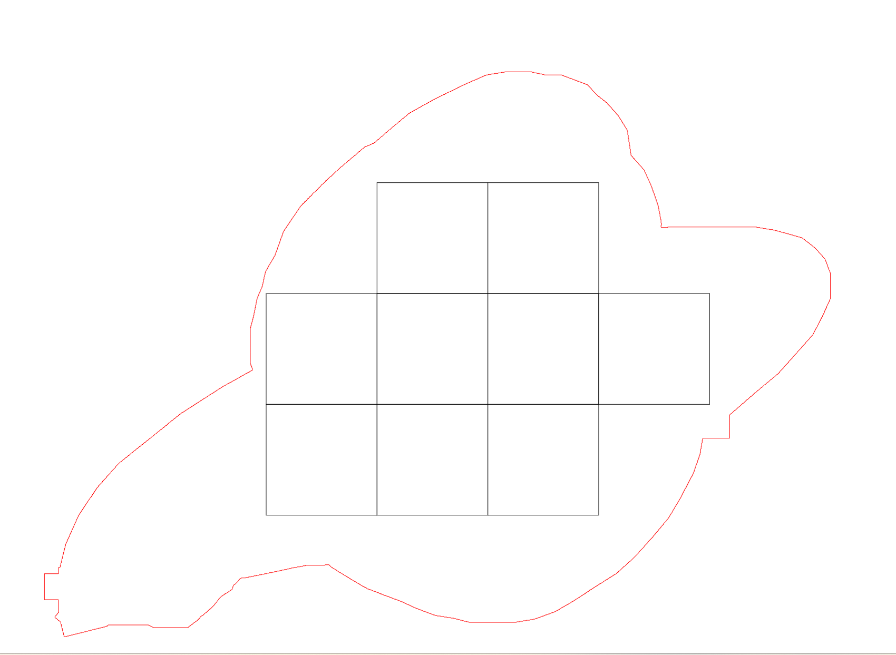
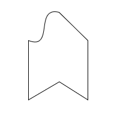
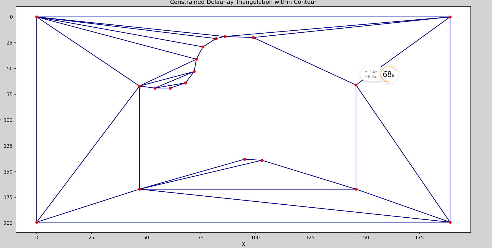
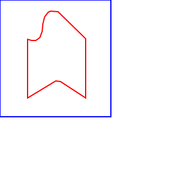
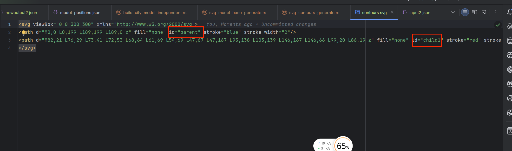
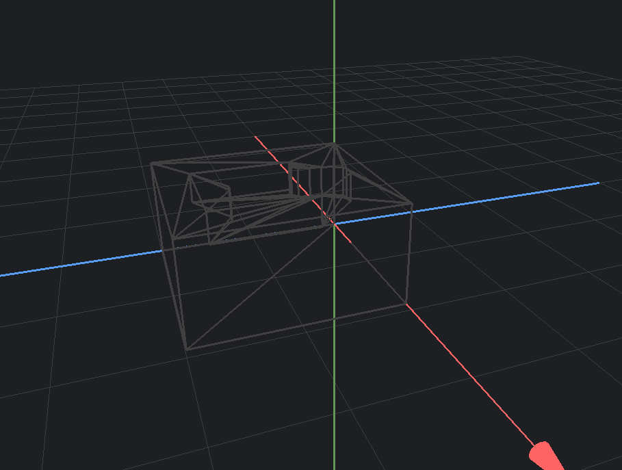
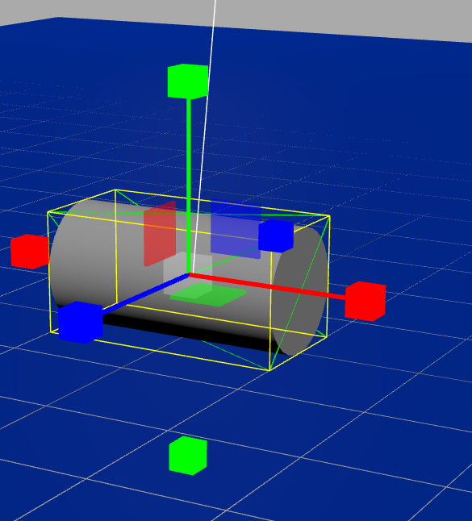

# 2d到3d的工作报告(需求设计)

## 基于色块的网格化模型铺设

- 输入：色块图、模型和色块对应关系

  .png)

- 输出：模型铺设网格、合并后的模型

  

  

- 算法：轮廓识别（核心）、网格分割

- 应用方向：利用网格进行参数化模型铺设（可参考植物大战僵尸）

## 2d平面地图到3d模型的参数化构造

- 外部开源库：svg路径编辑器（https://github.com/methodofaction/Method-Draw和https://github.com/SVG-Edit/svgedit）

  <video src="./../../../../wechatfiles/WeChat Files/wxid_oapygbetbx6622/FileStorage/Video/2024-09/7d0bb4bc020ece9aed47cfc08755abea.mp4"></video>

  <video src="./../../../../wechatfiles/WeChat Files/wxid_oapygbetbx6622/FileStorage/Video/2024-09/215a2ee54cb1106844bdb9409e99a963.mp4"></video>

- 算法：轮廓识别、三角剖分等

- 输入参数：轮廓地图、点击位置、高度参数

- 输出：3d模型

- 预计实际使用流程：

  1. 用户提供图片（模型底座轮廓图形）

     

  2. 输入多个点击位置（每个不同的点击位置提取最外层轮廓）

  3. 输出结果：

     1. 三角分割图片（开发者可见）

        

     2. svg文件（用户可见，利用svg编辑器进行调整）

        以路径形式存储轮廓，每一个轮廓对应一个path，并配有id，区分父子关系

        每一个轮廓在json传输配有height参数（单个点也有高度参数，但是每个点不同高度参数有待开发），预计用户可以单独对每一个轮廓进行参数化高度调整（进一步开发成-拖动，交互性好的高度调整方式）

        

        

        

     3. 输出模型（白模）

        

## 3d模型编辑

- 开源的https://threejs.org/editor/

  

- 难度较大，需要长期持续投入

## 总体功能设计

- 应用场景

  1. 城市记忆：参观某地之后，根据记忆绘制平面轮廓，通过参数化调整，构建记忆中的街区建筑景观
  2. 城市控规图：在沟通、会议场合，基于平面的控规图显然不够直观，信息量少，利用此技术将平面拔高，进行信息绑定，便于展示
  3. 房产开发：区别于传统的楼盘模型，通过该技术可以进行，对楼栋进行信息绑定，即此3d模型上可以携带“地契”

- 功能需求：

  - 单个模型的构建，储存，重复利用

    - 利用色块，网格划分，拖动等进行模型批量铺设

  - 一整个模型的参数化构造（与单个模型同理，但模型粒度不同）

  - 基于模型的信息绑定

  - SVG图形轮廓的编辑调整

    

    