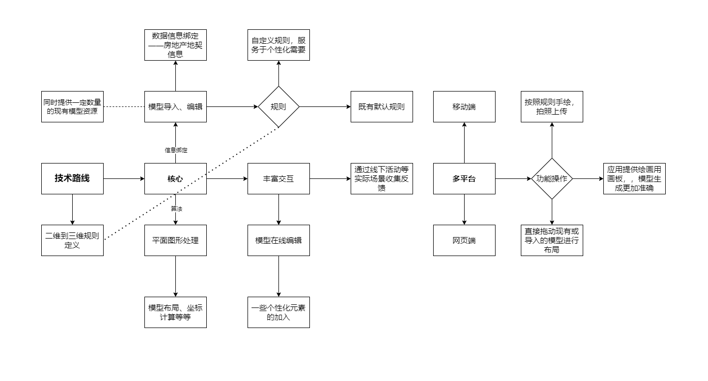
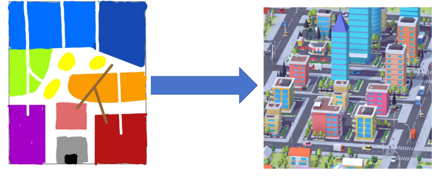
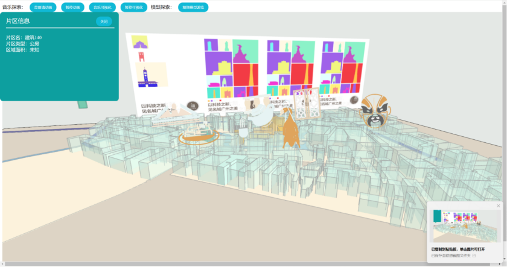

# 3D创意：从二维平面拔地而起的三维城市

## 创新训练立项依据

### [研究目的](https://m.thepaper.cn/detail/25639681)

21 世纪以来，大数据、云计算、人工智能等新兴技术风起云涌，并逐步渗入社会各行各业。伴随时间的推移，技术的不断成熟已经是不可限制的发展趋势，随之而来的挑战势必也会越来越严峻。传统的知识型人才已不足够满足当下和未来社会的需求，为了应对知识经济时代带来的一系列挑战，提高学习者应对未来多元的、变幻莫测的情境的能力，培养具备创新型、实践型与知识型于一体的人才成为我国当前人才培养的目标追求。《教育信息化“十三五”规划》中强调，要不断地推进信息技术在教育教学活动中的广泛应用，积极创新教学模式，提高学生的实践能力与创新能力。

伴随信息化时代人才培养教育教学工作的不断尝试，作为[创客教育](https://baike.baidu.com/item/%E5%88%9B%E5%AE%A2%E6%95%99%E8%82%B2/55021042)以及[STEM](https://www.forest-academy.com/stem%E6%95%99%E5%AD%B8%E8%AA%B2%E7%A8%8B) 课程等新兴课程的分支学科——3D 建模逐渐走进教育研究者以及教育工作者的视野。3D 建模是创建模型、制作三维动画和三维游戏的重要工具，学生主要利用 3D 建模软件来创建基础模型，制作作品，将创意化为现实。

近年来，不少教育工作者会引导学生制作3D模型，但大多需要教师的演示，学生总是在机械性地模仿，缺乏创意。同时，由于制作3D模型大多脱离不开对学生较为陌生的设计软件，学生学习使用成本高，对其缺乏兴趣，相关文教工作效果并不理想。

随着计算机技术、图形学技术、虚拟现实技术和Internet的迅速发展，实现Internet上的虚拟现实应用已经成为可能。目前3维可视化已经广泛应用于城市规划、建筑设计、地质勘探、气象预报、环境监测、移动通信等许多领域。但是用于文化教育工作，大多现有技术应用存在效率不达标、复杂度高等问题。

如果有一种方式可以将简单的平面色块转换为一个个3D模型，并且呈现在电子设备上，可以进行一定的编辑，或者通过简单的拖动实现城市模型的构建，那每一位有意参与者都可以通过这种简单直观的方式表现他们对城市布局、街区设施分布等情景的设想，并最终收获一个随时可以查看编辑的“数字化沙盘模型”。

该技术的实现应用，将为场景建模以及3D建模教育提供一种新思路，其尽可能回避枯燥的专业知识和软件操作的学习，使用者易上手，参与度高，可以减少机械的模仿，尽情地发挥自己的创意，拓展思维并感受3D建模的魅力所在。

 

### 研究内容

1. 规则定义的二维色块到3D模型场景转换

2. 便捷直观的3D模型编辑交互

3. 文化教育和数字化技术的融合

4. 3D模型实现信息绑定功能
5. 多平台、多种设备的数据共享

在信息化社会的背景下，结合[STEM](https://baike.baidu.com/item/stem/2641759)教育和[创客](https://zh.wikipedia.org/zh-hans/%E5%88%9B%E5%AE%A2)文化，开发一个具有强大功能的3D建模平台可以显著提升教育质量和学习的互动性。这样的平台不仅能够应用于科学和工程教育，还可以扩展到历史和文化学习，让学生通过实践操作深入理解抽象概念。

#### 1. 规则定义的二维色块到3D模型场景转换

在STEM教育中，将抽象的概念具象化是帮助学生理解复杂理论的重要方法。通过开发一个可以将二维设计自动转换为三维模型的工具，学生可以直观地看到设计的立体效果，这对于工程和建筑学等领域尤为重要。

通过开发基于图像识别和机器学习的算法，自动识别二维图像中的色块并按照预设规则转换为相应的3D模型。例如，教育者可以定义不同的色块对应不同的建筑材料或自然元素，使学生能够通过修改二维图像来探索其对三维场景的影响。

#### 2. 便捷直观的3D模型编辑交互

提供一个直观的3D模型编辑工具和丰富的3D模型资源对于教育至关重要，它允许学生在实践中学习和创造，强化了技术教育的互动性和实践性。

项目成员将致力于开发一个用户友好的编辑界面，支持拖拽、缩放、旋转等直观操作，并提供实时反馈。此外，集成教程和模板，帮助学生快速学习如何使用工具，该设计会在行进3D建模领域的新赛道，有别于Blender、Unity等广受业内人士的喜爱的专业建模软件，本项目成果将凭借易用性特点服务于学生群体或是简单的工作生活场景，将助力于激发学生的创造力和解决问题的能力。

#### 3. 文化教育和数字化技术的融合

数字化技术的融入可以极大地丰富文化教育的内容和形式，使传统文化教育更加生动和易于接受。

在3D模型中绑定丰富的文化和历史信息，通过虚拟展览或互动教学活动，让学生在探索三维场景的同时，了解相关的历史背景和文化故事。

#### 4. 3D模型实现信息绑定功能

信息绑定功能使得3D模型不仅仅是视觉展示工具，更成为知识传递的媒介。

为每个3D模型创建元数据，包含相关的说明、数据和参考资料链接。通过点击模型中的特定部分，学生可以获取详细信息，增加学习的深度和广度。

在房地产领域，3D模型结合信息绑定功能可以极大地提升房地产的展示、教育和市场分析效率。通过在3D房地产模型中绑定详尽的元数据，用户不仅能够从视觉上感受房产特性，还能深入了解其详细信息，如建筑材料、设计理念、价格、历史变迁及相关法规信息。这种方法尤其适用于教育领域中的房地产课程、专业培训、以及房地产市场的消费者教育

#### 5. 多平台、多种设备的数据共享

确保数据资源的广泛可达性和实时更新是现代教育技术的关键。

使用云基础设施存储模型和数据，对用户数据进行持久化存储，确保用户都能在任何设备和任何时间上传、访问内容。开发跨平台的应用程序，支持从桌面到移动设备的无缝学习体验。

通过这些策略的实施，该项目不仅可以增强学生的学习体验，还能提供一个多功能的平台，支持从技术到文化的教育应用，符合信息化社会对教育多样性和可访问性的要求。

### 技术路线

本项目的技术路线聚焦于通过高级3D建模和数据处理技术，创建一个功能全面的模型编辑和数据绑定平台。项目的主要目标是实现二维数据到三维模型的无缝转换、增强的3D模型编辑能力、以及多平台数据共享功能。以下是该项目技术路线的核心组成部分：

#### 1. 规则定义的二维到三维转换

在本项目中，我们将开发一种技术工具，专门针对将简单的二维色块绘画自动转换为三维模型。这种技术利用先进的图像识别算法来解析二维绘画中的色块，按照用户选择的模型对应关系将其转化为三维模型。这一过程不需要复杂的工程图纸或专业绘图，而是通过直观的色块布局来实现，使得任何初步的设计概念都能迅速成型并可视化。

在教育领域，这项技术尤其具有价值。它可以被整合到STEM课程中，作为教学工具帮助学生理解基本的几何概念和设计原理。学生可以通过绘制简单的二维色块图案来创建复杂的三维模型，这种直观的转换过程不仅增强了他们对形状和空间关系的理解，也激发了他们对创新和设计的兴趣。通过这样的实践，学生能够更加直观地掌握从概念到创建的整个过程，为未来在技术、工程、艺术和数学领域的学习和创新奠定基础。

#### 2. 便捷直观的3D模型编辑交互

该项目致力于开发一个用户友好的3D模型编辑平台，该平台将配备一系列直观的操作功能，如拖拽、缩放和旋转，使得任何没有专业背景的用户都能轻松上手。这个界面不仅仅局限于基本操作，还将集成多种编辑工具。例如，自动对齐功能可以帮助用户快速整理模型组件，确保精准的对齐和布局；或者根据需要修改模型的尺寸和形状；而参数化设计选项则提供了一种灵活的方法，让用户能够通过调整一系列预设参数来自定义模型的各个方面。

这样的设计使得平台不仅适用于初学者和业余爱好者，也能满足更有经验用户或教育工作者的复杂需求。通过提供这些工具，我们旨在降低3D建模的技术门槛，使更多人能够参与到3D创作和教育中来，从而拓展他们在数字创新方面的能力。

#### 3. 文化教育与数字化技术的融合

在这个结合3D建模技术与城市和街区建模的项目中，我们专注于创建一个实用且易于使用的模型编辑和信息绑定平台。该平台旨在通过可视化城市数据来增强规划和教育应用的有效性，主要适用于教育工作者和学生用户群体。

通过先进的算法，我们能将简单的二维设计或色块图案转换成详尽的三维城市模型。这一技术使得用户可以从基本的平面图起步，自动生成城市或街区的三维表现，极大地简化了从概念到模型的过程。在教育方面，学生可以利用这一技术来学习城市设计的基本原则，通过实际操作来理解空间规划和城市发展的复杂性。

平台将提供直观的3D模型编辑工具，使用户能够通过拖拽、缩放和旋转等操作直接在模型上进行修改。这些工具不仅简单易用，还包括自动对齐和模型优化等高级功能，支持更复杂的用户需求。此外，这些工具在教育应用中同样重要，它们允许教师和学生在探索城市规划和建筑概念时，进行即时的模型调整和实验。

模型信息绑定功能够为每个建筑或街区模型绑定丰富的背景信息，如历史数据、建筑功能和环境影响等。这些信息通过点击模型中的相关部分即可访问，提供了一个互动的学习和展示平台，用户不仅看到建筑的外观，还能深入了解其文化和功能意义。

应用支持多平台操作，确保在不同设备上都能无缝访问和编辑模型。无论是在台式机、笔记本电脑还是移动设备上，用户都能通过云平台同步他们的项目和模型，支持团队协作和远程教育。

#### 创意设计展示

**住宅区**

浅蓝色：公寓楼

深蓝色：独立别墅

**商业区**

红色：购物中心

橙色：办公楼

**工业区**

灰色：工厂

黑色：仓库

**公共设施**

紫色：学校

粉红色：医院

**娱乐和休闲**

绿色：公园

黄色：体育设施

**基础设施**

白色：道路

褐色：桥梁

### 国、内外研究现状和发展动态

网络教育（E-learning），特别是基于互联网的教育平台，在全球范围内呈现迅猛发展态势，为学习者提供了前所未有的便利和资源。这种新型的学习模式，通过多媒体网络学习资源、在线学习社区及先进的技术平台，让学习者可以在任何地点通过互联网接入教育内容，实现灵活的学习方式。

随着计算机和网络技术的不断进步，引入三维虚拟技术成为网络教育领域的一个重要发展方向。特别是在信息技术教育中，基于虚拟现实的多媒体教学资源和个性化教学环境的开发，不仅能够提供丰富的学习体验，还可以通过模拟复杂的实际情境，加深学习者的理解和应用能力。

目前，虚拟建模技术在教育领域的应用已经展示了其潜力，如数学的几何体建模和化学分子结构的演示等。然而，这项技术在城市建筑模型教育中的应用仍然较少，这表明在此领域存在进一步开发和应用的空间。

尽管当前城市三维（3D）模型建设面临着周期长、成本高和共享性差等挑战，但已有的研究提出了一种基于城市引擎软件的规则定义的快速构建方法。这种方法不仅能够利用现有的二维数据快速建模，还通过构建通用的城市模型规则库来促进模型的广泛应用，如在规划领域的指标分析和通视分析等，显著节约了资源和成本。

然而，这些系统大多数仍旧集中服务于需要深度技术支持的专业领域，设备和用户技能要求较高，且在快速反映创意和提供即时沟通方面存在限制。此外，这些技术在文化教育领域的应用还相对有限，未能充分发挥其在教育传播中的潜力。

鉴于这些背景和挑战，我们的项目旨在开发一个既适合教育也适合专业应用的平台，通过简化的用户界面和增强的交互性，使得3D模型不仅限于专业人士，而是能够广泛用于文化和教育传播，增强其普及性和实用性。

参考文献：

​	[[1]刘媛,左效刚,石增宇.规则定义的城市三维模型快速构建方法[J].北京测绘,2024,38(04):482-488.DOI:10.19580/j.cnki.1007-3000.2024.04.005.](https://kns.cnki.net/nzkhtml/xmlRead/trialRead.html?fileName=BJCH202404005&tableName=CJFDTOTAL&dbCode=CJFD&topic=&fileSourceType=1&taskId=&from=&groupId=&appId=KNS_BASIC_PSMC&ts=1721556691562&act=&SsoTokenId=&SharedTextId=&invoice=WshyeYtUsZATTl3wpJjXQGyVhNdBLokAGJY6%2b3y7gMo1BEAI4W3GFMmyPB9YHSA6y47yTyqauO1Qu8vBrgOvLIn0OaTStIZA5VIAsPbK4rTz8IzFaDuy02%2blC3XZ%2bSPsr9kZkiRgtwzJjN2fu14IVSJkr8wFvNBJ%2bbSOU78IhBQ%3d)

​	[[2]金宝轩,边馥苓.面向Internet的虚拟城市模型的可视化研究[J].测绘通报,2005,(05):22-26.](https://kns.cnki.net/nzkhtml/xmlRead/trialRead.html?fileName=CHTB200505006&tableName=CJFDTOTAL&dbCode=CJFD&topic=&fileSourceType=1&taskId=&from=&groupId=&appId=KNS_BASIC_PSMC&ts=1722419992210&act=&SsoTokenId=&SharedTextId=&invoice=mIp4QxsfvQMN2CIrG3GG8oKj1oJXe%2bCWwgCHGCjtMPXvIaU0HsxMb1%2fAa2%2fme%2btXqjUIHcHsJmlx4I4mwrcrtOWuplwTKC9t5yB6%2bZYUsL25uL4wwAnnbGzzsvSYh7ZdWYl5UvxJ3%2fWDVD567Bkvg%2bHfz%2bC%2bv5%2fyhaf%2b7kCYgGU%3d)

​	[[3]邓文新.Web3D技术的教学应用研究[J].现代教育技术,2002,(04):68-71+80.](https://kns.cnki.net/kcms2/article/abstract?v=O_Pen4SgC0A_l0_0JFQdxaCv_gNkzhRER--ic5-rTcNKcFlEa6gxIYAhZ2zutBWtR6Ft4rS2WrpTMk8zyOso3U48a5tQInnwmzTrs12FQGvz8l8EIkpEqsWw3Vk-qNNZQ-pjhQ7j7w2XyzgJo1SME4QkBCIQWSCFe-YKskjSDoKrqj2qAtSVoUqJuYAgzm3K5g0c-D_4bkxxuHHOjs-oLB9YxBysE4yer8fxgdpizGg=&uniplatform=NZKPT&language=CHS)

### 创新点与项目特色

#### 创新性

本项目的核心创新在于其将城市设计和文化教育结合的能力，通过可自定义的二维到三维的转换技术，使城市规划的可视化不仅限于专业人员。这种技术的推广有助于提高公众对城市设计的认识和参与，特别是在城市规划和文化遗产教育方面。同时，项目将会开发在线社区平台进一步加强用户的互动和参与感，通过讨论区、共享设计和实时反馈功能，增强了用户体验，使其成为一个有生命力的持续互动平台。

为确保社区的活跃和教育的实效性，平台将包括多个互动板块，如教程、工作坊、设计挑战和文化展览等。这些板块不仅服务于专业人士和学生，也欢迎公众参与，通过直观的工具和引导，帮助他们理解复杂的城市设计概念和文化背景。

#### 可拓展性

项目设计考虑到高度的可拓展性，使其能够迅速适应多变的需求。二维到三维的转换工具采用模块化设计，可以根据实际情景的具体需求进行调整。随着技术的进步和用户需求的发展，平台可以引入新的工具和功能，如增强现实(AR)和虚拟现实(VR)体验，使用户能够以全新的方式探索和体验城市模型。这种前瞻性的设计使得项目能够持续进化，保持其在教育和专业市场中的竞争力。

通过这种创新和可拓展的设计，本项目旨在不仅仅成为一个工具或平台，而是成为推动城市设计和教育发展的动力，为广大用户群体提供价值。

#### 可访问性

本项目还特别强调了可访问性，确保所有用户，无论其地理位置或技术能力如何，均能轻松访问和利用这些资源。通过良好的Web平台和响应式设计以及移动端、客户端应用开发，用户可以在各种设备上—无论是台式机、笔记本、平板还是智能手机—无缝体验所有功能。

这种对可访问性的关注，不仅使项目能够吸引更广泛的用户群体，还有助于实现项目的目标：使3D城市建模技术的精彩世界为更多人所了解和参与。通过提供易于使用的工具和资源，项目鼓励更多的社会参与和教育机会，促进全民对城市规划的参与积极性以及对3D渲染建模技术的理解。

### 项目研究进度安排

 

| 时间 | 进度安排                                                     |
| ---- | ------------------------------------------------------------ |
|      | 结合有关专业人士和调研结果进行系统设计                       |
|      | 搭建系统模块，实现核心功能部署                               |
|      | 次要功能完善优化                                             |
|      | 进行局部投用测试，收集反馈进行调整                           |
|      | 继续完善设计，进行成果整合，提交结题报告                     |
|      | 项目具体时间安排根据实际情况进行调整，每两周开会讨论项目进展 |

 

### 项目预期成果

**构建一个完整的二维转三维系统：**实现移动设备的APP开发以及网页开发，二维平面图不仅限于纸张绘制拍照上传，也可在支持绘画的电子设备上进行有规范约束地或自由地绘制后直接上传，最终呈现3D城市模型于设备上，并提供一定程度的模型可编辑性以及生成持久记录。

**提交 1 篇研究报告：**反馈项目价值，展示推广效果，进一步给出改善意见。

### 已有基础

本项目是《恩宁路创意空间》的深化拓展：现已有平面轮廓识别算法以及三维体模构建基础，下图为《恩宁路创意空间》的部分成果展示，其可实现建筑信息的浮现展示，并且建筑可随音乐节奏进行“律动”。其趣味性十足，交互设计较为完善，为本项目提供了丰富的创意交互可行性支持。

#### 已具备条件

指导老师长期参与相关领域的研究和项目推进工作，如 Archi&Casca 主题相关成果及应用，对本项目的研究方向和技术手段有着丰富的经验和深入的理解，能够为项目团队提供有效的指导和支持。

团队成员具有跨学科的背景和能力，结合并发挥各自专业优势。团队由建筑学、环境设计、信息与交互设计、软件工程专业的同学组成，能够支撑项目的研究、设计和开发工作。

已具备的条件:

（1）已完成对同类型3D建模应用的深入分析。团队成员分工对各大厂商推出的3D建模应用进行了体验，并对其异同、亮点和所应用的技术作了总结整理与对比分析。这作为一项重要的前期准备工作，为团队后期的应用设计和技术研发提供了成熟的参考。

（2）指导老师具有丰富的文保数字化经验，长期参与相关领域的研究和项目推进工作。（老师

后续补充）

（3）团队成员具备跨专业特点，结合并发挥专业性优势。

#### 尚缺少的条件及解决方法

​	项目团队尚缺少有关创意交互系统的完善设计和开发，需要根据用户需求分析，确定系统的功能模块、界面设计、交互逻辑等，并进行系统原型的制作和测试，以及系统正式版的开发和部署。

尚未形成规范的建筑元素设计规范，需要参考相关的视觉符号设计理论和实践，制定一套适合本项目特点和目标的系统规范文档。

