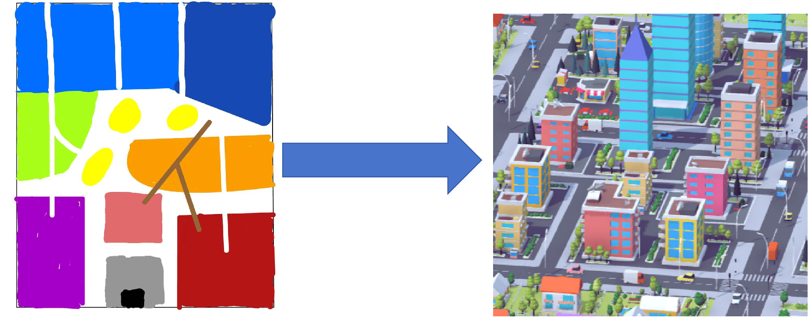
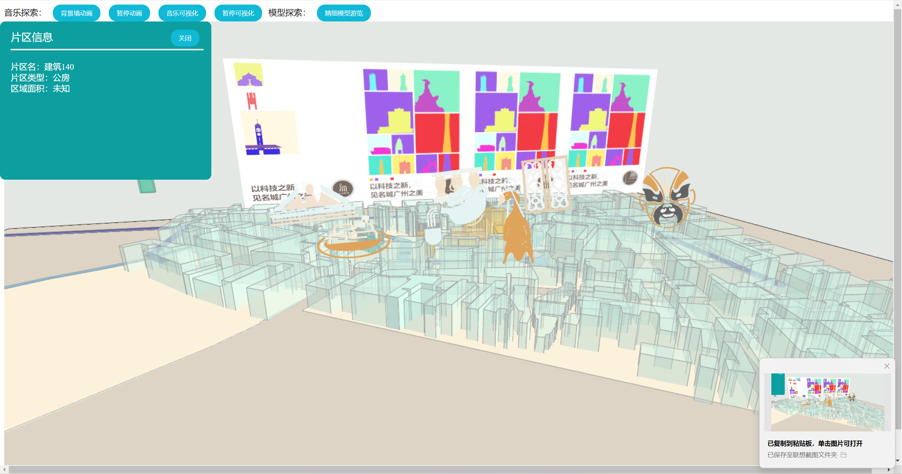

# 			3D创意：从二维平面拔地而起的三维城市

## **创新训练立项依据**

### 研究目的

​	中国城市发展迅速，从古到今，城市布局规划不仅是一个国家实力的表现，也是一项民生事业。

​	如果有一种方式可以将简单的平面色块转换为一个立体的城市模型，并且呈现在电子设备上，可以进行一定的编辑，那每一位有意愿的公民都可以通过这种简单直观的方式展现他们对城市未来场景的设想、参与城市规划建设中来，不仅可以提高公民推动城市发展的积极性，专业部门也能够高效地收集反馈、建议。

​	这种方式足够简单，无需专业知识，受众广，能够即时反映人的设想，利于沟通，能够服务于文化教育产业，在经过适当改造也能服务于专业领域。

​	简单讲是将人**手绘**或者在可绘画设备的图形，变成3D立体场景呈现在网页或者APP中。

### 研究内容

1. 二维色块到3D模型场景地转换
2. 低门槛可交互地城市规划场景编辑预览

#### 探索一种更具趣味性和互动性的城市模型建立方式

​	当今社会，移动设备十分普及，人们随时可以拍摄照片，在此基础上，依托于计算机视觉和额可视化设计，将绘制的平面图块转换为一个3D城市模型呈现在设备上。

​	不仅适用于文化教育，激发新生代对于城市未来图景的憧憬，也可以服务于专业领域的即使沟通设计展现。

#### 创意设计展示

1. **住宅区**
   - 浅蓝色：公寓楼
   - 深蓝色：独立别墅
2. **商业区**
   - 红色：购物中心
   - 橙色：办公楼
3. **工业区**
   - 灰色：工厂
   - 黑色：仓库
4. **公共设施**
   - 紫色：学校
   - 粉红色：医院
5. **娱乐和休闲**
   - 绿色：公园
   - 黄色：体育设施
6. **基础设施**
   - 白色：道路
   - 褐色：桥梁

### 创新点与项目特色

#### 创新点

1. 关注问题新

   本项目能够有效填补非专业人士对于参与城市规划、提出直观设计模型的方法的空白

2. 以人为本

   本项目面向广大市民，旨在激发他们对城市规划设计的认知和认同感，构筑居民共同的城市记忆，并通过新颖的技术手段，提供便捷、可靠的参与平台

#### 项目特色

1. 创新性

   本项目通过便捷的转换，对城市设计文化进行有效生动的传播，并搭建线上社区，设置多板块，提高广大市民的参与度和交流度，构建一个可持续发展的有生命力的交流平台。

2. 可拓展性

   二维平面到三维模型的转换，在经过完善补充，面向各行各业，结合更多实际需求进行快速改动部署投入使用。

### 经验借鉴

### 项目预期成果

1. **构建一个完整的二维转三维系统：**实现移动设备的APP开发以及网页开发，二维平面图不仅限于纸张绘制拍照上传，也可在支持绘画的电子设备上进行有规范约束地或自由地绘制后直接上传，最终呈现3D城市模型于设备上，并提供一定程度的模型可编辑性以及生成持久记录。
2. **提交 1 篇研究报告：**反馈项目价值，展示推广效果，进一步给出改善意见。

### 已有基础

​	本项目是《恩宁路创意空间》的深化拓展：现已有平面轮廓识别算法以及三维体模构建基础，下图为《恩宁路创意空间》的部分成果展示，其可实现建筑信息的浮现展示，并且建筑可随音乐节奏进行“律动”。其趣味性十足，交互设计较为完善，为本项目提供了丰富的创意交互可行性支持。

#### 已具备条件

1. 指导老师长期参与相关领域的研究和项目推进工作，如 Archi&Casca 主题相关成果及应用，对本项目的研究方向和技术手段有着丰富的经验和深入的理解，能够为项目团队提供有效的指导和支持。
2. 团队成员具有跨学科的背景和能力，结合并发挥各自专业优势。团队由建筑学、环境设计、信息与交互设计、软件工程专业的同学组成，能够支撑项目的研究、设计和开发工作。

#### 尚缺少的条件及解决方法

1. 项目团队尚缺少有关创意交互系统的完善设计和开发，需要根据用户需求分析，确定系统的功能模块、界面设计、交互逻辑等，并进行系统原型的制作和测试，以及系统正式版的开发和部署。
2. 尚未形成规范的建筑元素设计规范，需要参考相关的视觉符号设计理论和实践，制定一套适合本项目特点和目标的系统规范文档。

