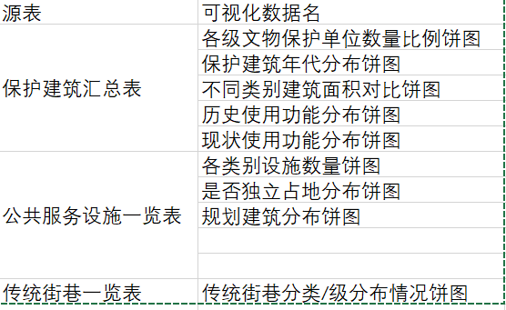

# API设计

## 结构化数据表格上传登记（excel/json）

### 上传保护建筑汇总表 excel文件

#### api路径

POST /api/upload/building-conservation

#### 请求体

{
  "file": "uploaded_file"
}


#### 响应

{
  "status": "success",
  "message": "Building conservation data uploaded successfully."
}

### 上传传统街巷一览表 excel文件

#### api路径

POST /api/upload/traditional-streets

#### 请求体

{
  "file": "uploaded_file"
}


#### 响应

{
  "status": "success",
  "message": "Traditional streets data uploaded successfully."
}

### 上传公服设施一览表excel文件

#### api路径

POST /api/upload/public-services

#### 请求体

{
  "file": "uploaded_file"
}


#### 响应

{
  "status": "success",
  "message": "Public service facilities data uploaded successfully."
}

### 上传保护建筑汇总表 json数据

#### api路径

POST /api/upload/building-conservation/json

#### 请求体

{
  "data": [
    {
      "Category": "Historical",
      "SerialNumber": 101,
      "Name": "Old Museum",
      "Era": "1950s",
      "Address": "123 Historical Rd.",
      "CurrentCondition": "Good",
      "Structure": "Brick",
      "HistoricalFunction": "Museum",
      "CurrentFunction": "Museum",
      "LandArea": 1200.5,
      "BuildingArea": 300.0,
      "City_ID": 1
    }
  ]
}


#### 响应

{
  "status": "success",
  "message": "JSON data for building conservation uploaded successfully."
}

### 上传传统街巷一览表 json数据

#### api路径

POST /api/upload/traditional-streets/json

#### 请求体

{
  "data": [
    {
      "Category": "Commercial",
      "Quantity": 20,
      "StreetDirectory": "Street names and historical significance",
      "City_ID": 102
    }
  ]
}


#### 响应

{
  "status": "success",
  "message": "JSON data for traditional streets uploaded successfully."
}

### 上传公服设施一览表json数据

#### api路径

POST /api/upload/public-services/json

#### 请求体

{
  "data": [
    {
      "Category": "Healthcare",
      "SerialNumber": 203,
      "Name": "City Hospital",
      "PlanningStatus": "Planned",
      "Location": "456 Central Blvd",
      "IsStandalone": 1,
      "City_ID": 105
    }
  ]
}


#### 响应

{
  "status": "success",
  "message": "JSON data for public service facilities uploaded successfully."
}


## 可视化数据请求和响应




### 各级文物保护单位数量比例饼图

#### api路径

GET /api/data/visualization/heritage-units

#### 请求体

{
  "cityId": 123
}


#### 响应

{
  "status": "success",
  "data": {
    "chartType": "Pie",
    "dataPoints": [
      {"label": "National", "value": 20},
      {"label": "Local", "value": 80}
    ]
  }
}

### 保护建筑年代分布饼图

#### api路径

GET /api/data/visualization/building-era-distribution

#### 请求体

{
  "cityId": 123
}


#### 响应

{
  "status": "success",
  "data": {
    "chartType": "Pie",
    "dataPoints": [
      {"label": "1900s", "value": 15},
      {"label": "2000s", "value": 85}
    ]
  }
}

### 不同类别建筑面积对比饼图

#### api路径

GET /api/visualization/building-area-comparison

#### 请求体

{
  "cityId": 123
}


#### 响应

{
  "status": "success",
  "data": {
    "chartType": "Pie",
    "dataPoints": [
      {"label": "Residential", "value": 2500},
      {"label": "Commercial", "value": 1500},
      {"label": "Industrial", "value": 1000}
    ]
  }
}

### 历史使用功能分布饼图

#### api路径

GET /api/visualization/historical-function-distribution

#### 请求体

{
  "cityId": 123
}


#### 响应

{
  "status": "success",
  "data": {
    "chartType": "Pie",
    "dataPoints": [
      {"label": "Museum", "value": 20},
      {"label": "Library", "value": 30},
      {"label": "Office", "value": 50}
    ]
  }
}

### 现状使用功能分布饼图

#### api路径

GET /api/visualization/current-function-distribution

#### 请求体

{
  "cityId": 123
}


#### 响应

{
  "status": "success",
  "data": {
    "chartType": "Pie",
    "dataPoints": [
      {"label": "Residential", "value": 40},
      {"label": "Commercial", "value": 60}
    ]
  }
}

### 各类别设施数量饼图

#### api路径

GET /api/visualization/public-service-category-distribution

#### 请求参数

此API可能需要接收一个或多个参数来定制数据的筛选，比如基于城市ID或其他属性：

| 参数名 | 类型 | 必填 | 描述                                       |
| ------ | ---- | ---- | ------------------------------------------ |
| cityId | int  | 否   | 可选，城市ID，用于限制查询结果在特定城市。 |

#### 响应

{
  "status": "success",
  "data": {
    "chartType": "Pie",
    "dataPoints": [
      {"label": "Healthcare", "value": 40},
      {"label": "Education", "value": 25},
      {"label": "Recreational", "value": 15},
      {"label": "Other", "value": 20}
    ]
  }
}

### 是否独立占地分布饼图

#### api路径

GET /api/visualization/standalone-distribution

#### 请求体

{
  "cityId": 123
}


#### 响应

{
  "status": "success",
  "data": {
    "chartType": "Pie",
    "dataPoints": [
      {"label": "Standalone", "value": 70},
      {"label": "Non-Standalone", "value": 30}
    ]
  }
}

### 规划建筑分布饼图

#### api路径

GET /api/visualization/planning-status-distribution

#### 请求体

{
  "cityId": 123
}


#### 响应

{
  "status": "success",
  "data": {
    "chartType": "Pie",
    "dataPoints": [
      {"label": "Planned", "value": 30},
      {"label": "Under Construction", "value": 50},
      {"label": "Completed", "value": 20}
    ]
  }
}

### 传统街巷分类/级分布情况饼图

#### api路径

GET /api/visualization/street-level-distribution

#### 请求体

{
  "cityId": 123
}


#### 响应

{
  "status": "success",
  "data": {
    "chartType": "Pie",
    "dataPoints": [
      {"label": "Level 1", "value": 40},
      {"label": "Level 2", "value": 35},
      {"label": "Level 3", "value": 25}
    ]
  }
}

于使用且符合实际业务需求，我们可以详细重新设计 API 的请求和响应格式，确保它能够清晰地传达所需信息并适应可能的业务场景。

## 描述性文本表格数据/不可可视化数据表格（excel）上传和搜索

### 搜索 Excel 数据

此 API 允许用户根据提供的关键词和其他可选参数对 Excel 数据进行搜索，这些数据是从数据库视图 `excel_data_with_columns` 同步到 Elasticsearch 的。

**路径**: `/api/search/exceldata`

**方法**: `GET`

**请求参数**:

| 参数名   | 类型   | 必填 | 描述                                   |
| -------- | ------ | ---- | -------------------------------------- |
| query    | string | 是   | 用户的搜索关键词，将在多个列中进行匹配 |
| cityId   | int    | 否   | 可选，用于限制搜索结果的城市ID         |
| page     | int    | 否   | 可选，指定返回结果的页码，默认为1      |
| pageSize | int    | 否   | 可选，指定每页显示的结果数量，默认为10 |

**示例请求 URL**:

```
GET /api/search/exceldata?query=library&cityId=123&page=1&pageSize=10
```

**响应结构体**:

```json
{
  "status": "success",
  "data": {
    "total": 25,
    "currentPage": 1,
    "pageSize": 10,
    "records": [
      {
        "id": 1,
        "row_index": 5,
        "columns_number": 6,
        "city_id": 123,
        "column_names_id": 2,
        "column1": "Central Library",
        "column2": "Main Street",
        "column3": "Public",
        "column4": "Yes",
        "column5": "5000 sq ft",
        "column6": "Active",
        "column_name1": "Name",
        "column_name2": "Address",
        "column_name3": "Type",
        "column_name4": "IsStandalone",
        "column_name5": "Area",
        "column_name6": "Status"
      }
    ]
  },
  "message": "Data retrieved successfully."
}
```

### 上传excel

POST /api/upload/excel/{dataType}


{
  "file": "uploaded_file"
}

{
  "status": "success",
  "message": "Excel data uploaded successfully."
}


### 上传表单（前端已经有的表格直接填入的数据

POST /api/data/submit-form


{
  "formType": "building-conservation",
  "data": {
    "Category": "Historical",
    "SerialNumber": 2001,
    "Name": "New Library",
    "Era": "21st Century",
    "Address": "456 New Street",
    "CurrentCondition": "Excellent",
    "Structure": "Concrete",
    "HistoricalFunction": "Library",
    "CurrentFunction": "Community Center",
    "LandArea": 5000,
    "BuildingArea": 2000,
    "City_ID": 1
  }
}

{
  "status": "success",
  "message": "Form data saved successfully."
}

## 模型、建筑分类管理、信息绑定

多个/一个模型组织成一个建筑，建筑和模型都有信息可以绑定。类比：一个房子里，有三室一厅，房子是“建筑”，三室一厅是四个“模型”，它们有各子的信息，也有从属关系

### 模型分类

#### 简介：

是在轮廓识别阶段，区分不同轮廓、模型所属类别


#### api路径

POST /api/models/classify

#### 请求体

{
  "modelId": 1001,
  "category": "Residential"
}


#### 响应

{
  "status": "success",
  "message": "Model classified successfully."
}

### 多个模型归于建筑

#### 简介：

在建模之后将多个模型组织为不同的建筑，

#### api路径


#### 请求体


#### 响应

### 新增单个、多个模型信息

#### 简介

对于单个模型可能有多种信息绑定，比如该模型属于哪一个建筑

#### api路径

POST /api/models/add

#### 请求体

{
  "models": [
    {
      "cityId": 123,
      "modelPath": "path/to/model1",
      "attributes": {
        "type": "Room",
        "area": "50 sqm"
      }
    },
    {
      "cityId": 123,
      "modelPath": "path/to/model2",
      "attributes": {
        "type": "Hall",
        "area": "120 sqm"
      }
    }
  ]
}


#### 响应

{
  "status": "success",
  "message": "Models added successfully."
}

### 新增单个、多个建筑信息

#### 简介

对于某个建筑可能有多种信息绑定，比如该建筑的名称面积

#### api路径

POST /api/buildings/add

#### 请求体


{
  "buildings": [
    {
      "cityId": 123,
      "name": "Heritage Museum",
      "area": "3000 sqm",
      "location": "Central Plaza",
      "type": "Museum",
      "status": "Operational"
    },
    {
      "cityId": 123,
      "name": "City Hall",
      "area": "5000 sqm",
      "location": "Main Street",
      "type": "Government",
      "status": "Renovating"
    }
  ]
}

#### 响应

{
  "status": "success",
  "message": "Building information added successfully."
}

### 获取模型信息

#### api路径

GET /api/models/info

#### 请求体

?modelId=101


#### 响应

{
  "status": "success",
  "data": {
    "modelId": 101,
    "cityId": 123,
    "modelPath": "path/to/model",
    "attributes": {
      "type": "Room",
      "area": "50 sqm"
    }
  }
}

### 获取建筑信息

#### api路径

GET /api/buildings/info

#### 请求体

?buildingId=101


#### 响应

{
  "status": "success",
  "data": {
    "buildingId": 101,
    "cityId": 123,
    "name": "Heritage Museum",
    "area": "3000 sqm",
    "location": "Central Plaza",
    "type": "Museum",
    "status": "Operational"
  }
}


