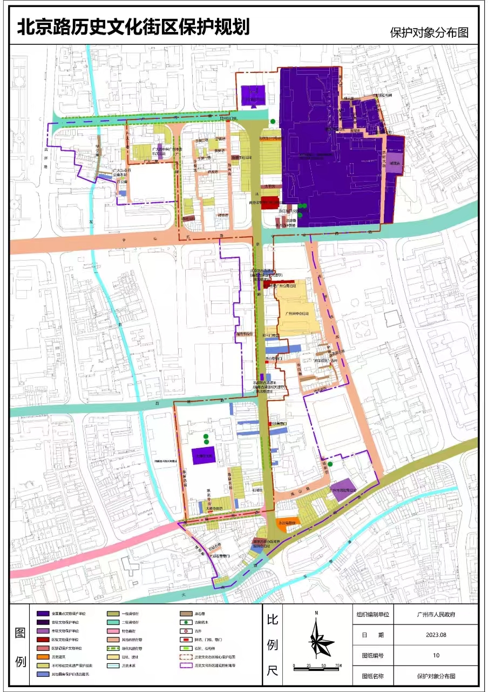
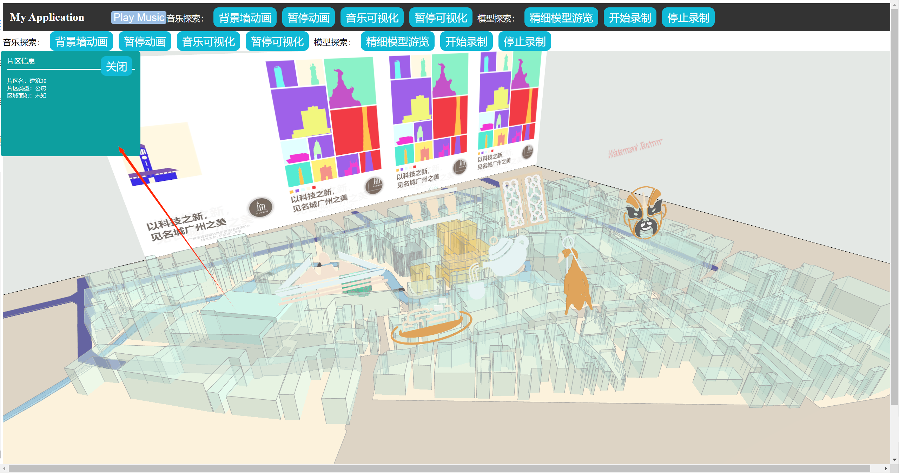

# 让图片“活”起来

## 项目背景以及创意

传统的建筑群分布图往往以图片的形式展示、传递，图片本身很难做出有趣的交互，是“死”物。

但是将其转变为编辑空间更大的svg图形，甚至是三维模型，赋予“平躺”的图片活力：

1. 可以选中某一块区域，识别为svg，给其上色，进行突出显示；
2. 或者选中这个区域轮廓将它随意拖动，调整它的形状
3. 甚至让图片“站”起来，变成模型，还可以绑定一些建筑元数据，选中某个建筑，显示/修改出它的名词、建筑者、年龄等信息；或者选定一片范围，显示出，该区域有多少个省级文物保护单位、多少个实际文物保护单位，去分类统计然后制成图表

当图片能够“活”起来，其可以获得更多的交互性，可以在图里存储更多的信息，不仅为文物保护赋能，也可为其它领域注入活力

## 图片到可编辑数据格式

### 可编辑格式一SVG

1. 选中区域进行轮廓识别，提取出轮廓
2. 提取出轮廓
   1. 上色填充
   2. svg轮廓编辑
   3. 拖动旋转等操作

### 可编辑格式二—OBJ模型

1. 利用svg轮廓分组以及高度参数的输入，构建模型进行渲染
2. 模型可以随着音乐进行律动
3. 律动模型场景可以进行视频录制

## 信息绑定

1. 选中某一个模型，编辑/展示出相关的信息卡片（高度、面积、名称等等）

2. 对建筑进行分类，在选定区域内存在建筑类群信息的统计，以及图表化

   

