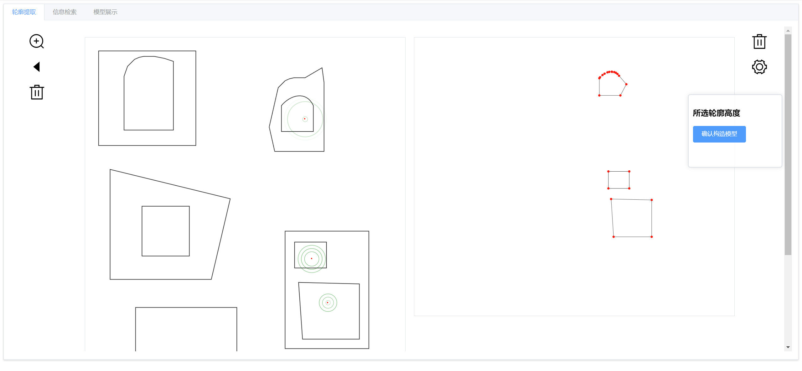
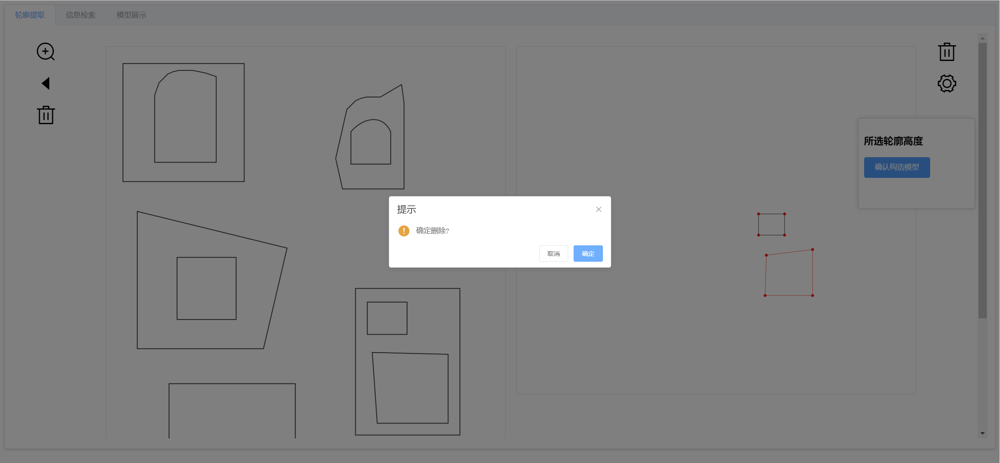
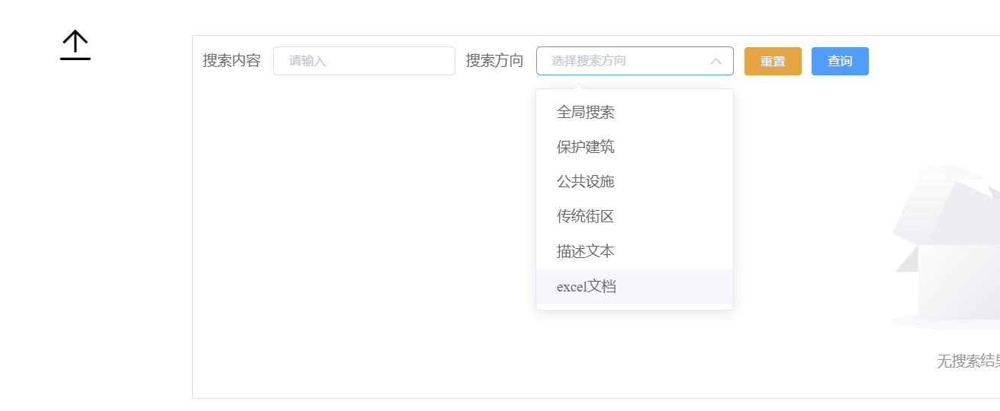
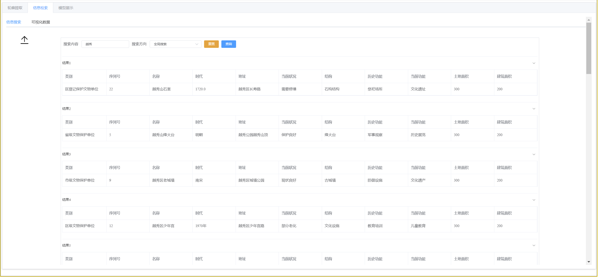
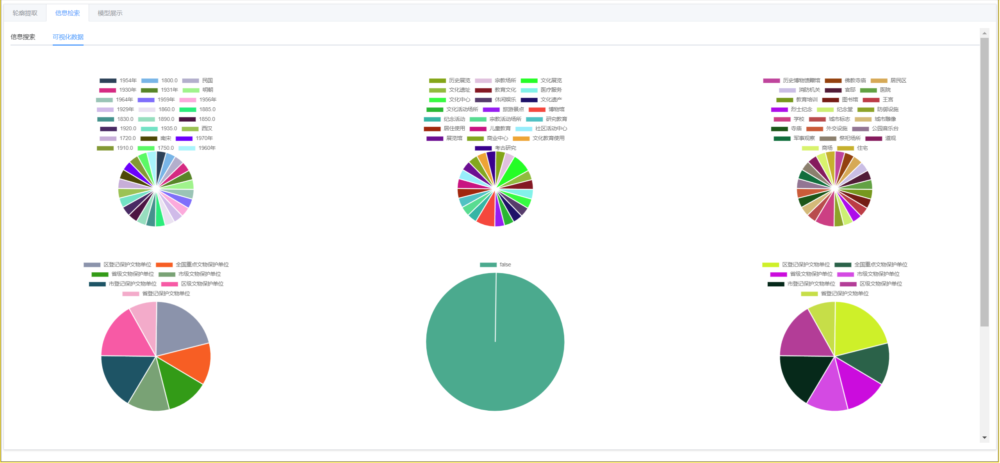
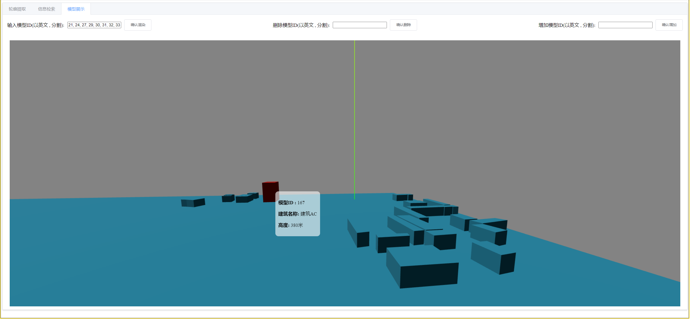
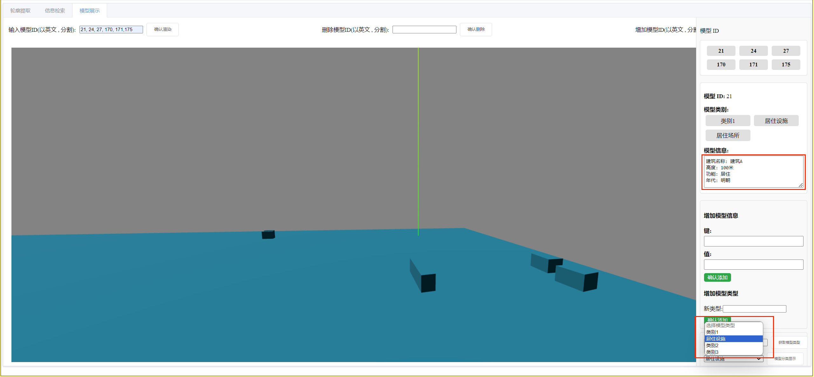
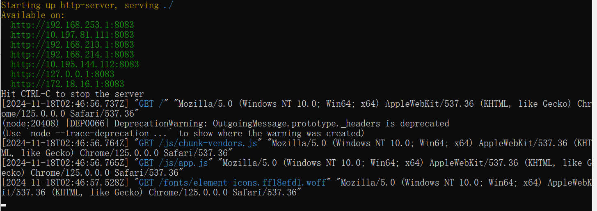

# 数字城市沙盘

2833976824@qq.com

## 背景

为更好地保护、挖掘和传承我省优秀历史文化遗产，弘扬民族传统文化，广东省发布广东省历史文化街区名单，相关方面也公布保护规划文档。但是这些规划书内容极其丰富，难以在短时间内通读并理解，并且受限于PDF文档的形式，文本、表格信息查阅困难，建筑布局、建筑高度等视觉效果的直观展现也难以实现。

## 解决

1. 提供模板（或自由录入），将信息归纳整理，录入计算机系统中，提供出信息检索、可视化的功能，使用计算机管理数据，能大幅提高信息检索效率，图表化也能让数据更加直观形象
2. 利用轮廓识别技术、建模工具，将街区从平面的规划图转变为向量化的三维模型，并绑定各种各样的标签数据，构建出数字化的街区模型沙盘，这样不仅可以管理建筑的年代、功能等标签信息，还可以直观的看到街区布局、建筑高度等视觉信息。

## 功能

### 轮廓提取

1. 选中一个封闭区域其会自动填充并找出最小包围“点”的轮廓，以路径点形式显示在右侧
2. 提取出轮廓后，可以进行轮廓点的拖动，改变轮廓形状
3. 同样可进行轮廓的删除操作，删除不满意的轮廓





### 信息展示（搜索、图表）

可以使用预制的excel模板进行文件上传，我们可以基于进行数据分析，饼图绘制，除此之外也可在有明确列标题的情况下上传其它自由内容的excel文件，我们将会以上种种excel文件提供特定板块或者全文检索，将PDF等文档的“死”数据，用计算机赋予生命力。

1. 文件上传，使用不同的excel文件进行上传信息
2. 在一定规范下，软件提供数据可视化和检索功能








### 三维模型（数字沙盘）

1. 基于轮廓提取，有了建筑底部形状，赋予高度，就可以渲染成三维模型
2. 将模型和信息相结合，可以丰富模型的内容，使其不仅仅是一个数学上的几何体，而是一个可以接收、传达讯息的媒介
3. 模型渲染可以进行分类，可以根据需要渲染不同类别的模型





## 技术框架

前端交互：vue2 three.js

服务端框架：spring boot

搜索引擎：Elasticsearch

数据库：mysql

## 分工

石夏源：软件策划；搜索功能服务、模型构建服务、文件上传服务、数据可视化服务；三维模型渲染界面搭建，以及该页面的交互功能实现

李颖宇：前端框架搭建；轮廓提取页面搭建以及交互实现，搜索界面、图表可视化界面的搭建和功能实现

陈金辉：模型分类服务构建、模型信息管理服务构建；北京路相关文档模板的梳理

曾竑力 ：轮廓提取服务的搭建以及优化；基于北京路保护规划图的重点区域的建筑建模演示工作

## 可用北京路模型id

21, 24, 27, 29, 30, 31, 32, 33, 34, 36, 37, 38, 39, 40, 42, 48, 49, 51, 53, 158, 159, 160, 161, 162, 163, 164, 165, 166, 167, 168, 169, 170, 171,175


### 本地运行

前提条件，安装Node、NPM，并且允许如下命令

```
npm -g install http-server
```

在dist目录下，运行命令

```
http-server --cors -p 8083 -o -c-1
```

运行结果如下：



本地访问ip：

```
http://127.0.0.1:8083/
```

