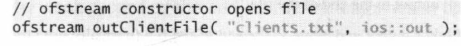
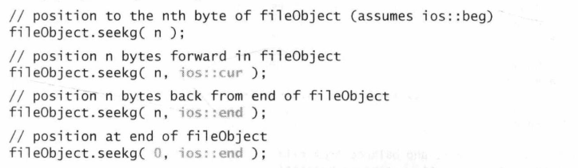
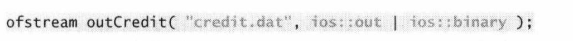
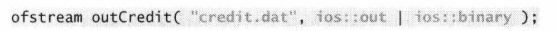
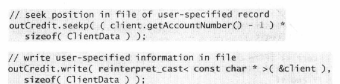
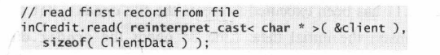

# Chapter file

C++ does not impose structure on a file

## 顺序文件

顺序文件和随机访问文件在实现上的区别主要体现在数据的存储结构和访问方法上。这些区别决定了它们在不同应用场景中的适用性和性能表现。

#### 打开顺序文件

1. open the file for output by creating an **ofstream** object.
   Two arguments are passed to the object's constructor-the filename and the fileopen mode .For an ofstream object, the file-open mode can be either **ios::out (the default)** to output data to a file or **ios: :app** to append data to the tail of file

   

   ps:out模式打开一个文件将会导致原内容被清空，从开头位置重新写入内容，即文件truncated，如果不存在，会自动创建一个文件​

2. open a file via the **open Member Function**

   

#### 文件的关闭

#### Reading Data from sequence File

C++中，当你使用标准库中的文件流（如`ifstream`）读取文件时，文件读取指针（也称为文件位置指针）会随着***每次读取操作自动向后移动***。这意味着每次读取操作（如使用`>>`操作符或`read()`函数）都会从当前文件指针的位置开始，读取完成后，指针会移动到读取的数据之后的位置

##### file position pointers

Both istream and ostream provide member functions for **repositioning the file-position pointer** (the byte number of the next byte in the file to be read or written).These member functions are **seekg("seek get"**)for istream and **seekp("seek put")**for ostream.Each istream object has a **get pointer**,which indicates the byte number in the file from which the next input is to occur,and each ostream object has a **put pointer**,which indicates the byte number in the file at
which the next output should be placed.

#### 更新顺序文件

problem is that,in the **formatted input/output** model using the stream insertion operator <and the stream extraction operator >>fields-and hence records-can **vary in size**.For example,values 7,14,-117,2074,and  27383 are all ints,which store the same number of"raw data"bytes internally (typically four bytes on 32-bit machines and eight bytes on 64-bit machines).However,these integers become different-sized fields,depending on their actual values,when output as formatted text (character sequences).Therefore,the formatted  input/output model usually is not used to update records in place

##### 一种可行的更新方式--很蠢

将需要修改的地方之前的数据放到新文件，将新数据放到新文件中，再将修改处后方的原本的数据放到新文件重新组合，然后删除旧文件，将新文件的文件名换为旧文件名

### 顺序文件的实现

1. **存储结构**：
   - 顺序文件通常将数据按照一定的顺序（例如，按键值升序或降序）存储在文件中。数据记录连续存放，没有间隔。
   - 文件通常从头到尾被读取或写入，数据添加通常发生在文件的末尾。

2. **访问方法**：
   - 读取顺序文件时，通常从文件的开始位置按顺序读取数据，直到找到所需记录或文件结束。
   - 更新或删除操作可能需要重写整个文件或大部分文件，因为修改一个记录的位置可能需要移动其后的所有记录。

3. **优化**：
   - 缓冲技术可以用来提高顺序读写的效率，特别是在处理大型文件时。
   - 文件维护（如压缩文件以消除删除记录后留下的空白）可以定期进行以保持存储效率。

## random access file

固定record长度（字节数）

#### 随机访问文件的实现

1. #### **存储结构**：

   - 随机访问文件不需要按特定顺序存储数据记录。每条记录可以独立存取，通常通过索引或指针直接访问。
   - 文件中的记录可以有固定的长度（固定长度记录更容易直接定位和访问），也可以是变长的（通常需要额外的索引结构来管理）。

2. #### **访问方法**：

   - 可以直接定位到文件中任何位置读取或写入数据，不需要顺序读取整个文件。这通常通过记录的偏移量实现，偏移量可能是基于文件开始的字节位置。
   - 更新和删除操作更为灵活和高效，因为可以直接定位到特定记录进行修改，无需影响其他记录。

3. #### **优化**：

   - 使用索引结构（如B树、哈希表等）可以极大提高随机访问文件的检索效率。
   - 文件碎片管理和优化对于维持随机访问文件的性能至关重要，尤其是在频繁更新和删除的环境中。

### creat random access file

outFile.write(reinterpret_cast<const char *>&number ),sizeof(number ))

其中以固定长度的record写文件**ios：：binary**不可少

reinterpret_cast类型转换，write要求类型是const char*,不同于之前的动态转换，这里的类型转换是在编译阶段已经转换好了

###### Opening a File for Output in Binary Mode

In Fig.14.11,line 11 creates an ofstream object for the file credit.dat.The second argument to the constructor-**ios:out | ios:binary**-indicates that we are opening the file for output in binary mode,which is required if we are to write **fixed-length** records.Multiple file-open modes are combined by separating each open mode from the next with the **|** operator,which is known as the bitwise inclusive OR operator.

Function **seekp** sets the put file-position pointer to a specific
position in the file,then function write outputs the data.

### 读写文件

The ostream member function **write** outputs to the specified stream a fixed number of bytes,beginning at a specific location in memory. The istream member function **read** inputs a fixed number of bytes from the specified stream to an area in memory beginning at a specified address.

读取字节数为sizeof（ClientData），存放到&client中，并且需要类型转换，write/read只接受const char*

- **顺序文件**更倾向于使用简单的文件系统API，如标准的读/写操作。它们的实现通常更简单，对新手更友好。
- **随机访问文件**可能依赖于更复杂的文件系统操作和数据结构，如内存映射文件（memory-mapped files）或数据库管理系统的底层支持。

## 14.11-p550-Object Serialization(序列化)

Problems

- When object data members are output to a disk file,we lose the object's type information
- only an object's data members were input or output

c++不提供这个方法，但是有第三方库可以实现序列化，解决对象输入输出问题

# Chapter 15 Standard Library Containers and Iterators p559