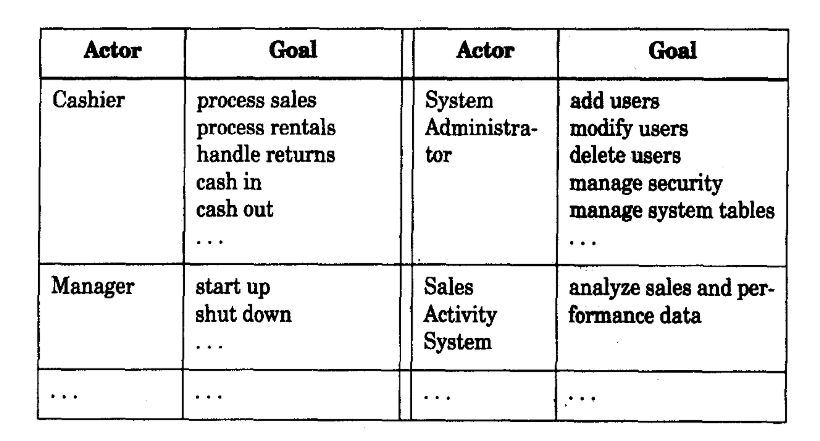

# chapter 6

## 6.14 109

RUP use case 定义：

一系列用例实体，每个实体都是一些列对特定actor产生显著的可观察到的价值的系统行为

#### 发现用例的步骤

1. 选择系统边界

2. 识别主要参与者

   - 谁开关系统
   - 谁负责用户和安全管理
   - 谁负责系统管理
   - 时间是否是一个actor
   - ...

3. 识别每个主要参与者的目的

   ​     怎么组织actor和goals：

   - 一旦发现结果，就把它们画在用例图中，并且像用例一样给它们命名

   - 首先绘制一个actor-goal 列表清单，复盘并且完善它，然后绘制在用例图中

     actor-goal list：

     

4. 定义满足使用者目标的用例；根据使用者的目标给它们命名

#### Why Ask About Actor Goals Rather Than Use Cases?

The viewpoint of use case modeling is to find these actors and  their goals,and create solutions that produce a result of value.

一个用户目标的用例名字应该反应它的用户目标，应为前者是后者的具体实现方法，例如：Goal:capture or process a sale;use case:Process Sale.

