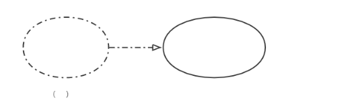
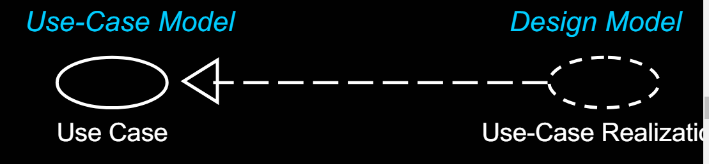
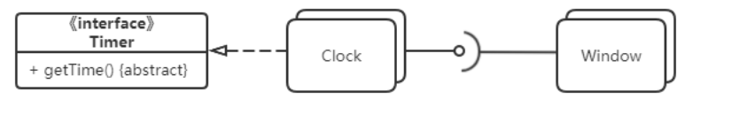
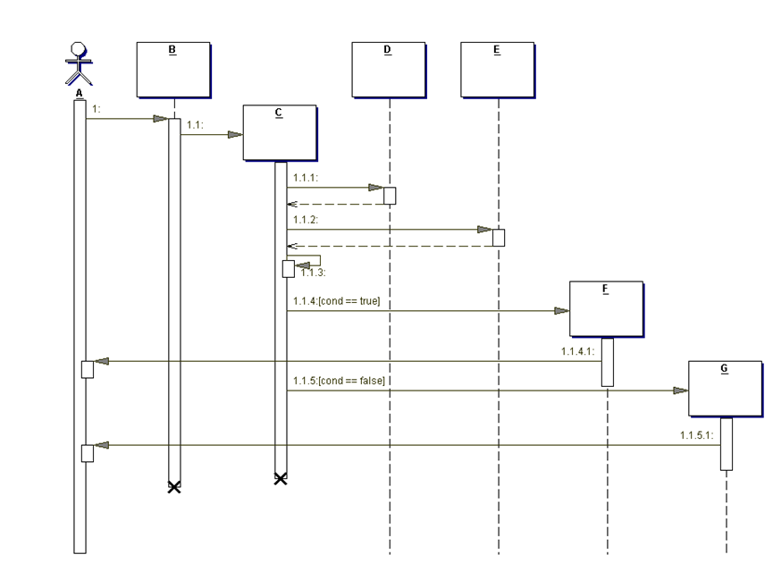
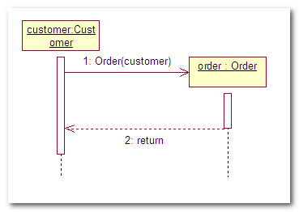

# 缩写词汇汇总

- **UP：**软件开发(过程)模型—统一过程模型(UP)

  初始阶段：生命周期目标。-Inception Phase

  精化阶段：生命周期架构。-Elaboration Phase

  构建阶段：初始运作功能。-Construction Phase

  移交阶段：产品发布。-Transition Phase

- **RUP**:**统一软件开发过程**（英语：Rational Unified Process，缩写为RUP）是一种软件工程方法，为迭代式软件开发流程。

- **Discipline**：（科目）科目是在一个主题域中的一组活动以及相关制品

- **Artifact**：（制品）是对所有工作产品的统称（如：代码、web图形、数据库模式、文本文档、图、模型等）

- **Domain Model**：领域模型-Start in Elaboration
  This is a visualization of the domain concepts;it is similar to a
  static information model of the domain entities.

- **Design Model：**设计模型-Start in Elaboration

  This is the set of diagrams that describes the logical design. This includes software class diagrams,object interaction diagrams,package diagrams,and so forth.

- **Data Model**：数据模型-Start in Elaboration

  This includes the database schemas,and the mapping strategies between object and non-object representations.

- **SSD：**系统顺序图。

  系统顺序图表示的是，对于用例的一个特定场景，外部参与者产生的事件，其顺序和系统之内的事件。所有系统被视为黑盒，该图强调的是从参与者到系统的跨越系统边界的事件。A system sequence diagram is a picture that shows,for one particular scenario of a use case,the events that external actors generate,their order,and
  inter-system events. All systems are treated as a black box;the emphasis of the diagram is events that cross the system boundary from actors to systems.

# 用例模型

SSD、

# **chapte**r 6

## 6.14 109

RUP use case 定义：

一系列用例实体，每个实体都是一些列对特定actor产生显著的可观察到的价值的系统行为；

强调两个属性：

1. 关注系统的使用者或者actor，书写其需求，通过询问他们的目标和一典型的环境
2. 理解演员是怎么样考虑一个结果是否有价值

#### 发现用例的步骤

1. 选择系统边界

2. 识别主要参与者

   - 谁开关系统
   - 谁负责用户和安全管理
   - 谁负责系统管理
   - 时间是否是一个actor
   - ...

   

3. 识别每个主要参与者的目的

   ​     怎么组织actor和goals：

   - 一旦发现结果，就把它们画在用例图中，并且像用例一样给它们命名

   - 首先绘制一个actor-goal 列表清单，复盘并且完善它，然后绘制在用例图中

     actor-goal list：

     

4. 定义满足使用者目标的用例；根据使用者的目标给它们命名--一般来说，为每个用户目标分别定义用例，二者名称类似；但存在例外多个目标对应一个用例；用例名称一般动词开头

   一对一：目标-处理销售 用例-处理销售

   多对一：目标合并成一个CRUD用例，并习惯性地称为管理<X>。例如，管理用户用例可以同时满足“编辑用户”、“删除用户”等目标。

其它发现在主要参与者和目标的方法：识别外部事件--它们是什么，源于哪里，为什么？通常一组事件会属于同一个用例

#### Why Ask About Actor Goals Rather Than Use Cases?

The viewpoint of use case modeling is to find these actors and  their goals,and create solutions that produce a result of value.

一个用户目标的用例名字应该反应它的用户目标，应为前者是后者的具体实现方法，例如：Goal:capture or process a sale;use case:Process Sale.

#### 主要参与者的判别

在不同边界的界定中，主要参与者也会有区别。在一个企业中

整个企业为一个整体作为系统边界则，顾客是主要参与者；仅仅以pos系统作为系统边界，收银员才是主要参与者（中间代理不会作为主要参与者）

## 6.16 发现有效用例的测试方法

实际的问题应该是--在应用需求分析时，表示用例的有效级别（级别不同取决于系统边界、参与者和目标）是什么？

### 三种常用test方法：

- The Boss Test
- EBP
- Size Test

一、The Boss TEST：

​       你的老板问：“你整天都做了些什么？”你回答：“登录系统！”你的老板会高兴吗？
​       如果不会，那么该用例不会通过老板测试，这意味着该用例与达到可量化价值的结果没有太大关系。这也许是更低级别目标的用例，但不是需求分析所适用的级别。
​       这也**不意味着要忽略在老板测试中失败的用例**。用户认证可能不会通过老板测试，但却是重点和难点。

二、EBP Test：Elementary Business Process(EBP)：

ebp的定义：A task performed by one person in one place at one time,in response to a business event,which adds measurable business
value and leaves the data in a consistent state,e.g.,Approve Credit or Price Order [original source lost].一人一时间一地点对一个业务实践做出的回应，并且有助于增加可视化价值和使其数据持久化，其测试类似于老板测试，关注可量化的业务价值

或许这个测试定义太严格，当涉及多个人、多个地点，也可能会通过测试；

1. 用例可能涉及多步
2. 用例可能需要几分钟或者一个小时，不能持续多天或者分为多个时期阶段

用例强调可量化业务价值，系统和数据具有稳定性和持久状态

三、规模测试-Size Test

用例通常包含多个步骤，详述形式的用例通常需要多页文本，避免将一系列步骤中的一个步骤定义为用例本身，规模太小会导致错误信息反馈（hint）

四：应用三种测试方法

·就供应者合同进行协商：比EBP更广泛，用时更长。更适合作为业务用例，而非系统用例。
·处理退货：能够通过老板测试。看上去与EBP类似。规模合适。
·登录：如果你一整天都在登录，老板不会满意。
在游戏板上移动棋子：单一步骤，不能通过规模测式

### 测试的合理违例

有时需要为子任务或者常规EBP级别的步骤编写单独的子功能级别的用例。

1.“信用卡支付”等子任务或扩展可能在多个基本用例中出现。如果有这种现象，即使不能真正满足EBP和规模测试，也需要考虑将其分离为单独的用例，并且将其连接到各个基本用例上，以避免文字上的重复。
2.“认证用户”这一用例可能无法通过老板测试，但是其步骤极为复杂，需要引起重视进行细致的分析，例如需要考虑“单点登录“特性。

## 6.19 Motivation:Other Benefits of Use Cases?Requirements in Context

1. 用例的动机在于关注谁是关键参与者，其目标和一般的任务是什么。除此之外，就其本质而言，用例是一种简单的、被广泛理解的形式（情节或场景形式）。

2. 另一动机是以用例代替详细的、低层的功能列表（在20世纪70年代传统需求方法中普遍使用)。这些列表的形式如下：

   使用用例，面向用户，可以增强需求理解，提高需求分组的内聚性。

### 容许高阶系统特性列表

简洁的高阶特性列表有助于概括系统的功能性--系统特性列表，只包含几十个条目，独立于用例视图。

### 什么时候详细特性列表比用例更适合

某些应用需要特性驱动的viewpoint

7.1.7豪豪：强烈推荐点赞

# 堂测

1、

Use-case realization(例如java中接口类-抽象类的实现)

参考：

也可以使用实线箭头，但是要有标签《realization》

2.D

组件图——该图中是clock实现了Timer接口后提供一个接口,用圆圈表示；半圆是需求接口

这里timer类是abstract抽象类

3.

232

状态图跨用例；

# [顺序图](https://blog.csdn.net/xingjiarong/article/details/50232199)

### 对象

时序图中对象使用**矩形**表示, 并且**对象名称下有下划线**.   

- 将对象置于时序图的顶部说明在交互开始时对象就已经存在了. 
- 如果对象的位置不在顶部, 表示对象是在交互的过程中被创建的.   如果对象是在交互过程中创建的, 那么就应该将对象放到中间部分. 如果要撤销一个对象, 在其生命线终止点处放置 “ X” 符号.  

#### 对象的创建

消息指向对象：消息是构造方法，箭头指向对象所代表的的矩形，

