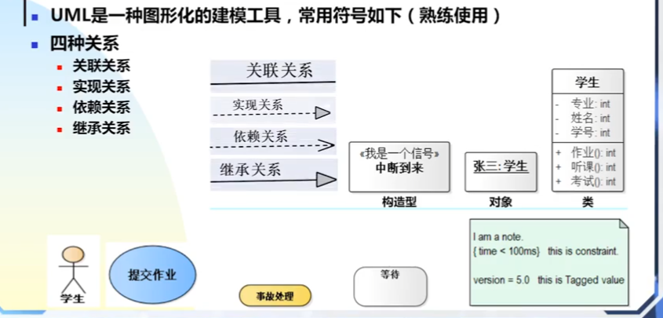
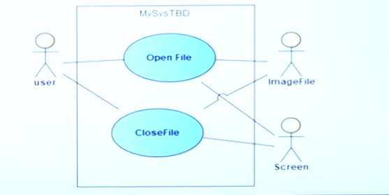
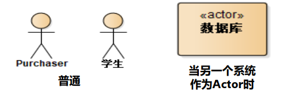

# 模型

## 模型定义

**建模modeling**
重要的研发成果常常产自类比(analogy)把不太理解的东西和一些已经较为理解、且十分类似的东西做比较，可以对这些不太理解的东西产生更深刻的理解，叫做建模

**模型**

- 建模产生的结果就是模型，模型是对现实的简化、对事物的一种抽象
- 模型可以帮助人们更好地了解事物的本质，抓住问题的要害
- 在模型中，人们总是剔除那些与问题无关的、非本质的东西，从而使模型与真实的实体相比更加简单、易于把握

## 模型的四项基本原理

1. 选择要创建什么模型
2. 同一种模型可以在不同精度上表示（纸飞机、完全的飞机）
3. 最好的模型和现实相关联。简化现实，但不能掩盖重要因素。
4. 单个模型不充分，一个系统最好用一组几乎独立的模型去处理

## UML概念模型

**关系**：

1. 依赖
2. 关联
3. 泛化
4. 实现

事物：

1. 结构事物：类、结构
2. 行为事物
3. 分组事物（包）
4. 注释事物

图：关系组织事物（类图、对象图）

**UML公有机制**

1. 详述
2. 修饰
3. 通用划分
4. 扩展机制
   1. 构造型(stereo type)
   2. 标记值(tagged value)
   3. 约束(constraint

**uml符号**

# 用例

中间的椭圆是用例；参与者和用例是关联关系；方框是边界；用例名称是一个简洁的“动名词”，不需要长句子描述

## 参与者actor

代表位于系统之外并和系统进行交互的一类事物（人、物、其他软件子系统等）

Actor的图形表示

- 参与者是人，用“小人图”
- "参与者是某个系统时用方框图，构造型《actor》

## 用例之间的关系

参与者和用例之间的关系

​	关联关系：实线

参与者之间的关系

​	泛化：实线加空心箭头（箭头指向父亲，实现连到具体的泛化个例）

用例之间的关系

- 泛化
- 含关系（include）
- 扩展关系

## 用例描述

分为主事件（一切顺利的情况）流、异常（可选）事件流

格式：

- Summary
  - Give the role,purpose and the summary of the use case.
- Actor List
  - List the actor involved in the use case.
- Pre-condition
  - Give the conditions that must be filled to activate the use case.
- Description
  - Detail operations performed during the use case.
- Post-condition后置条件（运行后限制）
  - Give the modified states of the system,modified resources,etc.…
- Exception
  - Give the possible errors or exceptions that must be taken into account during the use case execution.

## 用例模型

用例模型包括

1. 系统边界
2. 参与者
3. 用例
4. 用例图
5. 用例描述

