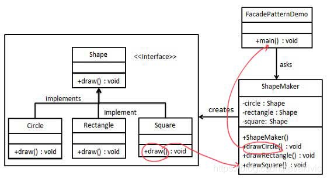
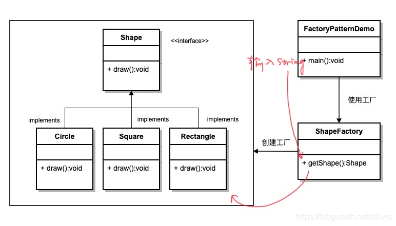
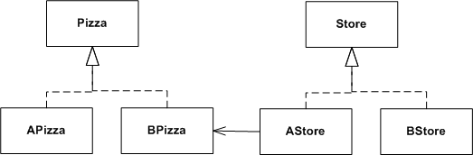
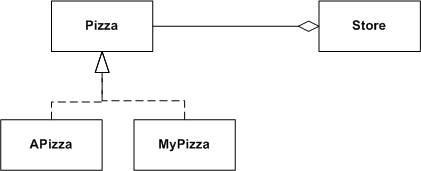

# GoF 设计模式

GoF所提出的23种设计模式主要基于以下面向对象设计原则：

1. 对接口编程而不是对实现编程
2. 优先使用对象组合而不是继承

23种设计模式分为三大类：创建型模式（Creational Patterns）、结构型模式（Structural Patterns）、行为型模式（Behavioral Patterns）

创建型模式的主要关注点是“怎样创建对象？”，它的主要特点是“将对象的创建与使用分离”。这样可以降低系统的耦合度，使用者不需要关注对象的创建细节，对象的创建由相关的工厂来完成。就像我们去商场购买商品时，不需要知道商品是怎么生产出来一样，因为它们由专门的厂商生产。

创建型模式分为以下几种。

* 单例（Singleton）模式：某个类只能生成一个实例，该类提供了一个全局访问点供外部获取该实例，其拓展是有限多例模式。
* 原型（Prototype）模式：将一个对象作为原型，通过对其进行复制而克隆出多个和原型类似的新实例。
* 工厂方法（FactoryMethod）模式：定义一个用于创建产品的接口，由子类决定生产什么产品。
* 抽象工厂（AbstractFactory）模式：提供一个创建产品族的接口，其每个子类可以生产一系列相关的产品。
* 建造者（Builder）模式：将一个复杂对象分解成多个相对简单的部分，然后根据不同需要分别创建它们，最后构建成该复杂对象。

以上 5 种创建型模式，除了工厂方法模式属于类创建型模式，其他的全部属于对象创建型模式。

结构型模式描述如何将类或对象按某种布局组成更大的结构。它分为类结构型模式和对象结构型模式，前者采用继承机制来组织接口和类，后者釆用组合或聚合来组合对象。

由于组合关系或聚合关系比继承关系耦合度低，满足“合成复用原则”，所以对象结构型模式比类结构型模式具有更大的灵活性。

结构型模式分为以下 7 种：

1. 代理（Proxy）模式：为某对象提供一种代理以控制对该对象的访问。即客户端通过代理间接地访问该对象，从而限制、增强或修改该对象的一些特性。
2. 适配器（Adapter）模式：将一个类的接口转换成客户希望的另外一个接口，使得原本由于接口不兼容而不能一起工作的那些类能一起工作。
3. 桥接（Bridge）模式：将抽象与实现分离，使它们可以独立变化。它是用组合关系代替继承关系来实现的，从而降低了抽象和实现这两个可变维度的耦合度。
4. 装饰（Decorator）模式：动态地给对象增加一些职责，即增加其额外的功能。
5. 外观（Facade）模式：为多个复杂的子系统提供一个一致的接口，使这些子系统更加容易被访问。
6. 享元（Flyweight）模式：运用共享技术来有效地支持大量细粒度对象的复用。
7. 组合（Composite）模式：将对象组合成树状层次结构，使用户对单个对象和组合对象具有一致的访问性。

以上 7 种结构型模式，除了适配器模式分为类结构型模式和对象结构型模式两种，其他的全部属于对象结构型模式。

行为型模式用于描述程序在运行时复杂的流程控制，即描述多个类或对象之间怎样相互协作共同完成单个对象都无法单独完成的任务，它涉及算法与对象间职责的分配。

行为型模式分为类行为模式和对象行为模式，前者采用继承机制来在类间分派行为，后者采用组合或聚合在对象间分配行为。由于组合关系或聚合关系比继承关系耦合度低，满足“合成复用原则”，所以对象行为模式比类行为模式具有更大的灵活性。

行为型模式是 GoF 设计模式中最为庞大的一类，它包含以下 11 种模式。

1. 模板方法（Template Method）模式：定义一个操作中的算法骨架，将算法的一些步骤延迟到子类中，使得子类在可以不改变该算法结构的情况下重定义该算法的某些特定步骤。
2. 策略（Strategy）模式：定义了一系列算法，并将每个算法封装起来，使它们可以相互替换，且算法的改变不会影响使用算法的客户。
3. 命令（Command）模式：将一个请求封装为一个对象，使发出请求的责任和执行请求的责任分割开。
4. 职责链（Chain of Responsibility）模式：把请求从链中的一个对象传到下一个对象，直到请求被响应为止。通过这种方式去除对象之间的耦合。
5. 状态（State）模式：允许一个对象在其内部状态发生改变时改变其行为能力。
6. 观察者（Observer）模式：多个对象间存在一对多关系，当一个对象发生改变时，把这种改变通知给其他多个对象，从而影响其他对象的行为。
7. 中介者（Mediator）模式：定义一个中介对象来简化原有对象之间的交互关系，降低系统中对象间的耦合度，使原有对象之间不必相互了解。
8. 迭代器（Iterator）模式：提供一种方法来顺序访问聚合对象中的一系列数据，而不暴露聚合对象的内部表示。
9. 访问者（Visitor）模式：在不改变集合元素的前提下，为一个集合中的每个元素提供多种访问方式，即每个元素有多个访问者对象访问。
10. 备忘录（Memento）模式：在不破坏封装性的前提下，获取并保存一个对象的内部状态，以便以后恢复它。
11. 解释器（Interpreter）模式：提供如何定义语言的文法，以及对语言句子的解释方法，即解释器。

以上 11 种行为型模式，除了模板方法模式和解释器模式是类行为型模式，其他的全部属于对象行为型模式。

# 区分对比

## [外观模式、工厂模式](https://blog.csdn.net/akivic/article/details/106128452)

一、外观模式（Façade设计模式）
属于结构式模式
作用：简化客户端与内部子系统之间的接口，让用户可以更简单的使用程序功能
适用：子系统相对独立时为外界提供访问模块

实现：在客户端和复杂系统之间再添加一层
其中Demo调用时

```
1ShapeMaker shapeMaker = new ShapeMaker();
2shapeMaker.drawCircle();
```

二、工厂模式（Factory设计模式）
属于创建式模式
作用： 解决接口的选择问题
适用：多个产品在同一工厂加工时
实现：创建的过程在子类中执行，用户输入对于字符串即可



其中Factory中

      if(shapeType.equalsIgnoreCase("CIRCLE")){
         return new Circle();
      } else if(shapeType.equalsIgnoreCase("RECTANGLE")){
         return new Rectangle();
      } else if(shapeType.equalsIgnoreCase("SQUARE")){
         return new Square();
      }

Demo的调用为

      ShapeFactory shapeFactory = new ShapeFactory();
     
      //获取 Circle 的对象，并调用它的 draw 方法
      Shape shape1 = shapeFactory.getShape("CIRCLE");
     
      //调用 Circle 的 draw 方法
      shape1.draw();
工厂模式和外观模式的对比：
这两个模式的结构都非常的相似，但是工厂模式的作用主要是体现在创建的过程上，可以使创建子类的操作简化。而外观模式主要体现在简化客户使用功能的过程。


## 四种模式的区别（装饰、代理、适配器、外观）

- 装饰模式：将一个对象包装起来以增加新的行为和责任
  - **不改变接口，但加入责任**
- 适配器模式：将一个对象包装起来以改变其接口
  - **将一个接口转成另一个接口，改变接口使其符合客户期望**
- 外观模式：将一群对象包装起来以简化其接口
  - **让接口更简单，提供子系统的一个简化接口**
- 代理模式：将一个对象包装起来以控制对它的访问
  - **控制和管理对对象的访问**

## 工厂模式和策略模式

## 相似点

在模式结构上，两者很相似；

## 差异

- 用途不一样
  工厂是创建型模式,它的作用就是创建对象；
  策略是行为型模式,它的作用是让一个对象在许多行为中选择一种行为;

- 关注点不一样
  一个关注对象创建
  一个关注行为的封装
- 解决不同的问题
  工厂模式是创建型的设计模式，它接受指令，创建出符合要求的实例；它主要解决的是资源的统一分发，将对象的创建完全独立出来，让对象的创建和具体的使用客户无关。主要应用在多数据库选择，类库文件加载等。
  策略模式是为了解决的是策略的切换与扩展，更简洁的说是定义策略族，分别封装起来，让他们之间可以相互替换，策略模式让策略的变化独立于使用策略的客户。
- 工厂相当于黑盒子，策略相当于白盒子；

## 举例说明

- 工厂模式
  有一天你决定去吃培根披萨，首先得选择店铺，A店和B店都有培根披萨；
  你点了A店的培根披萨，过了二十分钟，你的披萨就来了就可以吃到了。但这个披萨是怎么做的，到底面粉放了多少，培根放了多少，佐料放了多少，有多少道工序，你是不需要管的，你需要的是一个美味培根披萨。
- 策略模式
  在披萨店，你要一个培根披萨，老板说有标准的pizza，也可以自己去做。原料有培根、面粉、佐料。工序有1、2、3工序，你自己去做吧。然后你就需要自己去做，到底放多少培根，放多少面粉，放多少佐料，这都你自己来决定，工序1、2、3，你是怎么实现的，都你自己决定。最后你得到了披萨。

## 代码实现

我们用代码来实现上面的不同点：

- 工厂模式



```cpp
class Store
{
void orderPizza(){
Pizza *p = createPizza()
//有了pizza对象后，接下来的工序都是一样的，对用户而言，是透明的；
p->prepare(); //准备材料，放调料
p->bak(); //烘烤
p->cut(); //切块
}
virtual createPizza() = 0; 
}

class AStore : public Store
{
virtual Pizza * createPizza()
{
Pizza * p = new APizza();
return p;
}
}
```

- 策略模式



```csharp
class Store
{
void orderPizza(){
Pizza *p = MyPizza();
//工序都有，但是具体如何实现，由用户来确定实现；
p->prepare(); 
p->bak(); 
p->cut(); 
}

class MyPizza : public Pizza
{
virtual void prepare(){
//我的pizza我做主，我可以多放点肉，再多来点酱
}
virtual void bak(){
//我想烤的时间长点，这样会更脆
}
virtual  void cut(){
//切块，我想切成20块，像吃西瓜片那样吃披萨
}
}
```
