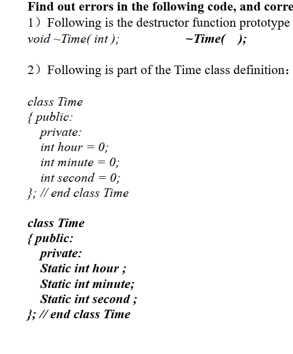

# 抽象类

## 纯虚函数——虚函数

区别：

- 定义一个函数为虚函数，不代表函数为不被实现的函数。
- 定义他为虚函数是为了允许用基类的指针来调用子类的这个函数。
- 定义一个函数为纯虚函数，才代表函数没有被实现。
- 定义纯虚函数是为了实现一个接口，起到一个规范的作用，规范继承这个类的程序员必须实现这个函数。

**抽象类的定义：** 称带有纯虚函数的类为抽象类，其不能定义对象

- 1、纯虚函数声明如下： **virtual void funtion1()=0;** 纯虚函数一定没有定义，纯虚函数用来规范派生类的行为，即接口。包含纯虚函数的类是抽象类，抽象类不能定义实例，但可以声明指向实现该抽象类的具体类的指针或引用。

- 2、虚函数声明如下：**virtual ReturnType FunctionName(Parameter)** 虚函数必须实现，如果不实现，编译器将报错，错误提示为：

  ```
  error LNK****: unresolved external symbol "public: virtual void __thiscall ClassName::virtualFunctionName(void)"
  ```

- 3、对于虚函数来说，父类和子类都有各自的版本。由多态方式调用的时候动态绑定。

- 4、实现了纯虚函数的子类，该纯虚函数在子类中就变成了虚函数，子类的子类即孙子类可以覆盖该虚函数，由多态方式调用的时候动态绑定。

- 5、虚函数是C++中用于实现多态(polymorphism)的机制。核心理念就是通过基类访问派生类定义的函数。

- 6、在有动态分配堆上内存的时候，析构函数必须是虚函数，但没有必要是纯虚的。

# 拷贝构造函数

当出现类的等号赋值时，会调用拷贝函数，在未定义显示拷贝构造函数的情况下，系统会调用默认的拷贝函数——即浅拷贝，它能够完成成员的一一复制。当数据成员中没有指针时，浅拷贝是可行的。但当数据成员中有指针时，如果采用简单的浅拷贝，则两类中的两个指针将指向同一个地址，当对象快结束时，会调用两次析构函数，而导致指针悬挂现象。所以，这时，必须采用深拷贝。

深拷贝与浅拷贝的区别就在于深拷贝会在堆内存中另外申请空间来储存数据，从而也就解决了指针悬挂的问题。简而言之，**当数据成员中有指针时，必须要用深拷贝。**

如果传值引用，则会导致递归，因为传值本质上需要生成实参，但是生成实参，也会调用拷贝构造函数，这样就无限递归下去。

解答：对于一个类X, 如果一个构造函数的第一个参数是下列之一:
a) X&
b) const X&
c) volatile X&
d) const volatile X&
且没有其他参数或其他参数都有默认值,那么这个函数是拷贝构造函数.

# 默认访问修饰符 access modifier

class默认private；

structure 默认是 public；

# 构造函数执行次数

指针初始不分配内存，不调用构造函数

MyClass是一个类,执行`MyClass a[5],*b[6];`,构造函数执行几次?–>**执行5次**.

执行构造函数,就是开始构造对象,为对象划分内存;同理如果给指针new 一个内存空间时,就会调用构造函数;

```
MyClass a[5],*b[6];
            //a[5]:生成一个数组,会分配5个对象;
            // *b[6]:生成一个指针数组,每一个元素可以指向一个数据类型为MyClass对象;但是,此时还没分配内存;


A a[5];
A *b[6];
for(int i=0;i<6;i++)
{
    b[i]=new A;//为b的每一个对象分配内存空间;
}

//此时,构造函数会调用11次;

```

# 格式化输出

setfill一旦设置就会不变一直影响输出，知道下次显式修改

setw影响是一次性的

# 派生类和基类相互赋值

## 1、将派生类对象赋值给基类对象

　　**赋值的本质是将现有的数据写入已分配好的内存中，对象的内存只包含了成员变量，所以对象之间的赋值是成员变量的赋值，成员函数不存在赋值问题**。因此就算将派生类的值赋给基类，若此时调用成员函数，仍旧调用的是基类的成员函数。换句话说，**对象之间的赋值不会影响成员函数，也不会影响 this 指针**。

　　将派生类对象赋值给基类对象时，会舍弃派生类新增的成员。**这种转换关系是不可逆的，只能用派生类对象给基类对象赋值，而不能用基类对象给派生类对象赋值**。理由很简单，基类不包含派生类的成员变量，无法对派生类的成员变量赋值。同理，同一基类的不同派生类对象之间也不能赋值。

- 派生类对象赋值给基类对象时，会舍弃新增的成员变量。
- 一个基类的多个派生类不能相互赋值。

## 2、将派生类指针赋值给基类指针

　　除了可以将派生类对象赋值给基类对象（对象变量之间的赋值），还可以将派生类指针赋值给基类指针（对象指针之间的赋值）。与对象变量之间的赋值不同的是，对象指针之间的赋值并没有拷贝对象的成员，也没有修改对象本身的数据，仅仅是改变了指针的指向。

- 将派生类指针赋给基类指针时，基类指针只能使用派生类的成员变量，而不能使用派生类的成员函数。
- 编译器通过指针来访问成员变量，指针指向哪个对象就是用哪个对象的成员变量；编译器通过指针类型来访问成员函数，指针属于哪个类的类型就使用哪个类的成员函数。

# 友元函数

## 普通友元函数

友元函数时可以直接访问类的私有成员或保护成员，它是定义在**类外的普通函数，**它不属于任何类，但需要在类的定义中加以声明。

类内声明后，类外实现不需要加类名限定符；其可以访问类内所有成员变量；

调用时则直接使用

```
//Pnt.h
#pragma once
class Pnt
{
public:
    Pnt(double x, double y);
    void print();
    friend double CalcDist(const Pnt &a, const Pnt &b);  //声明友元函数
    
private:
    double mX;    //x坐标
    double mY;    //y坐标
}
------------------------------------------------------------------------

//Pnt.cpp
#include "Pnt.h"
#include <cmath>
#include <iostream>
using namespace std;

Pnt::Pnt(double x, double y)
{
    mX = x;
    mY = y;
}

//定义普通类成员函数
void Pnt::print()
{
    cout<< "x=" << mX << "  y=" << mY << endl;
}

//定义普通友元函数
double CalcDist(const Pnt &a, const Pnt &b)
{
   //友元函数内，可以访问类里面的所有字段、方法（包括public/protected/private）
   //若该函数没有声明为友元函数，则：定义时需要加类限定符Pnt::，将之变为成员函数
   double deltX = a.mX - b.mX;
   double deltY = a.mY - b.mY;
   return sqrt(deltX * deltX + deltY * deltY);
}
---------------------------------------------------------------------------

//main.cpp
#include <windows.h>
#include <iostream>
#include "Pnt.h"
using namespace std;

int main(void)
{
    Pnt p1(3.0, 4.0);
    Pnt p2(6.8, 8.0);
    
    //类成员函数调用
    p1.print();
    p2.print();

    //普通友元函数调用
    double dist = CalcDist(p1, p2);
    cout << "Distance between p1 and p2 is " << dist << endl;

    system("pause");
}

```

## 类成员函数做为友元函数

类成员函数作为友元，声明友元的时候要用类限定符，所以必须先定义包含友元函数的类，但是在定义友元的函数时候，又必须事先定义原始类。通常的做法先定义包含友元函数的类，再定义原始类，这个顺序不能乱(如果是友元类，则没有这种这种必须)。

**名词约定：**
**原始类** ： 声明友元的类，即写friend Type ClassName::FunName();的那个类；
**友元函数类**：声明和定义成员函数的那个类，即写 Type FunName();的那个类；

类成员函数作为友元函数：原始类的成员函数作为另一个类的友元函数；原始类声明文件（.h文件）需要包含友元函数类的头文件，类体里面声明友元函数，声明时需要带类标识符；友元函数类的声明文件（.h文件）中，需要前向声明原始类，但不能包含原始类的头文件，在其定义文件（.cpp文件）中，如果用到了原始类的成员函数或成员变量，则需要包含原始类的头文件，被声明为友元函数的成员函数，正常定义即可，与该类中其他普通成员函数一致。

# 类定义

在c++11之前，类内非静态成员变量不能就地初始化；



静态成员变量不可以在类内初始化

# 数组中的对象析构顺序是什么？

与构造函数反序：先被构造的，后被析构。

以下的例子中，析构的顺序是`a[9]`, `a[8]`, ..., `a[1]`, `a[0]`：

```
 void userCode() {  Fred a[10];  `*// ...*` }
```

# cout浮点数

C++默认是不输出[浮点数](https://so.csdn.net/so/search?q=浮点数&spm=1001.2101.3001.7020)小数点后多余的0的。如果想要输出小数点后多余的0，则要在程序中用cout.setf(ios::showpoint);语句设置，不再想输出时要用cout.unsetf(ios::showpoint);语句恢复。以下代码供理解这个变化过程：

# 子类给父类赋值析构构造顺序

先调用父类构造函数，后调用父类析构函数

```
Person *mPerson2 = new Son();
SAFE_DELETE(mPerson2);
```

```
Person 构造函数
Son 构造函数
Son 析构函数
Person 析构函数
```

# 基类中存在虚函数

如果基类中的成员函数被定义为虚函数，并且在派生类中也实现了该函数，则通过“指向派生类的基类指针” 访问虚函数，访问的是派生类中的实现。允许“基类指针指向派生类”这个操作，最大的意义也就在此，通过虚函数和函数覆盖，实现了“多态”（指向不同的派生类，实现不同功能）。

# 空白符号

C标准中空白字符有：空格（‘ ’）、换页（‘\f’）、换行（‘\n’）、回车（‘\r’）、水平制表符（‘\t’）、垂直制表符（‘\v’）

# 复数模板类

complex是C++中的模板类，用来表示复数，及复数的一系列运算。
可以定义多种类型的复数，其虚部和实部可以是整数也可以是实数。

# 两个整数的最大公因数

需要利用abs()取绝对值正数（abs是取整数的绝对值，fabs是取浮点数）

```
int maxcommonFactor(int a,int b)
{if(a%b==0)return b; 
return maxcommonFactor(b,a%b) ; ;}
```

# 函数原型prototype

函数原型：指明函数的名字，返回的类型，有几个参数，这几个参数是什么类型，不需要函数体，也不需要形式参数的名字，其中用分号作为原型的结束符。

```
int fun( int );
```

函数原型在c++中就是函数声明，因为它定义了函数名、参数个数、参数类型和返回值。定义是函数声明加上对这个函数的实现，即有花括号跟随在后。