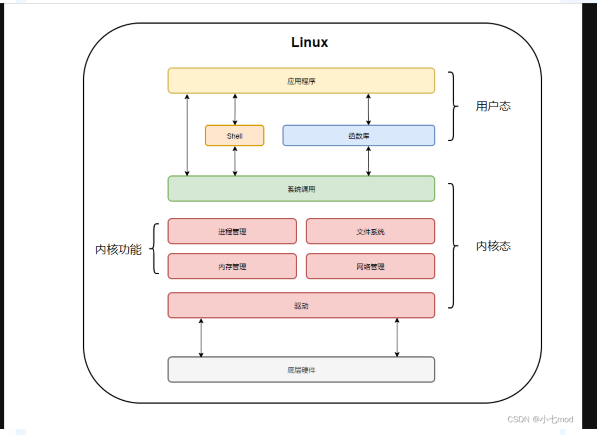
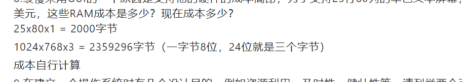
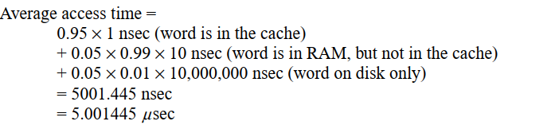
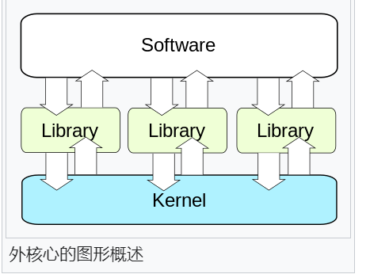

# 第一章练习题

## What are the two main functions of an operating system?  

An operating system must provide the users with an [extended machine,]() and it must manage the I/O devices and other system resources. To some extent, these are different functions.  

### extended machine(top down)

hide messy details which must be preformed

展示给用户一个易于使用的虚拟机

### resource manager（bottom_up)

允许多个程序同时运行，管理保护内存，I\O设备以及其它资源（从时间和空间两个方面实现资源的共享）

## 2

**In Section 1.4, nine different types of operating systems are described. Give a list of applications for each of these systems (one per operating systems type).**

Obviously, there are a lot of possible answers. Here are some. **Mainframe operating system:** Claims processing in an insurance company. **Server operating system:** Speech-to-text conversion service for Siri. **Multiprocessor operating system**: Video editing and rendering. Personal computer operating system: Word processing application. **Handheld computer operating system:** Context-aware recommendation system. **Embedded operating system:** Programming a DVD recorder for recording TV. **Sensor-node operating system:** Monitoring temperature in a wilderness area. **Real-time operating system:** Air traffic control system. Smart-card operating system: Electronic payment.

## 3

**What is the difference between timesharing and multiprogramming systems?**  

分时系统允许不同的用户使用自己的终端去在一个计算机系统上访问和执行计算；多道程序系统指一个用户可以在一个计算机上并发的运行多个程序；分时操作系统一定是多道程序设计系统，多道程序系统不一定是分时系统，多道程序系统也可以是运行在只有一个用户的PC机上

## 4

**To use cache memory, main memory is divided into cache lines, typically 32 or 64bytes long. An entire cache line is cached at once. What is the advantage of caching anentire line instead of a single byte or word at a time?**

因为内存访问具有局部引用性，当一个位置被访问时，附近的位置被访问的概率也很高，通过缓存整个cache line可以大大提高缓存命中，此外现在硬件设备传输64或者32字节的块数据比以字为单位读取相同数据会更加快速。

## 5

**On early computers, every byte of data read or written was handled by the CPU (i.e.,there was no DMA). What implications does this have for multiprogramming?**

多道程序设计系统是为了让CPU在等待I/OR任务完成的同时有事可做。如果失去DMA，当进行I/O操时，操作系统会多次参与，进行大量的上下文切换，CPU会被持续占用但是利用率很低（因为I/O操作和CPU相比速度很慢）；如果有DMA，当操作系统想要执行IO操作时，直接将相关指令发送给DMA设备，DMA硬件负责处理IO操作，CPU可以执行其它任务，当IO完成后，只需要发送一个中断给CPU，然后陷入到内核态，内核就知道IO已经知道IO操作完成，过程只需要四次必要的上下文切换，并且IO操作过程不消耗CPU资源。

### 内核态和用户态

内核态（Kernel Mode）：处于内核态的 CPU 可以访问任意的数据，包括外围设备，比如网卡、硬盘等，处于内核态的 CPU 可以从一个程序切换到另外一个程序，并且该状态下占用 CPU 不会发生被抢占情况，一般处于特权级 0 的状态我们称之为内核态。该状态下用来运行操作系统程序，操作硬件。
用户态（User Mode）：处于用户态的 CPU 只能受限的访问内存，并且不允许访问外围设备，用户态下的 CPU 不允许独占，也就是说 CPU 能够被其他程序获取。该状态下用来运行用户程序。

### CPU状态的切换



#### CPU状态转换的途径

用户态--->内核态：唯一途径是通过中断、异常、陷入机制（访管指令）

内核态--->用户态：设置程序状态字PSW

#### CPU状态转化流程（开销）

相信大家都听过这样的话「用户态和内核态切换的开销大」，但是它的开销大在那里呢？简单点来说状态转化有下面几步：

- 保留用户态现场（上下文、寄存器、用户栈等）

- 复制用户态参数，用户栈切到内核栈，进入内核态
- 额外的检查（因为内核代码对用户不信任）
- 执行内核态代码
- 复制内核态代码执行结果，回到用户态
- 恢复用户态现场（上下文、寄存器、用户栈等）

实际上操作系统会比上述的更复杂，这里只是个大概，我们可以发现一次切换经历了「用户态 -> 内核态 -> 用户态」。

#### 用户态到内核态切换

通常来说，以下三种情况会导致用户态到内核态的切换

##### 1、系统调用

这是用户态进程主动要求切换到内核态的一种方式，用户态进程通过系统调用申请使用操作系统提供的服务程序完成工作。比如fork()实际上就是执行了一个创建新进程的系统调用。

而系统调用的机制其核心还是使用了操作系统为用户特别开放的一个中断来实现，例如Linux的int 80h中断。

**用户程序通常调用库函数，由库函数再调用系统调用，因此有的库函数会使用户程序进入内核态**（只要库函数中某处调用了系统调用），有的则不会。

##### 2、异常

当CPU在执行运行在用户态下的程序时，发生了某些事先不可知的异常，这时会触发由当前运行进程切换到处理此异常的内核相关程序中，也就转到了内核态，比如缺页异常。

##### 3、外围设备的中断

当CPU在执行用户态的进程时，外围设备完成用户请求的操作后，会向CPU发出相应的中断信号，这时CPU会暂停执行下一条即将要执行的指令转而去执行与中断信号对应的处理程序，

如果先前执行的指令是用户态下的程序，那么这个转换的过程自然也就发生了由用户态到内核态的切换。比如硬盘读写操作完成，系统会切换到硬盘读写的中断处理程序中执行后续操作等。

这3种方式是系统在运行时由用户态转到内核态的最主要方式，其中系统调用可以认为是用户进程主动发起的，异常和外围设备中断则是被动的。

### 系统调用

系统调用（System Call）是操作系统提供给用户程序的接口，通过系统调用，用户程序可以请求操作系统内核来执行一些特权操作，如创建进程、打开文件、读写设备等。系统调用的执行过程可以概括为以下几个步骤：

1. 用户程序调用系统函数，将系统调用的参数传递给系统函数。

2. 系统函数将系统调用的参数存储到寄存器中，并将系统调用号（syscall number）存储到寄存器eax中。
3. 系统函数执行中断指令int 0x80，触发CPU从用户态切换到内核态，将控制权交给操作系统内核。
4. 操作系统内核根据系统调用号和参数，执行相应的特权操作，如创建进程、打开文件、读写设备等。
5. 操作系统内核将特权操作的结果返回给用户程序，将控制权重新切换到用户态，继续执行用户程序。

### [内核空间和用户空间](https://blog.csdn.net/qq_25046827/article/details/130353420)

需要注意的是，操作系统内核和用户程序在**物理上并没有区**别，它们在同一块内存中，只是在执行时CPU通过特权级别位来区分当前程序执行指令的权限级别，限制了一定要通过系统函数执行特权指令。但是系统函数常驻在内核空间，我们还需要保护这部分函数不被修改。所以操作系统内核需要通过一些特殊的手段来保证自己的安全性和稳定性，例如使用不同的内存地址空间来隔离不同的程序，限制程序的访问范围等。

内核是指内存管理、文件管理、硬件管理等这些模块的集合，可以看作是一个全局共享的，有权限保护功能的最底层的库，本质上是一个二进制文件，常驻在内存中。而系统调用是进程和内核交互的本质，当有进程想做一些高特权的操作时，如文件读写，就会通过系统调用去执行它的部分代码。开机之后，引导程序就会将内核载入内存。

在现代操作系统中，内存空间通常被划分为**内核空间和用户空间**。内核空间是操作系统内核所在的内存区域，它包含了操作系统内核的所有代码和数据结构，以及受保护的硬件资源，如中断控制器、时钟、设备驱动程序等。用户空间是普通应用程序所在的内存区域，它包含了应用程序的代码和数据结构，但是不能直接访问受保护的内核空间资源。


### DMA(Direct Memory Access)

传输数据，但是不需要CPU的参与

DMA（Direct Memory Access）是一种重要的数据传输技术，它能够在计算机系统中实现高速的数据复制和传输，而无需CPU的直接参与。通过直接访问内存，DMA可以将数据从一个地址空间复制到另一个地址空间，实现外设和存储器之间、存储器和存储器之间的快速数据传输。

作为计算机系统的核心，CPU负责处理各种任务和事务。然而，CPU的资源是有限的，而且有些任务并不需要CPU的实时处理。例如，数据的复制和存储操作并不需要CPU的高速计算能力，因此将这部分任务交给DMA来处理，可以更好地利用CPU的资源，使其能够专注于处理更复杂的计算任务，提高系统的整体性能。

## 6

**Instructions related to accessing I/O devices are typically privileged instructions, that is, they can be executed in kernel mode but not in user mode. Give a reason why these instructions are privileged.**

访问IO设备，比如打印机，通常是会对不同用户有不同的限制，有些用户可以随意打印它们想要的页数，有些用户甚至根本不被允许打印，有些用户会被允许打印一定数量的页数，这些限制是系统管理员基于某些**策略**制定，这些策略需要被强制实行，不能被用户修改干扰。

答案二：

在操作系统中，许多访问IO设备的指令都被设定为特权指令的原因主要涉及到系统的安全性和稳定性。这样的设计可以防止普通用户程序直接操作硬件设备，从而引发的一系列问题。以下是几个具体的理由：

1. **保护硬件资源**：IO设备通常是共享资源，如果任何程序都能随意访问这些设备，可能会导致设备状态混乱或硬件损坏。特权指令确保只有经过验证和授权的操作系统代码才能操作这些设备。

2. **系统稳定性**：如果用户程序能直接进行IO操作，可能会不当地更改设备设置或发送不正确的数据，这可能导致系统崩溃或不稳定。通过将这些指令设置为特权指令，操作系统可以通过自己的驱动和管理代码来确保操作的正确性和顺序。

3. **安全性**：直接访问IO设备可能会绕过操作系统的安全控制，比如访问未授权的数据或者篡改数据。特权指令机制可以阻止恶意软件或病毒通过硬件操作来损害系统安全。

4. **资源分配**：操作系统负责合理分配和调度计算机资源，包括CPU时间、内存和IO设备。如果用户程序能够自行控制IO设备，将很难做到公平和高效的资源使用。

5. **隔离和抽象**：操作系统提供了一个抽象层，使得应用程序不需要关心具体的硬件细节就可以进行IO操作。这种隔离保证了应用程序的可移植性和操作系统的灵活性。

因此，通过将访问IO设备的指令设定为特权指令，操作系统能够维护对硬件资源的完全控制，从而保证系统的整体安全、稳定和高效。这是现代操作系统设计中的一项基本原则。

## 7

The family-of-computers idea was introduced in the 1960s with the IBM System/360 mainframes. Is this idea now dead as a doornail or does it live on?

依然活着。 例如，英特尔使Core i3，i5和i7 CPU具有各种不同的属性，包括速度和功耗。 所有这些计算机都在架构上兼容。 只是它们的价格和性能不同。

## 8

One reason GUIs were initially slow to be adopted was the cost of the hardware needed to support them. How much video RAM is needed to support a 25-line × 80-row character monochrome text screen? How much for a 1200 × 900-pixel 24-bit color bitmap? What was the cost of this RAM at 1980 prices ($5/KB)? How much is it now?

****

## 9

**There are several design goals in building an operating system, for example, resource utilization, timeliness, robustness, and so on. Give an example of two design goals that may contradict one another.**

实时性和公平性互相矛盾。公平性要求每一个进程都以公平的方式分配资源，不能有进程超过合理份额。但是实时性，要求根据不同进程执行完成所必须的时间来分配资源，这会让实时进程获得不成比例的资源分配。

### What is a Real-Time Operating System (RTOS)？

[What is a Real-Time Operating System (RTOS)?](http://www.ni.com/white-paper/3938/en/)

```
一般而言，操作系统的任务是管理计算机的硬件资源和应用程序。 实时操作系统会执行这些任务，但是运行时间精度和可靠度都极高。 在实际应用中，有的系统失常代价高昂，甚至会引起安全事故。这时，操作系统的时间精度和可靠度都显得格外重要。

顾名思义，实时操作系统必须在已知的关键时间内完成关键操作，至少要在绝对大多数情况下在已知时间内完成关键操作。 部分这类操作包括操作系统调用和中断处理。 完全满足在指定时间内完成关键性操作的实时操作系统，被称为“硬实时”操作系统。大多数情况下能满足在指定时间内完成关键性操作的实时操作系统，被称为“软实时”操作系统。 实际情况中，上述分类的指导意义有限。每个实时操作系统都有独特的性能特征，用户在决定使用某个实时操作系统之前需要仔细研究这些特征。

下面通过列子来帮助理解实时操作系统的概念。 假设您在为一款新车设计安全气囊系统。 在该情况下，极小的时间误差（太早或太迟）都会产生灾难性后果，甚至导致人员伤亡。 因此，需要一个硬实时系统；在系统设计上要确保没有任何操作的优先级可以凌驾于时间限制之上。 另一方面，如要设计一个接收流媒体手机，在保持大致不丢失流媒体数据的前提下可以偶尔遗失少量数据。 在这种应用中，一个软实时操作系统就可满足要求。

如果编程合理，实时操作系统可保证程序运行在时间上的稳定可靠性。 实时操作系统向用户提供任务优先级排序的高度控制权，也通常会允许用户检查任务执行是否符合时间上设定的要求。
```

## 10

**What is the difference between kernel and user mode? Explain how having two distinct modes aids in designing an operating system.**

大多数现代的CPU有两种模式的执行：内核态和用户态。内核态可以执行指令集的所有指令，并且利用硬件的每一个特性功能；用户能只能使用子集指令以及硬件功能的子集。这样可以让用户程序运行在用户态从而避免访问使用关键指令，从而避免让计算机陷入混乱。

## 11

A 255-GB disk has 65,536 cylinders with 255 sectors per track and 512 bytes per sector. How many platters and heads does this disk have? Assuming an average cylinder seek time of 11 ms,  average rotational delay of 7 msec and reading rate of 100 MB/sec, calculate the average time it will take to read 400 KB from one sector

Number of heads = 255 GB / (65536*255*512) = 16（面，一个盘面一个磁头）

Number of platters = 16/2 = 8（片）

The time for a read operation to complete is seek time + rotational latency + transfer time. The seek time is 11 ms, the rotational latency is 7 ms and the transfer time is 4 ms, so the average transfer takes 22 msec

### 磁盘结构

磁盘设备由一组盘组组成：

- 包括一张或多张盘片，每张盘片分正反两面

- 每面可划分成若干磁道各磁道之间留有必要的间隙
- 每条磁道又分为若干个扇区，各扇区之间留有一定的空隙，每个扇区的大小相当于一个盘块大小磁盘在存储信息之前，必须进行磁盘格式化。

在微机上配置的硬盘和软盘一般采用移动磁头结构

- 一个盘组中所有盘片被固定在一根旋转轴上，沿着一个方向高速旋转
- 每个盘面配有一个读/写磁头，所有的读/写磁头被固定在移动臂上同时移动

### 单位换算

B KB MB GB 中间的跨度都是2^10=1024

- 1 纳秒 (ns) = 0.001 微秒 (μs)
- 1 纳秒 (ns) = 0.000001 毫秒 (ms)
- 1 纳秒 (ns) = 1e-9 秒 (s)

## 12

**Which of the following instructions should be allowed only in kernel mode?**

**(a) Disable all interrupts. (b) Read the time-of-day clock. (c) Set the time-of-day clock. (d) Change the memory map.**

acd都是内核态才能使用的指令；时钟读取可以在用户态，但是时钟修改必须在内核态，因为它对程序运行影响很大

### 只能在内核态运行的指令

以下是一些典型的只能在内核态运行的指令：

1. **控制寄存器操作**：如在x86架构中，对CR0、CR3等控制寄存器的操作只能在内核态进行。
2. **改变处理器状态**：例如，更改中断使能位，切换CPU的模式或状态。
3. **直接内存访问**：直接访问物理内存地址或进行某些类型的内存管理。
4. **输入/输出操作**：执行直接的I/O操作，如访问硬盘、网络接口等硬件资源的指令。
5. **特定的系统调用指令**：例如，在x86架构中，`syscall`, `sysenter` 等用于进入系统调用的指令。

### 如何区分内核态与用户态指令

区分内核态与用户态指令通常依赖于操作系统和CPU的架构设计：

- **硬件支持**：现代CPU设计包括多个模式或级别，常见的如x86架构的保护模式，其中包括了0到3的环级（Ring 0至Ring 3）。内核代码通常运行在Ring 0（内核态），享有最高的权限，而用户程序则运行在Ring 3（用户态），权限受限。
- **操作系统设计**：操作系统通过特权级的概念来限制访问权限。内核态能执行所有指令集和访问所有硬件资源，而用户态代码尝试执行特权指令时，会引发异常，并由操作系统处理（例如通过中断处理）。
- **系统调用接口**：用户态程序通过系统调用请求操作系统提供的服务，如文件操作、网络通信等。系统调用是用户态和内核态之间的接口，用户态程序通过这些调用请求内核态服务。

操作系统通过这些机制来保护关键系统资源，防止用户程序直接进行潜在的破坏性操作。在系统设计和开发中，了解这些区分非常重要，以确保系统的安全性和稳定性。

## 13

**Consider a system that has two CPUs, each CPU having two thread(hyperthreading). Suppose three programs, P0, P1, and P2, are started with run times of 5, 10 and 20msec, respectively. How long will it take to complete the execution of these programs?Assume that all three programs are 100% CPU bound, do not block during execution,and do not change CPUs once assigned**

一个cpu两个线程

完成这些程序的执行可能需要20,25或30毫秒，具体取决于操作系统如何安排它们。 如果P0和P1在同一个CPU上进行调度，而P2在另一个CPU上进行调度，则需要20毫秒。 如果P0和P2安排在同一个CPU上并且P1安排在另一个CPU上，则需要25毫秒。 如果P1和P2安排在同一个CPU上并且P0安排在另一个CPU上，则需要30毫秒。 如果所有三个都在同一个CPU上，则需要35毫秒。

## 14

**A computer has a pipeline with four stages. Each stage takes the same time to do itswork, namely, 1 nsec. How many instructions per second can this machine execute**

10^9;十亿条指令

与管道有多少级没有关系。一个十级管道在一纳秒也是执行一条指令，一秒也是执行10亿条指令。 重要的是完成的指令弹出管道末端的频率。

## 15

Consider a computer system that has cache memory, main memory (RAM) and disk,and an operating system that uses virtual memory. It takes 1 nsec to access a word from the cache, 10 nsec to access a word from the RAM, and 10 ms to access a word from the disk. If the cache hit rate is 95% and main memory hit rate (after a cachemiss) is 99%, what is the average time to access a word?



## 16

**When a user program makes a system call to read or write a disk file, it provides an indication of which file it wants, a pointer to the data buffer, and the count. Control is then transferred to the operating system, which calls the appropriate driver. Suppose that the driver starts the disk and terminates until an interrupt occurs. In the case of reading from the disk, obviously the caller will have to be blocked (because there are no data for it). What about the case of writing to the disk? Need the caller be blocked awaiting completion of the disk transfer**

不一定。如果立即将控制权返回然后立即重写数据，这会导致写文件发生的时候，写入的数据是错误的。但如果，驱动程序将数据复制到私有的缓存区中，那么调用者不需要被block，可以继续执行。

## 17、What is a trap instruction? Explain its use in operating systems  

A trap instruction switches the execution mode of a CPU from the user mode to the kernel mode. This instruction allows a user program to invoke functions in the operating system kernel

让CPU从用户态陷入到内核态，允许用户程序调用操作系统内核的功能

### trap指令

- 陷入指令是再用户态执行的，执行陷入指令之后，立即引发一个内中断，从而CPU进入核心态
- 发出系统调用请求是再用户态，而对系统调用的相应处理是再核心态下进行
- **陷入指令是唯一一个只能再用户态，而不可再核心态执行的指令**


## 宏内核、微内核、外核

### 宏内核

**Monolithic System - "the big mess".**

All operating system operations are put into a single file. The operating system is a collection of procedures, each of which can call any of the others.（高度耦合、执行速度快、效率高）

**Monolithic systems – basic structure:**

1. A **main program** that invokes the requested service procedure.
2. A set of **service procedures** that carry out the system calls.
3. A set of **utility procedures** that help the service procedures

### 微内核

- Move as much functionality as possible from the kernel into user space.
  OS kernel is very small -minimal functionality.
  - Primitive memory management (address space)
  - 1/O and interrupt management
  - Inter-Process Communication (IPC)
  - Basic scheduling
- Other OS functions provided at user level by
  trusted servers.
  - User process,trusted by kernel.
  - Device drivers,file system,virtual memory.

#### 客户/服务器模式——微内核衍生

内核只负责server和client之间的信息传递

### 外核

Exokernel与宏内核、微内核的本质区别：传统内核是不允许应用程序直接访问系统资源的。

在Exokernel中，运作在核心空间的唯一行程就是内核，唯一工作就是负责分配系统资源，并防止用户行程访问到其他行程的资源。**每个用户行程都拥有一个[虚拟机](https://zh.wikipedia.org/wiki/虛擬機器)**，可以执行自己的操作系统。



# 第二章

## 进程和线程

