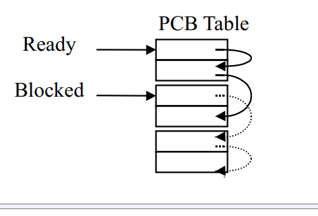
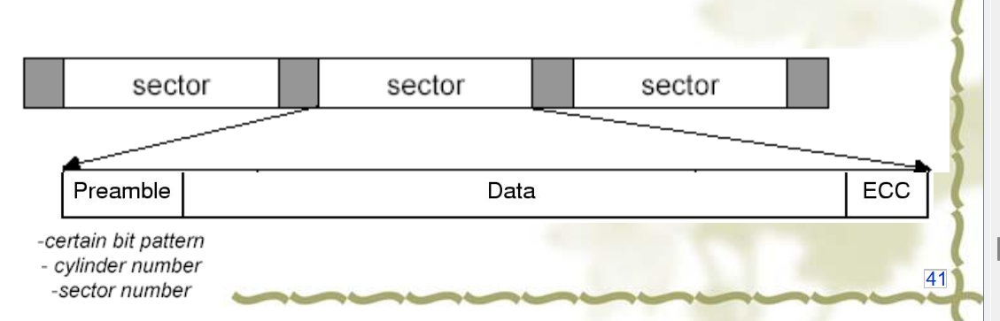
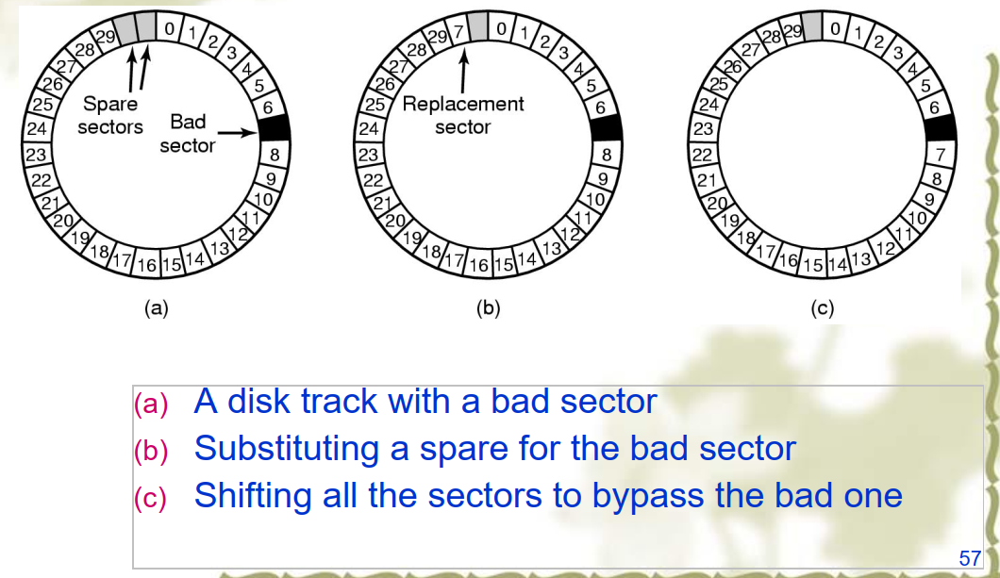
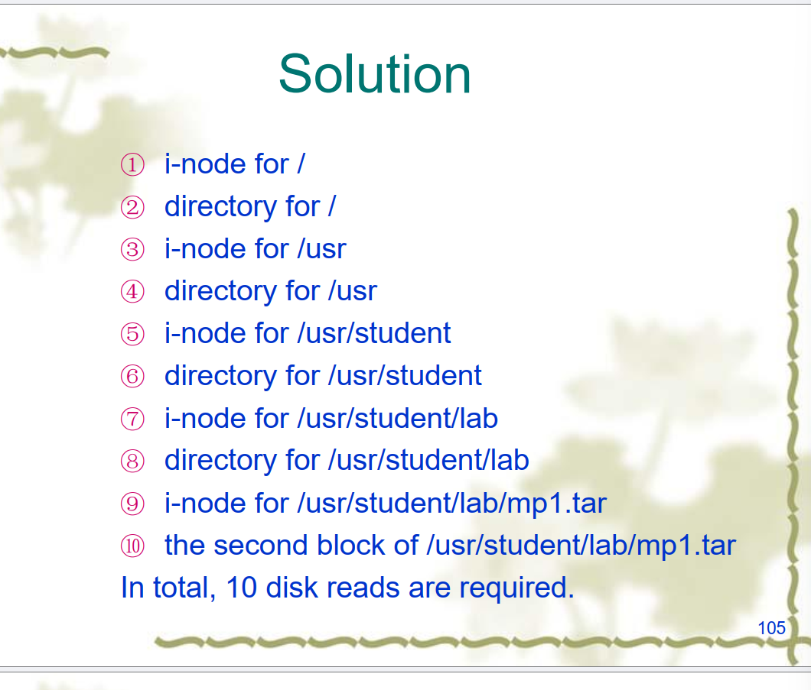
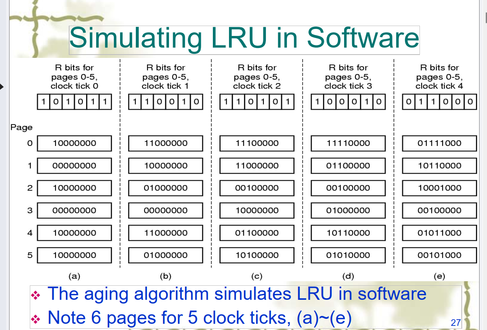

# 计算机操作系统

## 一.操作系统引论

### 1.操作系统的目标和功能

- 目标

  - 方便性

  - 有效性

    - 提高系统资源利用率

    - 提高系统吞吐量

  - 可扩充性

  - 开放性

- 作用

  - OS作为用户与计算机硬件系统之间的接口

    - 命令方式

    - 系统调用方式

    - 图标–窗口方式

  - OS实现了对计算机资源的抽象

### 2.操作系统的发展过程

- 未配置操作系统的计算机系统

  - 人工操作方式

    用户独占全机 CPU等待人工操作 严重降低了计算机资源的利用率

  - 脱机输入/输出(Off–Line I/O)方式

    减少了CPU的空闲时间 提高了I/O速度 效率仍然不理想

- 单道批处理系统

- 多道批处理系统

  1.资源利用率高
  2.系统吞吐量大
  3.平均周转时间长
  4.无交互能力

  - (宏观并行，微观串行)

- 分时系统

  特征:
  1.多路性
  2.独立性
  3.及时性
  4.交互性

- 实时系统

- 集群系统–超算~云计算

- 微机操作系统的发展

### 3.操作系统的基本特征

- 1.并发concurrence

  - 区别并行和并发

    并行性是指两个或多个事件在同一时刻发生→宏观并行，微观并行
    并发性是指两个或多个事件在同一时间间隔内发生→宏观并行，微观串行

    - 并发是进程宏观一起运行，微观上交替运行，而并行是指同时运行

  - 引入进程

    进程是指在系统中能独立运行并作为资源分配的基本单位，它是由一组机器指令，数据和堆栈等组成的，是一个能独立运行的活动实体

- 2.共享sharing

  - 1.互斥共享方式

  - 2.同时访问方式

  - 并发和共享是多用户(多任务)OS的两个最基本的特征。它们又是互为存在的条件

- 3.虚拟virtual

  - 时分复用技术

  - 空分复用技术

- 4.异步asynchronism

### 4.操作系统的主要功能

- 1.处理机管理功能

  - 进程控制

  - 进程同步

    - 进程互斥方式

    - 进程同步方式(协同)

  - 进程通信

  - 调度

    - 作业调度

    - 进程调度

- 2.存储器管理功能

  - 内存分配

    - 静态分配

    - 动态分配

  - 内存保护

  - 地址映射

  - 内存扩充

- 3.设备管理功能

  - 缓冲管理

  - 设备分配

  - 设备处理

    - 设备处理程序又称设备驱动程序

- 4.文件管理功能

  - 文件存储空间的管理

  - 目录管理

  - 文件的读写管理和保护

- 5.操作系统与用户之间的接口

  - 用户接口

  - 程序接口

- 6.现代操作系统的新功能

  - 系统安全

  - 网络的功能和服务

  - 支持多媒体

### 5.OS结构设计

- 传统操作系统结构

  - 无结构操作系统

  - 模块化OS

  - 分层式结构OS

- 微内核os结构

  - 客户/服务器模式

  - 面对对象的程序设计

## 第二章进程的描述与控制

### 前驱图和程序执行

### 程序并发执行

- 程序的并发执行

- 程序并发执行时的特征

  - 间断性

  - 失去封闭性

  - 不可再现性

### 进程的描述

- 进程的定义

  - 进程是程序的一次执行

  - 进程是一个程序及其数据在处理机上顺序执行时所发生的活动

  - 进程是具有独立功能的程序在一个数据集合上运行的过程，它是系统进行资源分配和调度的一个独立单位

- 进程的特征

  - 动态性

  - 并发性

  - 独立性

  - 异步性

- 从操作系统角度分类

  - 系统进程

  - 用户进程

- 进程和程序的区别

  - 进程是动态概念，而程序则是静态概念

  - 程序是指令的有序集合，永远存在；进程强调是程序在数据集上的一次执行，有创建有撤销，存在是暂时的；

  - 进程具有并发性(concurrency )，而程序没有

  - 进程可创建其他进程，而程序并不能形成新的程序

  - 进程是竞争计算机资源的基本单位，程序不是

- 进程和程序的联系

  - 进程是程序在数据集上的一次执行

  - 程序是构成进程的组成部分，一个程序可对应多个进程，一个进程可包括多个程序

  - 进程的运行目标是执行所对应的程序

  - 从静态看，[进程](#process image)由程序、数据和进程控制块（PCB）组成(program, data, and PCB  )

- 进程的基本状态及转换

  - 进程的三种基本状态

    - 就绪状态ready（占用CPU）

    - 执行状态running

    - 阻塞状态block（有外部事件发生才可能运行）

  - 三种基本状态的转换

    - 

      

  - 创建状态和终止状态

    - 五状态进程模型
    - 

  - 注意

    - 阻塞态->运行态和就绪态->阻塞态这二种状态转换不可能发生

- 挂起操作和进程状态的转换

  - 挂起和阻塞的区别

  - 挂起操作的目的

    - 终端用户的需要: 修改、检查进程

    - 父进程的需要：修改、协调子进程

    - 对换的需要：缓和内存

    - 负荷调节的需要：保证实时任务的执行

  - 关键图

- 进程管理中的数据结构（PCB）

  Os maintain a process table, each entry is PCB  

  

  - 进程控制块PCB的作用

    - 作为独立运行基本单位的标志

    - 能实现间断性运行方式

    - 提供进程管理所需要的信息

    - 提供进程调度所需要的信息

    - 实现与其他进程的同步与通信

    - PCB表的大小决定了系统的并发程度

  - 进程控制块的信息

    - 进程标识符

      - 外部标识符PID

      - 内部标识符(端口)

    - 处理机状态

      - 通用寄存器

      - 指令计数器

      - 程序状态字PSW

      - 用户栈指针

    - 进程调度信息

      - 进程状态

      - 进程优先级

      - 进程调度所需的其他信息

      - 事件

    - 进程控制信息

      - 程序和数据的地址

      - 进程同步和通信机制

      - 资源清单

      - 链接指针

    - 进程控制块的组织方式

      - 线性方式

      - 链接方式(link)

        

      - 索引方式(index)

        

        

### 进程控制

- 操作系统内核

  - 两大功能

    - 支撑功能

      - 中断管理

      - 时钟管理

      - 原语操作

        - 进程的管理，由若干原语（primitive）来执行

    - 资源管理功能

      - 进程管理

      - 存储器管理

      - 设备管理

  - 状态

    - 系统态，管态，内核态

    - 用户态，目态

- [进程的创建](#进程的创建)

- 进程的层次结构

  - 父进程

  - 子进程

- 引起创建进程的事件

  - 用户登录

  - 作业调度

  - 提供服务

  - 应用请求

- 进程的创建过程

  - 1.申请空白PCB

  - 2.为新进程分配其运行所需的资源

  - 3.初始化进程块PCB

  - 4.如果进程就绪队列能够接纳新进程，便将新进程插入就绪队列

- [进程的终止](#进程的终结)
  	- 引起进程终止的事件

  		- 1.正常结束
  	
  		- 2.异常结束
  	
  		- 3.外界干预
  	
  	- 进程的终止过程
  	
  		- 1.根据被终止进程的标识符

  - 进程的阻塞与唤醒

    - 引起进程阻塞和唤醒的事件

      - 请求系统服务而未满足

      - 启动某种操作而阻塞当前进程

      - 新数据尚未到达

      - 无新工作可做：系统进程

    - 进程阻塞过程(自己阻塞自己)

    - 进程唤醒过程(系统或其他进程唤醒自己)

  - 进程的挂起与激活

    - suspend

    - active

- 进程同步

  - 基本概念

    - 两种形式的制约关系

      - 间接相互制约关系

        - 互斥——竞争

      - 直接相互制约关系

        - 同步——协作

    - 临界资源

    - 分区

      - 进入区enter section

      - 临界区critical section

      - 退出区exit section

      - 剩余区remainder section

    - 同步机制应遵循的规则

      - 1.空闲让进

      - 2.忙则等待

      - 3.有限等待

      - 4.让权等待

  - 进程同步机制

    - 软件同步机制:都没有解决让权等待，而且部分方法还会产生死锁的情况

    - 硬件同步机制

      - 关中断

      - 利用Test-and-Set指令实现互斥

      - 利用swap指令实现进程互斥

    - 信号量机制

      - 整型信号量

      - 记录型信号量

        - 由于整型信号量没有遵循让权等待原则，记录型允许负数，即阻塞链表

      - AND型信号量

      - 信号量集

        - 理解:AND型号量的wait和signal仅能对信号施以加1或减1操作，意味着每次只能对某类临界资源进行一个单位的申请或释放。当一次需要N个单位时，便要进行N次wait操作，这显然是低效的，甚至会增加死锁的概率。此外，在有些情况下，为确保系统的安全性，当所申请的资源数量低于某一下限值时，还必须进行管制，不予以分配。因此，当进程申请某类临界资源时，在每次分配前，都必须测试资源数量，判断是否大于可分配的下限值，决定是否予以分配

        - 操作

          - Swait(S1，t1，d1…Sn，tn，dn)

          - Ssignal(S1，d1…Sn，dn)

        - 特殊情况

  - 经典进程的同步问题

    - 生产者–消费者问题

      - **生产者——消费者问题（producer-consumer）**，又称**有界缓冲区问题（bounded buffer）**。其通常是解决多个进程/线程协同的工作的问题。以两个进程为例，一个是生产者，一个是消费者。它们共享一个公共的固定大小的缓冲区。生产者负责生产数据并放入缓冲区，消费者负责从缓冲区读取数据并消费。当然，生产者和消费者数量可以不是1个，也可以把这个问题一般化为m个生产者和n个消费者问题。

      - 该问题在于当缓冲区被生产者生产的数据塞满，而此时生产者还想向缓冲区放入新的数据时。其解决办法是让生产者睡眠，当消费者从缓冲区取出一个数据时（此时缓冲区有空闲的空间），再唤醒生产者，生产者得以继续生产数据。同样，消费者从缓冲区中取数据发现缓冲区中数据个数为0，那么消费者就会睡眠，当生产者发现缓冲区的数据增加到1时，生产者会再唤醒消费者。

      - 但这里存在竞争条件。为了跟踪缓冲区的数量，需要一个整型变量count来记录缓冲区中数据量以及设置一个缓冲区的组大容量N。当count达到N时，让生产者睡眠；当count达到0时，让消费者睡眠。当count从N降为N-1时，消费者唤醒生产者；当count从0变为1时，生产者唤醒消费者。

      - **为什么会出现竞争条件呢？本质的原因是会存在发送给一个尚未睡眠的进程/线程的信号丢失了**。因为我们没有对count的访问加以限制。可能会出现这种情况：缓冲区为空，即count = 0，消费者读取的count == 0，此时消费者准备睡眠，但在消费者睡眠之前调度程序决定暂停消费者，**消费者被挂起但未在逻辑上睡眠**。生产者生产一项数据并放入共享缓冲区，此时count从0 变为 1，所以生产者认为刚才消费者读取了count为0，此时消费者肯定在睡眠，于是生产者就调用weakUp唤醒消费者。但因为消费者在逻辑上并没有睡眠而是被调**度程序挂起，这样导致信号被丢失了**。当消费者下次被调度并运行时，它判断**先前读取到的count为0**，认为共享缓冲区为空（而实际上缓冲区已经有数据了），所以消费者进入睡眠。这样种情况下，消费者没有被唤醒，生产者不断的生产数据直到填满缓冲区，最终生产者也进入了睡眠。这两个进程都将一直睡眠下去。

      - 简言之，还没来得及睡眠，就被挂起（唤醒无效），挂起结束后，认为缓存区还是空的，继续睡。

        

    - 哲学家进餐问题

    - 读者–写者问题

### 进程通信

- 进程通信是指进程之间的信息交换，又称低级进程通信
- 进程通信涉及的三个问题
  - 进程间的消息传递
  - 资源共享
    - 互斥访问(mutual exclusion)
      - No two processes simultaneously in [critical region](#critical region/section)
      - No assumptions made about speeds or numbers of CPUs
      - No process running outside its critical region may
        block another process
      - No process must wait forever to enter its critical region

  - 进程合作
    - 进程同步：对多个相关进程在执行次序上的协调，用于保
      证这种关系的相应机制称为进程同步。（或相互合作的一组
      并发进程在一些关键点上可能需要互相等待与互通消息，这种相互制约的等待与互通消息称为进程同步。)

- 进程通信的类型

  - 共享存储器系统

    - 基于共享数据结构的通信方式

      - 生产者和消费者

    - 基于共享存储区的通信方式

      - 高级通信

  - 管道通信系统(pipe)

    - 高级通信

  - 消息传递系统

    - 高级通信

    - 方式分类

      - 直接通信

      - 间接通信

  - 客服机–服务器系统
- 消息传递通信的实现方式

  - 直接消息传递系统

  - 信箱通信

### 线程的基本概念

- 线程的引入

  - 线程是lightweight process (LWP)  ，是一个进程内的顺序执行流；不拥有系统资源，只运行一些必须的数据结构（TCB——线程用来说明线程存在的标识、记录线程属性和调度信息, a program counter, a register set, and a stack——堆栈和寄存器用例存储线程的局部变量  ）；线程和进程内的其它线程共享所拥有的全部资源
  - 线程的引入正是为了简化线程间的通信，以小的开销来提高进程内的并发程度
  - 多进程并发的不足

    - 进程的两个基本属性

      - 一个拥有资源的独立单位，可独立分配系统资源
      - 一个可独立调度和分派的基本单位，PCB
    - 程序并发执行所需付出的时空开销

      - 创建进程

      - 撤销进程

      - 进程切换
    - 进程间通信效率低
    - 将分配资源和调度两个属性分开
  - 线程——作为调度和分派的基本单位

    - 进程是系统资源分配的单位，线程是处理器调度的单位

    - 线程表示进程的一个控制点，可以执行一系列的指令。通常，和应用程序的一个函数相对应

    - 进程分解为线程还可以有效利用多处理器和多核计算机

- 线程与进程的比较

  - 不同点

    - 线程是CPU调度的基本单位；同一进程内的进程共享同一地址空间；线程切换不涉及资源指针的保存和地址空间的切换，开销较小；线程的调度切换既可以由系统内核也可以由用户程序完成
    - 进程是资源分配的基本单位（如打印机、 I/O缓冲队列等， 均记录在进程控制块PCB中）；不同进程拥有不同的虚拟地址空间是分配主存的基本单位；进程切换涉及有关资源指针的保存和进程地址空间的转换，开销很大；进程切换和调度都是由操作系统内核完成
    - 并发性
  - 相似点

    - 状态：运行、阻塞、就绪

    - 线程具有一定的生命期

    - 进程可创建线程，一个线程可创建另一个子线程

    - 多个线程并发执行时仍然存在互斥与同步
  - 线程的优点
    - 线程创建快
    - 线程的退出快
    - 线程切换快
    - 线程之间的通信简单（共享内存和进程资源）

- 线程的实现

  - 线程的分类

    - 传统是进程是单线程控制（heavyweight）

    - 一个进程如果可以控制多个线程，一次可以执行多个任务，称之为（multithreading）

  - 线程的实现方式

    - [内核支持线程KST](#内核级线程)

    - [用户级线程ULT](#用户级线程（ULT）)

    - [组合方式（Hybrid Implementations  ）](#组合实现线程)

    - 弹出式线程

  - 多线程OS中的进程属性

    - 进程是一个可拥有资源的基本单位

    - 多个线程可并发执行

    - 进程已不是可执行的实体

  - 线程的状态和线程控制块

    - 线程运行的三个状态

      - 执行状态

      - 就绪状态

      - 阻塞状态

    - 线程控制块TCB

      


### 小概念补充

#### fork()

fork函数的作用是复制调用进程来创建一个新进程。新进程称为子进程。调用进程称为父进程，子进程和父进程在**不同的内存（地址）空间**中运行。子进程在父进程的基础上**复制了所有的资源**，包括代码段、数据段、堆栈段、打开的文件等，但是进程ID和父进程ID不同。调用fork函数会返回两个值：子进程返回0，父进程返回子进程的进程ID。父子进程之间是完全独立的，它们共享的只有内核中的一些数据结构。

之后可以为新进程调用execve（）system call来替换load 新的程序段

#### exec()

(换药不换壳儿)

exec函数族用于启动一个新程序来替换当前进程的映像。它有多种变体，例如execlp、execvp等。这些函数需要指定新程序的名称、命令行参数以及环境变量等信息。调用exec函数成功后，当前进程的**所有资源都会被新程序替换掉**，但是**进程ID和父进程ID不变**，系统认为还是同一个进程


#### process image

- 用户程序
- 用户数据
- Stack（过程调用和参数传递）
- PCB进程控制块-进程属性


#### 进程的创建

- System initialization (reboot)  
  - Foreground processes are those that interact with users and
    perform work for them.

  - Background processes that handle some incoming request
    are called daemons.（守护进程）

- 进程创建的系统调用（[fork（）](#fork())_ UNIX）

- 用户请求创建新进程
  - 命令行或者点击一个图标

- 初始化一份批处理作业（Initiation of a batch job）

#### 进程的终结

- 主动自愿退出
  - Normal exit   （Exit in UNIX and ExitProcess in Windows  ）
  - Error exit  （编译错误）
- 非自愿
  - Fatal error  （发生致命错误：执行非法指令、引用不存在的内存）
  - Killed by another process  （Kill in UNIX and TerminateProcess in Windows  ）

#### [Context](https://bbs.huaweicloud.com/blogs/342455)

##### 上下文

  上下文是从英文context翻译过来，指的是一种环境。相对于进程而言，就是进程执行时的环境；具体来说就是各个变量和数据，包括所有的寄存器变量、进程打开的文件、内存信息等。

​	通过系统调用，用户空间的应用程序就会进入内核空间，由内核代表该进程运行于内核空间，这就涉及到上下文的切换，**用户空间和内核空间具有不同的 地址映射，通用或专用的寄存器组**，而用户空间的进程要传递很多变量、参数给内核，内核也要保存用户进程的一些寄存器、变量等，以便系统调用结束后回到用户 空间继续执行

##### 进程上下文

是整个执行进程的静态藐视

一个进程的Context可以分为三个部分:用户级上下文、寄存器上下文以及系统级上下文:

​    （1）用户级上下文: 正文、数据、用户堆栈以及共享存储区；
​    （2）寄存器上下文: 通用寄存器、程序寄存器(IP)、处理器状态寄存器(EFLAGS)、栈指针(ESP)；
​    （3）系统级上下文: 进程控制块task_struct、内存管理信息(mm_struct、vm_area_struct、pgd、pte)、内核栈。

##### 上下文切换

- Switch CPU from one process to another
  Performed by scheduler (chapter 2.4)
  It includes:
- - save PCB state of the old process;
  - load PCB state of the new process;
  - Flush memory cache;
  - Change memory mapping;
- Context switch is expensive(1-1000 microseconds)
- - No useful work is done (pure overhead)
  - Can become a bottleneck

#### TCB

原进程PCB的内容分成两部分：

- 描述进程资源和空间的部分；
- 描述执行现场、 状态及调度的部分。

将第二部分内容作为线程控制块TCB的内容， 且一个进程内允许多个线程存在。

#### 引入线程后的新进程概念

- 一个独立的进程空间， 可装入进程映像；
- 一个独立的进程相关联的执行文件；
- 进程所用的系统资源；
- 一个或多个线程。 （进程在创建时一般同时创建好第一个线程，其他线程按需要由用户程序请求创建）

#### 用户级线程（ULT）

- 线程包完全在用户空间，内核不知道线程的存在
- 线程管理由用户级线程库进行
- 线程切换不需要内核特权，用户线程的创建、管理很快速
- 问题：如果内核为单线程，一旦某个进程的的某个线程发起（block）系统调用，由于内核不知道线程的存在，内核将直接block整个进程


#### 内核级线程

- 内核在内核空间执行线程的创建、调度和管理
- 没有线程库，内核提供api
- 内核维护进程和线程的上下文
- 线程切换需要内核（需要进行陷入内核操作）
- 线程是调度的基本单位
- 问题：成本高


#### 组合实现线程

在一些系统中，使用组合方式的多线程实现, 线程创建完全在用户空间中完成，线程的调度和同步也在应用程序中进行。一个应用程序中的多个用户级线程被映射到一些（小于或等于用户级线程的数目）内核级线程上。


#### pop up thread

弹出式线程经常使用在分布式系统当中，当系统得到了一个请求之后，就会新创建一个新的线程去对该请求进行处理。并且弹出式线程和其他的线程都不相同，其没有设置存储器，也没有设置堆栈等等内容，**可想而知，其创建的速度肯定要比一般的线程还要快。也正是因为如此，所以该请求到达到线程开始运行时间非常的短，请求不会被阻塞。**

Creation of a new thread when message arrives

(a) before message arrives (b) after message arrives

#### critical region/section

##### 临界资源

一次只允许一个进程访问的资源

包括：硬件资源（输入及、打印机）和软件资源（变量、表格、队列、文件）

##### 临界区

The part of the program where the critical resource is accessed is called critical region or critical section.

#### [mutual exclusion](https://juejin.cn/post/6955822657623293959)

可能的实现方案

- Disabling Interrupts

  - 进入临界区禁用中断，离开时释放
  - CPU会因为时钟或者其它中断切换进程，没有中断就不会切换
  - 问题
    - 如果进程没有enable 中断
    - 多处理器（禁用中断只能影响一个CPU）

- Lock Variables

  - 进入临界区时先检查lock是否为，如果为，置lock为1，然后进入临界区，离开后置lock为0；
  - 避免两个进程同时进入临界区，需要让检查判断和置1操作为原子操作（atomic）

- Strict Alternation

  - 严格轮换法的思路是：假设两个进程，分别是进程0、进程1，同时有一个整型锁变量turn，其初始值为0。进程0在锁变量为0时可以进入临界区，退出临界区之前将锁变量设置为1。进程1在锁变量为1时可以进入临界区，退出临界区之前将锁变量设置为0。**严格轮换法虽然能解决竞争条件问题，但是因为存在进程被临界区外的进程阻塞的情况。导致必须要依赖临界区外的进程执行完成才能执行**。这违反了上述的第三条原则“临界区外运行的进程不能阻塞其他进程” 这并不是一个好的方法。具体原因是：
    - 首先，turn初始值为0，进程0尝试进入临界区，测试turn为0，符合进入临界区条件，于是进程0进入临界区
    - 然后，进程0离开临界区，把turn设置为1，此时只有进程1可以进入临界区
    - 最后，进程0结束非临界区的操作并返回到while循环的开始，因为turn的值之前被进程0置为1，所以进程0不能进入临界区，需要等待非临界区的进程1把turn置为0，而此时进程1还在忙着非临界区的操作。这样依赖，进程0就被进程1阻塞了。进程0什么时候能够再次运行，取决于进程1什么时候访问并离开临界区后把turn置为0。

- Peterson's solution

  - Peterson解法也是一种软件解法。该算法由2个ANSI C编写的过程（函数）组成。ANSI是美国国家标准学会的缩写。ANSI C规定C语言为所定义的函数提供函数原型，也就是声明。下图是两个C函数。其工作原理是：
    - turn表示轮到哪个进程访问临界区
    - 如果intersted数组中的其他进程是TRUE则忙等待，否则可以进入临界区
    - 如果两个进程几乎同时调用enter_region，他们将自己的进程号存入turn，但只有后赋值给turn的进程号才有效。假设进程1后写入turn。运行到while语句时，turn为1，他们各自的process分别是0、1。于是进程1while语句的条件`turn === process && interested[other] == TRUE`为真，所以进程1忙等待。而进程0的while语句的turn和process不等，那么进程0循环0（不需忙等待）直接进入临界区。

- TSL

  - TSL指令是一个需要硬件支持的方案。TSL称为**测试并加锁**（test and set lock）。他将一个内存字LOCK读到寄存器RX中。然后在该内存地址上存一个非零值。读字和写字操作是不可分割的，即该指令结束前其他处理器均不允许访问该内存字。执行TSL指令的CPU将锁住内存中线，以禁止其他CPU在本指令结束前访问内存。**TSL指令解决了忙等待的屏蔽中断方案中无法屏蔽多处理器访问共享内存的问题。** 因为锁住内存总线不同于屏蔽中断，锁住内存总线后，所有处理器都无法通过内存总线访问内存字。

  - 那些多处理器的计算机都有TSL指令。如下：

    ```
    TSL RX, LOCK
    ```

  - ```
    // 布尔型共享变量 lock 表示当前临界区是否被加锁
    // true表示已加锁，false表示未加锁
    bool TestAndSet(bool *lock){
        bool old;
        old = *lock;    //old用来存放lock，原来的值
        *lock = true;   //无论之前是否已加锁，都将lock设为true
        return old;     //放回lock原来的值
    }
    
    // 以下是使用 TSL 指令实现互斥的算法逻辑
    while(TestAndSet(&lock)); //"上锁"并"检查"
    临界区代码段...
    lock = false;       //"解锁"
    剩余区代码段...
    ```

  - 若刚开始lock 是false，则TSL放回的old值为false，while循环条件不满足，直接跳过循环，进入临界区。若刚开始 lock 是 true，则TSL执行后，old返回值为true，while循环条件满足，会一直循环，直到当前访问临界区的进程在退出区进行"解锁"。

    相比于软件实现方法，TSL指令把"上锁"和"检查"操作用硬件的方式变成来一气呵成的原子操作。

- Sleep and Wakeup

  - 忙等待互斥的基本原理是：一个进程进入临界区前，先检查是否允许进入，即是否有其他进程正在临界区内，如果不允许进入临界区，则原地等待并不同的检测，直到进入为止。忙等待的缺点也是显而易见的：因为在忙等待的过程中，进程会不断的检测是否可以进入临界区，所以忙等待会浪费CPU的时间。
  - 另一方面，忙等待也会带来**优先级反转问题**。所谓优先级反转，即高优先级的进程（线程、任务）被低优先级的进程（线程、任务）阻塞的一种现象、
  - 比如，有两个进程H、L。H进程优先级高、L进程优先级低。调度规则规定只要H进程处于就绪状态就可以运行。但如果某一时刻，L处于临界区中，H突然从阻塞态变为就绪态，所以调度程序准备运行H。因为H就绪时L不会被调度，所以L无法离开临界区中。L没有离开临界区，H只能忙等待。所以最后的结果是H一直忙等待、L一直等待被调度。产生了一种类似于"死锁"的优先级反转的现象。
  - 因为忙等待的CPU性能问题，所以需要考虑一种非忙等待的方式避免竞争条件。即在进程无法进入临界区时使进程进入阻塞态而不是忙等待，当能够进入临界区的时候进行唤醒操作。睡眠与唤醒就是这种方式的实现。


#### 信号量——信号量区别联系

(互斥信号量初值一般为1，同步信号量初值要看对应资源的初始值是多少)

互斥量是二元信号量（只有lock和unlock两种状态）

**锁是服务于共享资源的；而semaphore是服务于多个线程间的执行的逻辑顺序的。**

P=DOWN操作

V=UP操作

互斥量用于线程的互斥，信号量用于线程的同步。

这是互斥量和信号量的根本区别，也就是互斥和同步之间的区别。

- 互斥：是指某一资源同时只允许一个访问者对其进行访问，具有唯一性和排它性。但互斥无法限制访问者对资源的访问顺序，即访问是无序的。
- 同步：是指在互斥的基础上（大多数情况），通过其它机制实现访问者对资源的有序访问。在大多数情况下，同步已经实现了互斥，特别是所有写入资源的情况必定是互斥的。少数情况是指可以允许多个访问者同时访问资源

note:信号量可以用来实现互斥量的功能

- 如果缓冲区大小大于1，就必须专门设置一个互斥信号量来保证互斥访问缓冲区。否则就会出现两个进程同时访问缓冲区的情况，有可能导致两个进程写入缓冲区的数据**相互覆盖**的情况。
- 如果缓冲区大小为1，有可能不需要设置互斥信号量就可以互斥访问缓冲区。

##### 信号量的物理含义

S>0表示有S个资源可用
S=0表示无资源可用
S<0则S表示S等待队列中的进程个数
挖
P(S)表示申请一个资源，V(S)表示释放一个资源
信号量的初值应该大于等于0

##### P,V操作必须成对出现，有一个P操作就一定有一个V操作

- 当为互斥操作时，它们同处于同一进程；
- 当为同步操作时，则不在同一进程中出现。
- 如果P(S)和P(S2)两个操作在一起，那么P操作的顺序至关重要，一个同步P操作与一个互斥P操作在一起时同步P操作在互斥P操作前；
- 而两个V操作的顺序无关紧要。

##### 信号量同步的缺点

用信号量可实现进程间的同步，但由于信号量的控制分布在整个程序中，其正确性分析很困难。

##### 引入管程

1973年，Hoare和Hanson提出一种高级同步原语一管程；其基本思想是把信号量及其操作原语封装在一个对象内部。

- ·管程是管理进程间同步的机制，它保证进程互斥地访问共享变量，并方便地阻塞和唤醒进程。
- ·管程可以函数库的形式实现。相比之下，管程比信号量好控制。

## 第三章:处理机调度与死锁

### 进程

- CPU bursts

  A period of time when a process needs the CPU is called a CPU burst.

- I/O bursts

  A period of time when a process needs 1/O is called a CPU burst.

Bound

- CPU密集型
  - CPU突发时间长，低频 的IO等待
- I/O密集型
  - 短时间的CPU burst，高频率的I/O等待
- cpu越快，进程越倾向于I/O密集型


### 处理机调度算法的目标

- 处理机调度算法的共同目标

  - 资源利用率:CPU的利用率=CPU有效工作时间/(CPU有效工作时间+CPU空闲等待时间)

  - 公平性

  - 平衡性

  - 策略强制执行

- 批处理系统的目标

  - 平均周转时间短（turnaround time）】
    - 一个进程从进入到完成的时间

  - 系统吞吐量高（Throughput）
    - 单位时间完成的进程

  - 等待时间（waiting time）
    - 就绪队列等待的时间

  - 处理机利用率高（processor utilization）

- 分时系统的目标

  - 响应时间快

  - 均衡性

- 实时系统目标

  - 截止时间的保证

  - 可预测性

- 处理机调度的层次

  - 高级调度（作业调度）

    - 分时系统无需作业调度，因为需要交互

    - 批处理系统需要作业调度

  - 中级调度（和挂起有关）

  - 低级调度（进程调度）

    - 进程调度是最基本的调度，任何操作系统都有进程调度。

    - 低级调度的三个基本机制

      - 排队器

      - 分派器

      - 上下文切换

    - 进程调度方式

      - 非抢占方式

      - 抢占方式

        - 优先权原则

        - 短进程优先原则

        - 时间片原则

    - 进程调度的任务

      - 保存处理机的现场信息

      - 按某种算法选取进程

      - 把处理器分配给进程

    - 进程调度的算法

      - 优先级调度算法

        - 优先级调度算法的类型

          - 非抢占式优先级调度算法

            - 等当前进程执行完以后，再执行另一个优先权最高的进程

            - 这种调度算法主要用于批处理系统中；也可用于某些对实时性要求不严的实时系统中。 

          - 抢占式优先级调度算法

            - 不等当前进程结束，直接抢处理机

            - 常用于要求比较严格的实时系统中， 以及对性能要求较高的批处理和分时系统中。

        - 优先级的类型

          - 静态优先级

            - 优先权是在创建进程时确定的，且在进程的整个运行期间保持不变。一般地，优先权是利用某一范围内的一个整数来表示的，例如，0~7或0~255中的某一整数， 又把该整数称为优先数。

            - 可以参考BIOS系统中设置boot的优先级

          - 动态优先级

            - 在创建进程时所赋予的优先权，是可以随进程的推进或随其等待时间的增加而改变的，以便获得更好的调度性能。

      - 轮转调度算法

        - 基本原理:在轮转(RR)法中，系统根据FCFS策略，将所有的就绪进程排成一个就绪队列，并可设置每隔一定时间间隔(如30ms)即产生一次中断，激活系统中的进程调度程序，完成一次调度，将CPU分配给队首进程，令其执行

        - 进程切换时机

          - 时间片未用完，进程完成

          - 时间片到，进程未完成

        - 时间片大小的确定

          - 太小利于短作业，增加系统切换开销

          - 太长就退化为FCFS算法

          - 一般选择: q略大于一次交互所需要的时间，使大多数进程在一个时间片内完成

        - 一般来说，平均周转时间将比SJF长，但是有较好的响应时间

      - 多队列调度算法

      - 多级反馈队列调度算法

        - 调度机制

          - 设置多个就绪队列

          - 每个队列都采用FCFS算法

          - 按照队列优先级调度，在第n队列中采取按时间片轮转的方式运行

        - 调度算法的性能

          - 对于终端型用户，由于作业小，感觉满意

          - 对于短批处理作业用户，周转时间也较小

          - 长批处理作业用户，也能够得到执行

      - 基于公平原则的调度算法

        - 保证调度算法

        - 公平分享调度算法

### 作业与作业调度

- 作业

  - 作业不仅包含程序和数据，还配有一份作业说明书，系统根据说明书对程序的运行进行控制。批处理系统是以作业为单位从外存掉入内存的。

- 作业控制块JCB

  - 为每个作业设置一个JCB，保存了对作业管理调度的全部信息。是作业存在的标志。

- 作业步

  - 作业步，每个作业都必须经过若干相对独立，有相互关联的顺序步骤才能得到结果。每一个步骤就是一个作业步。

- 作业运行的三个阶段

  - 收容阶段

  - 运行阶段

  - 完成阶段

- 作业运行的三个状态

  - 后备状态

  - 运行状态

  - 完成状态

- 作业调度的主要任务

  - 接纳多少个作业

  - 接纳哪些作业

- 先来先服务(first–come first–served，FCFS)调度算法

  - 比较有利于长作业，而不利于短作业。

  - 有利于CPU繁忙的作业，而不利于I/O繁忙的作业。

- 短作业优先(short job first，SJF)的调度算法

  - 优点

    - 比FCFS改善平均周转时间和平均带权周转时间，缩短作业的等待时间；

    - 提高系统的吞吐量；

  - 缺点

    - 必须预知作业的运行时间

    - 对长作业非常不利，长作业的周转时间会明显地增长

    - 在采用SJF算法时，人–机无法实现交互

    - 该调度算法完全未考虑作业的紧迫程度，故不能保证紧迫性作业能得到及时处理

- 优先级调度算法(priority–scheduling algorithm，PSA)

- 高响应比优先调度算法(Highest Response Ratio Next,HRRN)

  - 原理

    - 在每次选择作业投入运行时，先计算此时后备作业队列中每个作业的响应比RP然后选择其值最大的作业投入运行

    - 优先权=(等待时间+要求服务时间)/要求服务时间=响应时间/要求服务时间=1+等待时间/要求服务时间

  - 特点

    - 如果作业的等待时间相同，则要求服务的时间愈短，其优先权愈高，因而类似于SJF算法，有利于短作业

    - 当要求服务的时间相同时，作业的优先权又决定于其等待时间，因而该算法又类似于FCFS算法

    - 对于长时间的优先级，可以为随等待时间的增加而提高，当等待时间足够长时，也可获得处理机

### 实时调度(HRT和SRT任务)

- 实现实时调度的基本条件

  - 提供必要信息

    - 就绪时间

    - 开始截止时间和完成截止时间

    - 处理时间

    - 资源要求

    - 优先级

  - 系统处理能力强

    - ∑(Ci/Pi)≤1

    - N个处理机:∑(Ci/Pi)≤N

  - 采用抢占式调度机制

  - 具有快速切换机制

    - 对中断的快速响应能力

    - 快速的任务分派能力

- 实时调度算法的分类

  - 非抢占式调度算法

    - 非抢占式轮转调度算法

    - 非抢占式优先调度算法

  - 抢占式调度算法

    - 基于时钟中断的抢占式优先级调度算法

    - 立即抢占的优先级调度算法

- 最早截止时间优先EDF(Earliest Deadline First)算法

  - 根据任务的开始截至时间来确定任务的优先级

    - 截至时间越早，优先级越高

  - 非抢占式调度方式用于非周期实时任务

  - 抢占式调度方式用于周期实时任务

- 最低松弛度优先LLF(Least Laxity First)算法

  - 类似EDF

  - 算法根据任务紧急(或松弛)的程度，来确定任务的优先级。任务的紧急程度愈高，为该任务所赋予的优先级就愈高， 以使之优先执行。

  - 松弛度例子

    - 例如，一个任务在200ms时必须完成，而它本身所需的运行时间就有100ms，因此，调度程序必须在100 ms之前调度执行，该任务的紧急程度(松弛程度)为100 ms

- 优先级倒置(Priority inversion problem)

  - 优先级倒置的形成

    - 高优先级进程被低优先级进程延迟或阻塞。

  - 优先级倒置的解决方法

    - 简单的:假如进程P3在进入临界区后P3所占用的处理机就不允许被抢占

    - 实用的:建立在动态优先级继承基础上的

### 死锁概述

- 资源问题

  - 可重用性资源

    - 计算机外设

  - 消耗性资源

    - 数据，消息

  - 可抢占性资源

    -  不引起死锁

    -  CPU，内存 

  - 不可抢占性资源

    - 光驱，打印机

- 计算机系统中的死锁

  - 竞争不可抢占性资源引起死锁

  - 竞争可消耗资源引起死锁

  - 进程推进顺序不当引起死锁

- 死锁的定义，必要条件和处理方法

  - 定义:如果一组进程中的每一个进程都在等待仅由该进程中的其他进程才能引发的事件，那么该组进程是死锁的

  - 产生死锁的必要条件

    - 互斥条件

    - 请求和保存条件

    - 不可抢占条件

    - 循环等待条件

      - 如果每个资源只有一个实例，则环路等待条件是死锁存在的充分必要条件

    

  - 处理死锁的方法

    - 假装死锁不发生

      - 死锁发生概率低

      - 处理成本极高

      - 便捷和正确性的折中

    - 预防死锁

      - 静态方法，在进程执行前采取的措施，通过设置某些限制条件，去破坏产生死锁的四个条件之一，防止发生死锁。

      - 预防死锁的策略

        - 破坏互斥条件

          - Spooling

            在打印任务的执行过程中，打印机就是一种共享资源，因此也需要遵守互斥条件，即同一时间只能有一个进程访问打印机。

            Spooling是指在计算机系统中，为了避免多个进程同时访问打印机而导致的竞争和冲突，将打印任务先缓存到磁盘上，形成一个打印队列。打印机从队列中读取任务并依次打印。**实际上就是通过在打印机和进程之间引入一个缓冲区，使得进程间不再直接竞争打印机资源，**由唯一的守护后台进程发起请求，从而避免了多个进程同时访问打印机所导致的互斥条件冲突。

          - 后台进程通常被编写为能够输出完整的文件后才能打印，假如两个进程都占用了假脱机空间的一半，而这两个进程都没有完成全部的输出，就会导致死锁。

        - 破坏"请求和保存"条件

          - 第一种协议

            - 所有进程在开始运行之前，必须一次性地申请其在整个运行过程中所需的全部资源

            - 优点:简单，易行，安全

            - 问题
              - 进程运行前不知道所需要的资源
        
              - 会捆绑别的进程正在使用的资源
        
            - 缺点
        
              - 资源被严重浪费，严重地恶化了资源的利用率
        
              - 使进程经常会发生饥饿现象
        
          - 第二种协议
        
            - 它允许一个进程只获得运行初期所需的资源后，便开始运行。进程运行过程中再逐步释放已分配给自己的，且已用毕的全部资源，然后再请求新的所需资源
        
        - 破坏"不可抢占"条件
        
          - 当一个已经保存了某些不可被抢占资源的进程，提出新的资源请求而不能得到满足时，它必须释放已经保持的所有资源，待以后需要时再重新申请
        
        - 破坏"循环等待"条件
        
          - 一次请求一个资源，请求下一个资源就要释放当前拥有的资源
        
          - 资源全局排序
            - 对系统所以资源类型进行线性排序，并赋予不同的序号，所有请求必须按照顺序
        
            - 例如令输入机的序号为1，打印机序号为2，磁盘机序号为3等。所有进程对资源的请求必须严格按资源序号递增的次序提出。
        
            - 找一个满足所有需求的顺序是困难的
        
            - 序号对编程者是一种负担
        
          - 改进第二种
            - 进程不能请求比当前拥有资源序号低的资源
        

    - 避免死锁

      - 动态的方法，在进程执行过程中采取的措施，不需事先采取限制措施破坏产生死锁的必要条件，而是在进程申请资源时用某种方法去**防止系统进入不安全状态**，从而避免发生死锁。如银行家算法

      - 避免死锁的策略

        - 系统安全状态

          - 安全状态

            - 某时刻，对于并发执行的n个进程，若系统能够按照某种顺序如<p1,p2…pn>来为每个进程分配所需资源，直至最大需求，从而使每个进程都可顺利完成，则认为该时刻系统处于安全状态，这样的序列为安全序列

          - 安全状态之例

          - 由安全状态向不安全状态的转换

        - [利用银行家算法避免死锁](#银行家算法)
          - 含义:每一个新进程在进入系统时，它必须申明在运行过程中，可能需要每种资源类型的最大单元数目，其数目不应超过系统所拥有的资源总量。当进程请求一组资源时，系统必须首先确定是否有足够的资源分配给该进程。若有，再进一步计算在将这些资源分配给进程后，是否会使系统处于不安全状态。如果不会，才将资源分配给它，否则让进程等待
          
          - 折中
            - 为了安全，降低并行性

          - 不实际
            - 进程很少直到它们即将调用的所需最大资源
          
            - 进程数不固定
          
            - 系统认为的可用资源可能会突然消失：磁带坏了
          
          - 银行家算法中的数据结构
          
            - 可用资源向量 Available[m]：m为系统中资源种类数，Available[j]=k表示系统中第j类资源数为k个。
          
            - 最大需求矩阵 Max[n,m]：n为系统中进程数，Max[i,j]=k表示进程i对j类资源的最大需求数为中k。
          
            - 分配矩阵 Allocation[n，m]:它定义了系统中每一类资源当前已分配给每一进程资源数，   Allocation[i,j] = k表示进程i已分得j类资源的数目为k个。
          
            - 需求矩阵 Need[n,m]：它表示每个进程尚需的各类资源数，Need[i,j]=k 表示进程i   还需要j类资源k个。Need[i,j]=Max[i,j] - Allocation[i,j]
          
          - 银行家算法
          
          - 安全性算法
          
          - 银行家算法之例
          
          - 解题
          
            - 矩阵
          
            - 列表
    
    - 检测死锁
    
      - 死锁的检测与解除
    
        - 死锁的检测
    
          - 资源分配图
          - 简化步骤
            
            - 选择一个没有阻塞的进程p
            
            - 将p移走，包括它的所有请求边和分配边
            
            - 重复步骤1，2，直至不能继续下去
          
        - 死锁定理
        
          - 若一系列简化以后不能使所有的进程节点都成为孤立节点
        
        - 检测时机
        
          -  当进程等待时检测死锁 （其缺点是系统的开销大）
        
          -  定时检测
        
          -  系统资源利用率下降时检测死锁
        
        - 死锁检测中的数据结构
        
      - 死锁的解除
        
        - 抢占资源
        
        - 终止(或撤销)进程
        
        - 终止进程的方法
        
          - 终止所有死锁进程
        
          - 逐个终止进程
        
            - 代价最小
        
              - 进程的优先级的大小
        
              - 进程已执行了多少时间，还需时间
        
              - 进程在运行中已经使用资源的多少，还需多少资源
        
              - 进程的性质是交互式还是批处理的
        
        - 付出代价最小的死锁解除算法
        
          - 是使用一个有效的挂起和解除机构来挂起一些死锁的进程
    
    - 解除死锁
    
      - 抢占其它进程的资源（需要考虑资源的性质）
      - 通过回滚解除
        - 周期性设置还原点
        - 利用还原点，一旦发现死锁就回滚到不足以导致死锁的状态
      - 杀死其它进程
        - 简单粗暴，但是有效
        - 从循环中剔除一个进程，其它进程获取它占用的资源
        - 被杀死的进程之后从开始重新运行
  
- 其它问题

  - Other Issues
    - Two-Phase Locking
      - 两个进程第一阶段想要获得所有所需资源的读写锁，如果获取成功，则第二阶段结束后释放全部锁（类似于获取全部资源）
      - 如果第一阶段互相牵制，则发生死锁

    - Communication Deadlocks
      - 某个进程等待其它进程的事件发生
      - Process A sends a request message to process B, and then blocks until B sends back a reply message.
        If the **request message gets lost,** B is blocked waiting for a request asking it to do something.

    - Livelock
      - 进程持续运行，但是没有进展
      - 忙等待

    - Starvation
      - 最短作业优先，让长作业保持饥饿


## 第四章:存储器管理

### 无存储器抽象

每一个程序直接面对物理地址

内存中多应用并发

- 添加保护位
  - IBM360将内存划分为2KB的块，每一块4bit的保护位，保存在cpu特殊的寄存器中
  - 进程也有特殊的保护位：程序状态字（Program [Status](https://so.csdn.net/so/search?q=Status&spm=1001.2101.3001.7020) Word, PSW）又称状态寄存器，主要用于反映处理器的状态及某些计算结果以及控制指令的执行。当进程访问内存，对比内存中的保护位和PSW key
- 重新分配
  - Static Relocation：由于进程引用物理绝对地址，加载多个进程需要静态修改地址
    - 优点：不需要硬件支持
    - 缺点：不灵活，内存利用率低。程序一旦装入内存之后就不能再移动，且必须在程序执行之前将有关部分全部装入；必须占用连续的内存空间，，这就难以做到程序和数据的共享

### 地址空间

- 定义

  -  Address space is a set of addresses that a process can
     use to address memory.（可用于寻址内存的地址集合）

- 特性

  - 每个进程有独立的地址空间，互不干扰

- 地址绑定（binding）

  - 将程序指令和数据地址和物理内存地址相关联的进程。又名relocation，重定位

- 动态重定位

  - 动态地址重定位是在程序执行过程中，在CPU访问内存之前，将要访问的程序或数据地址转换成内存地址。动态地址重定位依靠硬件地址变换机构完成。

  - 地址重定位机构需要一个或多个基地址寄存器BR(basic register)和一个或多个程序虚拟地址寄存器VR(virtual register)。指令或数据的内存地址MA(memory address)与虚拟地址的关系为
    $$
    MA=(BR)+(VR)
    $$

  - 优点

    1. 可以对内存进行非连续分配
    2. 提供了实现虚拟存储器的基础
    3. 有利于程序段的共享
    4. 允许进程扩展地址空间（只需要改变limit register的值）
    5. 简单，使用快速的硬件（两个寄存器、add和compare操作）

  - 劣势

    1. 每一步都会被减慢（每一个地址引用需要add和compare操作）
    2. 进程间无法共享内存
    3. 进程大小受限于物理内存大小
    4. 让内存管理变得复杂

  - 硬件支持补充 Equip CPU with two special hardware registers: base and limit

    - Base register: start location for address space
    - Limit register: size limit of address space

### 内存管理

跟踪内存使用情况

#### 位图

One allocation unit corresponds to 1bit in the bitmap 

- 大小
  - 分配单位小，则位图大
- 问题
  - 当新进程到达，管必须寻找到连续的0位
  - 但是在位图中搜寻连续的0bit位，是缓慢的操作


#### linked lists

- 每一个entry表示一个进程和空闲区域；包含起始地址、长度和指向下一个entry的指针
- 可以按照大小排序
- 可以按照地址排序
  - 按照地址排序时，当进程终止或者换出，更新链表是简单的


### [存储分配策略](https://www.cnblogs.com/linfangnan/p/15111659.html#%E5%BF%AB%E9%80%9F%E9%80%82%E5%BA%94%E7%AE%97%E6%B3%95)

- first fit

  - **首次适应(first fit，FF)算法**要求空闲分区链以地址递增的次序链接，在分配内存时从链首开始顺序查找，直至找到一个大小能满足要求的空闲分区为止。然后再按照作业的大小，从该分区中划出一块内存空间，分配给请求者，余下的空闲分区仍留在空闲链中。若从链首直至链尾都不能找到一个能满足要求的分区，则表明系统中已没有足够大的内存分配给该进程，内存分配失败。
  - 该算法倾向于优先利用内存中低址部分的空闲分区，保留了高址部分的大空闲区。缺点是低址部分不断被划分，会留下许多难以利用的外部碎片。而每次查找又都是从低址部分开始的，会导致搜索的时间开销较大。

- next fit

  - 为避免低址部分留下许多很小的空闲分区，以及减少查找可用空闲分区的开销，可以使用循环首次适应算法。**循环首次适应(next fit，NF)算法**在为进程分配内存空间时，是从上次找到的空闲分区的下一个空闲分区开始查找，直至找到一个能满足要求的空闲分区。实现该算法一般会使用循环链表，如果最后一个(链尾)空闲分区的大小仍不能满足要求，则应返回到第一个空闲分区。
  - 算法能使内存中的空闲分区分布得更均匀，减少了查找空闲分区时的开销。但这样会导致高地址的大分区可能被划分为小分区来使用，使缺乏大的空闲分区给较大的进程。

- best fit

  - **最佳适应(best fit，BF)算法**在每次为作业分配内存时，总是把能满足要求、又是最小的空闲分区分配给作业。该算法要求将所有的空闲分区按其容量以**从小到大的顺序**形成一**空闲分区链**，这样第一次找到的能满足要求的空闲区必然是最佳的。
  - 由于每次分配后所切割下来的剩余部分总是最小的，所以在存储器中会留下许多难以利用的碎片。

- worst fit

  - **最坏适应(worst fit，WF)算法**在扫描整个空闲分区表或链表时，总是挑选一个最大的空闲区，从中分割一部分存储空间给作业使用。该算法要求将所有的空闲分区，按其容量以**从大到小的**顺序形成空闲分区链。
  - 这个算法会使存储器中缺乏大的空闲分区，它的优点是可使剩下的空闲区不至于太小，产生碎片的可能性最小，对中、小作业有利。同时最坏适应分配算法查找效率很高，查找时只要看第一个分区能否满足作业要求即可。

- best fit

  - **快速适应(quick fit)算法**又称为分类搜索法，是将空闲分区根据其容量大小进行分类，对于每一类具有相同容量的所有空闲分区，单独设立一个空闲分区链表。同时在内存中设立一张管理索引表，其中的每一个索引表项对应了一种空闲分区类型，并记录了该类型空闲分区链表表头的指针。该算法在搜索时先根据进程的长度，从索引表中去寻找到能容纳它的最小空闲区链表，然后从链表中取下第一块进行分配即可。
  - This is a very fast scheme, but a merge is expensive.合并算法复杂。

  

### 存储器的层次结构

- 多层结构的存储系统

  - 存储器的多层结构

    - CPU寄存器

    - [主存(main memory)](#memory（内存、主存）)

    - 辅存

  - 可执行存储器

    - 寄存器和主存的总称

    - 访问速度快，进程可以在很少的时钟周期内用一条load或store指令完成存取。

- 主存储器与寄存器

- 高速缓存和磁盘缓存

### 程序的装入和链接

- 步骤

  - 编译

    - 源程序 ->目标模块（Object modules）--------Compiler

      - 由编译程序对用户源程序进行编译，形成若干个目标模块

  - 链接

    - 一组目标模块 ->装入模块 （Load Module）----------Linker

      - 由链接程序将编译后形成的一组目标模板以及它们所需要的库函数链接在一起，形成一个完整的装入模块

  - 装入

    - 装入模块 ->内存  --------Loader

      - 由装入程序将装入模块装入内存

- 程序的装入

  - 绝对装入方式

    - 在编译时，如果知道程序将驻留在内存中指定的位置。编译程序将产生绝对地址的目标代码。

  - 可重定位装入方式

    - 在可执行文件中，列出各个需要重定位的地址单元和相对地址值。当用户程序被装入内存时，一次性实现逻辑地址到物理地址的转换，以后不再转换(一般在装入内存时由软件完成)。

    - 优点：不需硬件支持，可以装入有限多道程序。

    - 缺点：一个程序通常需要占用连续的内存空间，程序装入内存后不能移动。不易实现共享。

  - 动态运行时的装入方式

    - 动态运行时的装入程序在把装入模块装入内存后，并不立即把装入模块中的逻辑地址转换为物理地址，而是把这种地址转换推迟到程序真正要执行时才进行

    - 优点：

      - OS可以将一个程序分散存放于不连续的内存空间，可以移动程序，有利用实现共享。

      - 能够支持程序执行中产生的地址引用，如指针变量（而不仅是生成可执行文件时的地址引用）。

    - 缺点：需要硬件支持，OS实现较复杂。

    - 它是虚拟存储的基础。

- 程序的链接

  - 静态链接方式(lib)

  - 装入时动态链接

  - 运行时动态链接(dll)

### 连续分配存储管理方式

- 连续分配

  - 单一连续分配(DOS)

  - 固定分区分配(浪费很多空间)

  - 动态分区分配

- 地址映射和存储保护措施

  - 基址寄存器：程序的最小物理地址

  - 界限寄存器：程序的逻辑地址范围

  - 物理地址 = 逻辑地址 + 基址

- 内碎片：占用分区之内未被利用的空间

- 外碎片：占用分区之间难以利用的空闲分区（通常是小空闲分区）

- 把内存划分为若干个固定大小的连续分区。固定式分区又称为静态分区。

  - 分区大小相等：只适合于多个相同程序的并发执行（处理多个类型相同的对象）。

  - 分区大小不等：多个小分区、适量的中等分区、少量的大分区。根据程序的大小，分配当前空闲的、适当大小的分区。

  - 优点：无外碎片、易实现、开销小。

  - 缺点：

    - 存在内碎片，造成浪费

    - 分区总数固定，限制了并发执行的程序数目。

    - 通用Os很少采用，部分控制系统中采用

- 动态创建分区：指在作业装入内存时，从可用的内存中划出一块连续的区域分配给它，且分区大小正好等于该作业的大小。可变式分区中分区的大小和分区的个数都是可变的，而且是根据作业的大小和多少动态地划分。

  - 基于顺序搜索的动态分区分配算法

    - 首次适应算法（first fit,FF）

      - 顺序找，找到一个满足的就分配，但是可能存在浪费

      - 这种方法目的在于减少查找时间。

      - 空闲分区表（空闲区链）中的空闲分区要按地址由低到高进行排序

    - 循环首次适应算法（next fit，NF）

      - 相对上面那种，不是顺序，类似哈希算法中左右交叉排序

      - 空闲分区分布得更均匀，查找开销小

      - 从上次找到的空闲区的下一个空闲区开始查找，直到找到第一个能满足要求的的空闲区为止，并从中划出一块与请求大小相等的内存空间分配给作业。

    - 最佳适应算法（best fit，BF）

      - 找到最合适的，但是大区域的访问次数减少

      - 这种方法能使外碎片尽量小。

      - 空闲分区表（空闲区链）中的空闲分区要按大小从小到大进行排序，自表头开始查找到第一个满足要求的自由分区分配。

    - 最坏适应算法（worst fit，WF）

      - 相对于最好而言，找最大的区域下手，导致最大的区域可能很少，也造成许多碎片

      - 空闲分区按大小由大到小排序

  - 基于索引搜索的动态分区分配算法

    - 快速适应算法（quick fit）

    - 伙伴系统（buddy system）

    - 哈希算法

  - 动态可重定位分区分配

    - 紧凑

    - 动态重定位

      - 动态运行时装入，地址转化在指令执行时进行，需获得硬件地址变换机制的支持

      - 内存地址=相对地址+起始地址

    - 动态重定位分区分配算法

      - 1、在某个分区被释放后立即进行紧凑，系统总是只有一个连续的分区而无碎片，此法很花费机时。

      - 2、当“请求分配模块”找不到足够大的自由分区分给用户时再进行紧凑，这样紧缩的次数比上种方法少得多，但管理复杂。采用此法的动态重定位分区分配算法框图如下：

  - 优点：没有内碎片。

  - 缺点：外碎片。

### 对换

1. 进程对换（整体对换）：以进程为单位进行对换。
2. 页面对换（部分对换）：以页面为单位进行对换。
3. 分段对换（部分对换）：以分段为单位进行对换。

- 系统把阻塞、或者挂起的的作业放在外存，每次只调用一个（不一定一个，内存可以容纳就可以）作业进入内存运行，当时间片（结合时间片的一种方法）用完时，将它调至外存后备队列上等待，在从后备队列调入另一个作业进入内存运行。
- brings the whole process into memory, runs it for a while, and then move it back on the disk.
- 动态内存分配
  - 当进程到达，如果空间充足则分配所需内存
  - 或者在disk 等待

- 进程随着运行大小增加
  - 先换出，然后swap back，但是分配各大的分区——成本很高
  - 预留增长数据段
  - 为growing stack和grow data segment分配额外空间

- 问题
  - 随着swap in 和swap out，会出现孔洞holes（外部碎片）
    - 解决——compaction

      - 这些碎片需要被压缩（compaction），来产生足够大的自由空间
      - Assumes programs are all re-locatable
      - Processes must be suspended during compaction
      - Need be done only when fragmentation gets very bad

### 基本分页存储管理方式

- [页面分配策略](#页面分配的策略)
- [页面置换策略](#页面置换的策略)
- [页面分配策略和置换策略的组合](#分配和置换的策略组合)
- 小页面

- - 优势
  - 内部碎片少
    - 内存中无用的程序更少
  - 劣势
    - 程序需要更多页，页表可能太大
  
  

  

- overhead

  - 

  

- 分页存储管理的基本方式

  - 页面

    - 将一个进程的逻辑地址空间分成若干个大小相等的片

  - 页框（frame）

    - 内存空间分成与页面相同大小的存储块

  - 由于进程的最后一页经常装不满一块而形成了不可利用的碎片，称之为“页内碎片”

  - 地址结构

    - 页号P+位移量W(0-31)

  - 页表

    - 在分页系统中，允许将进程的各个页离散地存储在内存在内存的任一物理块中，为保证进程仍然能够正确地运行，即能在内存中找到每一个页面所对应的物理块，系统又为每个进程建立了一张页面映像表，简称页表

    - 页表的作用是实现从页面号到物理块号的地址映射

- 地址变换机构

  - 基本的地址变换机构

    - 要访问两次内存

    - 页表大都驻留在内存中

    - 为了实现地址变换功能，在系统中设置页表寄存器（PTR），用来存放页表的始址和页表的长度。

    - 在进程未执行时，每个进程对应的页表的始址和长度存放在进程的PCB中，当该进程被调度时，就将它们装入页表寄存器。

  - 具有快表的地址变换机构

    - 提高了效率，此处会有计算题

    - 如果页表存放在内存中，则每次访问内存时，都要先访问内存中的页表，然后根据所形成的物理地址再访问内存。这样CPU存一个数据必须访问两次内存，从而使计算机的处理速度降低了1/2。

    - 为了提高地址变换的速度，在地址变换机构中增设了一个具有并行查询功能的特殊的高速缓冲存储器，称为“联想存储器”或“快表”，用以存放当前访问的那些页表项。

    - 地址变换过程为：

      - 1、CPU给出有效地址

      - 2、地址变换机构自动地将页号送入高速缓存，确定所需要的页是否在快表中。

      - 3、若是，则直接读出该页所对应的物理块号，送入物理地址寄存器；

      - 4、若快表中未找到对应的页表项，则需再访问内存中的页表

      - 5、找到后，把从页表中读出的页表项存入快表中的一个寄存器单元中，以取代一个旧的页表项。

- 两级和多级页表

  - 主要是有的时候页表太多了，要化简

  - 格式：外层页号P1+外层页内地址P2+页内地址d

  - 基本方法：将页表进行分页，每个页面的大小与内存物理块的大小相同，并为它们进行编号，可以离散地将各个页面分别存放在不同的物理块中。

- 反置页表

  - 反置页表为每一个物理块（页框）设置一个页表项，并按物理块排序，其内容则是页号和其所属进程的标识。

- 优点：

  - 没有外碎片，每个内碎片不超过页大小。

  - 一个程序不必连续存放。

  - 便于改变程序占用空间的大小。即随着程序运行而动态生成的数据增多，地址空间可相应增长。

- 缺点：程序全部装入内存。

### 分段存储管理方式

- 引入

  - 方便编程

  - 信息共享

  - 动态增长

  - 动态链接

- 支持用户视角存储
  - User’s view of a program： A program is a collection of
    segments. A segment is a logical unit such as

  - Main program

  - Procedure

  - Function

  - Symbol table

  - Stack


-  segmented memory allows each table to grow or shrink, independently

- 在分段存储管理方式中，**作业的地址空间被划分为若干个段，每个段是一组完整的逻辑信息，每个段都有自己的名字，都是从零开始编址的一段连续的地址空间，各段长度是不等的。**

- 内存空间被动态的划分为若干个长度不相同的区域，称为物理段，每个物理段由起始地址和长度确定

- 分段系统的基本原理

  - 分段（段式地址）

    - 格式：段号+段内地址（偏置）
  - 段表

    - 段表实现了从逻辑段（用户视角的二维空间）到物理内存区（一维空间）的映射。
    - 索引为页号
    - 表项
      - 基址
      - 范围（段表范围）
  - 地址变换机构
  - 存在段表基址寄存器Segment-table base register (STBR) points to the segment table’s location in memory

- 存储动态分配

  - 跳棋盘checkerboarding或者外部碎片
  - 压缩外碎片

- （纯粹的分段）分段式[存储](https://cloud.baidu.com/product/bos.html)管理方式是一种将程序划分为多个逻辑段的存储管理方式。每个段都有自己的地址空间，并且从0开始编址。段的大小可以动态调整，以适应程序运行时的需求。逻辑地址由段号和段内地址组成，通过地址变换机制将逻辑地址转换为物理地址。

- 分段式存储管理方式的优点包括：

  1. 信息共享：分段式存储管理方式更有利于实现信息的共享和保护。由于段是信息的逻辑单位，因此可以更方便地共享和保护某个段的代码或数据。
  2. 信息保护：分段式存储管理方式可以实现信息的保护功能。例如，可以限制某个段的使用权限，防止未经授权的访问。
  3. 动态增长：在实际应用中，有些段会不断地增长，而事先又无法确切地知道数据段会增长到多大。分段式存储管理方式可以更好地适应这种需求，因为段的长度可以动态调整。
  4. 动态链接：分段式存储管理方式可以实现动态链接，即在作业运行之前，并不把几个目标程序段链接起来。每个段都有自己的名字，可以在运行时根据需要进行链接。

- （纯粹的分段）与分页系统相比，分段式存储管理方式具有以下优点：

  1. **分页系统中的“页”只是存放信息的物理单位，并无完整的意义，不便于实现共享。**而分段系统中的“段”是信息的逻辑单位，更有利于实现信息的共享和保护。
  2. 分页系统的地址空间是一维的，而分段系统的地址空间是二维的，使用户更容易理解和操作。
  3. 分段系统对用户更加友好，用户可以更方便地管理自己的程序和数据。

- 劣势

  - **缺点，\**无法利用碎片，必须搬移内存，造成性能损失。\****

- 和分页的区别

  - 页是信息的物理单位

  - 页的大小固定且由系统固定

  - 分页的用户程序地址空间是一维的

  - 通常段比页大，因而段表比页表短，可以缩短查找时间，提高访问速度。

  - 分页是系统管理的需要，分段是用户应用的需要。一条指令或一个操作数可能会跨越两个页的分界处，而不会跨越两个段的分界处。

- 信息共享

  - 这是分段最重要的优点

- 段页式存储管理方式

  - 虚拟内存中是分段、物理内存中使用分页
    - 一个段分为多页

    - 物理内存只保存段所需要的页，不加载整个段

    - 地址三个部分

  - 基本原理

    - 格式：段号（S）+段内页号（P）+页内地址（W）
  - 地址变换过程

    - 需要三次访问过程
  - 需要
    - 每个进程一个段表：指向所需的页表起始地址
  - 在段页式系统中，为了获得一条指令或数据，需三次访问内存：第一次访问内存中的段表，从中取得页表始址；第二次访问内存中的页表，从中取出该页所在的物理块号，并将该块号与页内地址一起形成指令或数据的物理地址；第三次访问才是真正根据所得的物理地址取出指令或数据。

  

### 知识详解补充

#### memory（内存、主存）

- Program must be brought into memory and placed within a process for it to be run.程序必须载入到内存中并且置于进程中才能运行
- Consecutive address space (memory unit)，is used for store the code and data of process.连续地址空间
- System section and User section

#### ROM-RAM

**ROM** (用于内存，易失性)是一种只能读取而不能写入的存储器，通常用于存储**手机**操作系统、应用程序和用户数据等固定的信息。 而**RAM** 是一种可以随机读取和写入的存储器，通常用于存储正在运行的应用程序和系统进程所需的数据。 **ROM** 的存储容量通常比**RAM** 大得多，因为它需要存储操作系统、应用程序和用户数据等大量信息。

#### 页面分配的策略

- **固定分配**：操作系统为每个进程分配一组固定数目的物理块，在进程运行期间不再改变。即，**驻留集大小不变**。
- **可变分配**：先为每个进程分配一定数目的物理块，在进程运行期间，可根据情况做适当的增加或减少。即，**驻留集大小可变**。

####  页面置换的策略

- **局部置换**：发生缺页时只能选进程自己的物理块进行置换。
- **全局置换**：可以将操作系统保留的空闲物理块分配给缺页进程，也可以将别的进程持有的物理块置换到外存，再分配给缺页进程。

> 【注】有些题目也把“置换”称为“淘汰”。

#### 分配和置换的策略组合

| 策略组合     | 局部置换                                                     | 全局置换                                                     |
| ------------ | ------------------------------------------------------------ | ------------------------------------------------------------ |
| **固定分配** | 进程运行前就分配一定数量的物理块，缺页时只能换出进程自己的一页 | **此组合不存在**，因为进程的物理块数是固定的，不能再申请或占用操作系统中的空闲物理块 |
| **可变分配** | 进程运行前就分配一定数量的物理块，缺页时只能换出进程自己的一页，系统根据发生缺页的频率来动态地增加或减少进程的物理块 | 进程运行前就分配一定数量的物理块，只要进程发生缺页，都将获得新的物理块 |

#### 页面清除策略

- Need for a background process, paging daemon
  -  periodically inspects state of memory
- When too few frames are free
  - selects pages to evict using a replacement algorithm
- It can use same circular list (clock)
  - as regular page replacement algorithm but with diff ptr(front hand & back hand)

#### 分页执行——四个时间开销

1.  Process creation
   1. determine program size
   2. create page table
2. Process execution
   1. MMU reset for new process
   2. TLB flushed
3. Page fault time
   1. determine virtual address causing fault
   2. swap target page out, needed page in
4. Process termination time
   1. release page table, pages

#### 缺页中断的流程

1. Hardware traps to kernel, saving the PC on the stack
2. General registers saved
3. OS determines which virtual page needed
4. OS checks validity of address, seeks page frame 
5. If selected frame is dirty, write it to disk, suspend the process
6. OS brings schedules new page in from disk.while page loading, process still suspend
7. Disk interrupts, page tables updated
8. Faulting instruction backed up to when it began
9. Faulting process scheduled
10. Registers restored
11. Program continues

## 第五章：虚拟存储器

### 常规存储管理方式的特征

- 一次性

- 驻留性

### 局部性原理

- 程序在执行时将呈现出局部性特征，即在一较短的时间内，程序的执行仅局限于某个部分，相应地，它所访问的存储空间也局限于某个区域

- 时间局限性

  - 如果程序中的某条指令一旦执行， 则不久以后该指令可能再次执行；如果某数据被访问过， 则不久以后该数据可能再次被访问。产生时间局限性的典型原因，是由于在程序中存在着大量的循环操作

- 空间局限性

  - 一旦程序访问了某个存储单元，在不久之后，其附近的存储单元也将被访问，即程序在一段时间内所访问的地址，可能集中在一定的范围之内，其典型情况便是程序的顺序执行。

### 定义

- 指具有请求调入功能和置换功能，能从逻辑上对内存容量加以扩充的一种存储器系统

### 优点

- 大程序：可在较小的可用内存中执行较大的用户程序；

- 大的用户空间：提供给用户可用的虚拟内存空间通常大于物理内存(real memory)

- 并发：可在内存中容纳更多程序并发执行；

- 易于开发：不必影响编程时的程序结构

- 以CPU时间和外存空间换取昂贵内存空间，这是操作系统中的资源转换技术

- 允许更加高效的进程创建

- 加载和存储虚拟内存对用户完全透明，无需用户参与

### 特征

- 离散性

  - 指在内存分配时采用离散的分配方式，它是虚拟存储器的实现的基础

- 多次性

  - 指一个作业被分成多次调入内存运行，即在作业运行时没有必要将其全部装入，只须将当前要运行的那部分程序和数据装入内存即可。多次性是虚拟存储器最重要的特征

- 对换性

  - 指允许在作业的运行过程中在内存和外存的对换区之间换进、换出。

- 虚拟性

  - 指能够从逻辑上扩充内存容量，使用户所看到的内存容量远大于实际内存容量。

### 虚拟存储器的实现方式

- 请求分页存储管理方式
  - 硬件

    - 请求页表机制

      - 格式：页号+物理块号+状态位P+访问字段A+修改位M+外存地址

    - 缺页中断机构

    - 地址变换机构（过程图很关键）

  - 请求分页中的内存分配

    - 最小物理块数

      - 即能保证进程正常运行所需的最小物理块数

    - 内存分配策略

      - 固定分配局部置换（国王的大儿子）

      - 可变分配全局置换（国王的二儿子）

      - 可变分配局部置换（国王的小儿子）

  - 物理块分配算法

    - 平均分配算法

    - 按比例分配算法

    - 考虑优先权的分配算法

  - 页面调入策略

    - 系统应在何时调入所需页面

      - 预调页策略（不能实现）

      - 请求调页策略（需要才给）

    - 系统应该从何处调入这些页面

      - 对换区

      - 文件区

    - 页面调入过程

    - 缺页率（出计算题）
- 请求分段系统

  - 硬件

    - 请求分段的段表机构

    - 缺段中断机构

    - 地址变换机构

### Fetch Strategies

#### 按需取用

- 发生缺页中断
- 内存值不合法，则杀死作业
- 合法引用，检查是否已经被缓存到内存中
- 寻找空闲的实页
- 将地址映射到磁盘块，并且将磁盘块装入实页；这个过程需要挂起用户进程
- 当磁盘读取完成，将虚拟内存映射到实页中
- 如果必要，重启回复进程

#### prepaging预取

以一定算法，提前将页面加载到内存中{发生缺页中断的时候，将所需页面和附近的页面一同加载到内存中}

优势：到获取page的时候，IO效率高

劣势：由于基于预测，获取的页面很少被引用则低效

### [页面置换算法](#页面置换算法详细讲解)

- 抖动的概念

  - 即刚被换出的页很快又要被访问，需要将它重新调入，此时又需要再选一页调出
  - Load Control
    - Despite good designs, system may still thrash
    - Some processes need more memory but no processes need less
    - Solution :Reduce a number of processes competing for memory
      - swap one or more to disk, divide up pages they held
      - reconsider degree of multiprogramming

- 最佳置换算法(需要预知后面进程，所以不能实现)

- 先进先出页面置换算法（FIFO）

  - 选择在内存中驻留时间最久的页面予以淘汰

- 最近最久未使用置换算法（LRU）Recently

  - 寄存器支持

  - 特殊的栈结构

- 最少使用置换算法（LFU）Frequently

- clock置换算法（对访问位A的判断）

  - 改进型——增加对修改位M思维判断

- 页面缓冲算法（PBA,page buffering algorithm）

  - 空闲页面链表

  - 修改页面链表


### 补充知识

#### MMU

The MMU (memory management unit) translates a virtual address into a physical address


#### Page fault

指的是当软件试图访问已映射在[虚拟](https://cloud.tencent.com/developer/tools/blog-entry?target=https%3A%2F%2Fbaike.baidu.com%2Fitem%2F%E8%99%9A%E6%8B%9F&source=article&objectId=1683163)[地址空间](https://cloud.tencent.com/developer/tools/blog-entry?target=https%3A%2F%2Fbaike.baidu.com%2Fitem%2F%E5%9C%B0%E5%9D%80%E7%A9%BA%E9%97%B4&source=article&objectId=1683163)中，但是目前并未被加载在[物理内存](https://cloud.tencent.com/developer/tools/blog-entry?target=https%3A%2F%2Fbaike.baidu.com%2Fitem%2F%E7%89%A9%E7%90%86%E5%86%85%E5%AD%98&source=article&objectId=1683163)中的一个[分页](https://cloud.tencent.com/developer/tools/blog-entry?target=https%3A%2F%2Fbaike.baidu.com%2Fitem%2F%E5%88%86%E9%A1%B5&source=article&objectId=1683163)时，由[中央处理器](https://cloud.tencent.com/developer/tools/blog-entry?target=https%3A%2F%2Fbaike.baidu.com%2Fitem%2F%E4%B8%AD%E5%A4%AE%E5%A4%84%E7%90%86%E5%99%A8&source=article&objectId=1683163)的内存管理单元所发出的[中断](https://cloud.tencent.com/developer/tools/blog-entry?target=https%3A%2F%2Fbaike.baidu.com%2Fitem%2F%E4%B8%AD%E6%96%AD&source=article&objectId=1683163)。

MMU会将一个最不常使用的page frame内容写回磁盘，获取被引用的页到物理内存中。


#### 虚拟地址

Virtual address (generated by CPU) is divided into page number (high-order bits) and an page offset (low-order bits)


#### PAGE table

Physical address is divided into

- Frame number
- Page offset

The purpose of the page table is to map **virtual pages（虚页）** onto **page frames.（实页）**

- Managed by OS
- Map VPN (Virtual Page Number) to PFN
  - VPN is the index into the table that determines PFN
- One page table entry (PTE)/页表项 per page in virtual address space, i.e. one PTE per VPN.
- Most operating systems allocate a pagetable for each process.

##### page table 问题

- 地址转换要快速，因为每次内存访问都需要
- 页表可能会太大
  - 多级页表
    - 
    - Since each level is stored as a separate table in memory, converting a logical address to a physical one in a **four-level paging may take five memory accesses.**


#### PTE

- Page frame number - map the frame number
- Present/absent bit - 1/0 indicates valid/invalid entry
- Protection bit - what kinds of access are permitted.
- Modified bit (dirty bit) - set when modified and writing to the disk occur
- Referenced bit - Set when page is referenced (help decide which page to evict)
- Caching disabled - Cache is used to keep data that logically belongs on the disk in memory to  improve performance.

可以是由软件控制、也可以是硬件控制

#### TLB

- 没有TLB的存在时的情况，对线性地址的访问，首先从PGD中获取PTE（第一次内存访问），在PTE中获取页框地址（第二次内存访问），最后访问物理地址，总共需要3次RAM的访问。
- 如果有TLB存在，并且TLB hit，那么只需要一次RAM访问即可。

 cache “active” part of page table； Translation Look-aside Buffers (TLBs)

#### inverted page table 

**反向页表（inverted page table）每个真正的内存页或帧才有一个条目**。每个条目包含保存在真正内存位置的页的虚拟地址以及拥有该页的进程的信息。因此，整个**系统只有一个页表**，对**每个物理内存的页只有一条相应的条目**。因为系统只有一个页表，而有**多个地址空间映射物理内存，所以反向页表的条目中通常需要一个地址空间标识符，以确保一个特定进程的一个逻辑页可以映射到相应的物理帧。**


让页表的空间大小和逻辑地址页号没有直接的关系，尽量和物理地址空间的页号建立映射关系，这么做的好处就是占用地址空间相对较少。

##### linear inverted page tables

One global page table

- One entry for each physical page frame
- Entry consists of the virtual address of the page stored in that real memory location, with information about the process that owns that page. (process, virtual page)
- The physical page number is used as an index into the table

实页号做为索引，自上而下检索，进程id和虚页号都匹配


##### hashed 反向页表

对进程id和虚页号进行哈希计算，来获得entry，遇到冲突则使用链表

弊端：管理哈希链是一种负担


## 第六章：输入输出系统

### I/O系统的功能，模型和接口

- I/O系统管理的对象是I/O设备和相应的设备控制器。

- I/O系统的基本功能

  - 隐藏物理设备的细节

  - 与设备的无关性

  - 提高处理机和I/O设备的利用率

  - 对I/O设备进行控制

  - 确保对设备的正确共享

  - [错误处理](#错误处理)

- I/O软件的层次结构

  - 用户层I/O软件

  - 设备独立性软件

  - 设备驱动程序（厂家开发）

  - 中断处理程序

  - 硬件

- I/O系统的分层

  - 中断处理程序

  - 设备驱动程序

  - 设备独立性软件

- I/O系统接口

  - 块设备接口

    - 指以数据块为单位来组织和传送数据信息的设备

    - 典型的块设备是磁盘、光盘

    - 块设备的基本特征

      - ①传输速率较高，通常每秒钟为几兆位；

      - ②它是可寻址的，即可随机地读/写任意一块；

      - ③磁盘设备的I/O采用DMA方式。

  - 流设备接口

    - 又称字符设备指以单个字符为单位来传送数据信息的设备

    - 这类设备一般用于数据的输入和输出，有交互式终端、打印机

    - 字符设备的基本特征

      - ①传输速率较低；

      - ②不可寻址，即不能指定输入时的源地址或输出时的目标地址；

      - ③字符设备的I/O常采用中断驱动方式。

  - 网络通信接口

    - 提供网络接入功能，使计算机能通过网络与其他计算机进行通信或上网浏览。

### I/O设备和设备控制器

- 分类

  - 使用特性分

    - 存储设备

    - I/O设备

  - 传输速率分

    - 低速设备（几字节——几百字节）

      - 典型的设备有键盘、鼠标、语音的输入

    - 中速设备（数千——数万字节）

      - 典型的设备有行式打印机、激光打印机

    - 高速设备（数十万——千兆字节）

      - 典型的设备有磁带机、磁盘机、光盘机

- 设备并不是直接与CPU进行通信，而是与设备控制器通信。在设备与设备控制器之间应该有一个接口。

  - 数据信号：控制器 ←  设备 ←  控制器

    - 传送数据信号，输入、输出bit

  - 控制信号: 控制器  →  设备

    - 执行读、写操作的信号

  - 状态信号：设备当前使用状态

- 设备控制器

  - 主要功能：控制一个或多个I/O设备，以实现I/O设备和计算机之间的数据交换

  - 基本功能

    - 接收和识别命令

      - 控制寄存器、命令译码器

    - 数据交换

      - 实现CPU与控制器，控制器与设备间的数据交换

    - 标识和报告设备的状态

    - 地址识别

      - 配置地址译码器，识别不同的设备

    - 数据缓冲区

    - 差错控制

  - 设备控制器的组成

    - 设备控制器与处理机（CPU）的接口

      - 实现CPU与设备控制器之间的通信

    - 设备控制器与设备的接口

      - 控制器可连接多个设备

    - I/O逻辑

      - 实现对设备的控制

      - CPU利用该逻辑向控制器发送I/O命令

      - 命令、地址译码

- 内存映像I/O

  - 驱动程序将抽象I/O命令转换出的一系列具体的命令，参数等数据装入设备控制器的相应寄存器，由控制器来执行这些命令，具体实施对I/O设备的操作

- I/O通道

  - 目的：建立独立的I/O操作(组织, 管理和结束)，使由CPU处理的I/O工作转由通道完成（解放CPU，实现并行）


	- 什么是I/O通道？
	
		-  是一种特殊的处理机，具有通过执行通道程序完成I/O操作的指令
	
		-  特点：指令单一(局限于与I/O操作相关的指令)，与CPU共享内存
	
	- 基本过程：
	
		- CPU向通道发出I/O指令->通道接收指令->从内存取出通道程序处理I/O->向CPU发出中断
	
	- 通道类型
	
		- 字节多路通道
	
			- 低中速连接子通道时间片轮转方式共享主通道
	
			- 字节多路通道不适于连接高速设备，这推动了按数组方式进行数据传送的数组选择通道的形成。
	
		- 数组选择通道
	
			- 这种通道可以连接多台高速设备，但只含有一个分配型子通道，在一段时间内只能执行一道通道程序， 控制一台设备进行数据传送， 直至该设备传送完毕释放该通道。这种通道的利用率很低。
	
		- 数组多路通道
	
			- 含有多个非分配型子通道，前两种通道的组合，通道利用率较好
	
	- 瓶颈问题
	
		- 原因;通道不足
	
		- 解决办法：增加设备到主机间的通路，而不增加通道（结果类似RS触发器）

### 中断机构和中断处理程序

- 中断

  - 分类

    - 中断（外部触发）

      - 对外部I/O设备发出的中断信号的响应

    - 陷入（内部原因：除0）

      - 由CPU内部事件引起的中断

  - 中断向量表（类比51单片机）

    - 中断程序的入口地址表

  - 中断优先级

    - 对紧急程度不同的中断处理方式

  - 对多中断源的处理方式

    - 屏蔽中断

    - 嵌套中断

- 中断处理程序

  - 测定是否有未响应的中断信号

  - 保护被中断进程的CPU环境

  - 转入相应的设备处理程序

  - 中断处理

  - 恢复CPU 的现场并退出中断

### [设备驱动程序](#设备驱动)

- 是I/O进程与设备控制器之间的通信程序，又由于它常以进程的形式存在，故以后就简称为设备驱动进程

- 主要任务是接受来自它上一层的与设备无关软件的抽象请求，并执行这个请求。

- 功能

  - 1) 接收由I/O进程发来的命令和参数， 并将命令中的抽象要求转换为具体要求。例如，将磁盘块号转换为磁盘的盘面、 磁道号及扇区号。

  - 2) 检查用户I/O请求的合法性，了解I/O设备的状态，传递有关参数，设置设备的工作方式。 

  - 3) 发出I/O命令，如果设备空闲，便立即启动I/O设备去完成指定的I/O操作；如果设备处于忙碌状态，则将请求者的请求块挂在设备队列上等待。

  - 4) 及时响应由控制器或通道发来的中断请求，并根据其中断类型调用相应的中断处理程序进行处理。

  - 5) 对于设置有通道的计算机系统，驱动程序还应能够根据用户的I/O请求，自动地构成通道程序。 

- 设备驱动程序的处理过程

  - 将用户和上层软件对设备控制的抽象要求转换成对设备的具体要求，如对抽象要求的盘块号转换为磁盘的盘面、磁道及扇区。

  - 检查I/O请求的合理性。

  - 读出和检查设备的状态，确保设备处于就绪态。

  - 传送必要的参数，如传送的字节数，数据在主存的首址等。

  - 工作方式的设置。

  - 启动I/O设备，并检查启动是否成功，如成功则将控制返回给I/O控制系统，在I/O设备忙于传送数据时，该用户进程把自己阻塞，直至中断到来才将它唤醒，而CPU可干别的事。

- 对I/O设备的控制方式

  - I/O控制的宗旨

    - 减少CPU对I/O控制的干预

    - 充分利用CPU完成数据处理工作

  - I/O 控制方式

    - 轮询的可编程I/O方式

    - 中断驱动I/O方式

    - DMA控制方式

    - I/O通道控制方式

- DMA控制器组成

  - 主机与DMA控制器的接口

  - DMA控制器与块设备的接口

  - I/O控制逻辑

### 与设备无关的I/O软件

- 基本概念

  - 含义： 应用程序独立于具体使用的物理设备。

  - 驱动程序是一个与硬件(或设备)紧密相关的软件。为实现设备独立性，须在**驱动程序上设置一层软件**，称为设备独立性软件。

  - 设备独立性(Device Independence)的优点

    - 以物理设备名使用设备

    - 引入了逻辑设备名

    - 逻辑设备名称到物理设备名称的转换（易于实现I/O重定向）

- 与设备无关的软件——功能

  - 设备驱动程序的[统一接口](#统一接口)

    - The driver implementers know what is expected from them

    - The OS implementers can developed
      device-independent I/O function on top of a well-defined lower-layer driver interface.

      - They know which functions each driver
        implements and the pro-types of these function

    - unix系统中，io设备被建模为特殊文件，每个设备由特殊的文件名

      - 主设备号定位设备驱动
      - minor副设备号定位读写单元
      - 文件保护也适用于设备宝华

      

  - [缓存管理](#缓存)

  - [差错控制](#错误处理)

  - 对独立设备的分配与回收

    - Do not allow concurrent accesses to dedicated devices such as CD-RWs.

  - 提供独立于设备的逻辑数据块

    - There are different kind of disk drives. Each
      ay have a different physical sector size.
    - A file system uses a block size while mapping files into logical disk blocks.
    - This layer can hide the physical sector size of different disks and can provide a fixed and uniform disk block size for higher layers, like the file system

- 设备分配中的数据结构

  - 设备控制表DCT

  - 控制器控制表COCT

  - 通道控制表CHCT

  - 显然，在有通道的系统中，一个进程只有获得了通道，控制器和所需设备三者之后，才具备了进行I/O操作的物理条件

  - 系统设备表SDT

  - 逻辑设备表LUT

  - 分配的流程，从资源多的到资源紧张的:LUT->SDT->DCT->COCT->CHCT

  - 在申请设备的过程中，根据用户请求的I/O设备的逻辑名，查找逻辑设备和物理设备的映射表；以物理设备为索引，查找SDT，找到该设备所连接的DCT；继续查找与该设备连接的COCT和CHCT，就找到了一条通路。

### 用户层（空间）的I/O软件

- 系统调用与库函数

  - OS向用户提供的所有功能，用户进程都必须通过执行库函数以获取相应的IO系统调用

  - 在C语言以及UNIX系统中，系统调用（如read）与各系统调用所使用的库函数（如read）之间几乎是一一对应的。而微软的叫Win32API

- 假脱机系统（spooling）
  - 一些程序不能直接写入IO设备中，写入假脱机
  
  - spooling技术是对脱机输入/输出系统的模拟
  
  - 主要组成
  
    - 输入/输出井
  
    - 输入/输出缓冲区
  
    - 输入/输出进程
  
    - 井管理程序
  
  - 特点（体现操作系统的虚拟性）
  
    - 提高了I/O的速度
  
      - 对数据所进行的I/O操作，已从对低速设备演变为对输入井或输出井中的数据存取。
  
    - 将独占设备改造为共享设备
  
      - 实际分给用户进程的不是打印设备，而是共享输出井中的存储区域 
  
    - 实现了虚拟设备功能
  
      - 将独占设备变成多台独占的虚拟设备。
  

### 缓冲区管理

- 缓冲的引入（原因）

  - 缓和CPU与I/O设备间速度不匹配的矛盾

  - 减少对CPU的中断频率，放宽对CPU中断响应时间的限制

  - 提高CPU和I/O设备之间的并行性

  - 解决数据粒度不匹配的问题

- 单缓冲区

  - 即在CPU计算的时候，将数据数据输入到缓冲区(大小取决与T和C的大小)

- 双缓冲区

  - 即允许CPU连续工作（T不断）

- 环形缓冲区（专为生产者和消费者打造）

  - 组成

    - 多个缓冲区

    - 多个指针

  - 使用

    - Getbuf过程

    - Releasebuf过程

  - 同步问题

- 缓冲池(理解为更大的缓冲区)

  - 组成

    - 空白缓冲队列（emq）

      - 由空缓冲区链接而成F(emq)，L(emq)分别指向该队列首尾缓冲区

    - 输入队列（inq）

      - 由装满输入数据的缓冲区链接而成F(inq)，L(inq)分别指向该队列首尾缓冲区

    - 输出队列（outq）

      - 由装满输出数据的缓冲区链接而成F(outq)， L(outq)分别指向该队列首尾缓冲

  - Getbuf和Putbuf过程

    - 收容：缓冲池接收外界数据

    - 提取：外界从缓冲池获得数据

  - 缓冲区工作方式（从缓冲区的角度来看）

    - 收容输入

    - 提取输入

    - 收容输出

    - 提取输出

### 磁盘存储器的性能和调度

- 数据的组织和格式

- 磁盘的类型

  - 固定头磁盘（贵）

  - 移动头磁盘

- 磁盘访问的时间（关键）

  - 寻道时间Ts=m*n+s

  - 旋转延迟时间Tr

  - 传输时间Tt=b/rN

  - 总时间Ta=Ts+1/2r+b/rN

- 磁盘的调度算法（掌握图表）

  - 先来先服务（FCFS）

    - 优点：公平，简单

    - 缺点：可能导致某些进程的请求长期得不到满足

  - 最短寻道时间优先（SSTF）

    - 说明：要求访问的磁道和当前磁头所在的磁道距离最近，以使每次的寻道时间最短

  - 扫描算法（SCAN）

    - 扫描算法不仅考虑到欲访问的磁道与当前磁道间的距离，更优先考虑的是磁道当前的移动方向

    - 联想电梯的运行

    - 可防止低优先级进程出现“饥饿”的现象

  - 循环扫描算法（CSCAN）

    - 算法规定磁头单向移动，例如，只是自里向外移动，当磁头移到最外的磁道并访问后，磁头立即返回到最里的欲访问磁道，亦即将最小磁道号紧接着最大磁道号构成循环，进行循环扫描

  - NStepScan算法

    - N步SCAN算法是将磁盘请求队列分成若干个长度为N的子队列，磁盘调度将按FCFS算法依次这些子队列。

  - FSCAN算法

    - 是Nstepscan算法的简化，将磁盘请求队列分成两个子队列

### 补充知识

#### IO控制

1. 程序控制IO
   1. CPU会一直忙于IO直到完成
      1. 单进程系统可行
         1. MS-DOS
         2. 嵌入式系统
      2. 多道程序系统、分时系统不适用
   2. Poll轮询
      1. CPU会一直检测打印机的状态寄存器
         1. 就绪
         2. 繁忙
         3. 错误
      2. 忙等待IO设备是一种CPU的浪费
2. 中断驱动IO
   1. CPU不会一直等待
   2. IO设备就绪后发出中断指令
   3. 当前进程被block，调度其它进程
   4. 劣势：
      1. 中断会发生在每个字符
3. IO使用DMA
   1. DMA控制器将字符从内核缓存输出到打印机控制器
   2. 不需要CPU 的参与
   3. 当整个缓存被输出，打印完成后再中断CPU

#### IO软件系统层次结构


在I/O系统中，各层的功能如下：

1. **用户级I/O软件**：这一层为用户程序提供了I/O服务，如文件操作、网络通信等。它允许应用程序使用高级语言和简单的接口来进行I/O操作，而无需关心底层的硬件细节。

2. **设备无关的操作系统软件**：这一层提供了对硬件设备的抽象，使上层软件不需要关心具体的硬件设备类型和控制细节。它通常包括缓冲、缓存、设备分配、设备无关的错误恢复等功能。

3. **设备驱动**：设备驱动层负责管理硬件设备，执行具体的设备控制操作，如读写设备寄存器等。每种类型的硬件设备都有一个对应的设备驱动。

4. **中断处理程序**：这一层负责响应硬件设备发出的中断信号，进行初步的事件处理。当硬件设备完成一个I/O操作或需要CPU的注意时，它会发出一个中断信号，中断处理程序会保存CPU的状态，处理中断，然后恢复CPU的状态。

以上就是I/O系统中各层的主要功能。

#### 中断向量

**中断向量**（Interrupt vector）是中断服务程序的入口地址，或中断向量表（它是一个中断处理程序地址的数组）的表项。

系统程序必须维护一份中断向量表，每一个表项纪录一个中断处理程序(ISR，Interrupt Service Routine)的地址

- 当外部事件或异常产生时，由硬件负责产生一个中断标记，CPU根据中断标记获得相应中断的中断向量号，然后由CPU根据中断向量表的地址和中断向量号去查找中断向量表获得相应中断号的中断程序地址，进一步执行对应的中断处理程序。

#### 设备驱动

A device driver is a specific module that manages
 the interaction between the device controller and
 the OS.

- device independent request -> device driver -> device dependent request
- Generally written by device manufacturers
  - Not necessarily by OS writers
- A driver can be written for more than one OS
- Each driver can handle one type of device

OSs usually classify drivers into two classes

- Drivers for block devices
- Drivers for character devices

#### 统一接口

Mapping symbolic I/O device names to their appropriate drivers


#### 缓存


#### 错误处理

- Some errors are handled by device-controllers
  - Example: Checksum incorrect, re-correct the block by using redundant bits
- Some by device derivers
  - Example: disk block could not be read, re-issue the
     read operation for block from disk
- Some by the device-independent software
  layer of OS.
  - Programming errors
    - Example: Attempt to write to a read-only device
  - Actual I/O errors
    - Example: The camcorder is shut-off, therefore we could not read. Return an indication of this error to the calling application.

#### 磁盘

##### 磁盘格式化

- After manufacturing, there is no information on the disk
  - Just empty bits
- Each platter need to have
  - A low-level format
  - A high-level format
-  before disk can be used
-  Low-level formatting
  - Dividing a disk into sectors that the disk controller can read and write
  - Low-level formatting is usually done by vendors厂商
- Each track should have formatted in the following way:
  - Sectors and inter-sector-gap between them
  - A sector will be have format like the following:
    - Preamble（序言） – data (512 bytes) – Checksum
- 


##### 柱面斜进

因为寻道时，也会不断旋转，需要计算出每个旋转一个扇区的事件和寻道事件比较，计算出合适的斜进量

##### 交错interleaving

扇区号不是顺序，而是交错：在传输万一个扇区的而数据后，想要传输下一个扇区的数据，但是磁头移动到很远的位置，所以下一个逻辑扇区不该在物理上层面上相邻

##### 二者结合

- if a disk has double interleaving, does it also need cylinder skew in order to avoid missing data when making a track-to-track seek?
- Maybe yes and maybe no. Double interleaving is effectively a cylinder skew of two sectors. If the head can make a track-to-track seek in fewer than two sector times, then no additional cylinder skews needed. If it cannot, then additional cylinder skew is needed to avoid missing a sector after a seek.

##### ECC _Error Checking and Correcting Code

##### 磁盘Error handling

Disk defect cause bad blocks

- If the defect is small, let the ECC correct
-  Otherwise, let entire sector go bad and deal with bad sector in controller or OS

Two approaches to handle bad sectors

-  Deal with them in controller
  - Disk tested before shipping（传输前检测）
  -  Bad sector marked and substituted with spare （标记，使用备用替代）
    - 
- Deal with them in operating system
  - OS check for bad sectors and record them

## 第七章：文件管理

### 数据项

- 基本数据项

- 组合数据项

### 记录

- 记录是一组相关数据项的集合，用于描述一个对象在某个方面的属性

### 文件

- 文件类型

- 文件长度

- 文件的物理位置

- 文件的建立时间

### 文件操作

- 创建文件

- 删除文件

- 读文件

- 写文件

- 设置文件读写的位置

### 文件的逻辑结构

- 顺序文件

- 记录寻址

- 索引文件

- 索引顺序文件

- 直接文件和哈希文件

### 文件目录

- 文件控制块（FCB）

  - 文件名+inode(属性)

- 简单的文件目录

  - 单级文件目录

    - 查找慢

    - 不允许重名

    - 不便于实现文件共享

  - 两级文件目录

    - 提高检索速度，从M*N到M+N

- 树形结构目录

  - 路径名

    - “..”是父目录

    - “/”是根目录

    - 区别绝对路径和相对路径（../.../.../1/2/3/）

### 文件共享

- 有向无循环图（DAG）

- 利用符号链接实现文件共享

  - 实际上就是“快捷方式”

### 文件保护





# 算法汇总

## 单个处理器调度算法

### FCFS_批处理系统First Come First Served

Non-preemptive

Implementation: FIFO queues

- A new process enters the tail of the queue
-  The scheduler selects from the head of the queue. 

对长进程有利，短进程在前，效率（平均等待时间）更加高，

Convoy effect：短进程在长进程之后，利用率更加低

问题

- 非抢占
- 不是最优平均等待时间
- 不能并行利用资源

### SJF（最短作业优先）Batch systems

- 运行时间最短优先

- 分类：

  - 抢占式（ Shortest Remaining Time First）

    - 调度最短剩余时间的作业
    - 也需要提前知道运行时间
    - 当不是同时可用的时候，不会造成CPU的浪费

    

  - 非抢占式
    - 知道到达时间和持续时间，利用甘特图决定运行顺序
    - 但是当不是同时可用，需要判断CPU是否需要等待最短进程的到达。

- 要求：需要提前知道运行时间
- 效率：如果所有的作业同时可用，则是最优的
- Problems
  - 饥饿
  - 短进程持续到达，将长进程不断滞后，长进程永远无法获得CPU调度

### Round Robin-Interactive Systems

- 通常是抢占式的
  - 时间切片
    - 时间间隔太大
      - 会变成先到先服务
      - 响应时间差
    - 切片太小
      - 上下文切换频繁
      - CPU利用率不高
  - 每个时间间隔前就决定好调度哪个进程
  - 从就绪队列中轮流取出进程
- 问题
  - 不考虑优先级
  - 上下文切换负担大


### Priority Scheduling-Interactive Systems

- 每个作业分配一个优先级
- 同一优先级内：FCFS
- 高级别job更加重要——合理
- 问题
  - 可能不是最佳AWT
  - 会导致无穷的Block和饥饿
- 设置优先级
  - 方法
    - 静态优先级：创建进程时确定，之后一直不变。
    - 动态优先级：创建进程时有一个初始值，之后会根据情况动态调整优先级
  - 优先级分配标准
    -  Cost to user
    - Importance of user
    - Process type
    - Requirement to resource
    - Aging
    - Percentage of CPU time used in last X hours.

### Multi Queue 

- Split the Ready Queue in several queues,processes assigned to one queue **permanently**——每个队列使用不同的调度算法

  - System processes (highest priority)

  -  Interactive programs (Round Robin)

  - Background Processes (FCFS)

  - Student Processes

- 不同队列之间使用固定的优先级（可能导致饥饿）

- 不同队列占用不同百分比CPU

### Multi-level Feedback-Interactive Systems

- Multi-Level Queue with priorities
- Processes **move** between queues
  - 最初每一个进程都在最高优先级队列中，随着每次CPU burst的完成，逐渐降低优先级
  - 每一级队列使用各自的time-slcice

### Guaranteed Scheduling-Interactive Systems


### Lottery Scheduling-Interactive Systems

- 很容易理解，就是买的彩票越多中奖的概率就越大。假设系统一共分配 𝐹*F* 份额，若一个进程分配到 𝑓*f* 份额，则它获得 CPU 处理能力的概率为 𝑓/𝐹*f*/*F* 。
- 优势
  - 简单
  - 快速相应
  - 支持进程合作
  - 支持优先级和比例需求

### Fair Sharing Scheduling-Interactive Systems

基于不同的标准给予不同进程固定比例的cpu份额

此例子是基于用户均分：


### Scheduling in Real-Time Systems

- The scheduler makes real promises to the user in terms of deadlines or CPU utilization.

- Schedulable real-time system
  Given m periodic events ，event i occurs within period Pi and requires Ci seconds.Then the load can only be handled if

  


## [页面置换算法详细讲解](https://juejin.cn/post/7024789733498683429#%E5%85%88%E8%BF%9B%E5%85%88%E5%87%BA%E9%A1%B5%E9%9D%A2%E7%BD%AE%E6%8D%A2%E7%AE%97%E6%B3%95first-in-first-outfifo)

### OPT OR MIN

最优算法

替换不再使用火或者最长时间不再被使用的页面

基于对未来引用的预测，是不实际的

缺页中断是最少的

### random page replacement

随机选一个倒霉蛋踢出去

### FIFO

先进先出算，将呆在主存时间最长的页面踢出去

- 维护一个链表
- 每次替换

**Belady 异常**——当为进程分配的物理块数增大时，缺页次数不减反增的异常现象。

只有 FIFO 算法会产生 Belady 异常。另外，FIFO算法虽然实现简单，但是该算法与进程实际运行时的规律不适应，因为先进入的页面也有可能最经常被访问。因此，算法性能差。

### Second Chance Algorithm

SC是对FIFO的一个优化，在FIFO中可能会错误的淘汰掉接下来可能会使用的页面，因此SC给予这些页面第二次机会。

SC仍然维护一个FIFO链表，但同时对每一个页会维护一个R位，为0则表示该页未使用，为1表示该页最近使用过，每次**访问页都会设置该页R位为1**。

当触发缺页异常，SC的算法规则是：

- 从表头移除页，如果该页R=1，则表示该页最近被使用过，可能会接着被使用，给予其第二次机会，因此操作系统将该页重新装入表尾，但设**置R=0**，然后继续从**表头读页。**
- 如果R=0，则表示该页生存时间很久了，并且最近都没有使用，则可以像FIFO那样直接置换掉该页。

SC的思想是NRU思想，我们很快就会介绍NRU算法思想，实践表明SC算法是一个较为合理的算法，但缺点是SC经常要在链表中移动页面，这是非常耗时的。

### Not Recently Used，NRU

NRU选择淘汰最近未使用的页面，NRU算法认为如果最近使用了一个页面，那么很有可能会继续使用，而对于没有使用的页面，可能很久都不会再使用了，因此淘汰掉该页面。

在大部分具有虚拟内存的计算机 中，在页面的页表项中，系统为每一页面设置了两个状态位。当页面被访问（读或写）时设置R位； 当页面（即修改页面）被写入时设置M位。R位是NRU实现的关键，R位为 1 表示该页最近被访问，为 0 则表示未被访问。

由于页面的访问是相当频繁的，因此设置R、M位最好是由硬件来完成，好在这项工作不算复杂，市面上已经有类似的实现了，

问题的关键是，这个最近的含义是什么？通常情况下，NRU采取操作系统的时钟中断(通常20ms一次)作为标志，即记录从上一次时钟中断到目前为止的访问信息，这意味着每一次时钟中断需要设置R为0，以表示“最近周期”的重新开始。时钟中断一般不设置M位，M位是脏位的标志，当确实要置换某页时，如果该页**M位为1，表示页被修改，则必须要写回磁盘以维护一致性**；如果M位为0，则页未被修改，可以直接覆盖(磁盘中的页与内存中的页一致)，无须写回。

当发生缺页中断时，操作系统检查所有的页面并根据它们当前的R位和M位的值，把它们分为4类：

- 编号0：没有被访问，没有被修改(最近未使用的干净页)。
- 编号1：没有被访问，已被修改(最近未使用的脏页)。
- 编号2：已被访问，没有被修改(最近使用的干净页)。
- 编号3：已被访问，已被修改(最近使用的脏页)。

NRU算法随机地从**编号最小页面中挑选**一个淘汰，选择的思想是优先选择干净页，这样可以节省一次写回磁盘的时间。

NRU主要优点是易于理解和能够有效地被实现，但它的性能不是很好，因为他必须要扫描所有表项才能找出要淘汰的页。

关键思想：每一个时钟周期刷新为0值，选择最干净的页面取替换，加快速度

### The Clock Page Replacement Algorithm

初步和二次机会算法类似，如果是1则置0，然后继续读取下一页，如果某页为零，则踢出去，围成一个圈》


和NRU类似额，只不过置0标准（周期）为一个循环，而不是以一个时钟中断周期为标志。

劣势，可能需要一整个循环周期才能找到复合要求的页面

### 最近最少使用页面置换算法(Least Recently Used，LRU)

LRU与NRU的区别在于：**NRU是严格查找最近未使用的页面，当最近页面都使用过，NRU就会变得不知所措，此时NRU通常会随机选取一个页面，这是造成NRU效率低效的主要原因；而LRU充分考虑到了这一点，即使最近页面都使用过，LRU也能找到最少使用的那么页面，实施淘汰算法。**从集合角度说，NRU包含于LRU，NRU通常作为LRU的近似实现。

因此LRU是最十分高效的算法，虽然LRU在理论上是可以实现的，但代价非常高。为了完全实现LRU，需要在内存中维护一个所有页面的链表，最近最多使用的页面在表头，最近最少使用的页面在表尾。每次访问一个页时，找到该页在链表中的位置(可以利用哈希)，然后将它移动到表头，淘汰时选取表尾的页淘汰即可。

算法思想是很简单的：每次被访问页面都被移动到头，那么尾部的节点就是最近最少被访问的页了。换句话说，对于任意一个节点而言，在它前面的节点一定是比它后被访问的，那么该节点在这段时间内访问的频率不如在它前面的节点，当然，这还要看对“最近”是如何定义的，对于这里的LRU而言，“最近”被定义为上一次访问尾节点的时间到现在。

但是，页面的访问是非常频繁的，诸如`int a = 0; a++;`这样的语句都需要访问对应的页，毫不夸张的说，几乎99%代码语句可能都需要访问页，而每次访问又需要移动页面指针，这代价太高了，因此这种存粹的**软件模拟**在操作系统层面上来说是不可取的。必须要借助硬件支持。

有一种很巧妙的方法实现LRU，

- 即：每个页表项中存在一个时间字段，当访问该页时，设置该时间字段为当前时间，淘汰时，扫描全部页表项，找到最晚的时间戳淘汰它。

  我们必须要利用硬件加速这个过程，因为软件更新时间戳效率太低了，这种算法是想要精确实现LRU的另一个选择。缺点是该算法与NRU类似，也必须扫描全部页表项，代价也是较高的(但可以接受)，并且还要考虑时间戳溢出问题；

- Hardware solution 2: Equip hardware with a 64 bit counter

  -  That is incrementing after each instruction.

  -  After memory reference, the counter value is stored in the 

    page table entry of  the page that was just referenced.（体现最长少访问）

  -  choose page with lowest value counter

  -  periodically zero the counter（体现最近的思想）

- 硬件实现方法三：——矩阵

  - Maintain a matrix of n x n bits for a machine with n page frames.
    - When page frame K is referenced:
      - Set row K to all 1s.（行置1）
      -  Set column K to all 0s.（列置0）
    - （取行最小）The row whose binary value is smallest is the LRU page.
  - 

### 最不常用页面置换算法(Not Frequently Used，NFU)

该算法将每个页面与一个**软件**（软件方法实现）计数器相关联，计数器的初值为0。每次时钟中断时，由操作系统扫描内存中所有的 页面，将每个页面的R位（它的值是0或1）加到它的计数器上，然后重新设置R位为0。这个计数器大体上跟踪了各个页面被访问的频繁程度。发生缺页中断时，则置换计数器值最小的页面。

**NFU与LRU的区别就在于NFU淡化了“最近”的含义，**是一种近似LRU的实现，NFU从不忘记任何事，他记得所有历史以来所有事情。这就会产生一些问题，比如，在一个多次（扫描）编译器中，在前几次扫描中被频繁使用的页面在程序进入第N次扫描时，其计数器的值可能仍然很高(甚至可能会发生溢出)，尽管该页可能前面使用频繁而后面使用不频繁。

因此，我们得想办法让NFU忘掉一些事情。

### ageing 老化算法

在LFU基础上进行优化，每一个时钟中断都把计数器右移一位

at each clock interrupt:

the counters are shifted right one bit, and
the R bits are added to the leftmost bit.
In this way, we can give higher priority to recent R values.



### work set

The working set is the set of pages used by the k most recent memory references
w(k,t) is the size of the working set at time t

需要维护一个引用链表，记录被访问的页面页号


 若每执行几条指令就产生一次缺页中断，那么就称这个程序发生了颠簸。
    在单纯的分页系统中，刚启动进程时，在内存中并没有页面。在CPU试图读取第一条指令时就会产生一次缺页中断，使操作系统装入含有第一条指令的页面，其他由访问全局数据和堆栈引起的缺页中断通常会紧接着发生。一段时间后，进程需要的大部分页面都已经在内存了，进程开始在较少缺页中断的情况下运行。这个策略被称为请求调页。
    有不少分页系统会设法跟踪进程的工作集，以确保在让进程运行以前，它的工作集就已经在内存中了。该方法称为工作集模型，大大减少缺页中断率。在进程前装入其工作集页面也称为预先调页。工作集是随时间变化的。
    事实上大多数程序会任意访问一小部分页面，工作集随时间缓慢变化。当程序重新开始时，就有可能根据它上次结束时的工作集对要用到的页面做一个合理的推测，预先调页就是在程序IXUS运行之前预先装入推测的工作集的页面。
    按照以前的方法，定义工作集为前1000万次内存访问锁使用过的页面的集合，那么现在就可以这样定义：工作集即是过去10ms中的内存访问所用到的页面的集合。这样的模型很合适而且更容易实现。要注意到，每个进程只计算它自己的执行时间。因此，如果一个进程在T时刻开始，在(T+100ms)的时刻使用了40msCPU时间，对工作集而言，它的时间就是40ms。一个程序从它开始执行到当前所实际使用的CPU时间总数通常称作当前实际运行时间。通过这个近似的方法，进程的工作集可以被称为在过去的τ秒实际运行时间中它所访问过的页面的集合。

​    每一个clock都要清除所有R位，0表示这个时钟周期内没有被访问

​    基于工作集的页面置换算法就是找出一个不在工作集中的页面并淘汰它。每个表项至少包含两条信息：上次使用该页面的近似时间和R（访问位）。

​    过程：扫描所有的页面检查R位：
​       若（R == 1）
​           设置上次使用时间为当前实际时间，以表示缺页中断时该页面正在被使用
​       若（R == 0 且生存时间>τ）
​           移出这个页面，该页面在当前时钟滴答中未被访问，不在工作集中，用新的页面置换它。扫描会继续进行以更新剩余的表项。
​       若（R == 0 且生存时间≤τ）
​           记住最小时间。如果该页面R==0且生存时间小于或等于τ，则页面仍在工作集中。把页面临时保存下来，但是要记住生存时间最长（“上次使用时间”的最小值）。如果扫描完整个页表却没有找到合适的淘汰的页面，如果找到了一个或多个R == 0的页面，就淘汰生存**时间最长的页面。**
​    在最坏的情况下，在当前时钟滴答中，所有的页面都被访问过了，也就是所有的R都为1，因此就随机选择一个页面淘汰，如果有的话最好选一个干净页面。

### 工作集时钟页面置换算法（WSClock）

​    在工作集页面置换算法中中，当缺页中断发生后，需要扫描整个页表才能确定被淘汰的页面，因此基本工作集算法是比较费时的。
​    基于时钟算法，并且使用了工作集信息，被称为WSClock（工作集时钟）算法。由于它实现简单，性能较好，所以在实际工作中得到了广泛应用。
​    **与时钟算法一样，所需的数据结构是一个以页框为元素的循环表。**最初，该表示空的，当装入第一个页面后，把它加到该表中。随着更多的页面加入，它们形成一个环。每个表项包含来自基本工作集算法的上次使用时间，以及R位和M位。
​    与时钟算法一样，每次缺页中断时，首先检查指针指向的页面。如果R位是1，该页面在当前时钟滴答中就被使用过，那么该页面就不适合被淘汰。然后把该页面的R位置为0，指针指向下一个页面，并重复该算法。
​    如果R位是0，查看生存时间，如果生存时间大于τ并且该页面是干净的，它就不在工作集中，而且在磁盘上它有一个有效的副本。申请此页框，并把新页面放在其中。如果该页面已经被修改过，就不立即申请此页框，为了避免由于调度写磁盘操作引起的进程切换，指针继续向前走，算法继续对下一个页面进行操作，有可能存在一个旧的而且干净的页面可以立即使用。
​    原则上，所有的页面都有可能因为磁盘I/O在某个时钟周期被调度，为了降低磁盘阻塞，需要设置一个限制，即最大只允许写回n个页面。一旦达到该限制，就不允许调度新的写操作。
​    指针经过一圈返回它的起点，有两种情况：

- What happens if the hand comes all the way around to its starting point?
  - Case1: At least one write has been scheduled.
    - The first clean page encountered is evicted（成功找到工作集合之外的页面进行替换（换出需要写））
  -  Case 2: No writes have been scheduled (all pages are in working set)
    -  Claim any clean page and use it.
    - If no clean pages exist, the current page is chosen and
       written back to disk.


## 死锁检测

### 经验

1. 发生死锁一定有环路
2. 有环路且每一种资源只有一个实例会死锁
3. 有环路，一种资源多个实例，不一定死锁

### 资源分配有向图中检测环路——资源只有一个实例

1. Initialize L to the empty list, and designate all the arcs as unmarked.
2. Add the current node to the end of L and check to see if the node now appears in L two times. If it does, the graph contains a cycle (listed in L) and the algorithm terminates.
3. From the given node, see if there are any unmarked outgoing arcs. If so, go to step 4; if not, go to step 5.
4. Pick an unmarked outgoing arc at random and mark it.
   hen follow it to the new current node and go to step 2.
5. We have now reached a dead end. Remove it and go back to the previous node, make it the current node, and go to step 3. If this node is the initial node, the graph does not contain any cycles and the algorithm terminates.


### 同种类型的资源有多个实例——矩阵

Each process is initially unmarked.

1. Look for an unmark process Pi, for which the i-th row

   of R is less than or equal to A. (Pi's request can be satisfied)

2. If such a process is found, add the i-th row of C to A,mark the process  and go back to step 1. ( When Pi completes, its resources will become available).

3. If no such process exist, the algorithm terminates. The unmarked process, if any, are deadlock.

4. 就是，如果需求小于空闲就释放资源，视为完成（完成后标记），每次标记后需要重新扫描


## 死锁避免


### 银行家算法

如果预计到满足某个进程的请求分配资源后，是不安全状态，则将请求挂起，直到有足够的资源可用；如果某个进程只是要求利用现有的资源就可以完成结束，不要求满足全部Max的，那么不安全状态也可能不会死锁

## 磁盘臂调度算法Disk Arm Scheduling Algorithms 

Time required to read or write a disk block determined by 3 factors

- Seek time
  - Move arm to the correct cylinder
- Rotational delay
  - Wait until correct sector comes under head.
- Actual data transfer time

For most systems, the seek time dominates the other two times.


Assume the disk is heavily loaded.
假设磁盘负载很重。
There are a lot requests for disk blocks that are arriving to the hard disk driver.
有很多对磁盘块的请求到达硬盘驱动程序。
The drivers queues the requests.
驱动程序将请求排队。
The driver knows for each block request, where in hard disk the block should be stored (the cylinder number).
对于每个块请求，驱动程序知道该块应该存储在硬盘的哪个位置(柱面号)。
Since moving between cylinders (seek time) is costly, we should try to minimize these seek50
由于在圆柱体之间移动(寻道时间)是昂贵的，我们应该尽量减少这些寻道时间

### FCFS


### SSF (SHOREST SEEK FIRST)


### 电梯算法Elevator algorithm/SCAN 算法

Move disk arm in one direction (from outer to inner tracks or vice versa), processing next request in that direction, till no more requests in that direction, then reverse direction and repeatIn the previous example, assume initial position was 11 and initial direction was up (going to higher numbered cylinders).
**在一个方向上移动磁盘臂**(从外部轨道到内部轨道或反之亦然)，处理该方向上的下一个请求，直到**该方向上没有更多请求，然后反转方向**并重复

在前面的示例中，假设初始位置为11，初始方向为上(前往更高编号的圆柱体)。


