# 计算机网络

## 概述

### 什么是因特网？

- 物理角度

	- 端设备

	  端系统通过通信链路和分组交换机连接在一起
	  端系统通过因特网服务提供商（ISP）接入因特网
	- 通信链路

	- 交换设备

		- 路由器

		- 链路层交换机

- 服务角度

	- 提供基础设施

	- 编程接口

	- 协议

	  TCP/IP协议簇
### 网络结构

- 网络边缘

  端系统/主机，也可以划分为客户/服务器和peer to peer。

  主机用于发送数据包

- 接入网

  端系统连接到其边缘路由器的物理链路，边缘路由器是端系统到任何远端系统的路径上的第一台服务器。

  

- 物理媒体

  - 引导性媒体

    - 信号沿着固体媒介被导引

      - 同轴电缆、光纤、双绞线

        

  - 非引导性媒体

    - 开放的空间传输电磁波或者光信号
      - 在电磁或者光信号中承载数字数据

  - 同轴电缆

    - 两同轴的铜导线
    - 双向

- 网络核心

  - 分组交换

    每一个路由器都有转发表，将目的地址或目的地址的一部分映射为输出链路；传输时使用全部带宽

    - 概念

      网络中，端系统彼此交换报文，报文可以用于数据传输或是控制功能。发送长报文时会将报文划分为小的数据块，称之为分组（packet）
    - 储存转发

      储存转发机制是指在交换机开始向输出链路传输该分组的第一个比特之前，必须先收到整个分组
    - 统计多路复用

      - 统计多路复用的意思是：当A，B主机经过链路发送分组时，占用的链路带宽是根据主机发送的数据量来决定的，不是事先平分好的。
        只有当A，B主机发送的数据量相等时才会平分带宽，各占0.75Mb/s。
    - 时延

      - 结点处理时延

        检查分组和决定分组导向
      - 排队时延

        在链路上的等待时间
      - 传输时延

        当所有分组都到以后，才向下个分组继续传输，t=L/R    L为分组长度，R为传输速率（bps/s)
      - 传播时延

        从A路由器到B路由器的时间消耗，t=d/s 
        d为两个路由器之间的距离，s是传播速率
    - 分组丢失

      丢包，当排队时延过大，无法继续储存新来的分组时，路由器将丢弃分组
    - 吞吐量

  - 网络核心关键功能

    - 路由
      - 决定分组采用的源到目标的路径
    - 转发
      - 将分组从路由器的输入链路转移到输出链路

  - 电路交换

    在会话期间，预留了端系统间通信沿路径所需要的资源

    - 端到端的资源被分配从源端到目标端的呼叫“call”	

    - 独享资源，不共享，每个呼叫一旦建立起来就能够保证性能

    - 带宽（链路）分片——如果某呼叫没有数据，则将其资源片处于空闲状态——实现多路服用

      - 频分复用(Frequencydivision multiplexing ）

      - 时分复用Time-division multiplexing
      - 波分复用 Wave-division multiplexing
      - 每一个呼叫独占资源片
    
    - 建立时间长，计算机网络的通信具有突发性，使用线路交换，浪费的时间片较多

### 协议分层

- 五层因特网协议

	- 应用层

	  网络应用程序及他们应用层协议存留的地方
	  报文
	- 运输层

	  因特网的运输层在应用程序端点之间传送应用层报文
	  报文段
	- 网络层

	  从一台主机移动到另一台主机
	  数据报
	- 链路层

	  将分组从一个节点移动到下一个节点
	  分组
	- 物理层

	  将帧中的每一个比特移动到下一个节点
	  帧
- 七层ISO OSI模型

	- 应用层

	- 表示层

	  使通信的应用程序能够解释交换数据的含义，包括数据的压缩及数据加密、数据描述
	- 会话层

	  提供数据交换定界和同步功能，包括建立检查点和恢复方案的方法
	- 运输层

	- 网络层

	- 链路层

	- 物理层

### 网络攻击

- 僵尸网络

- 病毒

- 蠕虫

- 拒绝服务攻击（DoS）

	- 分布式拒绝服务攻击（DDoS）

- IP哄骗

## 应用层

### 应用程序体系结构

- C/S体系结构

  客户-服务器体系结构，一只大开的主句成为服务器，用来服务其他作为客户的主机
- p2p体系结构

  对等方到对等方的体系结构，用户与用户之间直接发送，不通过服务器，大大缩减了对服务器的依赖。
  有着良好的自拓展性。但是同时面临着三大威胁：ISP友好型不够、安全性较差、用户参与欲望低。
### 进程通信

通信的本质是进程通信，只不过网络通信完成了跨越计算机的报文交换。
进程通过套接字（socket）的软件接口向网络发送报文和接受报文，因此套接字也被称为应用程序和网络之间的应用程序编程接口（API）
通信时需要选择协议，设定部分参数，选择目标主机的ip地址和接受进程标识符（端口号port）

### 运输服务

- 特征

	- 可靠数据传输

	- 吞吐量

	- 定时

	- 安全性

- 分类

	- TCP服务

	  特征：
	  面向连接的服务
	  可靠的数据传送服务
	  拥塞控制机制
	  产生的tcp连接是全双工的
		
		- 三次握手
		
		  客户端会先向服务器发送一个tcp报文段，服务器再返回一个小tcp报文段确认及响应。此时客户端在发出请求。
		  
		  例如：
		  缺哥哥：wei，zaima
		  天哥哥：不在，cnm
		  缺哥哥：该传火了
	- UDP服务
	
	  特征：
	  轻量级运输协议
	  提供最小服务
	  无拥塞控制
### 应用层协议

- 定义了运行着不同端系统上的应用程序进程如何相互传递报文

  所有通信的内容均由报文来完成，报文分为请求报文和响应报文，各种协议的报文内容均不相同——定义语法；定义字段语义
  
- 种类

  - http协议：超文本传输协议

    超文本传输协议是web的核心，web页面有对象组成（例如一个html文件，一个jpg图像，一个音频文件等等）
  	- 特征

  	  http由tcp作为支撑，通过三次握手来建立连接，**同时还是一个无状态协议**，可通过添加cookie来人为添加状态
  	  默认使用80端口
  	- 连接性

  		- 持续连接（默认）

  		- 非持续连接

  	- 往返时间

  	  往返时间（RTT）：是指一个短分组从客户到服务器再到客户花费的时间。
  	  一般来说，一次http请求会花费2个RTT和传输文件的时间（由于三次握手的原因）一个RTT用于创建连接，一个RTT用于请求和接收
  	- 报文

  		- 请求报文

  			- 请求行

  			  包含有：方法字段、URL字段、HTTP版本字段
  			- 首部行

  			  首部字段名：值
  		- 响应报文

  			- 状态行

  			  包含：版本、状态码、短语
  			  常见状态码：
  			  200  OK：请求成功
  			  300  Moved Permanently：请求对象已被转移，新URL在报文中
  			  400  Bad Request：不能被服务器理解
  			  404  Not Found：资源不存在
  			  505  HTTP Version Not Support：服务器不支持http版本
  			- 首部行

  			  首部字段名：值
  			- 实体体

  			  包含请求对象本身
  	- Web缓存器

  		- 意义：减少客户端请求响应时间、降低服务器压力、减少因特网上的Web流量

  		- 代理服务器（Proxy Server）

  		- 流程

  		  客户端发出请求到代理服务器
  		  代理服务器检查是否存有该资源
  		  如果有直接返回
  		  如果没有，向原服务器申请后缓存本地并向客户端返回
  		- 问题：缓存内容过期

  			- 条件GET

  			  向**源服务器**发送get请求，请求报文中包含“If-Modified-Since”首部行，如果资源未变动，服务器会返回304 not modified，如果改变则返回新资源。
  	- 带内（控制信息和数据信息使用同一个TCP连接）

  	- 一个报文对象使用一个报文

  - ftp协议：文件传输协议

    用户连接远程主机，然后发送用户标识和口令，得到授权后，进行文件的传输
    - 特征

      运行在TCP上，使用两个TCP连接来传输文件，一个是控制连接，一个是数据连接。
      控制连接贯穿整个会话过程，而数据连接只有在传文件时才会建立，传完后终止
      默认使用21号端口
    - 带外（out of band 控制连接）

    - 有状态

      - 服务器维护用户的状态信息：当前路径、用户帐户与控制连接对应状态

    - 连接性

      - 控制连接为持续连接

      - 数据连接为非持续连接

  - smtp/pop3/imap协议：邮件收发协议

  	- 特点：异步通信

  	- 组成

  		- 用户代理

  		  用户代理用于用户阅读、回复、转发、保存及撰写报文
  		- 邮件服务器

  		- 简单邮件传输协议

  	- 流程

  		- 1. 用户A通过用户代理编写邮件

  		- 2. 用户代理发给邮箱服务器

  		- 3. 邮箱服务器使用SMTP协议发送邮件到用户B的邮件服务器

  		- 4. 用户B的邮箱服务器使用POP3/IMAP/HTTP接受邮件

  		- 5. 用户B使用用户代理查看邮件

  	- 发送邮件协议

  		- SMTP

  		  SMTP是因特网电子邮件应用的核心，用于发送方的邮件服务器发送报文到接收方的邮件服务器。一般不会使用中间邮件服务器发送，而是直接由发送方到接收方。
  		  默认使用25端口
  			- 连接性：持续连接

  			- 是一个推协议

  			- 报文采用7比特ASCII码格式

  			- 所有报文对象在同一个报文中

  	- 接受邮件协议

  		- POP3协议

  		  是一个极为简单的邮件访问协议，会将邮件下载至本地然后处理
  		  默认使用110端口
  		- IMAP协议

  		  改进POP3的问题，允许直接在邮箱服务器内进行改动。
  		  同时，IMAP允许用户代理获取报文组件
  		  默认使用143端口
  		- HTTP协议

  - DNS：因特网目录服务

    说出来你可能不信，DNS也是一种应用层协议，当然了，我也不信，但他真的是。。
    主机名更容易让人识别，而ip地址更方便机器识别，DNS所做的工作就是中间的翻译工作。查询IP地址与主机名之间的对应关系。
  	
  	- 历史
  	
  	  - ARPANET的名字解析解决方案
  	    - 主机名：没有层次的一个字符串（一个平面）
  	    - 存在着一个（集中）维护站：维护着一张 主机名-IP地址 的映射文件：Hosts.txt
  	    -  每台主机定时从维护站取文件
  	    - ARPANET解决方案的问题  
  	      - 当网络中主机数量很大时 
  	      - 没有层次的主机名称很难分配

  	  

  	- 定义

  	  一个由分层的DNS服务器实现的分布式数据库
  	  一个使得主机能够查询分布式数据库的应用层协议
  	  运行在UDP之上，使用53号端口
  	- 思路
  	
  	  - **分层的、基于域的命名机制**
  	  - **若干分布式的数据库完成名字到IP地址的转换**
  	  -  **运行在UDP之上端口号为53的应用服务**
  	  -  核心的Internet功能，但以应用层协议实现
  	  -  **在网络边缘处理复杂性 （互联网最核心的功能（DNS）在边缘系统实现的）**
  	- 目的

  	  - 主要目的
  	    - 实现主机名-IP地址的转换(name/IP translate) （主要功能）
  	  - 其它目的
  	    - 主机别名到规范名字的转换
  	    - 邮件服务器别名到邮件服务器的正规名字的转换
  	    - 负载均衡：load distribution
  	- 使用
  	
  	  - 通常为其他应用层协议使用
  	
  	  - 对客户端发来的主机名解析并返回ip地址
  	
  	  - 提供其他服务
  	
  	  	- 主机别名
  	
  	  	- 邮件服务器别名
  	
  	  	- 负载分配
  	
  	  	  一些站点会被分配在多个服务器上，也就具有了多个ip地址，这是在解析时，dns服务器就会在这些冗余服务器之间循环分配负载
  	- 分类

  	  由于有大量地址需要进行解析，很明显一台dns服务器无法满足这种需求，所以需要大量的dns服务器来完成这一工作，这时，分布式、层次数据库的概念就被提了出来
  	  - 本地DNS服务器

  	  - 根DNS服务器

  	  - 顶级域DNS服务器
  	
  	  - 权威DNS服务器
  	
  	- DNS缓存
  	
  	  DNS广泛使用缓存技术，以减少延迟和报文数量。通常两天更新一次
  	- DNS记录和报文

  	  - 资源记录（RR）

  	  	- 用途：提供主机名到IP地址的映射

  	  	- 资源记录包含了一个4元组（Name，Value，Type，TTL）

  	  		- Name：姓名

  	  		- Value：值
  	
  	  		- Type：类型
  	
  	  			- Type=A
  	
  	  			  如果DNS服务器用于某特定主机的权威DNS服务器，那么该DNS服务器会有一条包含该主机名的类型A记录（即使不为权威DNS服务器，也可能包含有一条缓存的类型A记录）
  	  				- name为主机名，value为ip地址
  	
  	  			- Type=NS
  	
  	  			  如果服务器不用于某主机的权威DNS服务器，那么该DNS服务器会包含一条类型NS记录，记录包含主机名的域，同时返回一条A记录，记录NS记录中value字段的DNS服务器的ip地址
  	  				- name为个域，value为权威服务器主机名
  	
  	  			- Type=CHAME
  	
  	  				- name为主机的规范主机名，value为别名
  	
  	  			- Type=MX
  	
  	  				- name为邮件服务器的规范主机名，value为别名
  	
  	  		- TTL:生存时间
  	
  	  - DNS报文
  	
  	  	- 查询报文
  	
  	  	- 回答报文
  	  	
  	  	- 二者格式相同

- P2P

	- 资源共享

	- 直接通信

	- 无中心控制

## 运输层

### 定义

运输层协议为运行着不同主机上的应用进程之间提供了逻辑通信功能
运输层协议是在端系统中而不是路由器中实现的，将应用层的报文分成小段包装成报文段，继续向网络层发送
运输层位于网络层之上，网络层提供了主机之间的逻辑通信，而运输层运行在不同主机的进程之间提供逻辑通信
### 网络层

网络层协议为IP协议（网际协议），IP协议为主机之间提供了逻辑通信。IP的服务模型是尽力而为交付服务，所以是一种不可靠服务
- 运输层拓展

  UDP和TCP最基本的责任：将两个端系统间IP的交付服务拓展为运行在端系统上的两个进程之间的交付服务。这种将主机间交付拓展为进程间交付被称作运输层的多路复用和多路分解
	- 多路复用

	  从源主机上的不同套接字中收集数据块，并为其封装首部信息生成报文段，再传递到网络层。这一过程被称为多路复用
	- 多路分解

	  将运输层报文段中的数据交付到正确的套接字，这一过程被称为多路分解
### 运输层报文段

- 源端口号

- 目的端口号

- 其他首部字段

- 应用数据（报文）

### 协议

- UDP

	- 定义

	  运输层最低限度提供一种复用/分解服务，以便在网络层与正确的应用级进程之间传递数据。
	  
	  UDP除了复用/分解功能及少量查错检测外，几乎没有对IP增加别的东西。
	- 优势

		- 控制更为精细

		- 无需建立连接

		- 无连接状态

		- 分组首部开销小

	- 报文

		- 源端口号

		- 目的端口号

		- 长度

		  报文段的字节数
		- 检验和

		  使用校验和来检查报文段中是否出现了错误
		- 应用数据

	- 可靠传输协议

	  由于IP协议本身并不可靠，传输数据过程中发生更改，丢失，都无法确认，所以需要可靠传输协议来改善这一情况
		- 定义

		  数据通过一条可靠的信道进行传输，借助可靠信道，传输数据比特就不会受到损坏或丢失，而且所有数据都是按照其发送顺序进行交付。
		- 条件：底层信道完全可靠

		- 使用**有限状态机 (FSM)** 来描述发送方和接收方

		- 数据传输

			- 单工
		
			  简单的说就是一方只能发信息，另一方则只能收信息，通信是单向的。
			- 半双工
		
			  比单工先进一点，就是双方都能发信息，但同一时间则只能一方发信息。
			- 全双工
		
			  比半双工再先进一点，就是双方不仅都能发信息，而且能够同时发送。
		- rdt 1.0
		
		  假设底层信道完全可靠，以此为基础来进行数据的传输，该协议是一个最简单的协议，只包含有数据的发送和收取
		  - 缺陷：没有考虑出错状况

		  - 下层的信道是完全可靠的
		
		    - 没有比特出错
		    - 没有分组丢失
		
		  - 发送方和接收方的FSM
		
		    - 发送方将数据发送到下层信道
		    - 接收方从下层信道接收数据

		    发送方：接收–封装–打走 接收方：解封装–交付 什么都不用干

		- rdt 2.0

		  考虑了数据受损的情况，在2.0版本中新加入了确认机制，接收方会返回报文来向发送方确认收到的正确性。
		  如果错误将会常重传，基于这样重传机制的可靠数据传输协议称为自动重传请求ARQ
		
		  接收方在接收到分组后，会检测分组是否受损，如果受损，返回NAK，发送方接收到NAK后进行重传。如果正常则返回ACK，发送方接收到ACK结束这一次的发送。
		
		  - rdt2.0中的新机制：采用差错控制编码进行差错检测
		    - 发送方差错控制编码、缓存
		    -  接收方使用编码检错
		    - 接收方的反馈：控制报文（ACK，NAK）：接收方->发送方
		    - 发送方收到反馈相应的动作
		
		  - ARQ协议
		
		  	- 差错检测
		
		  	- 接收方反馈
		
		  	- 重传
		
		  - 又被称为“停等协议”
		
		  - 缺陷：没有考虑ACK/NAK受损
		
		- rdt 2.1
		
		  2.0版本虽然看上去让协议更加可靠，但是没有考虑当ACK/NAK受损的情况。这时我们在2.0的基础上又新加了分组序号。接收方只需要检查序号就可以确定收到的分组是重传。
		  
		  - 接收方不知道它最后发送的ACK/NAK是否被正确地收到
		    - 发送方不对收到的ack/nak给确认，**没有所谓的确认的确认**；
		    -  接收方发送ack，如果后面接收方收到的是：
		    - **老分组p0？则ack 错误**
		    -  **下一个分组？P1，ack正确**
		- rdt 2.2
		
		  在2.1的基础上，抹掉了NAK，发送方只识别ACK分组序号是0还是1减少了状态数量
		- rdt 3.0
		
		  基于时间的重传机制，需要倒计时定时器
		  又被称为比特交替协议，其核心是一个停等协议
	- 流水线可靠数据传输协议
	
	  在进行基于rdt3.0协议的基础上进行实际演示时，存在利用率极低的弊端。
		- 利用率
	
		  实际发送比特的时间与发送时间之比
		- 处理方法
	
		  不使用停等方式，允许发送方发送多个分组无需确认，这种技术被称为流水线
		- 影响
	
		  必须增加序号范围
		  发送方和接收方都要缓存多个分组
		  丢失或出错时处理手段：回退N步和选择重传
			
			- 回退N步（GBN）
			
			  又被称为滑动窗口协议。当出现分组损坏或丢失的时候，将出错分组及之后的分组全部进行重传。
			- 选择重传（SR）
			
			  SR接收方会缓存丢失或是损坏的分组，直到序号最小的丢失分组重传抵达为止。
- TCP

	- 定义

	  TCP是面向连接的，其连接状态完全保留在两个端系统中，由于TCP协议只在端系统中运行，而不再中间网络元素中运行，所以中间网络元素不会维持TCP连接状态。
	  不支持广播和组播，广播组播一般使用udp协议
	- 全双工、单对单服务

	- 三次握手

	  客户先发一段特殊的tcp报文，服务器返回一段特殊tcp报文，客户再用第三个特殊报文来响应。其中前两个报文不承载“有效载荷"，最后一个承载”有效载荷“。这一过程被称为三次握手
	  
	  在三次握手的过程中，会完成通信的部分准备工作。
	- 报文

		- 流程

		  为报文配上TCP首部行程TCP报文段，然后传输到网络层，网络层再将其封装到IP数据报中，最后被发送出去。
		- 结构

			- 源端口号

			- 目的端口号

			- 序号

			- 确认号

			- 首部长度

			- 标志

			  用于确认报文段或是控制连接的建立和拆除
			- 接收窗口

			  用于流量控制，表示接收方愿意接受的字节数量
			- 因特网校验和

			- 紧急数据指针

			  当标志设置PSH时，指示接收方应立即将数据交给上层。数据内容由紧急数据指针指出。
			- 选项

			  用于商定最大报文长度（MSS）或是调节窗口因子
			- 数据

	- 超时

		- 1.估计往返时间

		- 2.设置和管理重传超时间隔

		- 3.冗余ACK

		  延迟ACK，对另一个报文段的等待到达最多500ms，超过后重新发送ACK，一旦收到3个冗余ACK就会进行快速重传。
			- 快速重传

	- 流量控制

	  主机为连接设置了接收缓存，但是如果接收方忙于其他没有及时读取，或是读取速度慢，那么就会使缓存溢出。为解决这种情况，提出了流量控制服务。
	  
	  流量控制服务：一个速度匹配服务，即发送方的发送速率和接收方的读取速率匹配
	  
	  
	  流量控制是控制发送方发送数据速率来让其与接收方应用读取速率一致。而拥塞控制则是对IP网络的拥塞来进行处理。
	- TCP连接管理

		- 连接

		  客户端TCP发送特殊报文，只有首部，包含SYN报文段，置为1，同时随机产生client_isn发送
		  服务器收到后，为连接分配缓存和变量，同时发送报文确认允许连接。同样包含SYN，server_isn和ACK
		  客户端收到后，为连接分配缓存和变量，同时发送报文段确认。此时SYN被置为0
			- 三次握手

		- 断开

		  客户端向服务器发出FIN标志位
		  服务器返回ACK确认，同时再发送一封FIN
		  客户端收到FIN后发送ACK
		  客户端等待，连接完全断开
	- 拥塞控制

	  通过控制发送端发送速率防止路由器缓存溢出
	  不关注接收端，关注网络本身
		- 拥塞原因

		  由于链路不能以超过R/2的稳定状态速率向接收方交换分组。同时在分组到达速率接近链路容量时，分组的排队时延将无限大
		  分组丢失重传
		  时延过大时，产生超时导致不必要的数据重传
		- 控制方法

			- 端到端拥塞控制

			  报文段的丢失不会有反馈，当产生三次丢失后或是生成三次冗余后，端设备就认为当前网络拥塞，TCP将减小窗口长度
			- 网络辅助的拥塞控制

			  路由器将进行显示反馈，有两种方式
			  发送阻塞分组
			  在报文中加入拥塞字段（耗时长）
				- ATM ABR

		- TCP拥塞控制算法

		  考虑两个问题:
		  怎么得知网络状况
		  怎么调节
			- 慢启动

			  报文段数量从1开始，然后指数增长直到产生丢包为止。然后从头开始或是除2.
			- 拥塞避免

			  每成功传到一个分组，就增加1/10个MSS
			- 快速恢复

## 网络层

### 定义

网络层不仅包含在端系统中，还在路由器中。
网络层的主要协议是IP协议
其作用就是将数据报从一台主机移动到另一台主机，其最重要的两大功能：转发和路由选择
### 功能

- 转发

  转发是指将分组从一个输入链路接口转移到适当的输出链路接口的路由器本地动作。
	- 转发表

- 路由选择

  路由选择是指网络范围的过程，决定分组从源到目的地所采取的端到端路径。这里将会采用路由选择算法。
- 连接建立（三次握手过程，因特网中不存在）

### 网络服务模型

- 因特网

  尽力而为的服务
- 恒定比特率ATM网络服务

  保证恒定速率，无丢包，有序，定时维护，不会出现拥塞
- 可用比特率ATM网络服务

  保证最小速率，有丢包，有序，有拥塞提示
### 虚电路——有连接分组交换

- 组成

  源和目的主机之间的路径
  VC号，沿着该路径的每段链路的一个号码。
  沿着路径的每台路由器中的转发表表向
  
- 路由器必须为进行中的连接维持连接状态信息，在呼叫时决定路径，不改变

- 目的站地址仅在连接建立阶段使用，每个分组使用短的虚电路号；

- 在虚电路建立连接时，所有分组按照同一个路由，所有分组按照顺序到达

- 流量控制和差错处理

  - 通信子网负责

- 路由器故障

  - 所有经过该路由器的虚电路均不能工作

- 阶段

  - 虚电路建立

  - 数据传送

  - 虚电路拆除

- 信令报文/信令协议

  

### 数据报网络——无连接

直接加上端信息推送到网络中

- 分组的目标地址决定下一跳
- 不同阶段路由可以改变
- 每个分组独立选择路由，到达目的站时，可能不按照发送顺序
- Internet

### 路由器

网络层设备，执行路由算法
也成为三层设备
实现了物理层，链路层，网络层的功能，所以路由器有mac地址，ip地址，缓存
- 输入端口

  输入端口的线路端接功能与链路层处理实现了用于各个输入链路的的物理层和链路层，输入端口拥有转发表的影子副本
	- 防火墙

- 交换结构

  完成转发工作
	- 共享内存

	- 总线式

	  无需处理器干扰，在总线上按照预设进行传送
	- 纵横式

	  可以并行转发多个分组
- 输出端口

  进行封装
- 路由选择处理器

### 网络层组件

- IP协议

- 路由选择部分

- 报告数据差错和相应设施

### IP协议

- IPv4协议

	- 报文

		- 版本号

		- 首部长度

		- 服务类型

		- 数据报长度

		- 标识、标志、片偏移

		- 寿命

		  没经过一个路由器，寿命-1，当为0时进行丢弃
		- 协议

		  传输层协议TCP/UDP
		- 首部校验和

		- 源和目的IP地址

		- 选项

		- 数据

	- 分片

		- 最大传送单元(MTU)

		- 由于承载能力不同，所以分片

		- 在终端进行组装

	- 编址

	  32比特，高位为子网地址，低位为本机地址
		- 点分十进制：127.0.0.1

		  切换为2进制共32位
		- 子网

		  子网下的ip地址中的子网部分相同
		  
		  子网掩码 a.b.c.d/x x为子网位数
	- 接口

	  主机与物理链路之间的边界称为接口，一个接口有一个ip地址
- IPv6协议

  与IPv4的不同：
  IP地址长度增加的16字节
  简化IP分组首部格式
  增强了对进一步拓展的支持
  增强了对QoS的支持
  增强了对安全的支持
  增强了对Anycast通信的支持
	- 支持单播、组播、任播

	- 采用冒号十六进制记法

	- 转变方法

		- 双协议栈

		- 隧道技术

- ICMP协议

  用于进行差错报告
### 网络地址转换（NAT）

- NAT转换表

  配置内网的ip地址.端口号和外网ip地址.端口号的切换
- 问题

  使用端口号通信而不是主机地址。
  妨碍P2P应用
### DHCP协议

动态主机配置协议（又称即插即用协议）

上网时需要分配ip地址，有两种方式：
手动配置
自动获取（DHCP）
- 分配步骤

	- 1.DHCP发现

	  广播一个DHCP发现报文
	- 2.DHCP提供

	  服务器将回复一个DHCP提供报文，其中包含ip地址，掩码，租用期等信息
	- 3.DHCP请求

	  再给出的选择中选中一个并发送请求报文
	- 4.DHCP ACK

### 路由

- 分类

	- 默认路由器（第一跳路由器）

	  与主机相连的路由器，
	- 源路由器

	  源主机的默认路由器
	- 目的路由器

	  目的主机的默认路由器
- 路由算法

	- 全局式路由选择算法

	  用完整，全局性网络知识计算最短路径
		- 链路状态路由算法

		  Dijkstra算法
		  
		  特点：
		  向网络上所有其他节点广播消息
		  消息仅包括到邻居节点的距离
		  收敛速度比较快
		  能够广播不正确的链路信息
	- 分散式路由选择算法

	  以迭代，分布式的方式计算最短路径
		- 距离向量路由算法

		  Bellman-Ford方程
		  
		  特点：
		  仅与邻居节点交换信息
		  消息包括到所有节点的最短距离
		  收敛速度比较慢
		  能够广播不正确的路径信息
	- 静态路由算法

	- 动态路由算法

	- 负载敏感算法

- Internet路由协议（RIP）

	- 限定：最大跳数15跳

	  一段路径算一跳，所以至少有一跳
	- 基于UDP实现

- 自治系统内部路由选择（OSPF）

  优点：
  安全
  多条相同费用的路径
  支持单播和多播
  支持单个路由选择域内地层次结构
- 定界网关协议（BGP）

	- eBGP：不同系统间建立连接

	- iBGP：内部链接

### 广播/组播

- 广播

	- 方式

		- 基于源端复制

		  缺点：需要重复多份拷贝，效率低，并且需要知道每一个接收端的ip地址，不可取
		- 路由器复制

		  路由器收到数据包后拷贝进行分发
			- 洪泛

				- 无控制洪泛

				  当网络中有环时，可能会产生无休止的广播复制，称为广播风暴
				- 受控洪泛

				  序号控制洪泛
				  反向路径转发
			- 生成树广播

			  最小生成树
- 组播

  又叫多播。
  与广播区别：
  广播是一对所有（一个子网，不可穿越路由器），组播是一对一组（可穿越路由器）
	- 生成树

		- 基于源端的生成树

			- 最短路径树

			- 返向路径转发

		- 共享树

			- 中心树

			- 最小生成树

## 链路层

### 功能

负责相邻接点的数据转发。设备在这里称之为结点，通信信道称之为链路，一次转发称为一跳
### 服务

- 成帧

- 链路接入

- 可靠交付

- 差错检测和纠正

	- 奇偶校验

	- 校验和

	- 循环冗余检测

### 实现：网络适配器

### MAC协议

介质访问控制协议，用于解决资源分配问题，多个结点如何同时访问同一个信道。
- 信道分割式MAC协议

  人工进行划分
	- 时分复用

	- 频分复用

- 随机接入式MAC协议

  动态分发信道资源
  
  当有多个请求时，需要解决冲突
- 轮流式MAC协议

# 名词概念

## 概述

service：低层实体像上层实体提供它们之间的通信的能力

primitive:上层使用下层服务的形式，高层使用低层提供的服务，以及低层向高层提供服务都是通过服务访问原语来进行交互的

SAP:(SERVICE ACCESS POINT):上层使用下层提供的服务通过层间的接口—地点

​	传输层的SAP：端口PORT

服务与协议的区别

1.   服务(Service)：低层实体向上层实体提供它们之间的 通信的能力，是通过**原语(primitive)**来操作的，垂直

2.  协议(protocol) ：**对等层实体(peer entity)**之间在相互 通信的过程中，需要遵循的规则的集合，水平  服务与协议的联系

3.  本层协议的实现要靠下层提供的服务来实现 
4. 本层实体通过协议为上层提供更高级的服务

### DU

#### pdu、sdu、ici

ICI : 接口控制信息 - *Interface* *Control* *Information*

**上层的PDU对于本层是SDU，封装后对于本层是PDU**
两者的封装关系：一对一、一个SDU分成多个再进行封装，成多个PDU（一对多）、多个SDU封装成一个PDU（多对一）

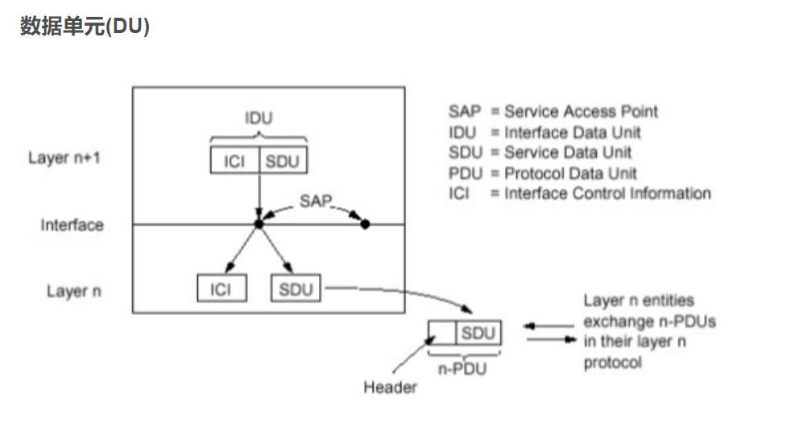

### Internet 协议栈

- 应用层:网络应用（实现网络应用）

  - 为人类用户或者其他应用进程提供网络应用服务
  - FTP,SMTP,HTTP,DNS
- 传输层:主机之间的数据传输（区分进程，把不可靠变为可靠）
  - 在网络层提供的端到端通信基础上，细分为进程到进程，将不可靠的通信变成可靠地通信
  - TCP , UDP
- 网络层:为数据报从源到目的选择路由（转发、路由）
  - 主机主机之间的通信，端到端通信，不可靠
  - IP,路由协议
- 链路层:相邻网络节点间的数据传输（相邻两点间，以帧位单位的传输）
  - 2个相邻2点的通信，点到点通信，可靠或不可靠
  - 点对对协议PPP,802.11(wifi),Ethernet
- 物理层:在线路上传送bit（相邻两点间电磁波的承载，以bit的传输）

ISO/OSI 参考模型（7层）
** 表示层: 允许应用解释传输的数据, e.g., 加密，压缩，机器相关的表示转换**
** 会话层: 数据交换的同步，检查点，恢复**
 互联网协议栈没有这两层! **（在Internet协议栈在应用层实现）**

### 各个层次的数据单元

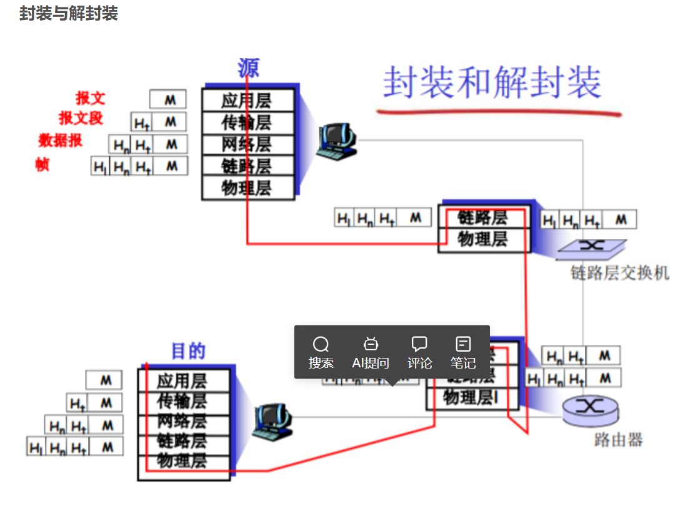

各层次的协议数据单元

应用层：报文(message)
传输层：报文段(segment)：TCP段，UDP数据报
网络层：分组packet（如果无连接方式：数据报 datagram）

- 数据包（Packet）：又称分组，是在分组交换网络中传输的格式化数据单元。一个数据包分成两个部分，它包括控制信息，也就是表头数据，和数据本身，也就是负载。它的起始和目的地是**网络层**。

- 数据报：TCP/IP协议定义了一个在因特网上传输的包，称为IP数据报，由首部和数据两部分组成。首部的前一部分是固定长度，共20字节，是所有IP数据报必须具有的。在首部的固定部分的后面是一些可选字段，其长度是可变的。首部中的源地址和目的地址都是IP协议地址。

  IP协议控制传输的协议单元称为IP数据报（IP Datagram，IP数据报、IP包或IP分组）。IP协议屏蔽了下层各种物理子网的差异，能够向上层提供统一格式的IP数据报。lP数据报采用数据报分组传输的方式，提供的服务是**无连接**方式。

数据链路层：帧(frame)
物理层：位(bit)

## 应用层

### socket

门户

**进程向套接字发送报文或从套接字接收报文**

**TCP socket:**

- TCP服务，两个进程之间的通信需要之前要建立连扫
  两个进程通信会持续一段时间，通信关系稳定
- 可以用一个整数表示两个应用实体之间的通信关系
  ，本地标示
- 穿过层间接口的信息量最小
- TCP socket: 源IP,源端口，目标IP，目标IP,目标

**TCP socket 是一个整数（类似文件描述符）代表一个四元组（我的IP和端口号 对方的IP和端口号）**
**便于管理 使得穿过层间的信息量最小**

**UDP socket：**

UDP服务，两个进程之间的通信需要之前无需建立连接
每个报文都是独立传输的
前后报文可能给不同的分布式进程
因此，只能用一个整数表示本应用实体的标示
因为这个报文可能传给另外一个分布式进程·1○穿过层间接口的信息大小最小
UDP socket:本IP,本端口
但是传输报文时:必须要提供对方IP，port
接收报文时:传输层需要上传对方的IP，port

**穿过层间接口的包括 ICI 和 SDU**

### http

无状态：服务器不维护关于客户的任何信息

http连接

- 非持久连接：最多只有一个对象在TCP上发送，下载多个对象需要多个TCP连接——1.0默认使用
  - 每个对象需要2个RTT
  - 操作系统必须为每个TCP连接分 配资源
  - 但浏览器通常打开并行TCP连接 ，以获取引用对象
- 持久HTTP 多个对象可以一个TCP连接上传输——1.1默认使用
  - 服务器在发送响应后，仍保持 TCP连接
  - 在相同客户端和服务器之间的后续请求和响应报文通过相同的连接进行传送
  - 客户端在遇到一个引用对象的时 候，就可以尽快发送该对象的请求
  - 不同方式
    - 非流水式：
      - 收到前一个响应后才能发送新的请求
      - 一个引用对象一个RTT
    - 流水式
      - HTTP1.1默认模式
      - 遇到一个对象立即产生一个请求
      - 所有应用对象可能只花费一个RTT

### 响应时间模型

RTT（round trip time）：一个小的分组从客 户端到服务器，在回到客户 端的时间（传输时间忽略）

响应时间： 

-  一个RTT用来发起TCP连接 
-  一个 RTT用来HTTP请求并 等待HTTP响应 
- 文件传输时间
- 总共：2个RTT + 一个对象的传输时间

### HTTP方法

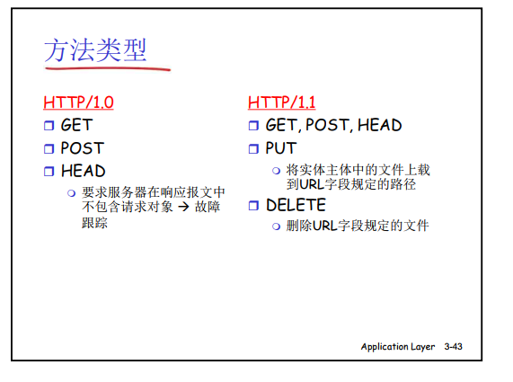

### Cookies

用户——服务器状态

大多数主要的门户网站使 用 cookies 4个组成部分：

1) 在HTTP响应报文中有 一个cookie的首部行
1) 在HTTP请求报文含有 一个cookie的首部行
1) 在用户端系统中保留有 一个cookie文件，由用户的浏览器管理
4) 在Web站点有一个后 端数据库
   

### FTP命令、响应

命令：

在**控制连接**上以ASCII文本方式传送

-  USER username
-  PASS password
-  LIST：请服务器返回远程主 机当前目录的文件列表
-  RETR filename：从远程主 机的当前目录检索文件 (gets)
-  STOR filename：向远程主 机的当前目录存放文件 (puts)

返回码样例：

-  状态码和状态信息 (同HTTP)
-  331 Username OK, password required
-  125 data connection already open; transfer starting 
- 425 Can’t open data connection 
-  452 Error writing file
  

#### FTP协议与HTTP协议的差别

**FTP协议是有状态的，FTP协议的控制命令和数据传输分别在两个TCP上进行**

### MIME

- MIME 是一种扩展标准，用来克服 SMTP 在内容传输上的限制。它在1980年代末期被开发出来，以支持通过电子邮件传输多种类型的数据。
- MIME 定义了一系列的头部（headers），这些头部被添加到邮件中，用来描述邮件体的内容类型（如文本、HTML、图像等）和编码方式。这允许电子邮件包含不同的字符集和多媒体文件。
- MIME 不仅支持多种内容类型的混合，还支持多部分类型的邮件，这意味着一个邮件可以有文本、图片和其他文件组成。

Base64 常用于在处理文本数据的场合，表示、传输、存储一些二进制数据，包括 MIME 的电子邮件及 XML 的一些复杂数据。**在 MIME 格式的电子邮件中，base64 可以用来将二进制的字节序列数据编码成 ASCII 字符序列构成的文本。**使用时，在传输编码方式中指定 base64。使用的字符包括大小写拉丁字母各 26 个、数字 10 个、加号 + 和斜杠 /，共 64 个字符，等号 = 用来作为后缀用途。

### IMAP与POP3

#### POP3 Post Office Protocol

- 先前的例子使用 “下载 并删除”模式。——服务器中不留
- 如果改变客户机，Bob不 能阅读邮件
-  “下载并保留”：不同 客户机上为报文的拷贝
-  POP3在会话中是**无状态**的

本地管理文件夹

#### IMAP Internet Mail Access Protocol

- IMAP服务器将每个报文 与一个文件夹联系起来
- 允许用户用目录来组织 报文
-  允许用户读取报文组件
-  IMAP在会话过程中保留 用户状态：
  - 目录名、报文ID与目录名 之间映射

远程管理文件夹  

### 覆盖网络

覆盖网络(overlay network)简单说来覆盖网络就是应用层网络，它是面向应用层的，不考虑或很少考虑网络层，物理层的问题。覆盖网络允许对没有IP地址标识的目的主机路由信息，例如：Freenet和DHT（分布式哈希表）可以路由信息到一个存储特定文件的结点，而这个结点的IP地址事先并不知道。

P2P就涉及到一个概念：**Overlay Network(覆盖网络)**。所谓覆盖网络是应用层网络，几乎不考虑网络层和物理层，它具体指的就是建立在另一个网络上的网络。例如P2P网络就是覆盖网络，因为它运行在互联网之前，但允许对未知IP主机的访问。通过DHT等算法，可以在事先不知道IP地址的情况下，访问到存储某个文件的结点。

### 视频编码

**空间编码**例子： 不是发送N个相同的颜色（全部是紫色）值，仅仅发送2各值：颜色（紫色）和重复的个数 (N)

**时间编码**例子： 不是发送第i+1帧的全部编码，而仅仅发送和帧i差别的地方

CBR: (constant bit rate): 以固定速率编码
VBR: (variable bit rate): 视频编码速率随时间的变化而变化
例子:

- MPEG 1 (CD-ROM) 1.5 Mbps
- MPEG2 (DVD) 3-6 Mbps
- MPEG4 (often used in Internet, < 1 Mbps)

### DASH Dynamic, Adaptive Streaming over HTTP

**服务器:**

- 将视频文件分割成多个块
- 每个块独立存储，编码于不同码率（8-10种）
- 告示文件（manifest file）: 提供不同块的URL

**客户端:**

- 先获取告示文件

- 周期性地测量服务器到客户端的带宽

- 查询告示文件,在一个时刻请求一个块，HTTP头部指定字节范围

  - 如果带宽足够，选择最大码率的视频块

  - 会话中的不同时刻，可以切换请求不同的编码块 (取决于当时的可用带宽)

**“智能”客户端: 客户端自适应决定**

- 什么时候去请求块 (不至于缓存挨饿，或者溢出)
- 请求什么编码速率的视频块 (当带宽够用时，请求高质量的视频块)
- 哪里去请求块 (可以向离自己近的服务器发送URL，或者向高可用带宽的服务器请求)

#### 实现——服务器如何通过网络向上百万用户同时流化视频内容 (上百万视频内容)?

- **一个大的超级数据中心**

​	超级服务器流化视频内容：瓶颈问题；二八定律——拷贝太多；单点故	障；不可扩展

- CDN Content distribution networks

### TCP UDP

TCP（Transmission Control Protocol）：中文名为传输控制协议，是一种面向连接的、可靠的、基于字节流的传输层通信协议。

**段**：这是TCP中的数据单元，包含了控制信息（如序列号、确认号等）和应用数据。段是TCP实现面向字节流的方式的技术实现细节，它允许TCP协议有效地进行数据排序、错误检查和流量控制等功能。

UDP（User Datagram Protocol）：中文名为用户数据报协议，是一种无连接、不可靠的、面向数据报的传输层通信协议。

## 传输层

### 校验和

### RTO

RTO（Retransmission Timeout）是TCP协议中用于超时重传的重要参数，表示在触发重传操作之前等待一个确认（ACK）的最长时间。这个时间间隔是动态计算的，目的是根据网络的当前条件（如延迟和拥塞）来优化TCP连接的性能和可靠性。

#### RTO的计算

RTO的计算基于两个主要的统计量：RTT（Round-Trip Time）和 RTT的变化量。RTT是指一个数据包从发送到收到确认的来回时间。由于网络延迟可能随时间和网络拥塞程度变化，因此RTO需要动态调整以适应这些变化。

- **基本RTT**：这是测量的每个数据包往返时间的平均值。
- **平滑的RTT（SRTT）**：是对RTT的加权平均值，通常使用指数加权移动平均（EWMA）算法来计算。新的SRTT由旧的SRTT和最近测量的RTT共同决定。
- **RTT变异性（RTTVAR）**：测量RTT的波动或不稳定性。这是通过计算RTT测量值与SRTT之间的偏差来实现的。

RTO通常按照以下公式计算：

\[ \text{RTO} = \text{SRTT} + 4 \times \text{RTTVAR} \]

这个公式的目的是确保在大多数网络条件下，RTO都足够长，可以避免由于RTT的临时波动导致不必要的重传，同时又足够短，以便在数据包确实丢失时及时重传。

#### RTO的重要性

- **避免早期重传**：如果RTO设置得太短，可能会导致在数据包还在途中时就进行不必要的重传，这会增加网络拥塞和不必要的带宽使用。
- **避免延迟重传**：如果RTO设置得太长，那么在数据包丢失的情况下，恢复传输的时间会增加，这会影响数据传输的整体速度和效率。

因此，准确计算RTO是优化TCP性能的关键，尤其是在高延迟或高变异性网络环境中。通过动态调整RTO，TCP能够更加智能地适应网络条件，提高数据传输的可靠性和效率。

### 数据信元、RM（资源管理信元首）

——拥塞控制

ATM——ABR

### TCP拥塞控制

#### 速率控制方法

### SYN

TCP（传输控制协议）通常使用三次握手（Three-Way Handshake）来建立一个连接，而不是两次握手。理解为什么TCP选择三次握手而非两次握手，以及“SYN”标志的含义，可以帮助我们更好地理解TCP的可靠性和效率。

### 两次握手的问题

假设TCP使用两次握手来建立连接，过程如下：
1. **第一次握手**：客户端发送一个带SYN标志的数据包到服务器以初始化一个连接。
2. **第二次握手**：服务器回复一个带SYN和ACK标志的数据包，以确认收到客户端的SYN包。

这种两次握手的机制存在以下问题：
- **不足以恢复旧的连接状态**：如果一个旧的连接请求（比如一个延迟的重复SYN包）误被网络延迟，而后到达服务器，两次握手将使服务器错误地认为这是一个有效的新连接请求，从而建立一个无客户端的连接。这种“孤儿连接”可能占用服务器资源，导致资源浪费。
- **缺乏确认机制**：客户端在发送SYN后没有接收到来自服务器的确认（ACK）信号，表示服务器已准备好接收数据。因此，客户端无法确定服务器是否真的准备好进行数据交换。

#### 三次握手的优势

TCP通过三次握手解决了两次握手的问题：
1. **客户端发送SYN**：客户端向服务器发送一个SYN包来请求建立连接。
2. **服务器发送SYN-ACK**：服务器确认收到客户端的SYN请求，并向客户端发送一个SYN-ACK包。
3. **客户端发送ACK**：客户端收到服务器的SYN-ACK后，再发送一个ACK包作为响应，完成握手过程。

这种方法确保了双方都确认连接已被对方正确建立和准备就绪，减少了由于错误响应或网络延迟造成的资源浪费和潜在连接错误。

#### SYN的含义

在TCP协议中，“SYN”是一个控制标志，代表“同步序列编号”（Synchronize Sequence Numbers）。它在TCP的头部标志位中设置，用来在建立连接时初始化序列号，并在连接的开始阶段同步。SYN标志的设置告诉接收方这是一个连接请求或连接接受的部分，通常在三次握手过程中的第一和第二次握手中使用。

#### 总结

因此，TCP使用三次握手而非两次握手，主要是为了增加网络通信的可靠性和稳定性，避免错误的连接建立。SYN标志则是这一过程中用来初始化和同步序列号，确保数据包的有序和可靠传输的关键部分。

### SS\CA

慢启动 拥塞避免阶段

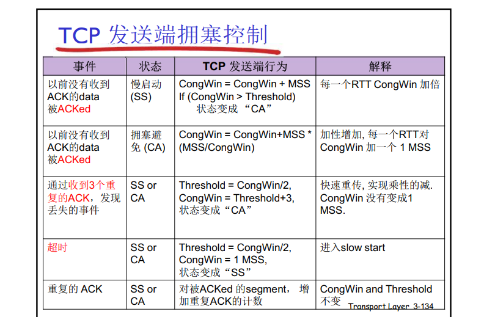

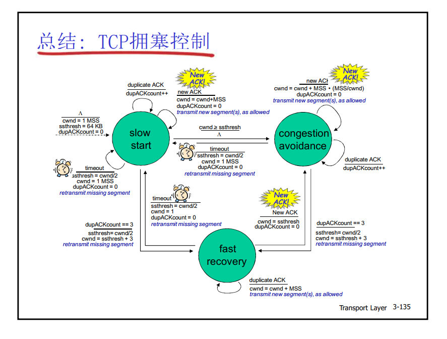

### TCP三次握手FSM

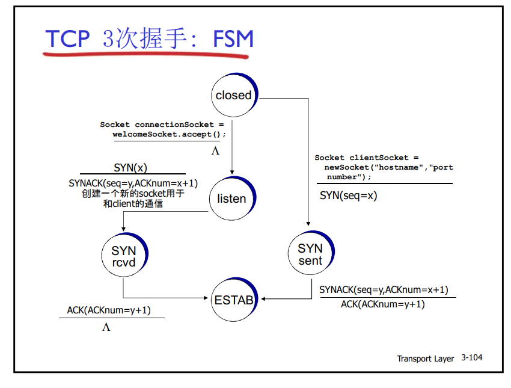

### SR Selective Repeat  

发送窗口《=发送缓冲区（绿色）

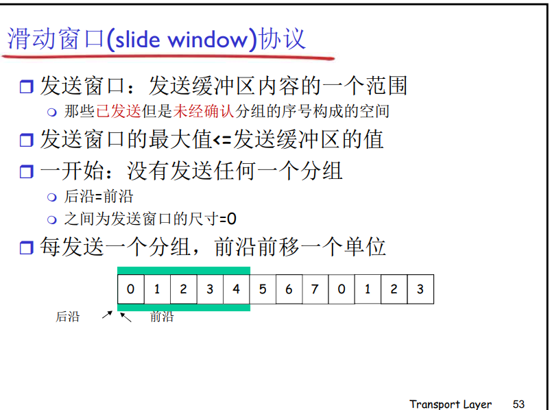

接收窗口等于接收缓冲区

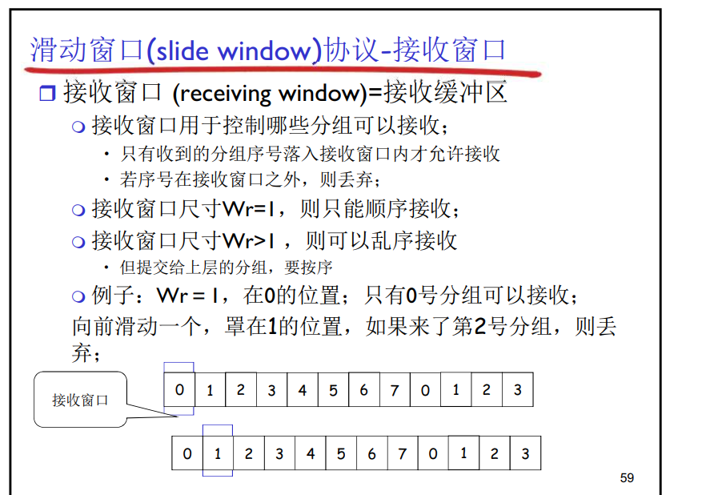

### 两个（拥塞、发送）窗口的实际应用

在任何给定的时间点，发送方的实际发送窗口大小是由`cwnd`和`rwnd`中较小的一个决定的。这意味着：

- 如果`rwnd`小于`cwnd`，那么发送窗口受到接收方缓冲区大小的限制。
- 如果`cwnd`小于`rwnd`，那么发送窗口受到网络拥塞控制的限制。

### TCP服务

累积确认（像GBN）

单个重传定时器（像GBN）

超时（只重发那个最早的未确认段：

SR）

## 链路层

### [ECC](https://www.cnblogs.com/Zeker62/p/15046165.html)

#### [CRC](https://www.cnblogs.com/Zeker62/p/15046165.html)

**循环冗余码（CRC，Cyclic Redundancy Code）校验（Check）**是目前在计算机网络通信及存储器中应用最广泛的一种校验编码方法。

它所约定的校验规则是：让校验码能为`某一约定代码`所`除尽`

- 如果除得尽，表明代码正确；
- 如果除不尽，`余数将指明出错位所在位置`。

步骤：

- **选一个 r+1 bit 的生成多项式G(x)，作为双方的除数。**
- 若原始数据为D，发送方用`M=2rD`作为被除数。
- 采用异或的方式用M除以G,得到一个`余数R`,即为CRC循环冗余检验码。
- 最终发送的数据为`M+R`。

具体例子如下：

> 例：原始数据D= 1010001101, G = x5+x4+x2+1，求发送方实际发送的数据。

**把x=2带入G，生成的数值的二进制就是除数。**
G生成的除数为：`110101`
[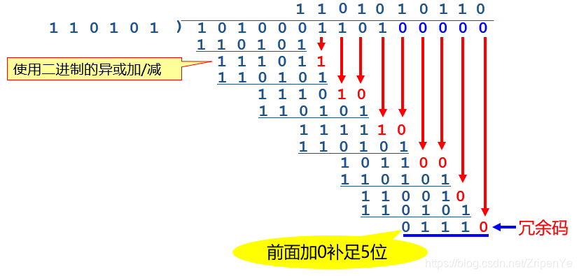](https://img-blog.csdnimg.cn/20210610122739288.png?x-oss-process=image/watermark,type_ZmFuZ3poZW5naGVpdGk,shadow_10,text_aHR0cHM6Ly9ibG9nLmNzZG4ubmV0L1pyaXBlblll,size_16,color_FFFFFF,t_70)
实际发送的数据： 1010001101**01110**

------

当发送方发送这个数据之后，接收方再去除以原来多项式生成的除数，如果余数为0，那么就认为数据没有错误。

**CRC的应用：**

- 广泛用于计算机网络数据链路层的帧的查错。
- 广泛用于测控和通信领域。

**CRC多项式的有关国际标准**

> CRC-12：G(x)=x12+x11+x3+x2+x+1
> CRC-16：G(x)=x16+x15+x2+1
> CRC-32（以太网）：G(x)=x32+x26+x23+x22+x16+x12+x11+x8+x7+x5+x4+x2+x+1

**CRC算法分析：**

- CRC的查错能力
  - 能检查出`全部单比特错`。
  - 能检查出`全部的奇数个比特错`。
  - 能检查出全部长度小于或等于r位的突发错。
- CRC的计算速度
  - 硬件电路`计算速度快`
- CRC的效率
  - CRC冗余码的长度与具体的生成多项式有关，相对查错能力而言，`效率很高`。

在CRC（Cyclic Redundancy Check）中，r+1 bit的生成多项式G(x)是指多项式的位数。这个位数是由多项式的最高次数决定的。例如，如果生成多项式是x^3 + x + 1，那么r就是3，因为这个多项式的最高次数是3。这意味着生成多项式在二进制表示中需要4个位，也就是r+1个位。

生成多项式的位数（r+1）决定了CRC校验码的位数。在CRC算法中，原始数据会被左移r位（在原始数据的右边添加r个零），然后用生成多项式去除，得到的余数就是CRC校验码，这个校验码的位数就是r位。

所以，r+1 bit的生成多项式和余数（即CRC校验码）的位数有直接关系。

#### [CheckSum](https://juejin.cn/post/7007352938171465764)

**Checksum计算过程：**
1、 先将需要计算checksum数据中的checksum设为0；

2、 计算checksum的数据按2byte划分开来，每2byte组成一个16bit的值，如果最后有单个byte的数据，补一个byte的0组成2byte；

3、 将所有的16bit值累加到一个32bit的值中；

4、 将32bit值的高16bit与低16bit相加到一个新的32bit值中，若新的32bit值大于0Xffff，再将新值的高16bit与低16bit相加；

5、 将上一步计算所得的16bit值按位取反，即得到checksum值，存入数据的checksum字段即可

### MAC

MAC（媒体访问控制）协议：分类

3大类:

信道划分

- 把信道划分成小片（时间、频率、编码）
- 分配片给每个节点专用

随机访问

- 信道不划分，允许冲突
- 冲突后恢复

依次轮流

- 节点依次轮流
- 但是有很多数据传输的节点可以获得较长的信道使用

#### 信道划分

CDMA (code division multiple access) :
• 所有站点在整个频段上同时进行传输,
采用编码原理加
以区分
•
完全无冲突
• 假定:信号同步很好,线性叠加

比方
• TDM:不同的人在不同的时刻讲话
• FDM:不同的组在不同的小房间里通信
• CDMA:不同的人使用不同的语言讲话

#### 随机访问

ALOHA协议是一种无线电通信协议，用于在共享通信媒介上进行数据传输。它是最早的以太网技术之一，由夏威夷大学在1970年代早期开发。

ALOHA的全称是"Additive Links On-line Hawaii Area"，意为"在线夏威夷区域附加链路"。

Carry Sense Multi

CSMA/C(ollision)A(voidance)  

IFS

- DIFS（Distributed Inter-Frame Space，分布式帧间隔）和SIFS（Short Inter-Frame Space，短帧间隔）都是无线网络中用于控制数据帧传输的时间间隔。

- SIFS是最短的时间间隔，用于优先级最高的数据帧传输，如ACK（确认帧）和CTS（Clear to Send，清除发送）帧。这是因为这些帧需要尽快被发送以减少网络的碰撞和延迟。

- DIFS则是一个较长的时间间隔，用于数据和管理帧的传输。在发送这些帧之前，设备需要等待DIFS时间长度，如果在这段时间内媒介是空闲的，设备就可以开始发送数据。如果在这段时间内检测到媒介是忙碌的，设备就需要等待一个随机的退避时间，然后再次尝试发送。

- 这两种时间间隔都是为了确保无线网络的公平性和高效性。

CA/CD

- CSMA/CA（Carrier Sense Multiple Access with Collision Avoidance，载波监听多路访问/碰撞避免）和CSMA/CD（Carrier Sense Multiple Access with Collision Detection，载波监听多路访问/碰撞检测）都是网络通信中的媒体访问控制协议。

- CSMA/CD是以太网（Ethernet）中使用的协议。在这种协议中，设备在发送数据之前会先检测通信媒介是否空闲。如果空闲，设备就开始发送数据。如果在发送数据的过程中发生了碰撞（即其他设备也在发送数据），设备就会停止发送，等待一个随机的时间间隔，然后再次尝试发送。

- CSMA/CA则是无线网络（如Wi-Fi）中使用的协议。由于无线设备无法在发送数据的同时检测到碰撞，所以CSMA/CA采用了一种预防碰撞的策略。在发送数据之前，设备会发送一个RTS（Request to Send，请求发送）帧，询问网络中的其他设备是否有数据要发送。如果没有，设备就开始发送数据。如果有，设备就会等待一个随机的时间间隔，然后再次尝试发送。

DOCSIS: data over cable service interface spec  

### MAC地址和MAC

MAC地址（Media Access Control address）是网络设备在数据链路层（如以太网、Wi-Fi等）的唯一标识。它是一个全球唯一的地址，由设备制造商在生产时分配，用于标识网络设备。

多路访问控制（Multiple Access Control，MAC）是一种网络协议，它定义了如何在共享的通信媒介（如以太网、Wi-Fi等）上进行数据传输。多路访问控制协议决定了哪个设备有权在何时使用通信媒介。

MAC地址和多路访问控制的关系在于，多路访问控制协议使用MAC地址来确定数据应该发送到哪个设备。当一个设备要发送数据时，它会在数据帧的头部添加接收设备的MAC地址。当数据帧到达接收设备时，接收设备会检查数据帧的头部，如果MAC地址与自己的MAC地址匹配，那么它就会接收这个数据帧；如果MAC地址不匹配，那么它就会忽略这个数据帧。

总的来说，MAC地址是网络设备的唯一标识，而多路访问控制是一种网络协议，它使用MAC地址来确定数据的发送和接收。

### ARP

ARP（Address Resolution Protocol，地址解析协议）是一种用于在网络上查找一个IP地址对应的MAC地址的协议。它是Internet协议套件中的一个关键组成部分，用于在物理网络（如以太网）上进行通信。

当一个设备需要向网络上的另一个设备发送数据时，它首先需要知道接收设备的MAC地址。如果发送设备只知道接收设备的IP地址，它就会使用ARP协议来查找接收设备的MAC地址。

ARP协议的工作过程如下：

1. 发送设备发送一个ARP请求包，这个包包含接收设备的IP地址，并广播到网络上。
2. 所有接收到ARP请求的设备都会检查ARP请求中的IP地址，如果IP地址与自己的IP地址匹配，那么设备就会发送一个ARP响应包，这个包包含设备的MAC地址。
3. 发送设备接收到ARP响应后，就可以从响应中获取接收设备的MAC地址，然后使用这个MAC地址来发送数据。

ARP协议是一种无状态协议，这意味着设备不会保存之前的ARP请求或响应的信息。因此，每次需要发送数据时，设备都可能需要发送一个新的ARP请求。为了提高效率，许多设备会在ARP缓存中保存最近使用的IP地址和MAC地址的映射，以减少ARP请求的数量。

### NIC

Network Interface Card网卡

### Hub：集线器  

网段(LAN segments)：可以允许一个站点发送的网络范围

**在一个碰撞域，同时只允许一个站点在发送**

如果有2个节点同时发送，则会碰撞

通常拥有相同的前缀，比IP子网更详细的前缀

**所有以hub连到一起的站点处在一个网段，处在一个碰撞域**

骨干hub将所有网段连到了一起

通过hub可扩展节点之间的最大距离

通过HUB,不能将10BaseT和100BaseT的网络连接到一起

### 交换机、路由器、集线器）——广播域、冲突

1. 集线器
   集线器是工作在物理层的设备，当他收到数据以后就把这个数据复制复制以后就把这个数据象所有的接口发送一次。所以集线器所有的接口是一个冲突域和广播域。
   1. 网段（network segment）**一般指一个计算机网络中使用同一物理层设备（传输介质，中继器，集线器等）能够直接通讯的那一部分**。
2. 交换机
   交换机就和集线器不一样了，交换机工作数据链路层的设备，他能够识别数据帧和MAC地址，他工作的方式就和集线器有很大的区别。交换机是依靠MAC地址表来转发数据。对于MAC地址表里没有的数据就广播。**所以我们说交换机的每个接口都是一个冲突域，交换机的所有的接口都属于一个广播域。**
3. 路由器
   路由器是工作在网络层的设备，路由器转发数据是依靠路由表来转发数据。对于广播流量路由器会处理但是不会转发数据。所以我们说路由器的**每个接口都属于同一个冲突域和广播域。**路由器可以用来隔离广播。
4. 设备总结
   集线器（HUB）所有端口都在同一个广播域、冲突域内，所以HUB不能分割冲突域和广播域。
   交换机（Switch）所有端口都在同一个广播域内，而每一个端口就是一个冲突域，所以交换机能分割冲突域，但分割不了广播域。虚拟局域网（Vlan）技术可以隔离广播域。
   路由器（Router）的每个端口属于不同的广播域、冲突域。

### 网段

在[以太网](https://zh.wikipedia.org/wiki/以太网)环境中，一个**网段**其实也就是一个**[冲突域](https://zh.wikipedia.org/w/index.php?title=冲突域&action=edit&redlink=1)**（碰撞域）。同一网段中的设备共享（包括通过[集线器](https://zh.wikipedia.org/wiki/集线器)等设备中转连接）同一物理[总线](https://zh.wikipedia.org/wiki/总线)，在这一总线上执行[CSMA/CD](https://zh.wikipedia.org/wiki/CSMA/CD)（载波监听多路访问/冲突检测）机制。不同网段间不共享同一[物理层](https://zh.wikipedia.org/wiki/物理层)，因此不会跨网段发生冲突（碰撞）。

现代[高速以太网](https://zh.wikipedia.org/w/index.php?title=高速以太网&action=edit&redlink=1)通常使用[交换机](https://zh.wikipedia.org/wiki/交换机)代替[集线器](https://zh.wikipedia.org/wiki/集线器)，[交换机](https://zh.wikipedia.org/wiki/交换机)是工作在[数据链路层](https://zh.wikipedia.org/wiki/数据链路层)的设备，由它转接的两组设备不在同一网段中。事实上，交换机为连在其上的每一个独立设备各自划分出一个独立的网段，每个网段只包含两个设备——交换机本身，和这个独立设备。这样，交换机就能隔离冲突，提高网络的利用率和总体性能。

### MPLS

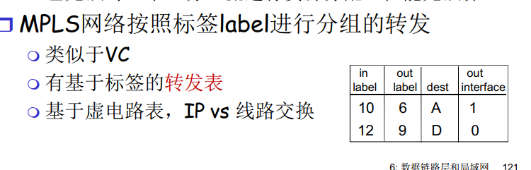

- MPLS：全称是 **Multi-Protocol Label Switching**，中文翻译为多协议标签交换。它是一种用于改善网络流量性能的数据传输方式。MPLS 可以创建出虚拟的链接，使得数据包能够按照预设的路径进行传输，从而提高了网络的性能和可靠性。  
- LER 是 Label Edge Router LER 是 Label Edge Router 的缩写，中文翻译为标签边缘路由器。在 MPLS（多协议标签交换）网络中，LER 是网络的入口和出口点。
- LER 的主要功能包括：

- 1. 对进入 MPLS 网络的数据包进行标签的添加（标签推送）。
  2. 对离开 MPLS 网络的数据包进行标签的移除（标签弹出）。

- 在 MPLS 网络中，数据包在进入网络时，LER 会根据一定的策略（如基于目标 IP 地址）为其分配一个标签，并将这个标签添加到数据包的头部。然后，数据包在网络中的转发就是基于这个标签进行的。当数据包到达目标 LER 时，LER 会移除数据包的标签，然后将数据包转发到目标网络。

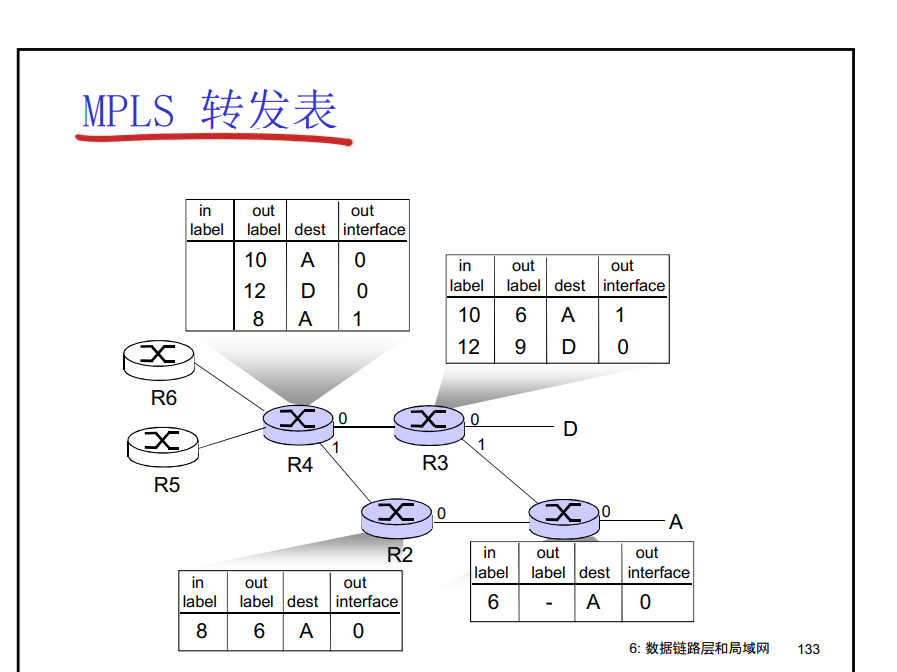

### 负载均衡器

负载均衡器的英文是 "Load Balancer"。

负载均衡器: **应用层路由**

接受外部的客户端请求

将请求导入到数据中心内部

返回结果给外部客户端 (对于客户端隐藏数据中心的内部结构)

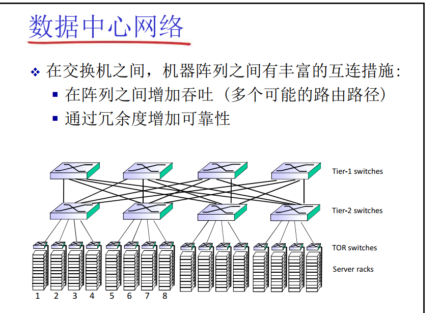

# 计算

CRC

效率CSMC

必考：

RDT

TCP拥塞控制
