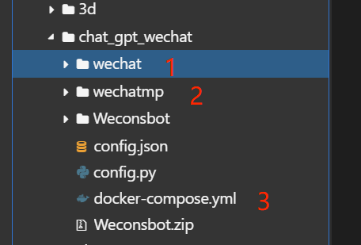
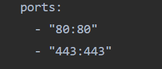
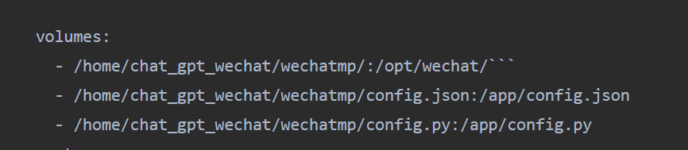

# 基本概念说明

## Docker

Docker 是一种可以让一个软件本身和需要的环境打包成一个小盒子的技术，这个小盒子就叫做image，然后image可以实例化成一个独立的可读写实例，即容器。容器的好处是，它可以在任何支持 Docker 的 Linux 机器上运行，而不用担心环境的差异和冲突。因为已经将应用需要的环境打包了进去，可以把应用和环境一起移动和部署，而不用每次换一个机器都重新安装和配置。

### image（镜像）

镜像可以看成是由多个镜像层叠加起来的一个文件系统（通过UnionFS与AUFS文件联合系统实现），镜像层也可以简单理解为一个基本的镜像，而每个镜像层之间通过指针的形式进行叠加，但是该系统是**只读**的。

### container（容器）

容器（container）的定义和镜像（image）几乎一模一样，也是一堆层的统一视角，唯一区别在于容器的最上面那一层是可读可写的。要点：容器 = 镜像 + **读写层**，并且容器的定义并没有提及是否要运行容器。


## Docker Compose

Docker Compose 是一种可以让用一个docker-compose文件来管理多个容器的工具，其只负责管理，不负责构建，并且该工具适合于开发环境快速部署，生产环境并不合适。

### compose网络环境

默认使用网桥模式，即一个compose文件的容器会自动构建一个新的局域网，通过网关和宿主机通信，这个局域网内的ip会动态分配，也可以自己指定静态ip。

如果想要在外网访问容器提供的服务，则需要配置端口映射，将容器的端口映射到宿主机上（这里就要避免端口的冲突）；

如果不需要从外部访问容器提供的服务，则不需要配置端口映射，因为每一个容器都是一台独立的Linux机器，有自己的ip，不存在端口冲突。

## 二者关系

镜像和装载操作系统iso镜像是一个概念，容器则可理解为镜像启动的操作系统。一个镜像可以启动任意多个容器，即可以装载多个操作系统。

### 挂载卷（volumes）

不指定挂载卷，一切数据保存在容器内部，一旦容器损坏、重置则数据会丢失；制定了挂载卷之后，指定容器的数据可以和宿主机同步。

宿主机和容器内的挂载卷位置的内容的覆盖关系，可以自己查阅。

# 配置文件

## config.json

### 个人聊天

```
{
  "channel_type": "wx",
  "model": "glm-4-plus",
  "zhipu_ai_api_key": "214b8d94b513fe14605fef84ec7fe97f.b3LZ7OvN26e2hTOz",
  "knowledge_base_id": "1790574294502342656",
  "open_ai_api_key": "YOUR API KEY",
  "claude_api_key": "YOUR API KEY",
  "text_to_image": "dall-e-2",
  "voice_to_text": "openai",
  "text_to_voice": "openai",
  "proxy": "",
  "hot_reload": false,
  "single_chat_prefix": [
    "@bot"
  ],
  "single_chat_reply_prefix": "@bot",
  "group_chat_prefix": [
    "@bot"
  ],
  "group_name_white_list": [
    "ChatGPT测试群",
    "ChatGPT测试群2"
  ],
  "image_create_prefix": [
    "画"
  ],
  "speech_recognition": true,
  "group_speech_recognition": false,
  "voice_reply_voice": false,
  "conversation_max_tokens": 10000,
  "expires_in_seconds": 7200,
  "character_desc": "你是基于大语言模型的AI智能助手，旨在回答并解决人们的任何问题，并且可以使用多种语言与人交流。",
  "temperature": 0.8,
  "subscribe_msg": "感谢您的关注！\n这里是AI智能助手，可以自由对话。\n支持语音对话。\n支持图片输入。\n支持图片输出，画字开头的消息将按要求创作图片。\n支持tool、角色扮演和文字冒险等丰富的插件。\n输入{trigger_prefix}#help 查看详细指令。",
  "use_linkai": false,
  "linkai_api_key": "",
  "linkai_app_code": ""
}

```

### 公众号

```
{
  "channel_type": "wechatmp",
  "model": "glm-4-plus",
  "wechatmp_token": "zyy",       
  "wechatmp_port": 80,            
  "wechatmp_app_id": "wx6cbcbbe8d7628ab1",     
  "wechatmp_app_secret": "ec56e033991bce8d25e65d1fd5bba6d7",  
  "wechatmp_aes_key": "",  
  "zhipu_ai_api_key": "214b8d94b513fe14605fef84ec7fe97f.b3LZ7OvN26e2hTOz",
  "knowledge_base_id": "1790574294502342656",
  "open_ai_api_key": "YOUR API KEY",
  "claude_api_key": "YOUR API KEY",
  "text_to_image": "dall-e-2",
  "voice_to_text": "openai",
  "text_to_voice": "openai",
  "proxy": "",
  "hot_reload": false,
  "single_chat_prefix": [
    "@bot"
  ],
  "single_chat_reply_prefix": "@bot",
  "group_chat_prefix": [
    "@bot"
  ],
  "group_name_white_list": [
    "ChatGPT测试群",
    "ChatGPT测试群2"
  ],
  "image_create_prefix": [
    "画"
  ],
  "speech_recognition": true,
  "group_speech_recognition": false,
  "voice_reply_voice": false,
  "conversation_max_tokens": 10000,
  "expires_in_seconds": 7200,
  "character_desc": "你是基于大语言模型的AI智能助手，旨在回答并解决人们的任何问题，并且可以使用多种语言与人交流。",
  "temperature": 0.8,
  "subscribe_msg": "感谢您的关注！\n这里是AI智能助手，可以自由对话。\n支持语音对话。\n支持图片输入。\n支持图片输出，画字开头的消息将按要求创作图片。\n支持tool、角色扮演和文字冒险等丰富的插件。\n输入{trigger_prefix}#help 查看详细指令。",
  "use_linkai": false,
  "linkai_api_key": "",
  "linkai_app_code": ""
}

```

## docker-compose.yml

这个只配置了config.json和config.py的映射，因为这两个文件和源代码不一致，以后修改该调整配置分别修改俩个目录下的config.json文件即可，配置了挂载卷，这里修改会同步到容器里，如果没生效就重启容器即可。

```
version: '2.0'
services:
  wechatmp:
    image: zhayujie/chatgpt-on-wechat
    container_name: wechatmp
    security_opt:
      - seccomp:unconfined
    environment:
      OPEN_AI_API_KEY: 'YOUR API KEY'

    volumes:
      - /home/chat_gpt_wechat/wechatmp/:/opt/wechat/```
      - /home/chat_gpt_wechat/wechatmp/config.json:/app/config.json
      - /home/chat_gpt_wechat/wechatmp/config.py:/app/config.py
    ports:
      - "80:80"
      - "443:443"

  chatgpt-on-wechat:
    image: zhayujie/chatgpt-on-wechat
    container_name: chatgpt-on-wechat
    security_opt:
      - seccomp:unconfined
    environment:
      OPEN_AI_API_KEY: 'YOUR API KEY'

    volumes:
      - /home/chat_gpt_wechat/wechat/:/opt/wechat/```
      - /home/chat_gpt_wechat/wechat/config.json:/app/config.json
      - /home/chat_gpt_wechat/wechat/config.py:/app/config.py
    ports:
      - "81:80"
      - "444:443"
```

## 目录结构

所有文件都在/home/chat_gpt_wechat目录下，目录结构如下

wechat和wechatmp分别对应个人聊天和微信公众号，只保留有数字的文件或者目录即可，其它都是多余的



# 基本命令\docker-compsoe.yml文件配置讲解

### 基本命令

默认在docker-compose.yml所在目录下运行

1. docker-compose up -d

   启动compose下的容器，并且不会占用控制台并显示日志信息

2. docker-compose down 

   停止并删除compose下的所有容器

### yml文件配置

#### ports

端口映射-将容器端口映射到宿主机上，因为此处使用网桥模式，无此项配置则无法从外部连接并访问（格式为 "宿主机端口：容器端口"）



微信公众号指定了宿主机80端口，就用80端口，个人聊天的没有此限制。

**可尝试**：使用域名和反向代理服务器，这个端口或许不一定就非得是80端口

#### volumes

挂载卷，将容器内部的目录挂载到宿主机上（格式  宿主机路径:容器内部路径）




