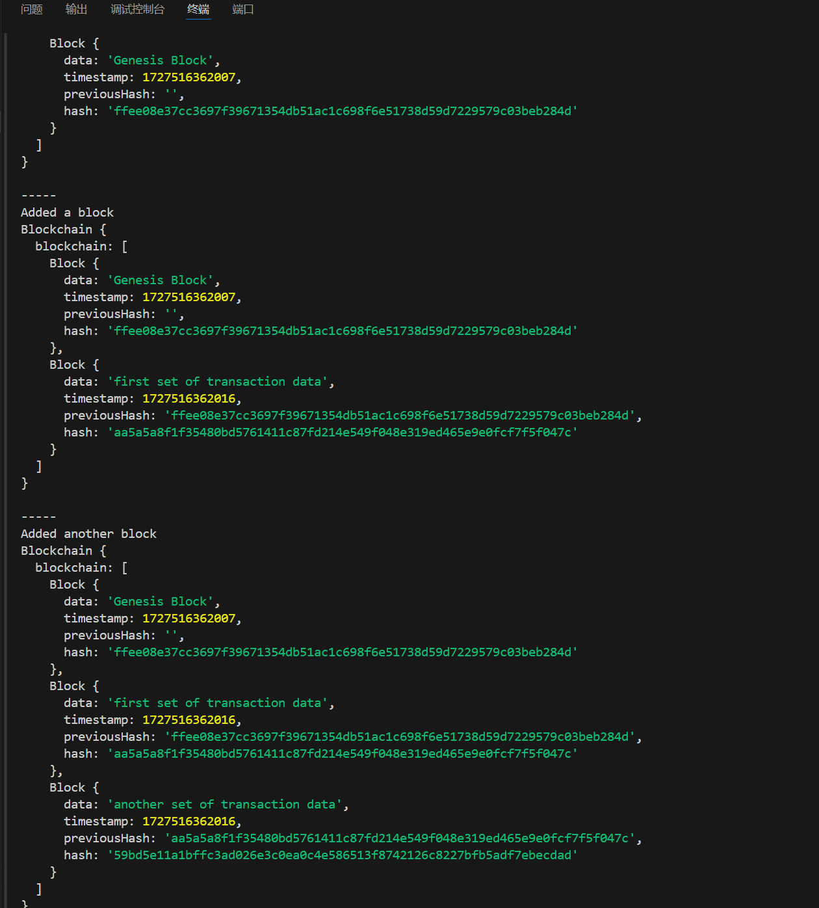
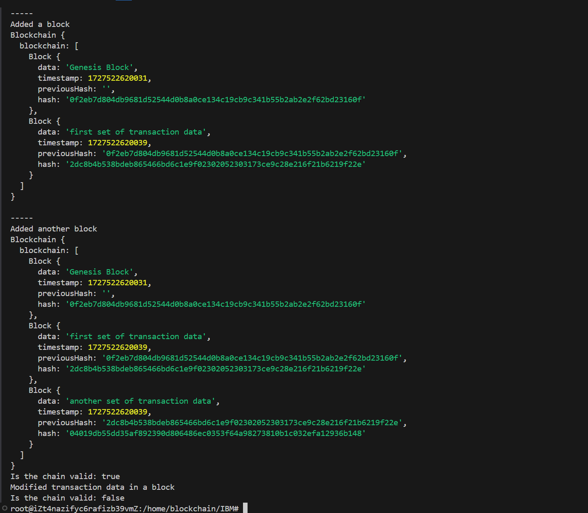

## 不到libprovider库文件


解决：
https://github.com/acmesh-official/acme.sh/issues/4048

```
sudo vim /etc/ssl/openssl.cnf
```


使用这个命令打开文件，找到那一行进行注释


## 编译错误

```
 BUILD FAILURE
[INFO] ------------------------------------------------------------------------
[INFO] Total time:  4.680 s
[INFO] Finished at: 2024-09-27T19:38:51+08:00
[INFO] ------------------------------------------------------------------------
[ERROR] Failed to execute goal org.apache.maven.plugins:maven-compiler-plugin:3.8.1:compile (default-compile) on project fisco-bcos-spring-boot-crud: Fatal error compiling: java.lang.NoSuchFieldError: Class com.sun.tools.javac.tree.JCTree$JCImport does not have member field 'com.sun.tools.javac.tree.JCTree qualid' -> [Help 1]
[ERROR] 
[ERROR] To see the full stack trace of the errors, re-run Maven with the -e switch.
[ERROR] Re-run Maven using the -X switch to enable full debug logging.
[ERROR] 
[ERROR] For more information about the errors and possible solutions, please read the following articles:
[ERROR] [Help 1] http://cwiki.apache.org/confluence/display/MAVEN/MojoExecutionException
```

```
java: java.lang.NoSuchFieldError: Class com.sun.tools.javac.tree.JCTree$JCImport does not have member field 'com.sun.tools.javac.tree.JCTree qualid'

```

在本项目中，各个目录的功能如下：

1. **根目录**：
   - 包含 `pom.xml` 文件，这是 Maven 项目的配置文件，定义了项目的依赖、插件和其他构建配置。

2. **src/main/java**：
   - 包含项目的主要 Java 源代码文件。

3. **src/main/resources**：
   - 包含项目的资源文件，如配置文件、静态资源等。

4. **src/test/java**：
   - 包含项目的测试代码。通常用于编写单元测试和集成测试。

5. **.mvn**：
   - 包含 Maven Wrapper 相关文件，使得项目可以在没有预先安装 Maven 的情况下构建。

6. **mvnw 和 mvnw.cmd**：
   - Maven Wrapper 脚本，用于在不同操作系统上运行 Maven。

### `com.fisco.cpp` 目录下的子目录

1. **com.fisco.cpp.client**：
   - 存放客户端相关的代码，负责与服务器或其他服务进行通信。例如，`CRUDClient` 和 `KVClient` 类。

2. **com.fisco.cpp.config**：
   - 存放配置文件和配置类。配置文件可以包括数据库配置、应用程序配置等。

3. **com.fisco.cpp.common**：
   - 存放通用的代码和类，这些代码和类可以在项目的多个部分中重复使用。例如，`CommonClient` 类。

4. **com.fisco.cpp.contract**：
   - 存放智能合约相关的代码和类。智能合约是区块链应用程序的核心部分，负责定义和执行区块链上的业务逻辑。

5. **com.fisco.cpp.service**：
   - 存放服务层的代码。服务层负责处理业务逻辑，调用数据访问层，并返回结果给控制层。

6. **com.fisco.cpp.controller**：
   - 存放控制层的代码。控制层负责处理 HTTP 请求，调用服务层，并返回响应给客户端。

7. **com.fisco.cpp.repository**：
   - 存放数据访问层的代码。数据访问层负责与数据库进行交互，执行 CRUD 操作。

8. **com.fisco.cpp.util**：
   - 存放工具类和辅助类。工具类提供通用的功能和方法，供其他类使用。


这些信息是关于区块链节点的生成和配置的日志。以下是简要概述：

1. 证书生成：成功生成了多个节点的证书，路径为`./nodes/127.0.0.1/sdk`和`./nodes/127.0.0.1/nodeX/conf`。
2. 管理员账户：管理员账户地址为`0xbf8899668348652a0f878d86ca593c347a35d5e1`。
3. 组ID：`group0`
4. 链ID：`chain0`
5. FISCO-BCOS路径：`bin/fisco-bcos`
6. 认证模式：`false`
7. 起始端口：`30300`和`20200`
8. 服务器IP：`127.0.0.1:4`
9. SM模式：`false`
10. 启用HSM：`false`
11. 节点配置文件：`127.0.0.1:30300,127.0.0.1:30301,127.0.0.1:30302,127.0.0.1:30303`
12. 输出目录：`./nodes`
13. 完成状态：所有文件已生成并保存在`./nodes`目录中。

## 实验一

```
root@iZt4nazifyc6rafizb39vmZ:/home/blockchain# cd fisco
root@iZt4nazifyc6rafizb39vmZ:/home/blockchain/fisco# curl -#LO https://github.com/FISCO-BCOS/FISCO-BCOS/releases/download/v3.11.0/build_chain.sh && chmod u+x build_chain.sh
##O=#    #                                                                                                                                                       #=#=- #     #                                                                                                                                                    ##########################                                                                                                                                    17.############################################################################################################################################################ 100.0%
root@iZt4nazifyc6rafizb39vmZ:/home/blockchain/fisco# ipconfig
Command 'ipconfig' not found, did you mean:
  command 'iwconfig' from deb wireless-tools (30~pre9-13.1ubuntu4)
  command 'ifconfig' from deb net-tools (2.10-0.1ubuntu3)
  command 'hipconfig' from deb hipcc (5.2.3-12)
  command 'iconfig' from deb ipmiutil (3.1.9-3)
Try: apt install <deb name>
root@iZt4nazifyc6rafizb39vmZ:/home/blockchain/fisco# ifconfig
eth0: flags=4163<UP,BROADCAST,RUNNING,MULTICAST>  mtu 8500
        inet 172.31.21.91  netmask 255.255.240.0  broadcast 172.31.31.255
        inet6 fe80::216:3eff:fe08:6aec  prefixlen 64  scopeid 0x20<link>
        ether 00:16:3e:08:6a:ec  txqueuelen 1000  (Ethernet)
        RX packets 1132212  bytes 1217964422 (1.2 GB)
        RX errors 0  dropped 0  overruns 0  frame 0
        TX packets 576707  bytes 410096618 (410.0 MB)
        TX errors 0  dropped 0 overruns 0  carrier 0  collisions 0

lo: flags=73<UP,LOOPBACK,RUNNING>  mtu 65536
        inet 127.0.0.1  netmask 255.0.0.0
        inet6 ::1  prefixlen 128  scopeid 0x10<host>
        loop  txqueuelen 1000  (Local Loopback)
        RX packets 9700694  bytes 6471532116 (6.4 GB)
        RX errors 0  dropped 0  overruns 0  frame 0
        TX packets 9700694  bytes 6471532116 (6.4 GB)
        TX errors 0  dropped 0 overruns 0  carrier 0  collisions 0

root@iZt4nazifyc6rafizb39vmZ:/home/blockchain/fisco# port
Command 'port' not found, but can be installed with:
snap install port
root@iZt4nazifyc6rafizb39vmZ:/home/blockchain/fisco# lsof -i :<port>
bash: syntax error near unexpected token `newline'
root@iZt4nazifyc6rafizb39vmZ:/home/blockchain/fisco# netstat -ano
Active Internet connections (servers and established)
Proto Recv-Q Send-Q Local Address           Foreign Address         State       Timer
tcp        0      0 0.0.0.0:4330            0.0.0.0:*               LISTEN      off (0.00/0/0)
tcp        0      0 0.0.0.0:33060           0.0.0.0:*               LISTEN      off (0.00/0/0)
tcp        0      0 0.0.0.0:30302           0.0.0.0:*               LISTEN      off (0.00/0/0)
tcp        0      0 0.0.0.0:30303           0.0.0.0:*               LISTEN      off (0.00/0/0)
tcp        0      0 0.0.0.0:30300           0.0.0.0:*               LISTEN      off (0.00/0/0)
tcp        0      0 0.0.0.0:30301           0.0.0.0:*               LISTEN      off (0.00/0/0)
tcp        0      0 0.0.0.0:6379            0.0.0.0:*               LISTEN      off (0.00/0/0)
tcp        0      0 127.0.0.54:53           0.0.0.0:*               LISTEN      off (0.00/0/0)
tcp        0      0 0.0.0.0:3306            0.0.0.0:*               LISTEN      off (0.00/0/0)
tcp        0      0 0.0.0.0:44322           0.0.0.0:*               LISTEN      off (0.00/0/0)
tcp        0      0 0.0.0.0:44323           0.0.0.0:*               LISTEN      off (0.00/0/0)
tcp        0      0 0.0.0.0:44321           0.0.0.0:*               LISTEN      off (0.00/0/0)
tcp        0      0 127.0.0.53:53           0.0.0.0:*               LISTEN      off (0.00/0/0)
tcp        0      0 0.0.0.0:20202           0.0.0.0:*               LISTEN      off (0.00/0/0)
tcp        0      0 0.0.0.0:20203           0.0.0.0:*               LISTEN      off (0.00/0/0)
tcp        0      0 0.0.0.0:20200           0.0.0.0:*               LISTEN      off (0.00/0/0)
tcp        0      0 0.0.0.0:20201           0.0.0.0:*               LISTEN      off (0.00/0/0)
tcp        0      0 127.0.0.1:60936         127.0.0.1:6379          TIME_WAIT   timewait (35.51/0/0)
tcp        0      0 127.0.0.1:36712         127.0.0.1:6379          TIME_WAIT   timewait (0.00/0/0)
tcp        0      0 127.0.0.1:47470         127.0.0.1:30301         ESTABLISHED off (0.00/0/0)
tcp        0      0 127.0.0.1:30301         127.0.0.1:47466         ESTABLISHED off (0.00/0/0)
tcp        0      0 127.0.0.1:37088         127.0.0.1:6379          TIME_WAIT   timewait (1.48/0/0)
tcp        0      0 127.0.0.1:36710         127.0.0.1:6379          TIME_WAIT   timewait (0.00/0/0)
tcp        0      0 127.0.0.1:48618         127.0.0.1:6379          TIME_WAIT   timewait (15.49/0/0)
tcp        0      0 127.0.0.1:47466         127.0.0.1:30301         ESTABLISHED off (0.00/0/0)
tcp        0      0 127.0.0.1:46178         127.0.0.1:6379          TIME_WAIT   timewait (41.52/0/0)
tcp        0      0 127.0.0.1:60950         127.0.0.1:6379          TIME_WAIT   timewait (39.52/0/0)
tcp        0      0 127.0.0.1:47446         127.0.0.1:30301         ESTABLISHED off (0.00/0/0)
tcp        0      0 127.0.0.1:54896         127.0.0.1:30303         ESTABLISHED off (0.00/0/0)
tcp        0      0 127.0.0.1:48628         127.0.0.1:6379          TIME_WAIT   timewait (17.50/0/0)
tcp        0      0 127.0.0.1:46194         127.0.0.1:6379          TIME_WAIT   timewait (45.52/0/0)
tcp        0      0 127.0.0.1:54686         127.0.0.1:6379          TIME_WAIT   timewait (23.50/0/0)
tcp        0      0 127.0.0.1:37112         127.0.0.1:6379          TIME_WAIT   timewait (5.48/0/0)
tcp        0      0 127.0.0.1:54894         127.0.0.1:30303         ESTABLISHED off (0.00/0/0)
tcp        0      0 127.0.0.1:30301         127.0.0.1:47446         ESTABLISHED off (0.00/0/0)
tcp        0      0 127.0.0.1:60914         127.0.0.1:6379          TIME_WAIT   timewait (31.51/0/0)
tcp        0      0 127.0.0.1:30303         127.0.0.1:54894         ESTABLISHED off (0.00/0/0)
tcp        0      0 127.0.0.1:54696         127.0.0.1:6379          TIME_WAIT   timewait (27.51/0/0)
tcp        0      0 127.0.0.1:46186         127.0.0.1:6379          TIME_WAIT   timewait (43.52/0/0)
tcp        0      0 127.0.0.1:54692         127.0.0.1:6379          TIME_WAIT   timewait (25.50/0/0)
tcp        0      0 127.0.0.1:30303         127.0.0.1:54896         ESTABLISHED off (0.00/0/0)
tcp        0      0 127.0.0.1:52814         127.0.0.1:6379          TIME_WAIT   timewait (53.53/0/0)
tcp        0      0 127.0.0.1:60946         127.0.0.1:6379          TIME_WAIT   timewait (37.52/0/0)
tcp        0      0 127.0.0.1:38994         127.0.0.1:5990          ESTABLISHED off (0.00/0/0)
tcp        0      0 127.0.0.1:48612         127.0.0.1:6379          TIME_WAIT   timewait (13.49/0/0)
tcp        0      0 127.0.0.1:48632         127.0.0.1:6379          TIME_WAIT   timewait (19.50/0/0)
tcp        0      0 127.0.0.1:46196         127.0.0.1:6379          TIME_WAIT   timewait (47.52/0/0)
tcp        0      0 127.0.0.1:60928         127.0.0.1:6379          TIME_WAIT   timewait (33.51/0/0)
tcp        0      0 127.0.0.1:37124         127.0.0.1:6379          TIME_WAIT   timewait (9.49/0/0)
tcp        0      0 127.0.0.1:30300         127.0.0.1:40544         ESTABLISHED off (0.00/0/0)
tcp        0      0 127.0.0.1:54702         127.0.0.1:6379          TIME_WAIT   timewait (29.51/0/0)
tcp        0      0 127.0.0.1:52832         127.0.0.1:6379          TIME_WAIT   timewait (57.53/0/0)
tcp        0      0 127.0.0.1:52808         127.0.0.1:6379          TIME_WAIT   timewait (51.53/0/0)
tcp        0      0 172.31.21.91:37334      100.103.15.60:80        ESTABLISHED off (0.00/0/0)
tcp        0      0 127.0.0.1:30301         127.0.0.1:47470         ESTABLISHED off (0.00/0/0)
tcp        0      0 127.0.0.1:37118         127.0.0.1:6379          TIME_WAIT   timewait (7.49/0/0)
tcp        0      0 127.0.0.1:37098         127.0.0.1:6379          TIME_WAIT   timewait (3.48/0/0)
tcp        0      0 172.31.21.91:44024      100.100.169.197:80      TIME_WAIT   timewait (7.00/0/0)
tcp        0      0 127.0.0.1:52828         127.0.0.1:6379          TIME_WAIT   timewait (55.53/0/0)
tcp        0      0 127.0.0.1:46202         127.0.0.1:6379          TIME_WAIT   timewait (49.53/0/0)
tcp        0      0 127.0.0.1:48604         127.0.0.1:6379          TIME_WAIT   timewait (11.49/0/0)
tcp        0      0 127.0.0.1:54672         127.0.0.1:6379          TIME_WAIT   timewait (21.50/0/0)
tcp        0      0 127.0.0.1:40544         127.0.0.1:30300         ESTABLISHED off (0.00/0/0)
tcp        0      0 127.0.0.1:52840         127.0.0.1:6379          TIME_WAIT   timewait (59.54/0/0)
tcp6       0      0 :::22                   :::*                    LISTEN      off (0.00/0/0)
tcp6       0      0 :::4330                 :::*                    LISTEN      off (0.00/0/0)
tcp6       0      0 127.0.0.1:51997         :::*                    LISTEN      off (0.00/0/0)
tcp6       0      0 127.0.0.1:36153         :::*                    LISTEN      off (0.00/0/0)
tcp6       0      0 :::44322                :::*                    LISTEN      off (0.00/0/0)
tcp6       0      0 :::44323                :::*                    LISTEN      off (0.00/0/0)
tcp6       0      0 :::44321                :::*                    LISTEN      off (0.00/0/0)
tcp6       0      0 ::1:6379                :::*                    LISTEN      off (0.00/0/0)
tcp6       0      0 127.0.0.1:62648         :::*                    LISTEN      off (0.00/0/0)
tcp6       0      0 127.0.0.1:63342         :::*                    LISTEN      off (0.00/0/0)
tcp6       0      0 127.0.0.1:5990          :::*                    LISTEN      off (0.00/0/0)
tcp6       0      0 172.31.21.91:22         221.4.34.18:33166       ESTABLISHED keepalive (158.83/0/0)
tcp6       0   1868 172.31.21.91:22         221.4.34.18:38946       ESTABLISHED on (0.10/0/0)
tcp6       0      0 127.0.0.1:36153         127.0.0.1:40952         ESTABLISHED keepalive (1133.91/0/0)
tcp6       0      0 127.0.0.1:40952         127.0.0.1:36153         ESTABLISHED keepalive (1133.91/0/0)
tcp6       0   1556 127.0.0.1:5990          127.0.0.1:38994         ESTABLISHED on (0.20/0/0)
udp        0      0 127.0.0.54:53           0.0.0.0:*                           off (0.00/0/0)
udp        0      0 127.0.0.53:53           0.0.0.0:*                           off (0.00/0/0)
udp        0      0 172.31.21.91:68         0.0.0.0:*                           off (0.00/0/0)
udp        0      0 127.0.0.1:323           0.0.0.0:*                           off (0.00/0/0)
udp6       0      0 ::1:323                 :::*                                off (0.00/0/0)
raw6       0      0 :::58                   :::*                    7           off (0.00/0/0)
Active UNIX domain sockets (servers and established)
Proto RefCnt Flags       Type       State         I-Node   Path
unix  2      [ ACC ]     STREAM     LISTENING     12274    /run/pcp/pmlogger.2241.socket
unix  2      [ ACC ]     STREAM     LISTENING     6705     /run/systemd/resolve/io.systemd.Resolve
unix  2      [ ACC ]     STREAM     LISTENING     13667    /var/run/mysqld/mysqlx.sock
unix  2      [ ACC ]     STREAM     LISTENING     6706     /run/systemd/resolve/io.systemd.Resolve.Monitor
unix  2      [ ]         DGRAM                    815295   /run/user/0/systemd/notify
unix  2      [ ACC ]     STREAM     LISTENING     815298   /run/user/0/systemd/private
unix  2      [ ACC ]     STREAM     LISTENING     13042    /var/run/mysqld/mysqld.sock
unix  2      [ ACC ]     STREAM     LISTENING     815306   /run/user/0/bus
unix  2      [ ACC ]     STREAM     LISTENING     815307   /run/user/0/gnupg/S.dirmngr
unix  2      [ ACC ]     STREAM     LISTENING     815309   /run/user/0/gnupg/S.gpg-agent.browser
unix  2      [ ACC ]     STREAM     LISTENING     815311   /run/user/0/gnupg/S.gpg-agent.extra
unix  2      [ ACC ]     STREAM     LISTENING     815313   /run/user/0/gnupg/S.gpg-agent
unix  2      [ ACC ]     STREAM     LISTENING     815315   /run/user/0/gnupg/S.keyboxd
unix  2      [ ACC ]     STREAM     LISTENING     815317   /run/user/0/pk-debconf-socket
unix  2      [ ACC ]     STREAM     LISTENING     815319   /run/user/0/snapd-session-agent.socket
unix  2      [ ACC ]     STREAM     LISTENING     816298   /run/user/0/gnupg/S.gpg-agent.ssh
unix  2      [ ACC ]     STREAM     LISTENING     12912    /tmp/aliyun_assist_service.sock
unix  3      [ ]         DGRAM      CONNECTED     7644     
unix  2      [ ACC ]     STREAM     LISTENING     3461134  /tmp/safbe197c7f-cf08-4660-b3db-3a4376971f4a
unix  2      [ ACC ]     STREAM     LISTENING     10252    /var/lib/pcp/pmcd/root.socket
unix  3      [ ]         STREAM     CONNECTED     8162     /run/dbus/system_bus_socket
unix  3      [ ]         STREAM     CONNECTED     6523     /run/systemd/journal/stdout
unix  2      [ ]         DGRAM      CONNECTED     7427     
unix  3      [ ]         STREAM     CONNECTED     9057     
unix  2      [ ]         DGRAM      CONNECTED     9041     
unix  3      [ ]         STREAM     CONNECTED     9842     /run/systemd/journal/stdout
unix  3      [ ]         STREAM     CONNECTED     9055     
unix  3      [ ]         STREAM     CONNECTED     7256     
unix  3      [ ]         STREAM     CONNECTED     8910     
unix  3      [ ]         STREAM     CONNECTED     9058     /var/lib/pcp/pmcd/root.socket
unix  2      [ ]         DGRAM      CONNECTED     605      
unix  3      [ ]         DGRAM      CONNECTED     7645     
unix  3      [ ]         SEQPACKET  CONNECTED     9028     
unix  2      [ ]         DGRAM                    8909     
unix  3      [ ]         STREAM     CONNECTED     9056     /var/lib/pcp/pmcd/root.socket
unix  3      [ ]         STREAM     CONNECTED     6997     
unix  2      [ ACC ]     STREAM     LISTENING     8737     /run/dbus/system_bus_socket
unix  2      [ ACC ]     STREAM     LISTENING     8740     /run/lxd-installer.socket
unix  3      [ ]         DGRAM      CONNECTED     7642     
unix  3      [ ]         STREAM     CONNECTED     9029     
unix  2      [ ACC ]     STREAM     LISTENING     8742     /run/snapd.socket
unix  2      [ ACC ]     STREAM     LISTENING     8744     /run/snapd-snap.socket
unix  2      [ ]         STREAM     CONNECTED     3456381  
unix  2      [ ACC ]     STREAM     LISTENING     8748     /run/uuidd/request
unix  3      [ ]         DGRAM      CONNECTED     7643     
unix  2      [ ]         STREAM     CONNECTED     4033694  
unix  3      [ ]         STREAM     CONNECTED     8911     /run/dbus/system_bus_socket
unix  3      [ ]         SEQPACKET  CONNECTED     9027     
unix  3      [ ]         STREAM     CONNECTED     10324    
unix  3      [ ]         STREAM     CONNECTED     4060     
unix  3      [ ]         STREAM     CONNECTED     13609    /usr/local/aegis/Aegis-<Guid(5A2C30A2-A87D-490A-9281-6765EDAD7CBA)>
unix  2      [ ]         DGRAM      CONNECTED     817081   
unix  2      [ ]         DGRAM      CONNECTED     11328    
unix  3      [ ]         STREAM     CONNECTED     10247    
unix  3      [ ]         STREAM     CONNECTED     9800     /run/systemd/journal/stdout
unix  3      [ ]         STREAM     CONNECTED     10032    /var/lib/pcp/pmcd/root.socket
unix  3      [ ]         STREAM     CONNECTED     10325    
unix  2      [ ]         DGRAM      CONNECTED     1226     
unix  3      [ ]         STREAM     CONNECTED     817083   
unix  3      [ ]         STREAM     CONNECTED     814490   /run/systemd/journal/stdout
unix  3      [ ]         STREAM     CONNECTED     10388    
unix  3      [ ]         STREAM     CONNECTED     13428    
unix  3      [ ]         STREAM     CONNECTED     11395    
unix  3      [ ]         STREAM     CONNECTED     9067     
unix  3      [ ]         STREAM     CONNECTED     9654     /run/systemd/journal/stdout
unix  2      [ ]         DGRAM      CONNECTED     3451794  
unix  3      [ ]         STREAM     CONNECTED     18029    /usr/local/aegis/Aegis-<Guid(5A2C30A2-A87D-490A-9281-6765EDAD7CBA)>
unix  3      [ ]         STREAM     CONNECTED     13455    
unix  3      [ ]         STREAM     CONNECTED     11323    
unix  3      [ ]         STREAM     CONNECTED     6996     
unix  3      [ ]         STREAM     CONNECTED     4095     /run/systemd/journal/stdout
unix  2      [ ACC ]     STREAM     LISTENING     3456383  /root/.cache/JetBrains/IntelliJIdea2024.2/.port
unix  3      [ ]         STREAM     CONNECTED     11138    
unix  3      [ ]         STREAM     CONNECTED     9194     /run/dbus/system_bus_socket
unix  3      [ ]         DGRAM      CONNECTED     1143     
unix  3      [ ]         STREAM     CONNECTED     817070   
unix  3      [ ]         STREAM     CONNECTED     813053   
unix  3      [ ]         STREAM     CONNECTED     817082   
unix  2      [ ]         DGRAM      CONNECTED     6995     
unix  3      [ ]         STREAM     CONNECTED     10100    
unix  3      [ ]         STREAM     CONNECTED     16330    
unix  3      [ ]         STREAM     CONNECTED     10323    
unix  3      [ ]         STREAM     CONNECTED     9841     /run/systemd/journal/stdout
unix  2      [ ]         DGRAM      CONNECTED     4066     
unix  3      [ ]         STREAM     CONNECTED     1332     
unix  3      [ ]         STREAM     CONNECTED     10056    /var/lib/pcp/pmcd/root.socket
unix  2      [ ]         DGRAM      CONNECTED     7076     
unix  3      [ ]         STREAM     CONNECTED     10101    /run/systemd/journal/stdout
unix  3      [ ]         STREAM     CONNECTED     12960    /run/systemd/journal/stdout
unix  3      [ ]         STREAM     CONNECTED     8916     /run/dbus/system_bus_socket
unix  3      [ ]         DGRAM      CONNECTED     1142     
unix  3      [ ]         STREAM     CONNECTED     6823     
unix  3      [ ]         STREAM     CONNECTED     10326    
unix  3      [ ]         STREAM     CONNECTED     10313    /run/dbus/system_bus_socket
unix  3      [ ]         STREAM     CONNECTED     818017   /run/systemd/journal/stdout
unix  3      [ ]         STREAM     CONNECTED     14771    
unix  3      [ ]         STREAM     CONNECTED     6153     /run/systemd/journal/stdout
unix  3      [ ]         STREAM     CONNECTED     16622    /run/systemd/journal/stdout
unix  3      [ ]         STREAM     CONNECTED     10055    
unix  3      [ ]         STREAM     CONNECTED     817086   /run/user/0/bus
unix  2      [ ]         DGRAM      CONNECTED     10385    
unix  3      [ ]         STREAM     CONNECTED     10312    
unix  3      [ ]         STREAM     CONNECTED     7028     /run/dbus/system_bus_socket
unix  3      [ ]         DGRAM      CONNECTED     4071     
unix  3      [ ]         STREAM     CONNECTED     13456    /run/pcp/pmcd.socket
unix  3      [ ]         STREAM     CONNECTED     10150    /run/systemd/journal/stdout
unix  3      [ ]         STREAM     CONNECTED     9961     /run/systemd/journal/stdout
unix  3      [ ]         STREAM     CONNECTED     7885     
unix  2      [ ]         DGRAM      CONNECTED     817161   
unix  3      [ ]         STREAM     CONNECTED     11096    
unix  3      [ ]         DGRAM      CONNECTED     4070     
unix  3      [ ]         STREAM     CONNECTED     13608    
unix  4      [ ]         DGRAM      CONNECTED     1141     /run/systemd/notify
unix  3      [ ]         STREAM     CONNECTED     12191    /run/pcp/pmcd.socket
unix  3      [ ]         STREAM     CONNECTED     7821     
unix  2      [ ACC ]     STREAM     LISTENING     1144     /run/systemd/private
unix  3      [ ]         STREAM     CONNECTED     13427    
unix  3      [ ]         STREAM     CONNECTED     11322    
unix  2      [ ACC ]     STREAM     LISTENING     1146     /run/systemd/userdb/io.systemd.DynamicUser
unix  3      [ ]         STREAM     CONNECTED     6999     /run/dbus/system_bus_socket
unix  2      [ ACC ]     STREAM     LISTENING     1147     /run/systemd/io.systemd.ManagedOOM
unix  3      [ ]         STREAM     CONNECTED     8690     
unix  2      [ ]         DGRAM      CONNECTED     9973     
unix  2      [ ACC ]     STREAM     LISTENING     550      /run/lvm/lvmpolld.socket
unix  3      [ ]         STREAM     CONNECTED     3454705  
unix  3      [ ]         STREAM     CONNECTED     7000     /run/dbus/system_bus_socket
unix  2      [ ]         DGRAM                    3925     /run/systemd/journal/syslog
unix  3      [ ]         STREAM     CONNECTED     11833    /run/dbus/system_bus_socket
unix  2      [ ACC ]     STREAM     LISTENING     9012     /run/pcp/pmcd.socket
unix  2      [ ]         DGRAM      CONNECTED     9683     
unix  2      [ ACC ]     STREAM     LISTENING     3927     /run/systemd/fsck.progress
unix  2      [ ]         STREAM     CONNECTED     2195954  
unix  2      [ ]         DGRAM                    9026     /run/chrony/chronyd.sock
unix  12     [ ]         DGRAM      CONNECTED     3929     /run/systemd/journal/dev-log
unix  3      [ ]         STREAM     CONNECTED     8888     
unix  8      [ ]         DGRAM      CONNECTED     553      /run/systemd/journal/socket
unix  3      [ ]         DGRAM      CONNECTED     815297   
unix  2      [ ACC ]     STREAM     LISTENING     555      /run/systemd/journal/stdout
unix  2      [ ACC ]     SEQPACKET  LISTENING     559      /run/udev/control
unix  2      [ ]         DGRAM      CONNECTED     12456    
unix  3      [ ]         STREAM     CONNECTED     9667     
unix  3      [ ]         STREAM     CONNECTED     12752    /run/pcp/pmcd.socket
unix  3      [ ]         STREAM     CONNECTED     9958     
unix  3      [ ]         DGRAM      CONNECTED     815296   
unix  2      [ ]         DGRAM      CONNECTED     2196360  
unix  3      [ ]         STREAM     CONNECTED     12695    
unix  3      [ ]         STREAM     CONNECTED     9924     /run/dbus/system_bus_socket
unix  3      [ ]         STREAM     CONNECTED     7745     
unix  2      [ ]         DGRAM      CONNECTED     815285   
unix  3      [ ]         STREAM     CONNECTED     7716     
unix  2      [ ACC ]     STREAM     LISTENING     1564     /run/systemd/io.systemd.sysext
unix  3      [ ]         STREAM     CONNECTED     12650    
unix  3      [ ]         STREAM     CONNECTED     8048     
unix  3      [ ]         STREAM     CONNECTED     6773     /run/systemd/journal/stdout
unix  2      [ ACC ]     STREAM     LISTENING     602      /run/systemd/journal/io.systemd.journal
unix  3      [ ]         STREAM     CONNECTED     12721    
unix  3      [ ]         STREAM     CONNECTED     817172   /run/dbus/system_bus_socket
unix  2      [ ]         STREAM     CONNECTED     3454335  
unix  3      [ ]         STREAM     CONNECTED     8049     /run/systemd/journal/stdout
unix  3      [ ]         STREAM     CONNECTED     13451    /run/systemd/journal/stdout
unix  3      [ ]         STREAM     CONNECTED     8127     
unix  3      [ ]         STREAM     CONNECTED     12696    /run/pcp/pmcd.socket
unix  3      [ ]         STREAM     CONNECTED     12751    
unix  2      [ ]         DGRAM      CONNECTED     8704     
unix  2      [ ACC ]     STREAM     LISTENING     10329    /usr/local/aegis/Aegis-<Guid(5A2C30A2-A87D-490A-9281-6765EDAD7CBA)>
unix  3      [ ]         STREAM     CONNECTED     9959     
unix  3      [ ]         STREAM     CONNECTED     9949     /run/systemd/journal/stdout
unix  3      [ ]         STREAM     CONNECTED     9923     
unix  3      [ ]         STREAM     CONNECTED     9682     /run/systemd/journal/stdout
unix  2      [ ACC ]     STREAM     LISTENING     10435    /run/pcp/pmproxy.socket
unix  3      [ ]         STREAM     CONNECTED     9668     /run/systemd/journal/stdout
unix  3      [ ]         STREAM     CONNECTED     3456417  /run/user/0/bus
unix  3      [ ]         STREAM     CONNECTED     6807     /run/systemd/journal/stdout
unix  3      [ ]         STREAM     CONNECTED     815299   @e35fbf93c924dec8/bus/systemd/bus-system
unix  2      [ ACC ]     STREAM     LISTENING     552      @/org/kernel/linux/storage/multipathd
unix  3      [ ]         STREAM     CONNECTED     7092     @f3968902b6723059/bus/systemd-logind/system
unix  3      [ ]         STREAM     CONNECTED     9629     @3403fff78cd68a22/bus/systemd-resolve/bus-api-resolve
unix  3      [ ]         STREAM     CONNECTED     7698     @e749ec30a2b3d3b9/bus/systemd-network/bus-api-network
unix  3      [ ]         STREAM     CONNECTED     7884     @ba184453ef342aa6/bus/systemd/bus-api-system
unix  2      [ ACC ]     STREAM     LISTENING     8739     @ISCSIADM_ABSTRACT_NAMESPACE
unix  3      [ ]         STREAM     CONNECTED     818029   @f0ed71417d102c9e/bus/systemd/bus-api-user
root@iZt4nazifyc6rafizb39vmZ:/home/blockchain/fisco# bash build_chain.sh -l 127.0.0.1:4 -p 30300,20200
[FATAL] ./nodes DIR already exist, please check!
root@iZt4nazifyc6rafizb39vmZ:/home/blockchain/fisco# rm -rf ./nodes
root@iZt4nazifyc6rafizb39vmZ:/home/blockchain/fisco# bash build_chain.sh -l 127.0.0.1:4 -p 30300,20200
[INFO] Downloading fisco-bcos binary from https://osp-1257653870.cos.ap-guangzhou.myqcloud.com/FISCO-BCOS/FISCO-BCOS/releases/v3.11.0/fisco-bcos-linux-x86_64.tar.gz ...
########################################################################################################################################################## 100.0%
[INFO] Generate ca cert successfully!
Processing IP 127.0.0.1 Total:4
[INFO] Generate ./nodes/127.0.0.1/sdk cert successful!
[INFO] Generate ./nodes/127.0.0.1/node0/conf cert successful!
[INFO] Generate ./nodes/127.0.0.1/node1/conf cert successful!
[INFO] Generate ./nodes/127.0.0.1/node2/conf cert successful!
[INFO] Generate ./nodes/127.0.0.1/node3/conf cert successful!
[INFO] Admin account: 0xbf8899668348652a0f878d86ca593c347a35d5e1
==============================================================
[INFO] GroupID              : group0
[INFO] ChainID              : chain0
[INFO] fisco-bcos path      : bin/fisco-bcos
[INFO] Auth mode            : false
[INFO] Start port           : 30300 20200
[INFO] Server IP            : 127.0.0.1:4
[INFO] SM model             : false
[INFO] enable HSM           : false
[INFO] nodes.json           : 127.0.0.1:30300,127.0.0.1:30301,127.0.0.1:30302,127.0.0.1:30303,
[INFO] Output dir           : ./nodes
[INFO] All completed. Files in ./nodes
root@iZt4nazifyc6rafizb39vmZ:/home/blockchain/fisco# bash nodes/127.0.0.1/start_all.sh
try to start node0
try to start node1
try to start node2
try to start node3
 node1 is running, pid is 29683.
 node3 is running, pid is 29694.
 node2 is running, pid is 29692.
 node0 is running, pid is 29690.
root@iZt4nazifyc6rafizb39vmZ:/home/blockchain/fisco# ps aux |grep -v grep |grep fisco-bcos
root       29683  1.8  0.6 921240 49644 ?        Sl   14:19  10:41 /home/blockchain/fisco/nodes/127.0.0.1/node1/../fisco-bcos -c config.ini -g config.genesis
root       29690  1.8  0.6 925332 49656 ?        Sl   14:19  10:22 /home/blockchain/fisco/nodes/127.0.0.1/node0/../fisco-bcos -c config.ini -g config.genesis
root       29692  1.8  0.5 903816 44300 ?        Sl   14:19  10:27 /home/blockchain/fisco/nodes/127.0.0.1/node2/../fisco-bcos -c config.ini -g config.genesis
root       29694  1.8  0.5 920208 43788 ?        Sl   14:19  10:31 /home/blockchain/fisco/nodes/127.0.0.1/node3/../fisco-bcos -c config.ini -g config.genesis
root@iZt4nazifyc6rafizb39vmZ:/home/blockchain/fisco# curl -LO https://github.com/FISCO-BCOS/console/releases/download/v3.7.0/download_console.sh && bash download_console.sh
  % Total    % Received % Xferd  Average Speed   Time    Time     Time  Current
                                 Dload  Upload   Total   Spent    Left  Speed
  0     0    0     0    0     0      0      0 --:--:-- --:--:-- --:--:--     0
100  5031  100  5031    0     0   3275      0  0:00:01  0:00:01 --:--:-- 23957
[INFO] Downloading console 3.7.0 from https://osp-1257653870.cos.ap-guangzhou.myqcloud.com/FISCO-BCOS/console/releases/v3.7.0/console.tar.gz
########################################################################################################################################################## 100.0%
[INFO] Download console successfully
[INFO] unzip console successfully
root@iZt4nazifyc6rafizb39vmZ:/home/blockchain/fisco# cp -r nodes/127.0.0.1/sdk/* console/conf
root@iZt4nazifyc6rafizb39vmZ:/home/blockchain/fisco# cd console &&bash start.sh
Failed to create BcosSDK failed! Please check the node status and the console configuration, error info: get Client failed, e: /usr/local/share/vcpkg/buildtrees/fisco-bcos-cpp-sdk/src/ca52207e71-760710030d.clean/bcos-boostssl/bcos-boostssl/websocket/WsService.cpp(255): Throw in function void bcos::boostssl::ws::WsService::syncConnectToEndpoints(bcos::boostssl::ws::EndPointsPtr)
Dynamic exception type: boost::wrapexcept<std::runtime_error>
std::exception::what: [ ssl handshake failed certificate verify failed (ssl routines, tls_process_server_certificate):/127.0.0.1:20200,  ssl handshake failed certificate verify failed (ssl routines, tls_process_server_certificate):/127.0.0.1:20201]

root@iZt4nazifyc6rafizb39vmZ:/home/blockchain/fisco/console# 


```

## js

```
New blockchain created
Blockchain {
  blockchain: [
    Block {
      data: 'Genesis Block',
      timestamp: 1727516362007,
      previousHash: '',
      hash: 'ffee08e37cc3697f39671354db51ac1c698f6e51738d59d7229579c03beb284d'
    }
  ]
}

-----
Added a block
Blockchain {
  blockchain: [
    Block {
      data: 'Genesis Block',
      timestamp: 1727516362007,
      previousHash: '',
      hash: 'ffee08e37cc3697f39671354db51ac1c698f6e51738d59d7229579c03beb284d'
    },
    Block {
      data: 'first set of transaction data',
      timestamp: 1727516362016,
      previousHash: 'ffee08e37cc3697f39671354db51ac1c698f6e51738d59d7229579c03beb284d',
      hash: 'aa5a5a8f1f35480bd5761411c87fd214e549f048e319ed465e9e0fcf7f5f047c'
    }
  ]
}

-----
Added another block
Blockchain {
  blockchain: [
    Block {
      data: 'Genesis Block',
      timestamp: 1727516362007,
      previousHash: '',
      hash: 'ffee08e37cc3697f39671354db51ac1c698f6e51738d59d7229579c03beb284d'
    },
    Block {
      data: 'first set of transaction data',
      timestamp: 1727516362016,
      previousHash: 'ffee08e37cc3697f39671354db51ac1c698f6e51738d59d7229579c03beb284d',
      hash: 'aa5a5a8f1f35480bd5761411c87fd214e549f048e319ed465e9e0fcf7f5f047c'
    },
    Block {
      data: 'another set of transaction data',
      timestamp: 1727516362016,
      previousHash: 'aa5a5a8f1f35480bd5761411c87fd214e549f048e319ed465e9e0fcf7f5f047c',
      hash: '59bd5e11a1bffc3ad026e3c0ea0c4e586513f8742126c8227bfb5adf7ebecdad'
    }
  ]
}
```




2

```
-----
New blockchain created
Blockchain {
  blockchain: [
    Block {
      data: 'Genesis Block',
      timestamp: 1727522620031,
      previousHash: '',
      hash: '0f2eb7d804db9681d52544d0b8a0ce134c19cb9c341b55b2ab2e2f62bd23160f'
    }
  ]
}

-----
Added a block
Blockchain {
  blockchain: [
    Block {
      data: 'Genesis Block',
      timestamp: 1727522620031,
      previousHash: '',
      hash: '0f2eb7d804db9681d52544d0b8a0ce134c19cb9c341b55b2ab2e2f62bd23160f'
    },
    Block {
      data: 'first set of transaction data',
      timestamp: 1727522620039,
      previousHash: '0f2eb7d804db9681d52544d0b8a0ce134c19cb9c341b55b2ab2e2f62bd23160f',
      hash: '2dc8b4b538bdeb865466bd6c1e9f02302052303173ce9c28e216f21b6219f22e'
    }
  ]
}

-----
Added another block
Blockchain {
  blockchain: [
    Block {
      data: 'Genesis Block',
      timestamp: 1727522620031,
      previousHash: '',
      hash: '0f2eb7d804db9681d52544d0b8a0ce134c19cb9c341b55b2ab2e2f62bd23160f'
    },
    Block {
      data: 'first set of transaction data',
      timestamp: 1727522620039,
      previousHash: '0f2eb7d804db9681d52544d0b8a0ce134c19cb9c341b55b2ab2e2f62bd23160f',
      hash: '2dc8b4b538bdeb865466bd6c1e9f02302052303173ce9c28e216f21b6219f22e'
    },
    Block {
      data: 'another set of transaction data',
      timestamp: 1727522620039,
      previousHash: '2dc8b4b538bdeb865466bd6c1e9f02302052303173ce9c28e216f21b6219f22e',
      hash: '04019db55dd35af892390d806486ec0353f64a98273810b1c032efa12936b148'
    }
  ]
}
Is the chain valid: true
Modified transaction data in a block
Is the chain valid: false
```


