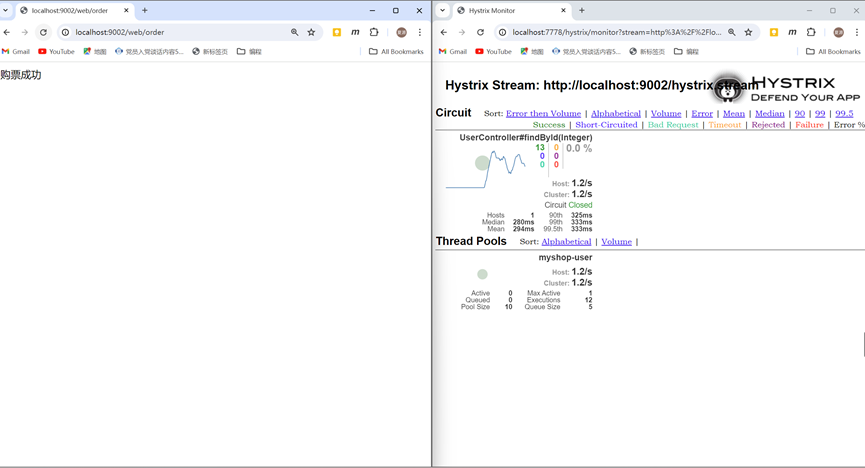

# LAB5

## 一 实验目的

通过在购票微服务中添加熔断器，当用户微服务出现故障时，可以自动调用的fallback方法执行，从而确保即使用户微服务出现问题，购票微服务也可以回滚而不至于奔溃，提高系统的健壮性和可用性。

本实验中使用两种不同的方法配置熔断器：分别是RestTemplate+ ribbon+Hystrix和OpenFeign+Hystrix。并且学习使用Hystrix Dashboard监控面板。

## 二 实验环境

操作系统:win11

IDE: IDEA 2024版

## 三 实验步骤

### 方案1：RestTemplate+ ribbon+Hystrix

#### 引入依赖并修改WebController，编写fallback回滚方法

#### 启动类添加@EnableHystrix注解，恢复实例化RestTemplate的方法

#### 测试

##### 开启用户微服务、购票微服务，浏览器请求order方法，记录eureka界面及请求返回界面

##### 关闭用户微服务（模拟用户微服务故障），记录eureka界面及请求返回界面，重启用户微服务后再次记录eureka界面及请求返回界面

### 方案2：OpenFeign+Hystrix

#### OpenFeign开启Hystix功能

#### 编写熔断器类UserControllerImpl（client包）

#### 添加usercontroller，webcontroller改为OpenFeign代码，映射并且实现回滚方法

#### 所有服务均可用时测试

左侧控制台输出用户信息，右侧浏览器输出成功信息

#### myshop user服务不可用时测试

左侧控制台显示熔断，但是依旧右侧浏览器打印出购票成功

## Hystrix Dashboard监控面板

### 搭建Hystrix Dashboard工程并进行配置

#### 子模块构建

#### yml文件配置

#### 启动类添加注解

### 启动Hystrix Dashboard监控面板微服务，并访问其用户界面

#### 启动各微服务，访问hystrix dashboard。浏览器多次请求order方法，记录监控界面

反复在浏览器中发起请求，结果如下

# LAB6

## 一 实验目的

1. 通过创建网关服务模块来实现路由转发，自定义过滤器。利用Zuul网关管理所有服务的入口，使得可以在网关层面上进行动态路由、过滤和安全控制。网关服务实现了请求的路由转发和自定义过滤器，这样可以在请求到达具体的服务之前进行必要的处理，从而增强服务的安全性和灵活性。
2. 学习Swagger的使用，构建api文档。

## 二 实验环境

操作系统:win11

IDE: IDEA 2024版

java:8

JDK: 1.8

## 三 实验步骤

### Zuul动态路由

####  构建子模块并且进行配置

子模块构建

yml文件配置

#### 启动各服务并测试网关路由转发是否成功

#### 通过网关请求服务localhost:8222/myshop-web/web/order

购票微服务被成功调用

### Zuul自定义过滤器的编写

#### myfilter 1、2过滤器类代码编写

#### 重启网关微服务，浏览器多次请求order方法

过滤器返回作用，二者依次执行，过滤器一优先被调用

执行顺序局部图

### 自定义权限控制过滤器

#### AuthFilter代码编写

#### 多次localhost:8222/myshop-web/web/order请求order方法

由于权限过滤器的作用，此时请求会被拒绝

#### 使用localhost:8222/myshop-web/web/order?token=user请求才会成功

### 自定义异常处理过滤器

#### MyErrorFilter和result代码编写

#### 测试

左侧没有token=user，请求失败，返回json信息，右侧请求成功。

json信息如下

### Swagger

#### 网关融合Swagger的DocumentationConfig类编写、注解等配置

#### 初次尝试访问主页localhost:8222/swagger-ui.html

由于两个微服务没有进行相关配置，无法获取相关api信息

#### 微服务(myshop-web及myshop-user)暴露API

##### myshop-web的配置

web微服务配置类编写

web微服务添加@Api注解和@ApiOperation注解

##### myshop-user

用户微服务SwaggerConfig配置类

指定用户微服务中API的内容

#### 购票微服务与用户微服务引导类开启swagger功能，添加注解

#### 重启各微服务，查看微服务的API，访问网页显示内容

web接口概览

user接口概览

web接口展开

user接口展开

#### 使用swagger测试服务

左侧显示购票成功，code为200，右侧控制台也打印出了购票人物信息

