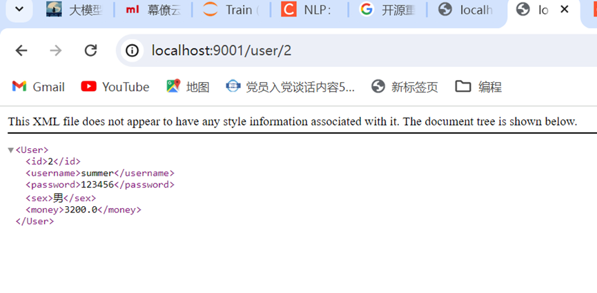
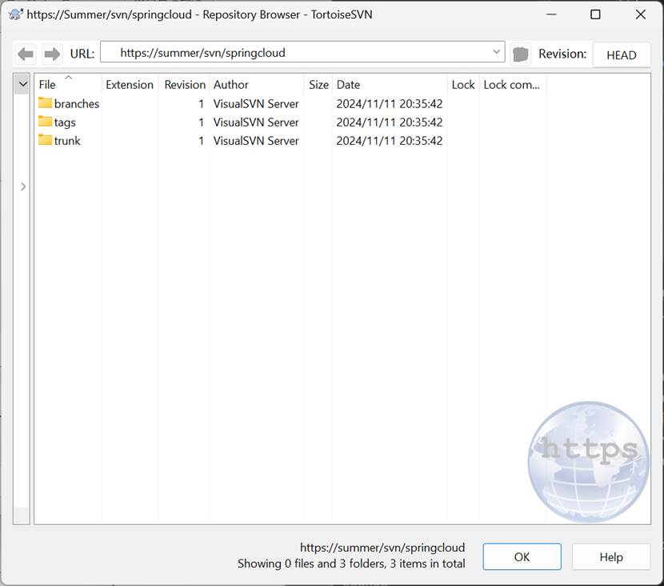
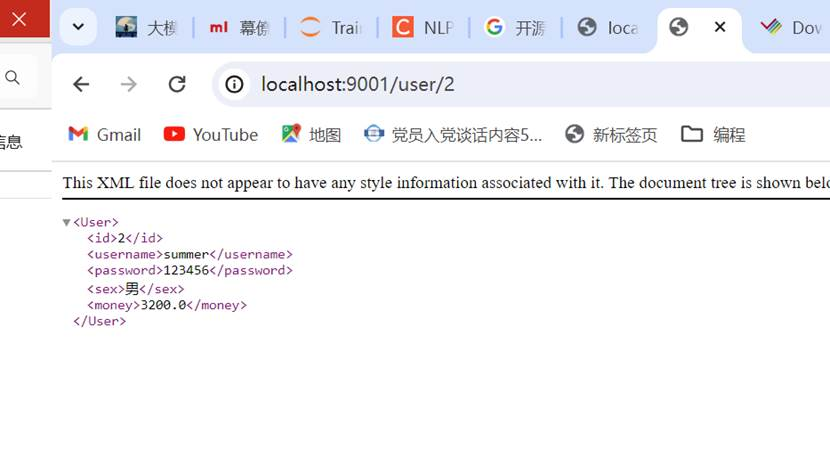

# LAB 7 Spring Cloud Config集中配置

## 一 实验目的

**理解和应用集中配置管理**：学习如何使用Spring Cloud Config进行微服务的集中配置管理。这包括如何从中心仓库（Git或SVN）管理不同环境下微服务的配置文件，使得配置文件更加集中，易于管理。

**实践不同的配置管理方式**：探索并实现两种配置存储方式（Git和SVN），了解各自的设置和操作流程，以及如何通过Spring Cloud Config服务器将配置信息提供给各个客户端微服务。

**集成Spring Cloud Bus实现配置的动态更新**：整合Spring Cloud Bus和RabbitMQ，使得配置更新可以实时传播到各个微服务，无需重启服务即可生效，增强了配置管理的灵活性和响应速度。

**提高系统的高可用性**：将配置中心注册到Eureka服务注册中心并运行多个实例，增强配置服务的可靠性。

## 二 实验环境

操作系统:win11

IDE: IDEA 2024版

## 三 实验步骤

### Spring Cloud Config-Git方式

#### 把微服务application.yml抽离到github中。创建一个仓库springcloud存放各微服务的配置文件，配置文件命名规则为：微服务名-环境名称，例如：user-dev.yml

 

#### 搭建Spring Cloud Config服务端

##### 编写config配置文件

##### 编写config项目的引导类，添加@EnableConfigServer ，开启配置中心服务端功能

##### 启动myshop-config，测试服务端是否能连上仓库，请求localhost:12000/user-dev.yml是否能查看到仓库存储的配置文件（需要截图测试结果）

#### 搭建Spring Cloud Config客户端（myshop-user, myshop-user均为客户端）

##### resources包中建bootstrap.yml引导配置文件

##### 启动微服务，观察是否连上config服务端

##### 测试。请求用户微服务，若能成功访问，则config配置成功。

### Spring Cloud Config-SVN方式

#### 创建SVN仓库，并将配置文件上传至SVN仓库

#### myshop-config导入SVN依赖并修改config服务端配置文件

#### 重启config，测试服务端是否能连上仓库

#### 修改微服务端bootstrap.yml，并重启微服务，验证服务能否从SVN获取配置文件，记录请求localhost:9001/user/2的返回结果

### Spring Cloud Bus消息总线

#### 新建一个端口为3307的同名数据库，但3307与3306两数据库表内容不同SVN仓库中修改用户微服务配置，将数据源改为3307的数据库，通过服务端查看该配置文件是否修改生效？

配置文件改变，但是不生效（即依旧是旧连接）

 

更新仓库的配置文件重启才会生效

 

#### docker中创建rabbitmq容器

##### 下载rabbitmq镜像，然后启动rabbitmq

##### 访问rabbitmq，用户名密码均为guest

我的登录

#### 配置Spring Cloud Bus客户端（用户微服务，购票微服务中配置）
 

##### Postman中触发地址更新后，无需重启微服务，请求localhost:9001/user/2，记录请求结果，观察修改的配置文件（切换到3307数据库）是否生效

 立即生效

##### 观察rabbitmq界面，是否生成配置传输的queues

### 高可用配置中心

#### myshop-config配置中心注册到Eureka

修改配置文件，开启多个配置中心实例

#### 修改Spring Cloud Config客户端引导配置文件bootstrap.yml

myshop-config注册到Eureka之后，客户端需通过服务名访问配置中心，且bootstrap.yml中需要包含eureka的配置

#### 启动微服务，记录启动信息中连接的是哪一个config（截图）

#### 测试用户微服务可用性。停止一个config，观察微服务是否仍可用？

如server控制台所示，12000端口config已经取消挂载

但依然可以访问调用服务，config自动替换为另一个实例提供服务

# LAB 8 Spring Cloud分布式链路跟踪

## 一 实验目的

**增强对微服务架构的监控和故障诊断能力**：通过整合Spring Cloud Sleuth和Zipkin，提供分布式链路跟踪功能，理解和监控微服务之间的调用关系和性能问题。

**实践日志增强技术**：在微服务中加入日志跟踪代码，观察请求经过的微服务路径，并通过控制台输出了解服务间的调用详情。

**使用Zipkin进行深入的服务追踪分析**：通过设置和使用Zipkin服务器，观察服务请求的详细信息，如调用时间和服务依赖关系。

**了解和应用链路追踪数据**：通过分析Zipkin收集的数据，学习如何利用这些数据优化微服务性能和解决实际问题。

## 二 实验环境

操作系统:win11

IDE: IDEA 2024版

Ubuntu：24.0

## 三 实验步骤

### 微服务方法增加日志功能

##### 购票微服务方法增加日志功能

##### 用户微服务方法增加日志跟踪代码

##### 通过网关请求购票微服务，记录购票微服务及用户微服务IDEA控制台信息

1. 开启网关服务

2. 发送请求

3. 控制台输出

### 整合Spring Cloud Sleuth

#### 导入依赖（gateway，用户微服务和购票微服务，所有请求调用的微服务均需导入依赖）

 

#### 通过网关访问购票微服务，观察IDEA控制台中日志信息与第一步的3中日志信息有什么区别？

info信息增多,内容意义如下：

1. application name — 应用的名称， 也就是application.yml中的spring.application.name参数配置的属性。
2. traceId — 为一个请求分配的ID号， 用来标识一条请求链路。
3. spanId — 表示一个基本的工作单元， 一个请求可以包含多个步骤， 每个步骤都拥有自己的spanId。 一个请求包含一个TraceId， 多个SpanId
4. export — 布尔类型。 表示是否要将该信息输出到类似Zipkin这样的聚合器进行收集和展示。
5. TraceId在两条日志中是相同的， 即使消息来源于两个不同的类。 这就可以在不同的日志通过寻找traceid来识别一个请求。

### Spring Cloud Sleuth + Zipkin

#### Zipkin服务端配置

##### 新建名为zipkin-server的Zipkin微服务，导入相关依赖,并配置yml文件

##### 编写启动类

##### 启动zipkin服务，登录zipkin服务端界面localhost:9041/zipkin/

#### 注册Zipkin服务

##### 网关，购票微服务及用户微服务导入依赖

##### 添加application.yml配置

##### 测试。重启网关，购票微服务及用户微服务。 浏览器中通过网关去访问购票微服务，刷新zipkin界面，观察并记录zipkin界面中监控到的日志信息以及服务依赖分析。

网关调用web服务，web购票服务调用user服务，user服务返回数据到web服务

