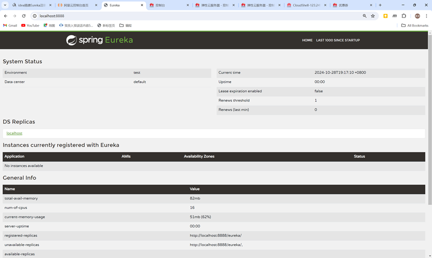
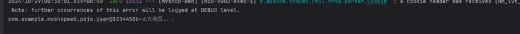
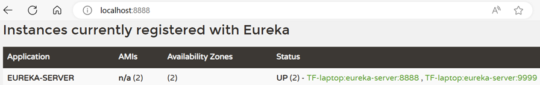
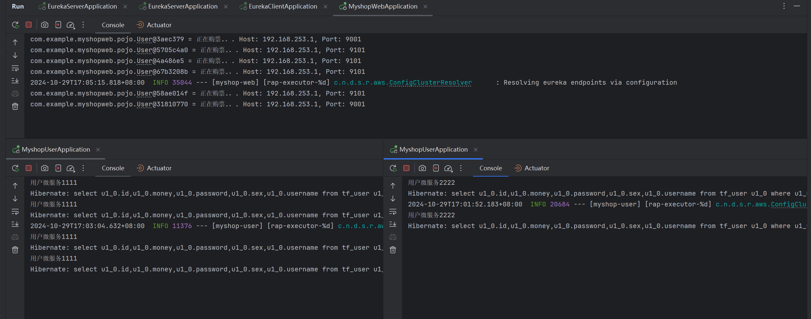
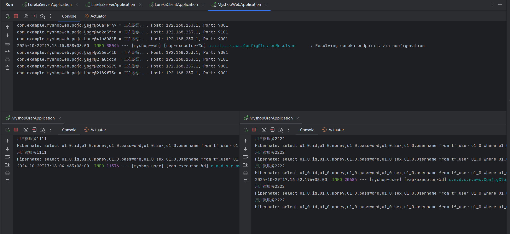

# LAB3

## 实验目的

掌握如何使用Eureka Server作为服务注册中心，使得服务实例能够注册和发现。构建Eureka Server和Client，实现服务注册与自动发现，并搭建高可用的Eureka Server集群。

## 实验环境

1. 操作系统windows11
2. ide：IDEA 2024 Ultimate

## 实验步骤

### 搭建Eureka Server

#### 创建项目以及各个子模块：

#### 配置server启动类：

#### 启动Eureka，访问Eureka（浏览器输入locallhost:8888)，检查Eureka是否启动成功

### 搭建Eureka Client

此处同时集成实验12的两个微服务一同启用、注册

#### 配置完毕后，重启微服务，观察记录Eureka界面内容

### 使用Eureka实现服务调用

#### 修改order（）方法：注入自动发现客户端对象discoveryClient

#### 重启购票微服务，浏览器上请求调用order方法（localhost:9002/web/order)

浏览器：

postman：

idea控制台：

### 搭建高可用的Eureka Server

#### 同名服务server互相调用

idea控制台：

浏览器查看：

# LAB4

## 实验目的

学习和实现Spring Cloud服务调用和负载均衡：通过使用RestTemplate结合Ribbon以及OpenFeign实现服务调用；探究Ribbon的不同负载均衡策略，如轮询和随机算法；通过实践理解服务间的通信机制和负载均衡的效果。

## 实验环境

1. 操作系统windows11
2. IDE：IDEA 2024 Ultimate

## 实验步骤

### 实现RestTemplate（服务调用）+Ribbon（负载均衡）

#### 修改购票微服务Webcontroller类代码

#### 启动两个端口分别为9001和9101的myshop-user用户微服务

网页截图：

#### 重启购票微服务，并多次请求该服务order（）方法

采取轮询算法，请求依次分配（左右各五次请求）

#### 修改Ribbon负载均衡算法为随机算法

修改代码截图：

随机请求结果截图IDE（6次请求，4次于9101端口，2次9001端口服务）：

#### 简化购票微服务

代码修改：

服务调用结果（之前的随机配置并没有删除，则依旧随机调用，1111出现2次，2222出现5次）：

### OpenFeign（服务调用）+ 内置Ribbon（负载均衡）

代码修改、配置如下：

