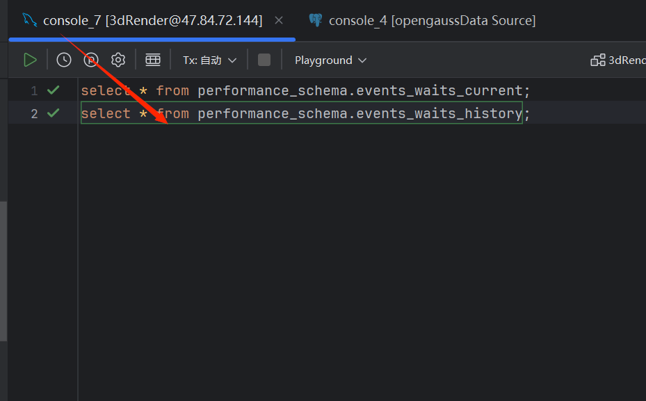
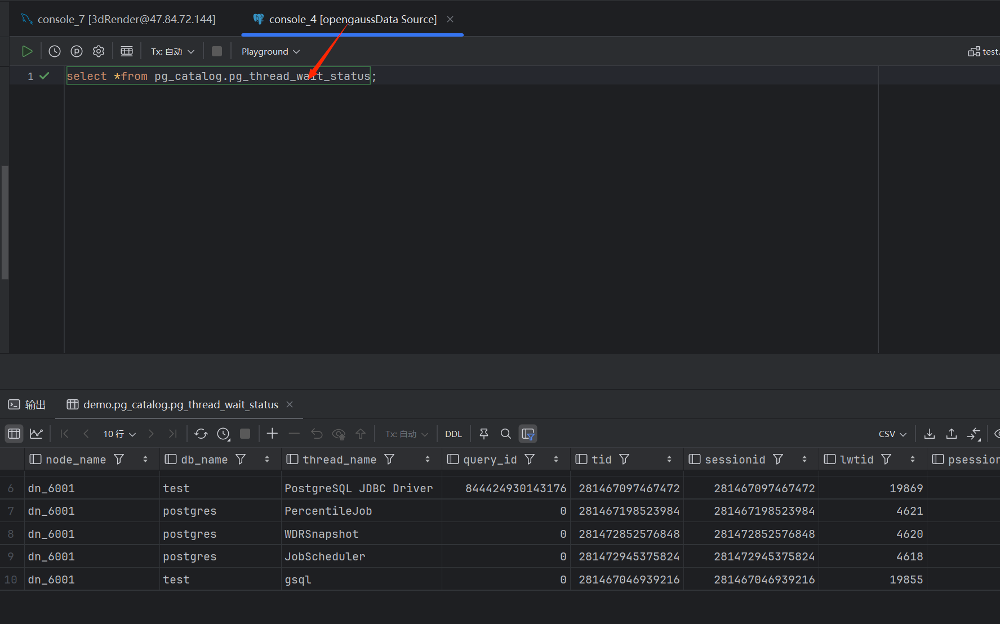
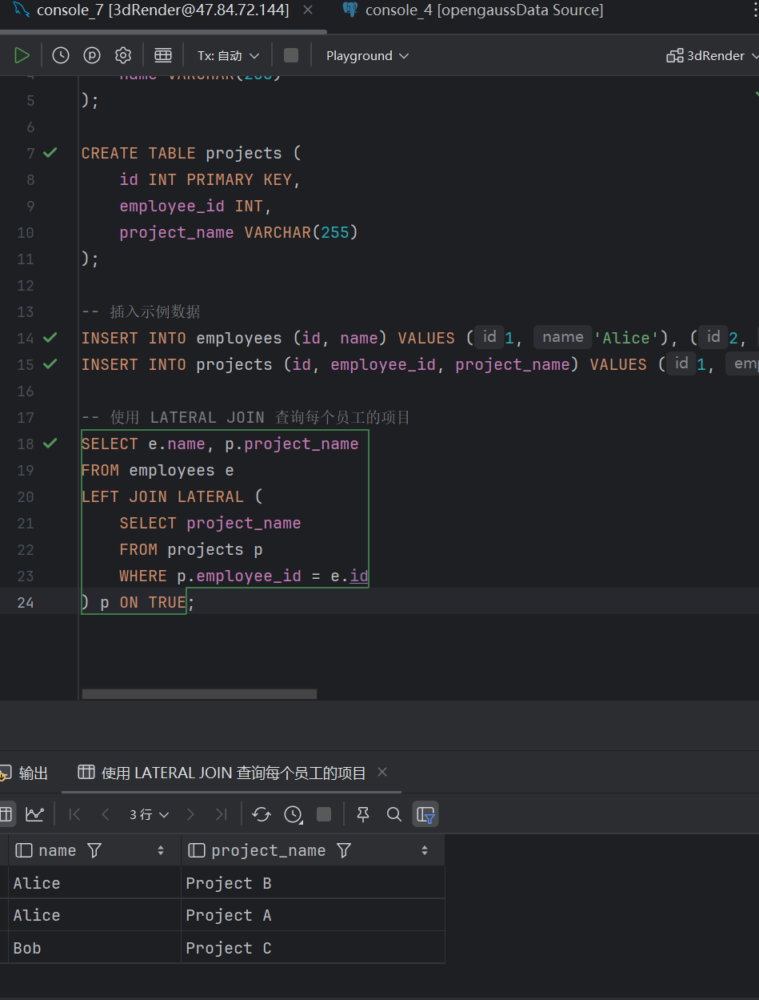
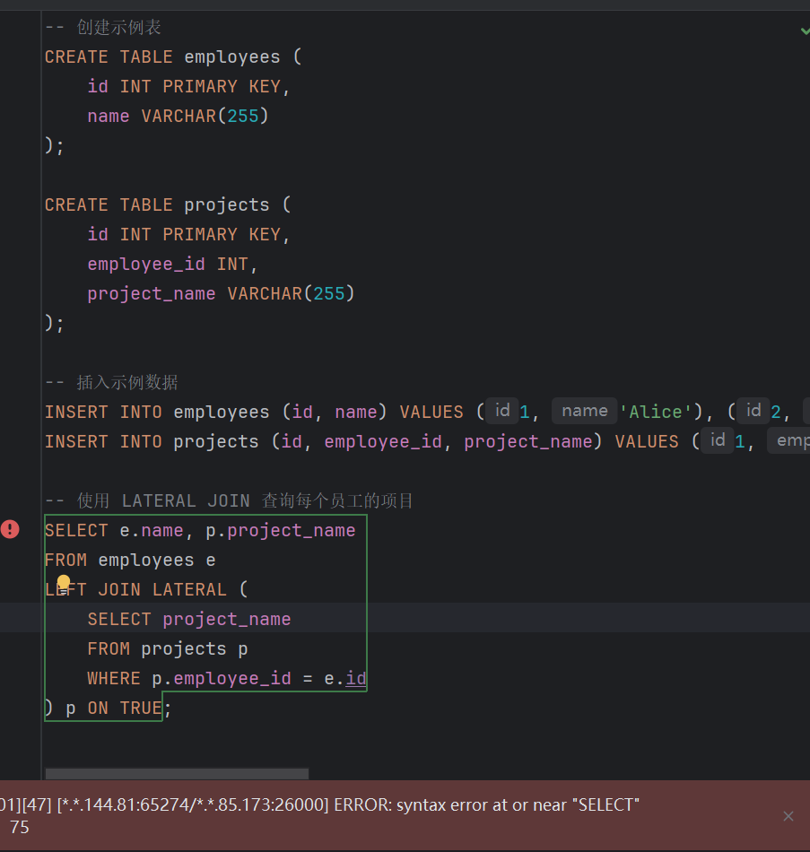
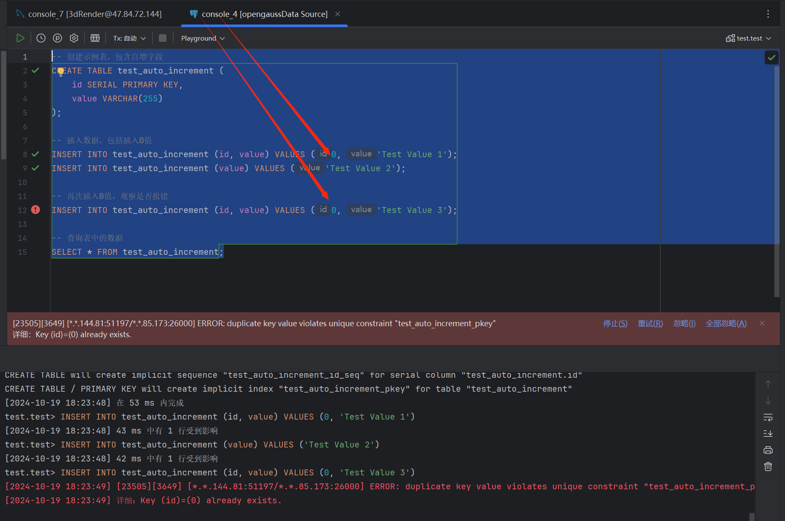
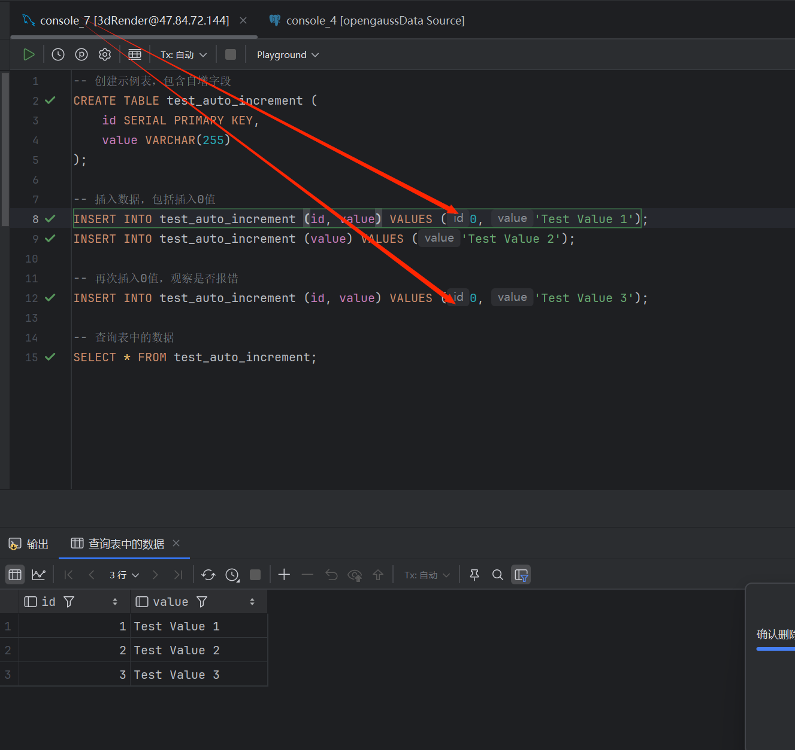

## 查询等待事件状态

1. 我发现mysql具备显示当前等待事件、历史等待事件的功能

   

2. 但是opengauss似乎只可以查看当前实例中工作线程的阻塞等待状态，对等待事件的信息记录不够完善。

   

## PostgreSQL、MySql都支持横向子查询（LATERAL subquery），但是基于PostgreSQL上的开发opengauss不支持

MYSQL示例如下：

opengauss调用LATERAL subquery报错

## opengauss指定插入重复自增键值0会报错,但是mysql会认为是默认值从而实现自动递增

opengauss：（键值重复从而报错）

mysql如下：（自动递增，不会报错）

