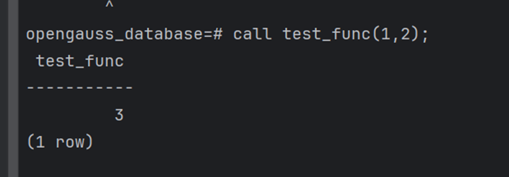

参考openGauss官网中“快速入门”、安装指南以及参考文档《2024实验三：数据库SQL对象迁移》、《openGauss官方文档——数据迁移指南部分》。

 

*注意：由于实验可以使用JDBC**或者ODBC**来进行，因此选择自己实验进行的部分来进行填写。*

## 对象创建、视图迁移

使用JDBC或者ODBC从源数据库A迁移视图到 openGauss 中（源数据库A和openGauss相应的创建对象的SQL语法不存在差异）将实验过程及相关截图记录下来。

Root 密码也是root

docker run --name opengauss --privileged=true -d -e GS_USER=sxy -e GS_PASSWORD=Helloworld@123 enmotech/opengauss:latest

### mysql创建相关对象

#### 查看用户信息

#### 创建视图：

#### 创建过程：

#### 创建函数：

#### 创建触发器：

### opengauss创建相关基础表

#### 连接并且查看用户

#### 创建三个表

### 迁移

#### 迁移代码

#### 迁移结果

## 存储过程、函数、触发器三种数据库对象迁移

使用JDBC或者ODBC从源数据库A迁移存储过程、函数、触发器三种数据库对象到 openGauss 中（源数据库A和openGauss相应的创建对象的SQL语法存在差异），将实验过程及相关截图记录下来。

### 迁移

#### 迁移代码

##### 迁移函数：

##### 迁移过程：

##### 迁移触发器：

#### 迁移结果

##### 函数的迁移结果：

##### 过程的迁移结果：

##### 触发器的迁移结果：

## 语法差异

**3.**  请简述一下源数据库A和openGauss这四种数据库对象定义的语法差异。

### 存储过程

#### MySQL 存储过程

在 MySQL 中，创建存储过程时通常会使用 `DELIMITER` 关键字来更改SQL语句的结束符，MySQL 默认使用分号 `;` 作为语句的结束符。在存储过程中，可能包含多个 SQL 语句，每个语句都以分号结束。为了防止在存储过程完全结束前就被执行，需要使用`DELIMITER` 关键字更改 SQL 语句的结束符。

#### openGauss存储过程

openGauss（基于 PostgreSQL）通常不需要使用 `DELIMITER`，它可以自然地处理多个语句在一个函数或存储过程中的执行。在 openGauss 中，存储过程可以直接用标准的 SQL 分号结束，而无需更改分隔符。在opengauss中存储过程可以使用 `$$` 来包围过程体，这是 PostgreSQL 和 openGauss 中常用的方法来定义函数和过程中的代码块，以避免内部的单引号和其他特殊字符导致的混淆问题而不需要使用 `DELIMITER` 来改变结束符。

### 存储函数

1. **语法风格**：MySQL 使用 `BEGIN ... END` 与自定义的 `DELIMITER` 来定义函数，而 openGauss/PostgreSQL 使用标准的 SQL 块定义方式 (`$$` 或其他自定义的界定符)。
2. **分隔符**：MySQL 函数必须使用 `DELIMITER` 改变命令分隔符以嵌入多条语句，而 openGauss/PostgreSQL 通过使用 `$$` 来分隔。

### 存储触发器

#### MySQL 触发器创建

在 MySQL 中，创建触发器的语法相对简单。触发器体内直接包含了触发动作的 SQL 语句，这些语句在触发条件满足时执行。

#### openGauss 触发器创建

openGauss 提供了两种风格的触发器创建语法，一种类似于 MySQL，另一种则需要先定义一个触发器函数，然后创建触发器时引用这个函数。

### 视图

数据库mysql和openGauss相应的创建对象的SQL语法不存在差异

## 困难

在实验过程中你遇到什么困难和问题，你怎么解决的？（没有则可以不写）

1. 欧拉系统的网络问题

   初期部署mysql的时候，由于openeuler缺少一系列工具等环境配置，并且网络问题无法解决，安装mysql十分困难，不得已迁移到ubuntu系统进行部署opengauss和mysql，但是opengauss未对ubuntu进行适配，进而我只能使用docker进行容器部署两种数据库

2. 驱动版本问题：

   由于使用postgresql驱动低版本貌似不支持Dolphin的一系列组件依赖，导致执行转换报错，只好尝试新版本驱动去使用。

 

简介：

本实验你需要编写一个简单的小程序，能够从源数据库 A 中，迁移四种数据库对象到 openGauss 中，你需要做具体的任务大致可以分为如下：

1. 安装其它类型的关系型数据库(下面称为数据库 A)，例如 MySQL 数据库
2. 在数据库 A 中创建视图、存储过程、函数、触发器四种数据库对象
3. 编写迁移程序：使用上次实验学到的 jdbc/odbc 知识，在程序中读取数据库 A 的系统表，提取出你定义的存储在数据库 A 的数据库对象，然后将提取的对象“重放”到 openGauss 端，即使用 jdbc/odbc 在 openGauss 一侧执行对象定义SQL语句。如果源数据库和 openGauss 相应的 SQL 语句语法存储差异，请在程序中进行转化，再“重放”执行。
4. 测试：对象迁移重放成功，可以正常使用。