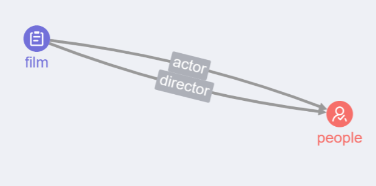

VLDB、SIGMOD、PODS和ICDE是数据库领域的顶级国际会议。2024年VLDB 50周年会议正好在广州举办。会议录用的论文均为目前业界较为领先的研究成果或前沿研究。请浏览VLDB录用的论文集，找出其中一个你最感兴趣的研究论文，然后结合该论文，调研相关研究写总结报告。其他参考文献请前往华南理工大学电子图书馆查阅。

论文要求如下：

1、 需要包含8篇以上英文文献，中文参考文献必须是期刊论文，不能是博客。

2、 写作语言中英文不限。

3、 论文要有标题，并包含以下部分：摘要、引言、主体内容(多个，子标题自定)、总结、参考文献。

4、 字数需在三千字以上。

5、 提交截止时间2024年10月8日。

6、报告格式见QQ群文件。

 

VLDB 2024：https://vldb.org/pvldb/volumes/17

选择：KGFabric: A Scalable Knowledge Graph Warehouse for Enterprise Data Interconnection

基于妈蚁集团多元化的应用场景，我们构建了蚂蚁知识图谱平台(AKGP)。它构建了众多与商家、公司、账户、产品等相关的领域特定知识图谱。AKGP管理着数万亿的结构化知识图谱，服务于搜索、推荐、风险控制和其他业务。然而，随着图模式匹配、图表示学习、跨领域知识重用等各种工作负载的需求不断增加，现有的基于关系DBMS或图数据库的仓库系统已经无法满足需求。为了解决这些问题,我们提出了KGFabric,一个建立在分布式文件系统(DFS)上的工业规模的知识图谱管理系统。KGFabric提供了一个近线知识存储引擎，该引擎利用了语义增强的可编程图(SPG)模型，该模型与标记属性图(LPG)模型兼容。数据持久化存储在DFS中，如HDFS,利用POSIX文件系统API,适合在多云环境中以低成本部署。KGFabric:提供了一种基于本地图形的混合存储格式，可以作为并行图形计算系统的共享后端，大大加快了对多工作负载的分析。此外。KGFabric包含一个图结构框架，可以最大限度地减少数据重复并保证数据安全。

## 名词解释

[KG](https://qianshuang.github.io/2018/10/04/KB_01/)

SPG（Semantic-enhanced Programmable Graph，语义增强可编程框架）

（KGF）Knowledge Graph Fabric

分布式文件系统（DFS）

RDF和SPARQL是知识表示的核心技术。
RDF（Resource Description Framework，资源描述框架），将知识以三元组的形式呈现，即每一份知识都可以被分解为：(subject, predicate, object)。所以RDF具备一定的推理能力：

本体：

#### 本体简介

更新时间：2023-06-09 GMT+08:00

[查看PDF](https://support.huaweicloud.com/usermanual-kg/kg-usermanual_hws(1).pdf)

[分享](javascript:void(0);)

在创建知识图谱之前，您需要创建图谱的本体，用于组织知识图谱信息结构。

##### 基本概念

- 实体

  实体是有可区别性且独立存在的某种事物。例如某一具体的电影（或人物或关系），如电影“霸王别姬”，可称作实体。

- 概念

  概念指是抽象的、普遍的想法，是充当指明实体、事件或关系的范畴或类的实体。例如本体如[图1](https://support.huaweicloud.com/usermanual-kg/kg_01_0004.html#kg_01_0004__fig429151434812)所示，“film”、“people”可称作概念。

- 概念间关系

  概念间关系是概念之间的相关联系。例如本体如[图1](https://support.huaweicloud.com/usermanual-kg/kg_01_0004.html#kg_01_0004__fig429151434812)所示，“film”、“people”两者之间的关系“actor”、“director”均可称作概念间关系。关系名称不能重复。

- 本体

  本体是某个领域中抽象概念的集合，能够描述某个范围内一切事物的共有特征以及事物间的关系。例如[图1](https://support.huaweicloud.com/usermanual-kg/kg_01_0004.html#kg_01_0004__fig429151434812)可称作一个本体。

  图1 本体
  

#### LSMTree

 (Log-Structured Merge-Tree)**：一种数据库索引技术，用于优化写操作。

## 问题框架

论文《KGFabric: A Scalable Knowledge Graph Warehouse for Enterprise Data Interconnection》在蚂蚁集团的背景下，针对现有的基于关系数据库管理系统(DBMS)或图数据库的知识图谱仓库系统在处理高负载工作如图模式匹配、图表示学习和跨领域知识重用时的不足，提出了一个基于分布式文件系统(DFS)的工业规模的知识图谱管理系统KGFabric。以下是该论文解决的主要问题、子问题以及相应的解决方案和涉及的技术。

### 主要问题
**扩展性和性能不足**：随着图数据量的激增，现有的系统难以支持高效的数据存储、查询和跨领域知识融合。

### 子问题及解决方案
1. **数据存储效率和查询性能问题**：
   - **解决方案**：KGFabric引入了一个基于DFS的存储引擎，利用语义增强的可编程图(SPG)模型，兼容已标记的属性图(LPG)模型。该存储引擎支持原生的图形基础存储格式，显著提高了存储效率和查询性能。
   - **涉及技术**：分布式文件系统（如HDFS），POSIX文件系统API，图形基础存储格式，多索引及时间分片技术。

2. **跨领域知识融合和数据安全问题**：
   - **解决方案**：引入了一个分布式图形架构框架，支持跨租户加密和异构知识图谱的融合。该框架允许创建虚拟图形视图和用户定义的操作符，有效管理数据冲突和确保数据安全。
   - **涉及技术**：加密技术，用户定义的操作符，虚拟图形视图，分布式图形架构框架。

3. **图模式匹配和图表示学习工作负载的性能提升问题**：
   - **解决方案**：提供了一个共享的后端支持并行图形分析系统，如GeaFlow和GraphX，支持各种知识图谱工作负载，包括秒级延迟的在线分析处理(OLAP)和图模式匹配。
   - **涉及技术**：并行图形计算系统，图形分析语言如Gremlin，高效图形查询API。

### 未来方向和改进计划
- **向量存储和通用存储格式兼容性**：通过数据向量化提高图存储的局部性，优化跨域图形织物和推理的性能，支持KG+LLM（大规模语言模型）。
- **跨平台数据迁移最小化**：与开放格式如Parquet和ORC兼容，减少数据迁移过程中的损失。

通过这种方式，KGFabric能够有效地解决了大规模知识图谱管理在存储效率、查询性能和数据融合方面的挑战。该系统不仅提高了处理速度和准确性，还通过其创新的技术架构增强了数据安全和跨领域融合的能力。

## 涉及的知识点

KGFabric 的研究背景和涉及的知识涵盖了几个核心领域，包括知识图谱、分布式计算、语义网络以及大数据管理。每个领域中都有若干具体的技术和理论，这些都在构建 KGFabric 这一解决方案中发挥了重要作用。下面是一些详细的相关研究和知识点。

### 1. 知识图谱构建与管理

- **属性图 (Property Graph) 和 RDF (Resource Description Framework)**：这两种是构建知识图谱的常用数据模型。KGFabric 使用了与标记属性图兼容的 SPG（语义增强可编程图）模型，这一模型结合了属性图的灵活性与 RDF/OWL 的丰富语义。
- **图数据库**：研究如何在图数据库中有效地存储和查询复杂的图结构数据，包括索引机制、查询优化和数据分区技术。

### 2. 分布式计算

- **分布式文件系统 (DFS)**：如 Apache Hadoop 文件系统（HDFS），研究如何在多节点环境中高效、可靠地存储大量数据。
- **MapReduce 和其他大数据处理框架**：如 Apache Spark，用于处理和分析大规模数据集，特别是在图数据处理和机器学习应用中。

### 3. 图计算和分析

- **图计算框架**：如 Apache Giraph、GraphX 和 Neo4j，这些框架提供了进行大规模图数据处理的工具和算法。
- **并行图算法**：研究如何有效地在分布式环境中执行图算法，例如社区检测、最短路径计算和图模式匹配。

### 4. 数据安全与隐私

- **加密技术和数据脱敏**：确保在处理敏感信息时的数据安全和隐私保护，特别是在多租户环境中的应用。
- **安全多方计算（SMC）**：研究如何在不泄露各方输入的情况下，共同完成数据计算和分析任务。

### 5. 语义网和本体

- **Web Ontology Language (OWL)**：用于创建详细的、复杂的本体结构，增强数据之间的语义关联。
- **SPARQL 查询语言**：用于在语义网和RDF数据中执行复杂的查询操作。

### 6. 多云和混合云架构

- **云服务管理**：研究如何在不同云服务提供商之间有效管理和迁移数据，以及如何优化云资源的使用以降低成本。

## 引言

在数字化时代，随着数据量的爆炸式增长，企业越来越依赖于高效的数据管理系统来理解和利用复杂的信息结构。尤其在蚂蚁集团这样的金融科技公司，知识图谱作为连接和解析大规模异构数据的关键技术，其重要性不断上升。知识图谱能够通过实体之间的丰富关系展示复杂的数据联系，为搜索优化、推荐系统、风险控制等业务提供强有力的支持。然而，传统的基于关系数据库管理系统（DBMS）或图数据库的解决方案在处理蚂蚁集团数万亿规模的结构化知识图谱时显示出性能瓶颈，尤其是在图模式匹配、图表示学习和跨领域知识重用等高负载工作场景下。

为了应对这些挑战，蚂蚁集团知识引擎团队提出了KGFabric，一种创新的知识图谱仓库解决方案，旨在通过先进的数据模型和分布式架构改进知识管理和数据互联。KGFabric 建立在强大的分布式文件系统（DFS）之上，采用语义增强的可编程图（SPG）作为其核心数据模型，这一模型不仅与传统的标记属性图（LPG）模型兼容，还在保持高度灵活性的同时提供了丰富的语义表达能力。KGFabric 的设计通过一种基于本地图形的混合存储格式，优化了存储效率和查询性能，特别适应了多工作负载和高并发的分析需求。

该论文将探讨KGFabric的系统架构、关键技术实现、以及它在蚂蚁集团内部的实际应用场景，展示了其如何有效地解决了大规模知识图谱管理中的关键问题，包括数据存储效率、知识融合、数据安全和多云环境部署等。

## 正文

在面对企业级大数据管理和处理的挑战时，传统的数据库技术往往难以满足高效写入和持续可靠性的需求，该系统利用用LSM（Log-Structured Merge-tree）树技术来优化数据写入和查询性能。LSM树是一种专为高性能写入操作设计的数据结构，通过将数据写入到内存中的日志结构合并树，然后异步批量写入到磁盘，大大减少了磁盘I/O操作的需求，从而提高了写入效率。LSM树存在多种变体和优化技术，包括压缩策略、Bloom过滤器、以及层级存储机制等。这些技术共同提升了数据库系统处理大规模数据集时的性能，减少了数据查询过程中的延迟。KGFabric采用了类似的技术策略来优化其知识图谱仓库的存储系统。系统中实现的Bloom过滤器可以有效过滤掉非目标数据的访问请求，减少无效的磁盘访问；而多级合并策略则确保了数据在合并和压缩过程中的效率和数据完整性。此外，KGFabric还实现了多版本并发控制（MVCC），保证了高并发环境下数据的一致性和隔离性。改设计使得KGFabric不仅能支持传统的数据存储和查询任务，还能有效地进行跨领域的知识融合和智能化数据分析，为企业数据互联提供了强大的技术支撑。

KGFabric通过引入基于DFS的存储引擎提高其知识图谱数据的存储效率和访问速度。DFS作为基础架构支持KGFabric处理大规模、分布式的数据集，确保数据处理的可扩展性和可靠性。有关研究提及在DFS中可以使用神经网络和灰狼优化算法来动态预测并预取将要被频繁访问的文件块，这种预取策略有效减少I/O等待时间，提高数据访问的速度。也许在KGFabric中，可以利用类似的预测模型来预测哪些知识图谱节点或边将被频繁地查询，通过预加载这些图元素到主存储中，可以显著减少图查询的响应时间，特别是在执行复杂的图遍历或模式匹配查询时。

## 层次结构

KGFabric 的研究背景和涉及的知识涵盖了几个核心领域，包括知识图谱、分布式计算、语义网络以及大数据管理。每个领域中都有若干具体的技术和理论，这些都在构建 KGFabric 这一解决方案中发挥了重要作用。下面是一些详细的相关研究和知识点。

### 1. 知识图谱构建与管理
- **属性图 (Property Graph) 和 RDF (Resource Description Framework)**：这两种是构建知识图谱的常用数据模型。KGFabric 使用了与标记属性图兼容的 SPG（语义增强可编程图）模型，这一模型结合了属性图的灵活性与 RDF/OWL 的丰富语义。
- **图数据库**：研究如何在图数据库中有效地存储和查询复杂的图结构数据，包括索引机制、查询优化和数据分区技术。

### 2. 分布式计算
- **分布式文件系统 (DFS)**：如 Apache Hadoop 文件系统（HDFS），研究如何在多节点环境中高效、可靠地存储大量数据。
- **MapReduce 和其他大数据处理框架**：如 Apache Spark，用于处理和分析大规模数据集，特别是在图数据处理和机器学习应用中。

### 3. 图计算和分析
- **图计算框架**：如 Apache Giraph、GraphX 和 Neo4j，这些框架提供了进行大规模图数据处理的工具和算法。
- **并行图算法**：研究如何有效地在分布式环境中执行图算法，例如社区检测、最短路径计算和图模式匹配。

### 4. 数据安全与隐私
- **加密技术和数据脱敏**：确保在处理敏感信息时的数据安全和隐私保护，特别是在多租户环境中的应用。
- **安全多方计算（SMC）**：研究如何在不泄露各方输入的情况下，共同完成数据计算和分析任务。

### 5. 语义网和本体
- **Web Ontology Language (OWL)**：用于创建详细的、复杂的本体结构，增强数据之间的语义关联。
- **SPARQL 查询语言**：用于在语义网和RDF数据中执行复杂的查询操作。

### 6. 多云和混合云架构
- **云服务管理**：研究如何在不同云服务提供商之间有效管理和迁移数据，以及如何优化云资源的使用以降低成本。

通过这些研究领域和知识，KGFabric 能够有效地解决传统知识图谱系统在处理大规模数据、实现复杂查询和支持数据隐私保护方面的不足。这些技术的融合也表明了现代大数据和知识管理领域的跨学科性质和技术融合趋势。

## 子问题

1. **数据存储效率和查询性能问题**：
   - **解决方案**：KGFabric引入了一个基于DFS的存储引擎，利用语义增强的可编程图(SPG)模型，兼容已标记的属性图(LPG)模型。该存储引擎支持原生的图形基础存储格式，显著提高了存储效率和查询性能。
   - **涉及技术**：分布式文件系统（如HDFS），POSIX文件系统API，图形基础存储格式，多索引及时间分片技术。
2. **跨领域知识融合和数据安全问题**：
   - **解决方案**：引入了一个分布式图形架构框架，支持跨租户加密和异构知识图谱的融合。该框架允许创建虚拟图形视图和用户定义的操作符，有效管理数据冲突和确保数据安全。
   - **涉及技术**：加密技术，用户定义的操作符，虚拟图形视图，分布式图形架构框架。
3. **图模式匹配和图表示学习工作负载的性能提升问题**：
   - **解决方案**：提供了一个共享的后端支持并行图形分析系统，如GeaFlow和GraphX，支持各种知识图谱工作负载，包括秒级延迟的在线分析处理(OLAP)和图模式匹配。
   - **涉及技术**：并行图形计算系统，图形分析语言如Gremlin，高效图形查询API。

### 未来方向和改进计划

- **向量存储和通用存储格式兼容性**：通过数据向量化提高图存储的局部性，优化跨域图形织物和推理的性能，支持KG+LLM（大规模语言模型）。
- **跨平台数据迁移最小化**：与开放格式如Parquet和ORC兼容，减少数据迁移过程中的损失。

KGFabric采用了分布式哈希表技术，将大规模的知识图谱数据划分为多个分片，并存储在不同的节点上。这种设计不仅提高了系统的扩展性，使得系统能够轻松应对知识图谱数据的持续增长，同时也为并行计算提供了基础。

在查询效率方面，KGFabric通过优化查询算法和利用分布式计算资源，显著提高了复杂查询的执行速度。此外，系统还支持增量更新，能够以较低的成本实现知识图谱数据的快速更新和维护。

KGFabric的研究成果不仅对蚂蚁集团自身的业务发展具有重要意义，更为整个知识图谱管理领域带来了新的思考和发展方向。随着KGFabric等先进技术的不断涌现和完善，我们可以预见未来知识图谱将在更多领域发挥重要作用。

例如，在金融领域，通过构建大规模的金融知识图谱，并结合自然语言处理、机器学习等技术，可以实现更为智能的风险提示、投资决策和客户服务等功能。在医疗领域，利用知识图谱对海量的医疗数据进行整合和分析，有助于发现新的治疗方法和预防策略。

此外，随着5G、物联网等技术的普及，未来还将产生更多类型的数据和实体关系，这为知识图谱的应用提供了更广阔的空间。而像KGFabric这样的高性能知识图谱管理系统，无疑将成为支撑这些数据应用的重要基石。

## 引用

[1]Ling-Zhe Z ,Xiang-Dong H ,Yan-Kai W , et al.Time-tired compaction: An elastic compaction scheme for LSM-tree based time-series database[J].Advanced Engineering Informatics,2024,59

[1]Luo C ,Carey J M .LSM-based storage techniques: a survey[J].The VLDB Journal,2020,29(1):393-418.

[1]Krishna R S L T ,Ragunathan T.Performance evaluation of speculative semantics-based algorithm for read operations in distributed file system[J].Int. J. of Communication Networks and Distributed Systems,2019,22(3):275-293.

[1] Soundharya, U. L., Vadivu, G., & Chaitanya, G. K. (2024). Distributed file systembased optimization algorithm. Wireless Networks. DOI: 10.1007/s11276-024-03760-y. Available: https://doi.org/10.1007/s11276-024-03760-y

[1]Dobler, K., Riesen, K. (2024). Learning Graph Matching with Graph Neural Networks. In: Suen, C.Y., Krzyzak, A., Ravanelli, M., Trentin, E., Subakan, C., Nobile, N. (eds) Artificial Neural Networks in Pattern Recognition. ANNPR 2024. Lecture Notes in Computer Science(), vol 15154. Springer, Cham. https://doi.org/10.1007/978-3-031-71602-7_1

[1]Xu, Y., Mao, C., Wang, Z. *et al.* Semantic-enhanced graph neural network for named entity recognition in ancient Chinese books. *Sci Rep* **14**, 17488 (2024).