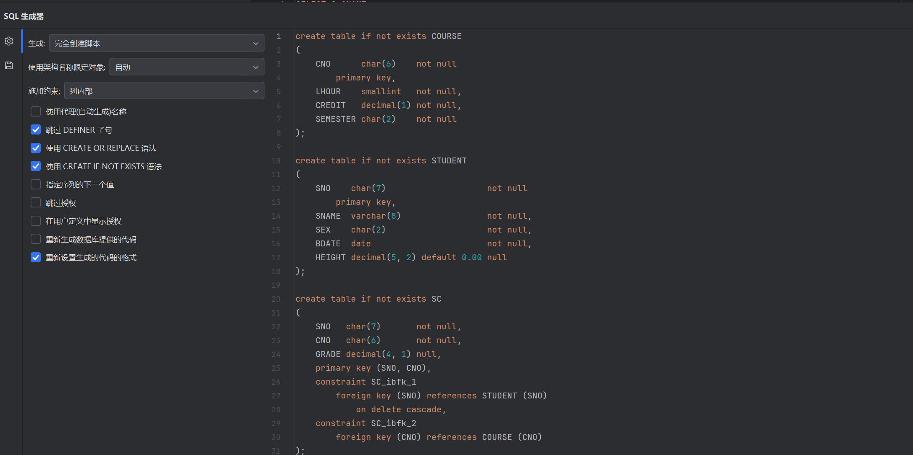
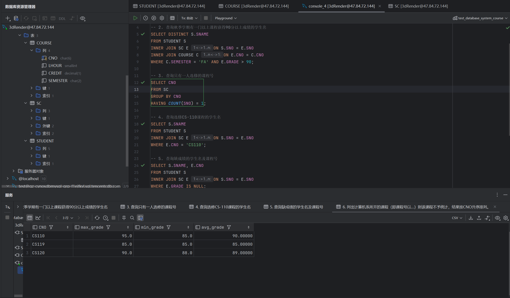

[TOC]


## 实验截图

### 表的创建



### 查询语句以及结果



## 数据库表的构建语句导出

```
create table if not exists COURSE
(
    CNO      char(6)    not null
        primary key,
    LHOUR    smallint   not null,
    CREDIT   decimal(1) not null,
    SEMESTER char(2)    not null
);

create table if not exists STUDENT
(
    SNO    char(7)                    not null
        primary key,
    SNAME  varchar(8)                 not null,
    SEX    char(2)                    not null,
    BDATE  date                       not null,
    HEIGHT decimal(5, 2) default 0.00 null
);

create table if not exists SC
(
    SNO   char(7)       not null,
    CNO   char(6)       not null,
    GRADE decimal(4, 1) null,
    primary key (SNO, CNO),
    constraint SC_ibfk_1
        foreign key (SNO) references STUDENT (SNO)
            on delete cascade,
    constraint SC_ibfk_2
        foreign key (CNO) references COURSE (CNO)
);

```
## 问题

1. 查询所有女学生的身高（以厘米表示）
2. 查询秋季学期有一门以上课程获得90分以上成绩的学生名
3. 查询只有一人选修的课程号
4. 查询选修CS-110课程的学生名
5. 查询缺成绩的学生名及课程号
6. 列出计算机系所开的课程（即课程号以CS开头的课程)的最高成绩，最低成绩，平均成绩。如果某门课程的成绩不全（即GRADE中有NULL出现）则该课程不予统计，结果按CNO升序排列。

## 解答

### 插入实验性数据

```
插入学生数据
INSERT INTO STUDENT (SNO, SNAME, SEX, BDATE, HEIGHT) VALUES
('S000001', 'Alice', 'F', '2000-01-01', 160.00),
('S000002', 'Bob', 'M', '1999-05-12', 175.00),
('S000003', 'Cathy', 'F', '2001-03-15', 165.00),
('S000004', 'David', 'M', '1998-07-22', 180.00)
ON DUPLICATE KEY UPDATE
SNAME = VALUES(SNAME),
SEX = VALUES(SEX),
BDATE = VALUES(BDATE),
HEIGHT = VALUES(HEIGHT);

插入课程数据
INSERT INTO COURSE (CNO, LHOUR, CREDIT, SEMESTER) VALUES
('CS110', 48, 3, 'FA'),
('CS120', 60, 4, 'FA'),
('M101', 45, 3, 'FA');

插入选课数据
INSERT INTO SC (SNO, CNO, GRADE) VALUES
('S000001', 'CS110', 95.0),
('S000002', 'CS110', 85.0),
('S000003', 'CS120', 90.0),
('S000004', 'M101', NULL),
('S000001', 'CS120', 88.0),
('S000002', 'M101', 92.0);

插入只有一人选课的课程号
insert into COURSE(CNO, LHOUR, CREDIT, SEMESTER) values('CS119', '88', 4, 'FA');
INSERT  INTO SC(SNO, CNO, GRADE) VALUES('S000001', 'CS119', 85);
```

### 查询语句（使用了内连接inner join）

```
1. 查询所有女学生的身高（以厘米表示）Female=F
SELECT HEIGHT FROM STUDENT WHERE SEX = 'F';

2. 查询秋季学期有一门以上课程获得90分以上成绩的学生名
SELECT DISTINCT S.SNAME
FROM STUDENT S
INNER JOIN SC E ON S.SNO = E.SNO
INNER JOIN COURSE C ON E.CNO = C.CNO
WHERE C.SEMESTER = 'FA' AND E.GRADE > 90;

3. 查询只有一人选修的课程号
SELECT CNO
FROM SC
GROUP BY CNO
HAVING COUNT(SNO) = 1;

4. 查询选修CS-110课程的学生名
SELECT S.SNAME
FROM STUDENT S
INNER JOIN SC E ON S.SNO = E.SNO
WHERE E.CNO = 'CS110';

5. 查询缺成绩的学生名及课程号
SELECT S.SNAME, E.CNO
FROM STUDENT S
INNER JOIN SC E ON S.SNO = E.SNO
WHERE E.GRADE IS NULL;

6. 列出计算机系所开的课程（即课程号以CS开头的课程)的最高成绩，最低成绩，平均成绩。如果某门课程的成绩不全（即GRADE中有NULL出现）则该课程不予统计，结果按CNO升序排列。
SELECT CNO, MAX(GRADE) AS max_grade, MIN(GRADE) AS min_grade, AVG(GRADE) AS avg_grade
FROM SC
WHERE CNO LIKE 'CS%' AND GRADE IS NOT NULL
GROUP BY CNO
HAVING COUNT(GRADE) = (SELECT COUNT(*) FROM SC E2 WHERE E2.CNO = SC.CNO)
ORDER BY CNO;
```

### 查询结果

```
1
#,HEIGHT
1,160.00
2,165.00


2
#,SNAME
1,Alice
2,Bob


3
#,CNO
1,CS119


4
#,SNAME
1,Alice
2,Bob


5
#,SNAME,CNO
1,David,M101

6
#,CNO,max_grade,min_grade,avg_grade
1,CS110,95.0,85.0,90.00000
2,CS120,90.0,88.0,89.00000

```

## 以下是上述 SQL 查询语句转化为关系代数的格式

### 1. 查询所有女学生的身高（以厘米表示）

**σ_sex='F' (STUDENT) [π_height]**


### 2. 查询秋季学期有一门以上课程获得90分以上成绩的学生名

**π_sname (σ_semester='FA' ∧ grade>90 (STUDENT ⨝ SC ⨝ COURSE))**


### 3. 查询只有一人选修的课程号

 **π_cno (σ_count(sno)=1 (GROUP BY cno (SC)))**


### 4. 查询选修CS-110课程的学生名
**π_sname (σ_cno='CS110' (STUDENT ⨝ SC))**

### 5. 查询缺成绩的学生名及课程号

 **π_sname, cno (σ_grade IS NULL (STUDENT ⨝ SC))**


### 6. 列出计算机系所开的课程（即课程号以CS开头的课程)的最高成绩，最低成绩，平均成绩。如果某门课程的成绩不全（即GRADE中有NULL出现）则该课程不予统计，结果按CNO升序排列。

**π_cno, max(grade) AS max_grade, min(grade) AS min_grade, avg(grade) AS avg_grade (σ_cno LIKE 'CS%' ∧ grade IS NOT NULL ∧ count(grade) = count(*) (SC)) GROUP BY cno ORDER BY cno**
### 符号标识

 **σ** 表示选择操作（selection），用于条件筛选。
 **π** 表示投影操作（projection），用于选择特定的列。
 **⨝** 表示连接操作（join），用于结合多个表。
 **GROUP BY** 与 **HAVING** 表示分组与分组后的条件过滤。
 **COUNT**, **MAX**, **MIN**, **AVG** 为聚合函数，用于执行特定的计算。
 **ORDER BY** 表示排序操作。