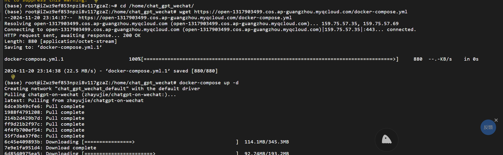

-2024-11-20 23:14:37--  https://open-1317903499.cos.ap-guangzhou.myqcloud.com/docker-compose.yml
Resolving open-1317903499.cos.ap-guangzhou.myqcloud.com (open-1317903499.cos.ap-guangzhou.myqcloud.com)... 159.75.57.35, 159.75.57.69
Connecting to open-1317903499.cos.ap-guangzhou.myqcloud.com (open-1317903499.cos.ap-guangzhou.myqcloud.com)|159.75.57.35|:443... connected.
HTTP request sent, awaiting response... 200 OK
Length: 880 [application/octet-stream]
Saving to: ‘docker-compose.yml.1’

docker-compose.yml.1                      100%[====================================================================================>]     880  --.-KB/s    in 0s      

2024-11-20 23:14:38 (22.5 MB/s) - ‘docker-compose.yml.1’ saved [880/880]

(base) root@iZwz9ef853npzi8v117gzaZ:/home/chat_gpt_wechat# docker-compose up -d

