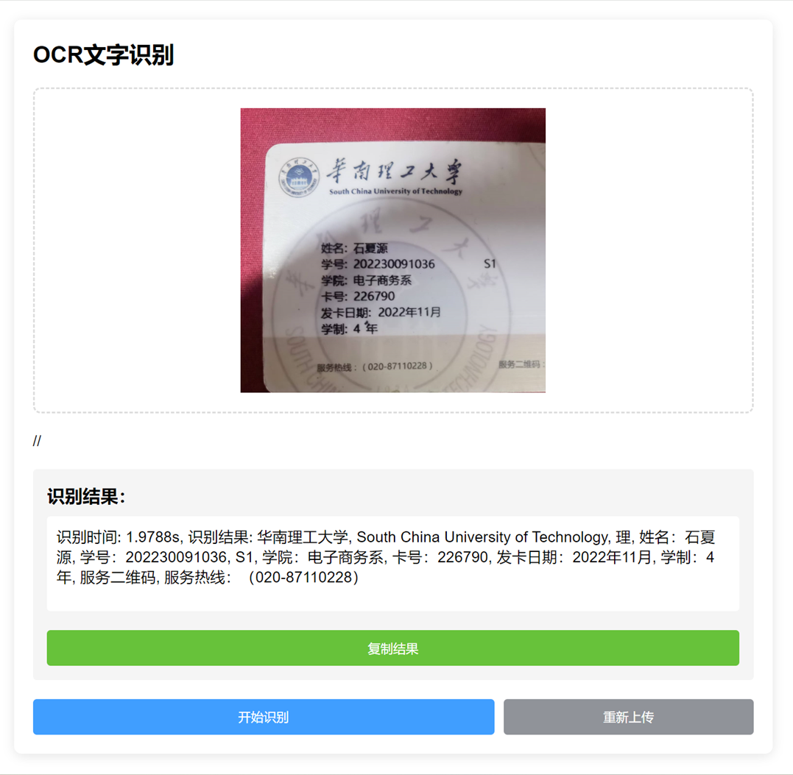
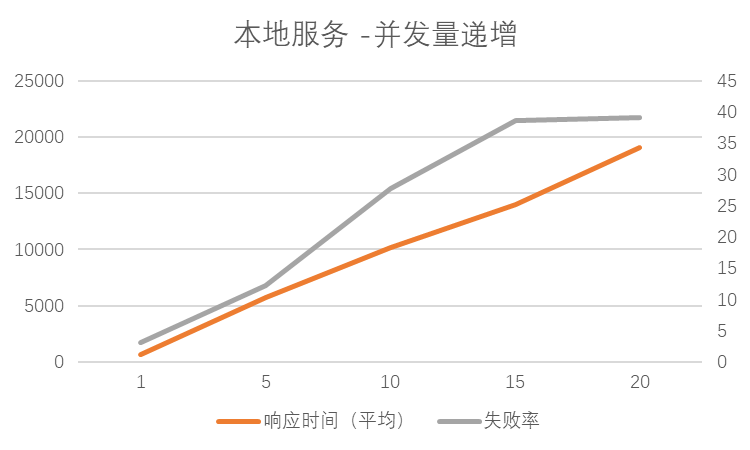
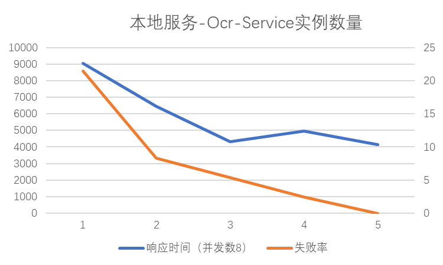
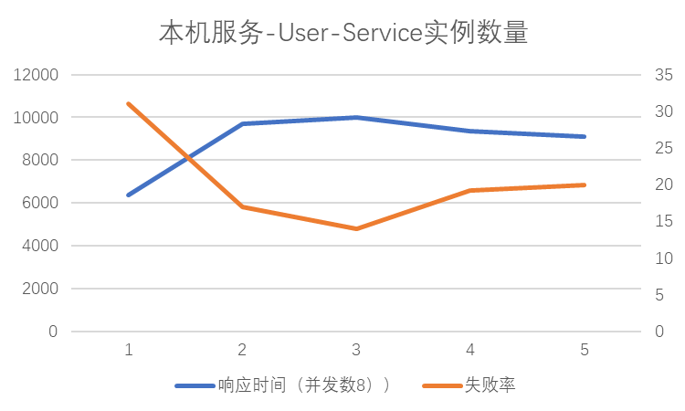
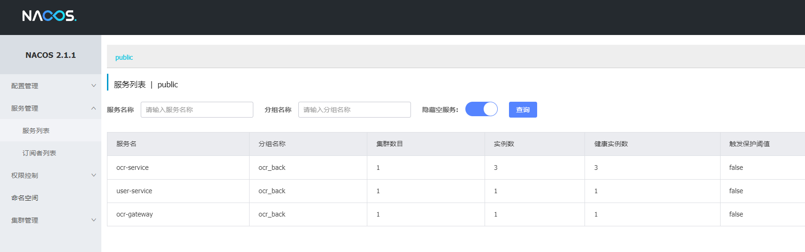
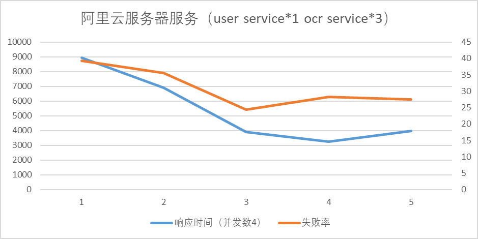

# OCR服务

## 摘要

此文章是以Nacos为服务注册中心，使用Spring和Flask框架的OCR服务系统的设计与测试汇报。系统采用现代微服务架构，应用了服务网关、服务注册与发现、负载均衡并采用容器化部署（云服务器）。系统的主要功能包括用户登录注册、图片上传及OCR结果接收。我们分别在本地和云服务器环境下进行了系统性能测试，主要关注平均响应时间和请求失败率两个性能指标。

## 引言

随着微服务架构的普及，构建高效、可扩展的应用服务变得尤为重要。OCR服务，作为一种计算密集型任务，对系统性能的要求极高。我们设计并实现了一个基于Spring和Flask框架的OCR服务系统，实现OCR服务的水平扩展，并且运行在不同的环境下进行测试，旨在探索不同硬件配置、水平扩展度和并发响应数量等条件下的性能表现，并记录系统表现、分析系统瓶颈。

## 系统结构

### 系统结构概述

1. **服务网关**: Spring Cloud Gateway
2. **服务总线、服务注册中心**: Nacos Server
3. **整体框架**: Spring
4. **OCR-SERVICE框架**: Flask
5. **负载均衡**: Spring Cloud LoadBalancer
6. **Web功能**: 登录注册、上传图片、返回识别结果

### 系统架构图

### 环境、配置

ocr-service服务：python3.9、Flask

其余部分均为sping boot框架，使用java21

服务注册中心、总线服务：Nacos

网关服务：Spring Cloud  Gateway

负载均衡：Spring Cloud LoadBalancer、

测试用工具：ApiFox

云服务器系统：Ubuntu 24.04

本机系统：win11 

## 实验测试

### 运行结果示例

### **测试环境**

**阿里云服务器**：

4核8g，无提供gpu服务，但是约空余4g内存提供给程序出来请求

**本地测试**：

物理内存16g，提供GPU服务，但是由于准备测试资源占用大量本机资源，实际可提供给程序的内存空间为3g左右（除去测试资源占用）

**环境区别**：

云服务器无GPU支持，但内存略高

### 测试指标

1. **平均响应时间**
2. **请求失败率**

### 测试条件

1. 不同环境（云服务器容器编排部署/本机）
3. 不同的Ocr-Service的实例数量
4. 不同的User-Service的实例数量
5. 不同的并发请求数量

### 测试结果

#### 本地测试

本地使用打包的jar包、直接运行server.py文件进行运行

##### 测试数据记录

##### **结果分析：**

1. UserService实例数量，对服务性能影响并不大，性能瓶颈集中在OcrService，随着OcrService实例增加，失败率和响应时间显著提升，最后趋于一个失败率和响应时间都趋于一个较小的稳定值
2. 随着响应并发递增，服务失败率和响应时间显著上升。
3. 显卡会参与图形处理，从任务管理器的性能监控面板中可以看到显卡运行情况。在无其它任务时，显卡利用率为3%左右，在进行图处理时，随着并发数量增加，GPU利用率会上升，但内存利用率接近100%的时候，GPU利用率维持在30%上下，不会随着响应增多而出现显著上升趋势。结果表明：处理速度、失败率在未充分利用GPU的情况下，受限于内存空间不足而无法进一步改善。

#### 云服务器测试

云服务器使用docker-compose进行编排部署

##### 服务情况截图：

##### 测试数据记录：

##### **结果分析：**

1. 由于缺乏显卡支持，表现很差，无法快速处理图片，请求会阻塞、失败，响应速度和失败率的数值表现都不理想。
2. 因为阻塞，物理内存限制，当并发数和图片大小超过一定数值，服务器都会奔溃而停机，最终多次尝试，上述结果是基于103kb大小的图片、响应并发数为4的条件下测试得到。

## 结论

1. **实例数量的重要性**：增加 OCR-Service 的实例数量能够显著改善处理能力，降低失败率并且提升响应时间。对于ocr这种计算密集型的服务，通过增加处理实例数量来进行水平扩展是非常有效的。
2. **硬件资源的影响**：GPU 和内存大小对系统性能有显著影响。在本地测试中，有GPU支持的环境表现出更好的图像处理能力和更低的失败率；然而，内存的限制最终会成为系统性能的瓶颈。
3. **环境的差异**：本地环境与云服务器环境在性能上存在显著差异，云服务器由于缺乏GPU支持和较低的内存容量，表现出较慢的响应时间和更高的失败率。

## 提交内容、分工说明

**注：**提交zip文件中包括PDF报告和本地、云服务器部署用的源码和docker配置文件，不包含本地nacos server包和可执行jar包

**小组分工**

1.石夏源（组长）：nacos server搭建、nacos总线服务、flask-ocr service基础构建、云服务器部署测试、本地服务测试

2.赖健康：web端界面构建

3.黄超平：网关服务搭建、用户鉴权服务

4.陈津乐：参与本地服务部署测试

5.陈金辉：客户端负载均衡、User-Service构建、ocr/user service服务注册
