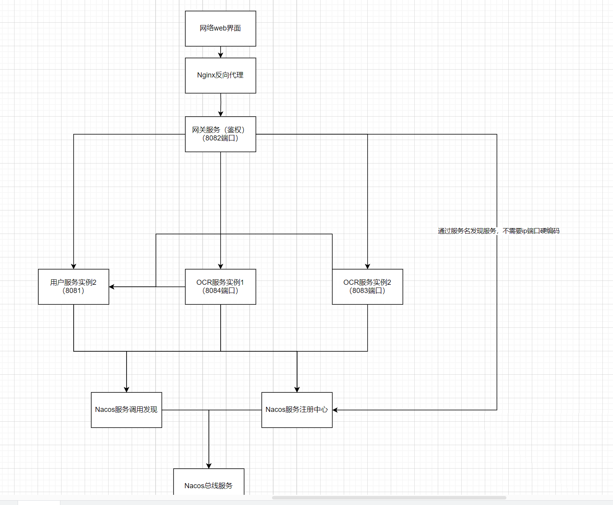

https://blog.csdn.net/qq_32649581/article/details/124145042

架构是采用微服务

服务只有两个：用户和OCR

服务注册：Nacos：来自于[SpringCloudAlibaba](https://so.csdn.net/so/search?q=SpringCloudAlibaba&spm=1001.2101.3001.7020)

**server address服务ip是120.79.173.96:8848**

**数据库 ip 120.79.173.96:3306**

**账户nacos 密码nacos**

 pip list --format=freeze > requirements.txt

服务调用：Spring Cloud OpenFeign

服务网关：Spring Cloud Gateway

服务配置：Nacos

服务总线：Nacos

整体框架Spring（OCR采用python调用即可）

负载均衡：Spring Cloud LoadBalancer

web界面（登录注册）、（上传图片、返回识别的文字）-赖健康

your-project-root/
│
├── nacos-server/              # Nacos Server 模块（石夏源）-已经搞定 **server address服务ip是120.79.173.96:8848**
│   ├── src/
│   ├── pom.xml
│   └── Dockerfile
│
├── ocr-service/               # OCR 服务模块（陈金辉）
│   ├── src/
│   ├── pom.xml
│   └── Dockerfile
│
├── user-service/              # 用户服务模块（陈金辉、需要负载均衡，调用ocr服务）
│   ├── src/
│   ├── pom.xml
│   └── Dockerfile
│
├── api-gateway/               # API Gateway 模块（黄超平）
│   ├── src/
│   ├── pom.xml
│   └── Dockerfile
│
├── service-bus/               # 服务总线模块（黄超平）
│   ├── src/
│   ├── pom.xml
│   └── Dockerfile
│
└── pom.xml                    # 父 POM 文件

测试点：（测试-本地测试-陈津乐）（服务器部署测试-石夏源）

1. 性能

   1. 单次请求响应时间

   1. 多次请求的响应时间

2. 可靠性
   1. 某一个微服务宕掉，是否功能正常
   2. 能否动态注册服务
3. 安全性
   1. 网关服务过滤