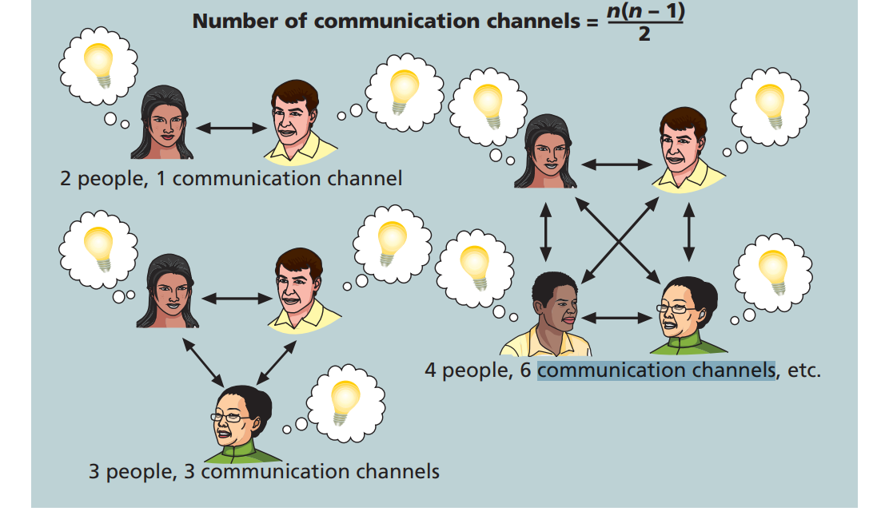

## 快速测验

1，2，3，5，6，7，9，10

1. b; 2. c; 3. d;  5. d; 6. a; 7. b;  9. b; 10. b  

## 讨论题

### 4

What items should a communications management plan address? How can a stakeholder analysis assist in preparing and implementing parts of this plan?

需要解决一下事项：

1. 相关者沟通要求
2. 要传达的信息，包括格式、内容和详细程度
3. 谁将接收信息，谁将产生信息
4. 传达信息的建议方法或技术
5. 沟通频率
6. 解决问题的升级程序
7. 更新通信管理计划的修订程序。
8. 常用术语词汇表

三过程中的沟通管理计划的输入包括项目章程、项目管理计划、项目文件、企业环境因素以及组织过程资产。在工具和技术方面涉及到专家判断、沟通需求分析、沟通技术、沟通模型、沟通方法、人际及团队技能、数据表示以及会议等。通过这些工具和技术的应用，产出沟通管理计划、项目管理计划的更新和项目文件的更新。

通过分析利益相关者的沟通需求，可以避免浪费时间或者在创造或传播不必要的信息上浪费金钱。除此之外，利益相关者分析能在准备和实施沟通管理计划中发挥以下作用：

1. **识别利益相关者**：利益相关者分析帮助项目团队识别出所有重要的利益相关者。帮助了解他们在项目中的角色、权力、影响力和兴趣点。通过这种方式，团队能够确定哪些人需要接收项目信息，并分析他们对项目成功的潜在影响。

2. **理解需求和期望**：借助利益相关者分析，团队能更好地理解不同利益相关者的具体需求和期望，这对于定制沟通内容和形式至关重要，确保沟通能够满足各方的具体要求，从而增加信息的接受度和有效性。

3. **选择适当的沟通方式和渠道**：不同的利益相关者可能更倾向于不同的沟通方式和渠道。例如，一些可能偏好电子邮件，而其他人则可能更喜欢定期的面对面会议。利益相关者分析帮助管理者确定最有效的沟通方式，以确保信息传达效果最佳。

4. **制定沟通频率**：利益相关者分析还可以帮助确定与各利益相关者沟通的频率。某些关键利益相关者可能需要更频繁的更新，而其他人则可能只需要定期的项目概览。了解这一点可以帮助项目管理者有效分配资源，避免信息过载或信息不足。

5. **预测和管理利益冲突**：通过分析，项目团队可以预见并管理潜在的利益冲突。明确各利益相关者的期望可以在早期阶段识别潜在的问题区域，从而采取措施解决冲突，确保项目顺利进行。

6. **提升参与度和支持**：当利益相关者感觉他们的需求和期望被认真对待时，他们更可能支持项目。利益相关者分析确保了所有关键方都能在项目过程中受到关注，从而增加他们对项目的支持度。

## 练习题

How many different communication channels does a project team with six people have? How many more communication channels would there be if the team grew to 10 people?

6人团队：15

10人团队：45

## 实践案例

### 10.14 实践案例：2

Prepare a partial communications management plan to address some of the challenges mentioned in Part 7 of the case.

为了有效地应对上述案例中提到的沟通挑战，我们需要准备一个部分沟通管理计划。下面是针对Global Treps项目的沟通管理计划的部分内容填充：

**项目名称：Global Treps项目**

1. **利益相关者沟通需求：**

   1. **Ashok（编辑视频）**：由于Ashok因伤暂时无法工作，需要重新分配视频编辑任务。利用Kanban板追踪任务进度，确保无缝移交接手和持续更新。
   2. **Alfreda和Dr. B**：解决Alfreda与Dr. B沟通困难的问题，考虑使用Dr. B习惯的通信方式，并设定具体的沟通时间点。

2. **沟通概要：**

   1. **视频编辑任务跟踪**：使用Kanban板系统化管理视频编辑的各个阶段，确保所有任务都可视化并实时更新。
   2. **与埃塞俄比亚合作沟通**：约定定期开展电话或者视频会议，确保关键信息的准确传递。

3. **利益相关者沟通表：**

   

   | 利益相关者     | 沟通名称             | 交付方式/格式          | 生产者                     | 频率/时间                            |
   | -------------- | -------------------- | ---------------------- | -------------------------- | ------------------------------------ |
   | 项目团队成员   | 视频编辑任务进度更新 | Kanban板               | 项目团队                   | 每周一次更新，团队会议每周二下午2:00 |
   | Alfreda与Dr. B | 项目合作沟通         | 视频/电话会议          | Alfreda                    | 每两周一次，时间待定                 |
   | 项目指导委员会 | 周状态报告           | 纸质报告及简短会议     | Kristin Maur               | 每周三上午9点                        |
   | 赞助商与倡导者 | 月状态报告           | 纸质报告及简短会议     | Kristin Maur               | 每月第一个周四上午10点               |
   | 受影响的员工   | 项目公告             | 备忘录、电子邮件、网站 | Lucy Camerena和Mike Sundby | 2007年7月1日                         |

4.  **注释/指南:**

   1. **Kanban板使用指南：** 所有团队成员需要接受简短的Kanban板培训，以确保每个人都能有效地使用此工具跟踪和更新任务状态。建议团队每周进行一次Kanban板的复查会议，以确认所有任务都当前并且正确标记。
   2. **多文化沟通：** 鉴于团队成员和合作伙伴分布在全球多个地区，建议采用尊重各地文化的沟通方式。例如，对于不使用文本消息的利益相关者，应优先考虑他们偏好的沟通方式，如电话或电子邮件。
   3. **透明性原则：** 为增强团队间的信任，项目相关的所有沟通都应尽可能保持透明。重要决策和更新应及时共享给所有利益相关者，避免信息孤岛。
   4. **反馈和调整：** 鼓励团队成员提供反馈关于沟通效果以及管理计划的实施。项目经理应定期收集这些反馈，并根据实际情况调整沟通策略。
   5. **敏感信息处理：** 对于涉及敏感信息的沟通，应严格控制信息的传播范围，并确保所有涉及的团队成员都了解和遵守相关的隐私政策和安全规定。
   6. **紧急沟通流程：** 在紧急情况下，如项目关键任务延误或突发问题，应立即启动预先设定的紧急沟通流程。项目团应清楚知道在这些情况下如何快速有效地通报情况给相关利益相关者。

5. **问题解决升级程序：**

   1. **对于任务升级问题**：若任务延误或有紧急问题，项目团队成员需立即通知项目经理，由项目经理决定是否需要升级至项目指导委员会。

   1. **对于合作问题**：Alfreda与Dr. B沟通不畅时，应先尝试解决个别问题，若问题仍无法解决，需升级至项目经理，并考虑更改合作策略或介入更高级别的管理。

6. **本文档的修订程序：**

   1. **定期审查**：本沟通管理计划将每季度审查一次，以确保其有效性并根据项目进展进行必要的调整。
   2. **修订请求**：团队成员可在必要时向项目经理提出修订请求，由项目经理汇总后提交给项目指导委员会审批。

7. **常用术语表：**

   1. **Kanban板**：一种视觉化工具，用于追踪和展示工作流程中的任务进度。
   2. **状态报告**：定期更新的文档，用于向利益相关者报告项目的当前状态。
   3. **视频/电话会议**：通过视频或电话进行的远程会议，用于跨地区沟通。

