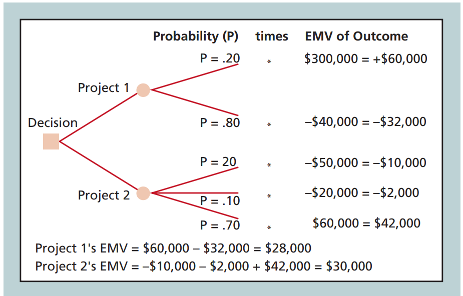

## 讨论题

### 6

Explain how to use decision trees and Monte Carlo analysis for quantifying risk. Give an example of how you could use each technique on an IT project.

#### 决策树

是一种有效的风险量化评估技术，尤其在信息技术（IT）项目中。通过图表-树状图模型，管理者可以理解不同决策路径下的潜在结果和相关风险。以下是如何使用决策树来量化风险，以及在IT项目中应用此技术的具体例子。

#### 如何使用决策树量化风险：

1. **定义决策节点**：首先确定需要做出的决策，例如选择哪个项目方案或技术解决方案。

2. **识别可能的结果**：为每个决策选项绘制可能的结果，包括成功、失败或其他中间状态的结果。

3. **估计概率**：为每个可能的结果分配一个概率值，这些概率基于历史数据、专家判断或市场研究。

4. **分配结果价值**：为每个结果确定一个预期的货币价值或成本。这包括直接成本、潜在收入或避免的损失。

5. **计算期望货币价值（EMV）**：通过将每个结果的概率与其相应的货币价值相乘，并将所有结果相加，来计算每个决策路径的EMV。

6. **选择最优路径**：比较不同决策路径的EMV，选择EMV最高（或成本最低）的路径。

#### IT项目中的应用决策树例子：

例如在如下决策树中，要计算每个项目的EMV，需要让概率乘以每个项目的每个潜在结果的结果值，并将结果求和。要计算项目1的EMV,从左到右，将概率乘以每个分支的结果，并将结果相加。在这个例子中，项目1的EMV是28,000美元，项目二是30000美元，由于EMV值越高越好（成本越低越好），投资项目二是更加好的决策。

#### 蒙特卡洛分析

是一种基于模拟的量化风险分析方法，通过随机抽样和统计分析来预测项目的结果。

#### 蒙特卡洛分析的使用步骤：

1. **收集估计数据**：收集项目关键变量（如任务完成时间）的乐观、悲观和最可能的估计值。

2. **确定概率分布**：为每个变量确定其概率分布，即变量在不同值间的分布概率。

3. **随机选择变量值**：根据设定的概率分布，为每个变量随机选择一个值。

4. **进行单次确定性分析**：使用这些随机选择的变量值，完成模型的一次运行，得到一次结果。

5. **重复模拟**：重复步骤3和4多次，通常为100到1000次，以获得模型结果的概率分布。

#### IT项目中应用蒙特卡洛分析示例：

假设一个IT项目团队正在开发一个新的软件产品，项目的成功非常依赖于按时完成。项目经理可以使用蒙特卡洛分析来预测项目按时完成的概率：

**步骤1**：收集关键开发任务的时间估计。例如，开发一个特定模块的乐观估计是3周，悲观估计是6周，最可能的估计是4周。

**步骤2**：确定每个任务的时间估计的概率分布。可以选择正态分布或三角分布等，根据专家的判断或历史数据设定这些分布。

**步骤3**：对每个任务，使用蒙特卡洛模拟来随机选择一个完成时间，基于步骤2中设定的概率分布。

**步骤4**：将所有任务的随机选择的时间加总，得到整个项目的完成时间。

**步骤5**：重复步骤3和4多次（例如250次），记录每次模拟的项目完成时间。

通过这种方式，项目经理可以得到一个项目完成时间的概率分布图。例如，可能发现有10%的概率可以在第8周完成项目，有50%的概率可以在第10周完成，有90%的概率可以在第12周完成。

这样的分析帮助项目经理理解项目按时完成的不确定性和风险，从而更好地做出决策，比如是否需要增加资源或调整时间表以确保按时交付。

## 练习题

### 1

Suppose your college or organization is considering a project to develop an information system that would allow all employees, students, and customers to access and maintain their own human resources information, such as address, marital status, and tax information. The main benefits of the system would be a reduction in human resources personnel and more accurate information. For example, if an employee, student, or customer had a new telephone number or e-mail address, he or she would be responsible for entering the data in the new system. The new system would also allow employees to change their tax withholdings or pension plan contributions. Identify five potential risks for this new project, and be sure to list some negative and positive risks. Provide a detailed description of each risk and propose strategies for addressing each risk. Document your results in a short paper

在开发一个允许所有员工、学生和客户访问和维护自己的资源信息的信息系统项目时，需要识多种潜在风险，这些风险包括正面和负面的影响：

#### 技术实施风险（负面风险）
**描述**：新系统的技术实施可能面临诸如软件兼容性问题、数据迁移失败或系统性能不达标等问题。
**应对策略**：选择经验丰富的技术供应商进行合作，并在项目开始前进行彻底的技术评估和需求分析。实施阶段性的测试和评审，以确保系统符合技术规范和业务需求。

#### 用户接受度风险（负面风险）
**描述**：员工、学生或客户可能不愿意接受自行维护个人信息的责任，或因不熟悉操作导致数据输入错误。
**应对策略**：开展全面的培训和教育活动，确保所有用户都能熟练使用新系统。同时，提供易于访问的技术支持和帮助手册，帮助用户解决使用过程中的疑问。

#### 数据安全和隐私风险（负面风险）
**描述**：系统可能成为网络攻击的目标，导致敏感信息如地址、婚姻状况和税务信息的泄露。
**应对策略**：应用强大的数据加密措施和严格的访问控制，确保只有授权用户才能访问敏感信息；定期进行安全审计和漏洞测试，以维护系统的安全性。

#### 过程效率提升（正面风险）
**描述**：新系统实施后，由于简化了数据管理流程，人力资源部门的工作效率可能显著提升。
**应对策略**：优化人力资源部门的工作流程，重新配置人力资源分配，将节省下来的资源用于更加关键的任务，如员工发展和福利计划。

#### 信息准确性提高（正面风险）
**描述**：由于系统允许用户自行更新个人信息，这可能提高整体数据的准确性和时效性。
**应对策略**：鼓励用户定期更新其个人信息，并通过系统提示和通知功能来提醒用户进行数据更新。实施奖励机制以提高用户参与度和数据更新的积极性。

### 4

Suppose that your organization is deciding which of four projects to bid on, as summarized in the following table. Assume that all up-front investments are not recovered, so they are shown as negative profits. Draw a diagram and calculate the EMV for each project. Write a few paragraphs explaining which projects you would bid on. Be sure to use the EMV information and your personal risk tolerance to justify your answer.

#### 项目数据整理和EMV计算

1. **项目1**：
   1. 获得$120,000收益的概率是50%
   2. 损失$50,000的概率是50%

   **EMV** = (0.5 * $120,000) + (0.5 * -$50,000) = $60,000 - $25,000 = $35,000

2. **项目2**：
   1. 获得$100,000收益的概率是30%
   2. 获得$50,000收益的概率是40%
   3. 损失$60,000的概率是30%

   **EMV** = (0.3 * $100,000) + (0.4 * $50,000) + (0.3 * -$60,000) = $30,000 + $20,000 - $18,000 = $32,000

3. **项目3**：
   1. 获得$20,000收益的概率是70%
   2. 损失$5,000的概率是30%

   **EMV** = (0.7 * $20,000) + (0.3 * -$5,000) = $14,000 - $1,500 = $12,500

4. **项目4**：
   1. 获得$40,000收益的概率是30%
   2. 获得$30,000收益的概率是30%
   3. 获得$20,000收益的概率是20%
   4. 损失$50,000的概率是20%

   **EMV** = (0.3 * $40,000) + (0.3 * $30,000) + (0.2 * $20,000) + (0.2 * -$50,000) = $12,000 + $9,000 + $4,000 - $10,000 = $15,000

#### 投标建议与风险考量

根据上述计算，每个项目的EMV如下：

1. **项目1**：$35,000
2. **项目2**：$32,000
3. **项目3**：$12,500
4. **项目4**：$15,000

考虑到风险承受能力和项目的EMV，推荐投标的策略如下：
- **项目1和项目2** 显示了较高的EMV，表明这两个项目有较高的潜在平均收益。项目1的风险相对较大（可能会损失$50,000），但其高收益（$120,000）的概率同样是50%，这对于风险承受度高的投资者是可接受的。项目2的最大亏损概率较低，并且有70%的概率实现盈利，使其成为一个风险较小同时收益较为稳定的选择。

- **项目3和项目4** 的EMV相对较低，尤其是项目3的风险相对较小（最大损失$5,000），但收益也不高。项目4虽然有可能实现$40,000的高收益，但也存在较高的损失风险。

如果组织倾向于追求高收益且能接受相应的高风险，应考虑投标项目1和项目2。如果对风险接受度较低，推荐只投标项目2，因为它提供了一个较好的风险与收益的平衡。