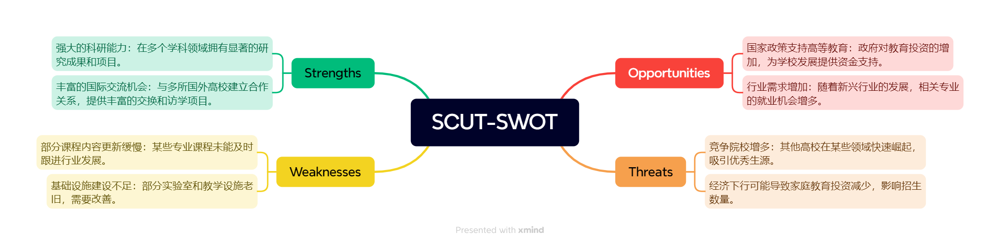
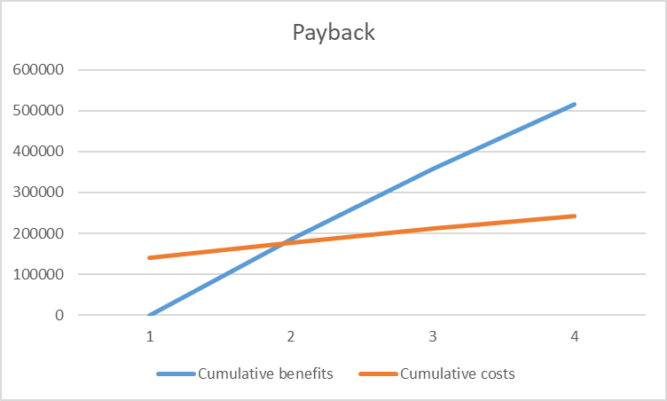
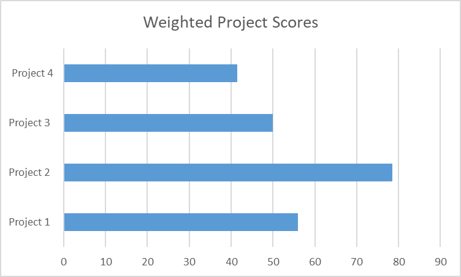

## 快速检测

1. a; 3. b; 5. c; 6. a;  8. a; 10. c  

## 练习题

### 2

为组织创建一个SWOT分析的思维导图。包括至少两个优势，劣势，机会和威胁，然后为至少三个潜在的项目提供想法。或者，你可以使用你的学院或大学进行SWOT分析，重点关注它可以做些什么来改善为学生提供的服务。

### 潜在项目想法

1. **课程更新与改革**：定期审核和更新课程内容，引入前沿技术与行业发展趋势。
2. **改善基础设施**：投资升级实验室和教学设备，提升学生的学习和研究体验。
3. **加强职业发展服务**：建立与企业的合作关系，提供更多实习和就业指导机会。

### 3

使用电子表格软件创建本文中的图4-4至图4-7。

 [图表4.4-4.7.xlsx](..\..\..\..\..\桌面\图表4.4-4.7.xlsx) 

#### 4.4

| Discount  rate | 10%      |        |        |        |        |         |
| -------------- | -------- | ------ | ------ | ------ | ------ | ------- |
|                |          |        |        |        |        |         |
| PROJECT 1      | YEAR 1   | YEAR 2 | YEAR 3 | YEAR 4 | YEAR 5 | TOTAL   |
| Benefits       | $0       | $2,000 | $3,000 | $4,000 | $5,000 | $14,000 |
| Costs          | $5,000   | $1,000 | $1,000 | $1,000 | $1,000 | $9,000  |
| Cash flow      | ($5,000) | $1,000 | $2,000 | $3,000 | $4,000 | $5,000  |
| NPV            | ¥2,316   |        |        |        |        |         |
|                |          |        |        |        |        |         |
|                |          |        |        |        |        |         |
| PROJECT 2      | YEAR 1   | YEAR 2 | YEAR 3 | YEAR 4 | YEAR 5 | TOTAL   |
| Benefits       | $1,000   | $2,000 | $4,000 | $4,000 | $4,000 | $15,000 |
| Costs          | $2,000   | $2,000 | $2,000 | $2,000 | $2,000 | $10,000 |
| Cash flow      | ($1,000) | $0     | $2,000 | $2,000 | $2,000 | $5,000  |
| NPV            | ¥3,201   |        |        |        |        |         |

#### 4.5

| Discount  rate                             | 8%       |         |         |         |         |      |
| ------------------------------------------ | -------- | ------- | ------- | ------- | ------- | ---- |
| Assume  the project is completed in Year 0 |          | Year    |         |         |         |      |
|                                            | 0        | 1       | 2       | 3       | Total   |      |
| Costs                                      | 140,000  | 40,000  | 40,000  | 40,000  |         |      |
| Discount factor                            | 1        | 0.93    | 0.86    | 0.79    |         |      |
| Discounted costs                           | 140,000  | 37,200  | 34,400  | 31,600  | 243,200 |      |
| Benefits                                   | 0        | 200,000 | 200,000 | 200,000 |         |      |
| Discount factor                            | 1        | 0.93    | 0.86    | 0.79    |         |      |
| Discounted benefits                        | 0        | 186000  | 172000  | 158000  | 516,000 |      |
| Discounted benefits - costs                | -140,000 | 148,800 | 137,600 | 126,400 | 272,800 | NPV  |
| Cumulative benefits - costs                | -140,000 | 8,800   | 146,400 | 272,800 |         |      |
|                                            |          |         |         |         |         |      |
| ROI                                        | 112%     |         |         |         |         |      |
|                                            |          |         |         |         |         |      |

#### 4.6

#### 4.7

| Criteria                                             | Weight | Project 1 | Project 2 | Project 3 | Project 4 |
| ---------------------------------------------------- | ------ | --------- | --------- | --------- | --------- |
| Supports key  business objectives                    | 25%    | 90        | 90        | 50        | 20        |
| Has strong  internal sponsor                         | 15%    | 70        | 90        | 50        | 20        |
| Has strong  customer support                         | 15%    | 50        | 90        | 50        | 20        |
| Uses realistic  level of technology                  | 10%    | 25        | 90        | 50        | 70        |
| Can be  implemented in one year or less              | 5%     | 20        | 20        | 50        | 90        |
| Provides  positive NPV                               | 20%    | 50        | 70        | 50        | 50        |
| Has low risk  in meeting scope, time, and cost goals | 10%    | 20        | 50        | 50        | 90        |
| Weighted  Project Scores                             | 100%   | 56        | 78.5      | 50        | 41.5      |

### 6

为项目管理计划制定一个大纲（只有主标题和副标题），为你的班级创建一个适合移动设备的网站，然后为介绍或概述部分填写细节。假设这个网站将包括一个主页，其中包含指向本课程教学大纲、课堂讲稿或其他教学信息的链接，指向本教科书网站的链接，指向其他包含项目管理信息的网站的链接，以及指向每个班级成员和未来班级的个人页面的链接。此外，还要包括一个公告板和聊天室功能，学生和老师可以在这里交换信息。假设你的导师是项目发起人，你是项目经理，你的同学是你的项目组，你有三个月的时间来完成这个项目。

#### 项目管理计划大纲

##### 1. 项目概述

   - 项目背景
   - 项目目标
   - 项目范围

##### 2. 项目团队

   - 项目发起人
   - 项目经理
   - 项目组成员

##### 3. 项目时间表
   - 项目里程碑
   - 任务分配
   - 时间管理

##### 4. 项目资源
   - 人力资源
   - 物质资源
   - 技术资源

##### 5. 项目风险管理
   - 风险识别
   - 风险评估
   - 风险应对策略

##### 6. 项目沟通计划
   - 沟通渠道
   - 会议安排
   - 报告格式

##### 7. 项目监控与评估
   - 进度监控
   - 质量评估
   - 成果反馈

##### 介绍或概述部分

在现代教育环境中，移动设备已成为学生获取信息和资源的主要工具。本项目旨在为我们的班级创建一个适合移动设备访问的网站，方便学生随时随地获取课程相关信息。网站将包括一个主页，提供以下功能：

- **课程教学大纲链接**：直接指向本课程的详细教学大纲，帮助学生了解课程要求和学习目标。
- **课堂讲稿或其他教学信息链接**：便于学生访问课堂讲稿及重要的学习资料，确保他们能够及时复习和准备。
- **教科书网站链接**：指向本教科书的官方网站，提供额外的学习资源和工具。
- **项目管理信息网站链接**：为学生提供进一步的项目管理知识和信息，促进学习和理解。
- **个人页面链接**：每个班级成员及未来班级的个人页面，将展示他们的简介和联系方式，便于相互沟通与合作。
- **公告板**：用于发布重要通知和更新信息，确保每位学生都能及时获取课堂消息。
- **聊天室功能**：为学生和老师提供实时交流的平台，促进信息交换和讨论。

在为期三个月的项目周期内，作为项目经理，我将和团队成员紧密合作，确保网站按时上线并满足所有需求。这一网站将大大提升我们班级的沟通效率和学习体验。

## 作业

### 3

为Global Treps项目准备一个商业案例。假设这个项目需要6个人几个月才能完成，需要大量参与者付出时间，软件、差旅、劳动力和硬件成本约为13万美元。使用本书的网站上的商业案例模板。一定要研究一下大学和其他团体举办的电视节目和活动的信息，这些都是由更成功的企业家举办的。也可以访问DonorsChoose.org,看看这个网站是如何运作，并且了解创建非营利组织的步骤。

### Global Treps项目商业案例
**日期：** 2024年9月24日

#### 项目名称：Global Treps - 移动友好的创业展示平台开发

---

#### 1.0 引言/背景
Global Treps项目旨在创建一个非营利组织，开发一个移动友好型网站和应用程序，以支持学校和组织举办类似于《创业圈》（Shark Tank）的创业展示活动。这些活动将为创业者提供一个展示其商业想法的平台，激励更多的创业精神。

#### 2.0 商业目标
本项目的主要目标是建立一个综合性平台，支持组织创业展示活动，同时促进创业者的成长。我们计划在项目期间举办多场活动，并开发相应的在线功能。

#### 3.0 当前状况及问题/机会声明
许多学校和组织在举办创业展示活动时面临资源和经验不足的问题。缺乏集中平台使得活动组织困难，参与者难以获取必要的支持。本项目将为此提供解决方案，推动全球创业活动的开展。

#### 4.0 关键假设和约束
- **假设**：项目能获得所需资金和支持，团队具备实施所需的技能。
- **约束**：项目预算限制在$130,000，需在六个月内完成。

#### 5.0 选项分析和推荐
- **自行开发网站和应用程序**：确保功能的定制化和用户体验优化。
- **与现有平台合作**：扩大资源利用。

**推荐**：选择自行开发以确保平台功能满足具体需求。

#### 6.0 初步项目需求
- **捐款功能**：接受潜在投资者的捐款，支持特定学校或组织的活动。
- **创意提交**：接受对新产品或服务的创意提案。
- **定制网站**：允许组织创建自己的网站，招募本地参与者和投资者，接受申请并宣传获奖和失败者。
- **收益分配机制**：研究捐赠和参赛者利润的一定比例回馈Global Treps组织的机制。
- **在线活动**：提供活动视频和现场反应，同时获取观众的实时反馈和捐款。

#### 7.0 预算估算和财务分析
**预计费用**：
- **网站和应用开发**：$80,000
- **市场推广和宣传**：$20,000
- **硬件和基础设施**：$10,000
- **差旅和其他**：$20,000

**总预算估计**：$130,000

#### 8.0 时间表估算
- **项目启动**：2024年10月1日
- **需求收集**：2024年10月
- **开发阶段**：2024年11月 - 2025年1月
- **测试和优化**：2025年2月
- **发布日期**：2025年3月1日

#### 9.0 潜在风险
- **参与人数不足**：提前宣传和吸引潜在参与者以缓解。
- **技术挑战**：建立强大的项目管理流程和定期测试机制。
- **预算超支**：通过严格监控预算和资源使用来控制。

### 5

建立一个经验教训登记册，记录从这个项目中学到的知识。包括经验教训,日期，来源，类别,描述，影响，建议和提议的行动。

### 经验教训登记册_(日期无意义、内容为结合实际经历进行演绎)

| 经验教训         | 日期          | 来源         | 类别     | 描述                                                   | 影响                                       | 建议                               | 提议的行动                                 |
| ---------------- | ------------- | ------------ | -------- | ------------------------------------------------------ | ------------------------------------------ | ---------------------------------- | ------------------------------------------ |
| 需求收集的重要性 | 2025年3月1日  | 项目团队会议 | 项目管理 | 在项目初期充分收集用户需求能确保最终产品符合用户期望。 | 提高用户满意度，减少后期修改的时间和成本。 | 在项目开始阶段进行详细的需求调研。 | 开展用户访谈和调查问卷以获取更多需求信息。 |
| 跨团队沟通       | 2025年2月15日 | 项目实施过程 | 团队协作 | 不同团队间的沟通不畅导致部分功能开发延误。             | 影响项目进度，造成时间延误。               | 建立定期跨团队沟通机制。           | 设立周会和月会以确保信息共享。             |
| 测试阶段的重要性 | 2025年2月25日 | 测试反馈     | 质量控制 | 提前测试发现问题可以降低后期修改成本。                 | 改善产品质量，增强用户体验。               | 在开发过程中进行阶段性测试。       | 建立测试计划并分配专门人员负责测试。       |
| 灵活的预算管理   | 2025年1月20日 | 财务审查     | 财务管理 | 预算超支主要由于未预见的技术问题和市场变化。           | 影响项目的财务健康和资源分配。             | 定期审查预算并留出应急资金。       | 制定灵活的预算计划并定期调整。             |
| 用户反馈机制     | 2025年3月5日  | 用户调查     | 用户体验 | 及时收集用户反馈有助于产品持续改进和优化。             | 提高用户满意度和产品的市场竞争力。         | 建立持续的用户反馈渠道。           | 创建用户反馈表单和定期用户访谈。           |

