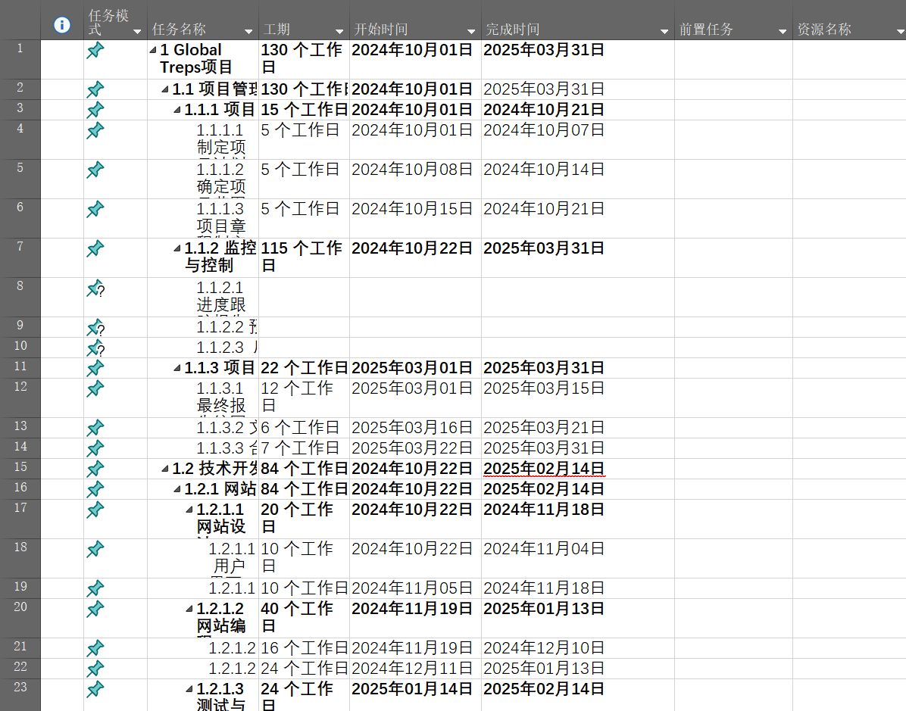

# 第五章作业

## 5.12快速检测1、3、4、5、7、10

1. c; 3. b; 4. d; 5. c; .7. b; 10. c  

## 5.14练习题4

使用Mierosoft Projeet 或类似软件，并适当缩进类别来创建与练习3相同的 WBS。使用大纲翁号办能显示大纲编号，或手动输入编号。不要输人任何持续时间或依赖关系。有关构建WBS 的说明，请参见附录A 或Project 2016 的帮助部分。将做出的甘特图打印在一张纸上，同时确保能展示出个任务名称栏。

## 5.16作业

### 1

记录你收集项目需求的方法。在需求跟踪矩阵中包括至少5种技术需求和5种非技术需求。还要制定一份清单，列出至少5个你想询问项目发起人的问题。如果方便的话，可以请你的导师为你解答。

#### 收集项目需求的方法

1. **访谈与会议**：与项目的主要利益相关者进行一对一的访谈，包括Dr. K、鲍比和其他团队成员，以获取他们对项目的视角和预期。
2. **工作坊**：组织工作坊，邀请所有团队成员共同讨论项目目标、预期的功能、潜在的问题等。
3. **问卷**：向其他潜在的用户和参与者发送问卷，收集他们对于类似活动的期待和需求。
4. **市场调研**：研究类似项目和平台，如DonorsChoose.org，了解它们的功能、用户反馈和业务模型。
5. **原型评估**：早期开发网站的原型，通过内部测试和小范围用户反馈获取初步评估。

#### 需求跟踪矩阵

##### 技术需求
1. **网站定制与编程**：网站能够支持自定义创建活动页面，接受申请，并推广活动。
2. **捐赠处理功能**：集成第三方支付处理系统，以便接受和处理捐赠。
3. **视频内容管理**：开发一个管理视频内容的系统，允许用户轻松上传和编辑视频。
4. **多国语言支持**：网站应支持英语、越南语、印地语和阿姆哈拉语。
5. **移动设备兼容性**：网站必须在各种设备上表现良好，包括手机和平板电脑。

##### 非技术需求
1. **用户培训材料**：为用户提供详细的操作手册和在线培训视频。
2. **国际活动支持**：项目必须能够支持在多个国家同时举办活动。
3. **预算管理**：确保活动的总体预算不超过设定的12万美元。
4. **项目监管**：建立一个项目管理框架，监控进度和财务状况。
5. **合规性与安全**：确保所有捐赠处理和数据管理遵守相关的法律和政策。

#### 项目发起人问题清单

1. **项目的主要目标和预期成果是什么？**
2. **对于网站功能有哪些具体的要求或预期？**
3. **项目最关键的成功因素有哪些？**
4. **关于项目预算分配，您有什么具体的想法或限制吗？**
5. **您对于团队合作和沟通有什么具体的期待或要求？**

### 3

为项目创建一个工作分解结构，将工作恰当地分解至第3级或第4级。使用本书配套网站上的模板和本章中的示例作为指南，以列表形式打印WBS。确保 WBS 是以项目章程（见第4章中的实践案例）、作业2创建的项目范围说明书以及其他相关的信息为基础的。

