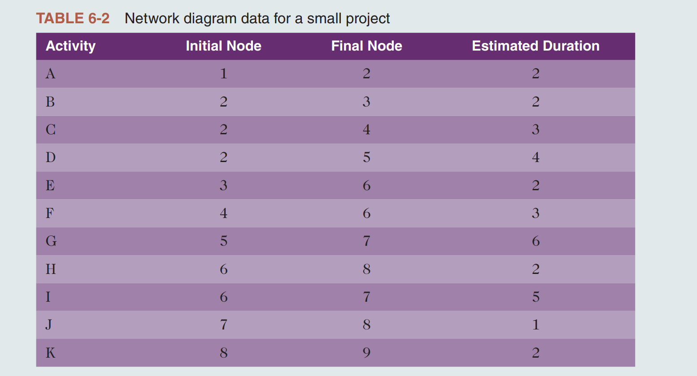
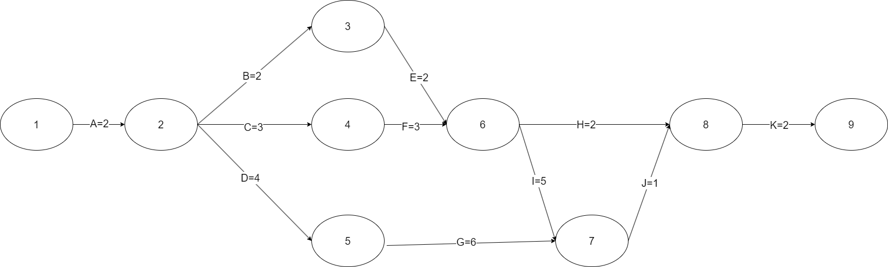
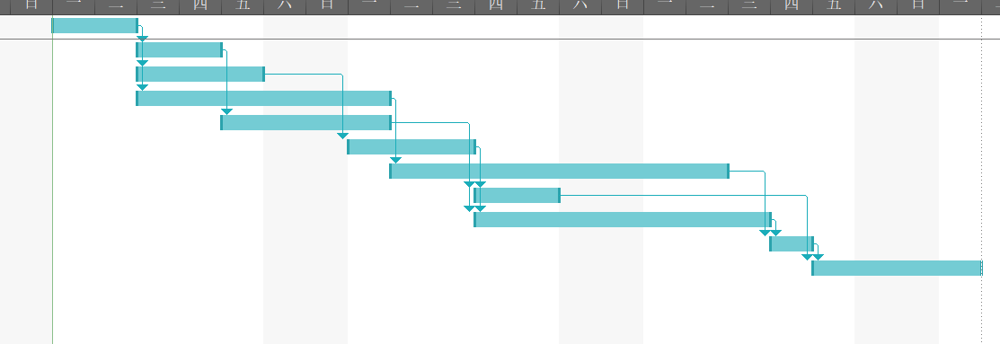
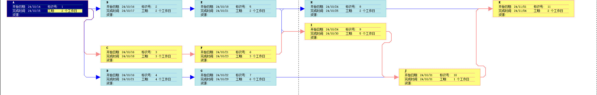

## 快速测验

1. a; 2. d;  4. a; 5. b;8. c; 9. d; 10. d  

## 讨论题

### 4

Explain the difference between estimating activity durations and estimating the effort required to perform an activity

1. duration：包括在活动上工作的实际时间加上经过的时间。例如，即使可能需要一个工作周或五个工作日来完成实际工作，持续时间估计可能是两周，以允许获得外部信息所需的额外时间。分配给任务的人员或资源也会影响任务持续时间的估计。再举一个例子，如果有人问你预计什么时候能读完一本特定的书，你可能会给出两个月的答案。两个月将是持续时间的估计，即使你只计划花20个小时真正阅读这本书。
2. effort：是指完成一项任务所需的工作日或工作时间。比如您可能计划花20个小时阅读一本书一一这是工作量估计一一并将时间分散到两个月一一这是持续时间。

### 10

How is schedule management different when using an agile approach?  

工作可以根据原始的系统需求规范被组织成用户故事。每个用户故事根据难度分配了一定数量的故事点。在每个周期的冲刺开始时，开发团队确定在每个冲刺期间要做哪些用户故事。在每次冲刺结束时，不管是否完成了所有的工作，团队都需要演示系统，但只有通过测试（由客户批准)的用户故事才会被报告为完成。如果用户描述没有完成，它们就会被移到产品待事项列表中。这种方法帮助团队专注于在指定的时间框架内交付满足客户需求的工作系统。换句话说，重点是在短时间内为客户完成一些有用的工作，而不是试图首先定义所有需要的工作，然后安排什么时候可以完成。

## 练习题

### 2

Consider Table 6-2.All duration estimates or estimated times are in days,and the network proceeds from Node 1 to Node 9.(Note that you can easily change this table to create multiple exercises.)

1. Draw an AOA network diagram representing the project. Put the node numbers in circles and draw arrows from node to node, labeling each arrow with the activity letter and estimated time.

   

2. Identify all of the paths on the network diagram and note how long they are, using Figure 6-8 as a guide for how to represent each path.

   Path 1: A-B-E-H-K  Length =2+2+2+2+2=10

   Path 2: A-B-E-I-J-K Length =  2+2+2+5+1+2=14

   Path 3: A-C-F-H-K Length =  2+3+3+2+2=12

   Path 4: A-C-F-I-J-K Length =2+3+3+5+1+2=16

   Path 5: A-D-G-J-K Length =2+4+6+1+2=15

3. What is the critical path for this project and how long is it?

   Since the critical path is the longest path through the network diagram, Path 4, A-C-F-I-J-K, is the critical path for the project.

   Length is 16

4. What is the shortest possible time needed to complete this project?

​	项目最短时间取决于关键路径的时间，在此图中，关键路径为16，相应的最短时间也是16

### 4

Enter the information from Exercise 2 into Project 2016. View the network diagram and task schedule table to see the critical path and float or slack for each activity. Print the Gantt chart and network diagram views and the task schedule table. Write a short paper that interprets this information for someone unfamiliar with project schedule management

| 任务模式 | 任务名称 | 工期       | 开始时间       | 完成时间       | 前置任务 |
| -------- | -------- | ---------- | -------------- | -------------- | -------- |
| 手动计划 | A        | 2 个工作日 | 2024年10月14日 | 2024年10月15日 |          |
| 手动计划 | B        | 2 个工作日 | 2024年10月16日 | 2024年10月17日 | 1        |
| 手动计划 | C        | 3 个工作日 | 2024年10月16日 | 2024年10月18日 | 1        |
| 手动计划 | D        | 4 个工作日 | 2024年10月16日 | 2024年10月21日 | 1        |
| 手动计划 | E        | 2 个工作日 | 2024年10月18日 | 2024年10月21日 | 2        |
| 手动计划 | F        | 3 个工作日 | 2024年10月21日 | 2024年10月23日 | 3        |
| 手动计划 | G        | 6 个工作日 | 2024年10月22日 | 2024年10月29日 | 4        |
| 手动计划 | H        | 2 个工作日 | 2024年10月24日 | 2024年10月25日 | 5,6      |
| 手动计划 | I        | 5 个工作日 | 2024年10月24日 | 2024年10月30日 | 5,6      |
| 手动计划 | J        | 1 个工作日 | 2024年10月31日 | 2024年10月31日 | 7,9      |
| 手动计划 | K        | 2 个工作日 | 2024年11月01日 | 2024年11月04日 | 8,10     |

黄色为关键路径

1. **任务A**: 开始于2024年10月14日，持续2个工作日，结束于2024年10月15日。
2. **任务B、C、D**: 在任务A完成后开始。任务B和C开始于2024年10月16日，B任务持续2天，C任务持续3天。任务D也从同一天开始，持续4天。
3. **任务E**：依赖任务B完成，于2024年10月18日开始，持续2天。
4. **任务F**：依赖任务C完成，从2024年10月21日开始，持续3天。
5. **任务G**：依赖任务D完成，从2024年10月22日开始，持续6天。
6. **任务H和I**：依赖任务E和F完成，分别于2024年10月24日开始，H任务持续2天，I任务持续5天。
7. **任务J**：依赖任务G和I完成，仅在2024年10月31日进行，持续1天。
8. **任务K**：依赖任务H和J完成，从2024年11月1日开始，持续2天。

关键路径是项目中时间最长的连续任务链，任何这条路径上的延迟都会直接导致项目总期限的延迟。在此项目中，关键路径为Path 4: A-C-F-I-J-K Length =2+3+3+5+1+2=16

