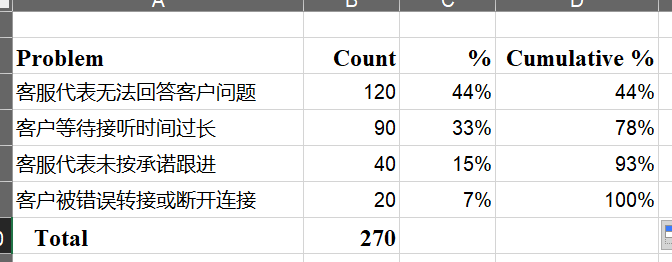
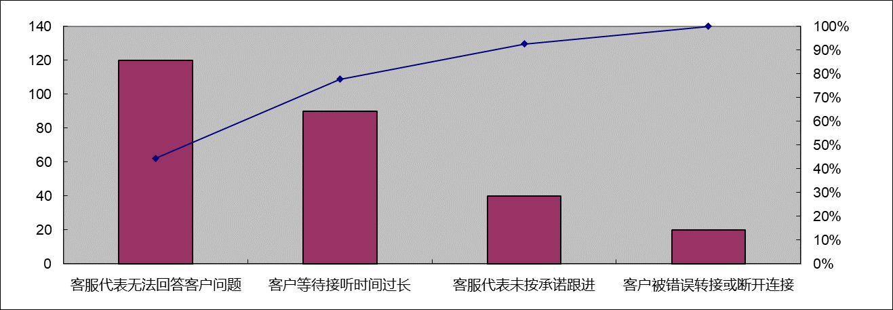

## 快速测验

1. a; 2. c; 3. d; 5. b; 6. c; 7. b; 8. a; 9. b; 10. c  

## 讨论题

### 2

What are the main processes in project quality management?  

1. 质量管理规划包括确定哪些质量要求和标准与项目相关，以及如何满足它们。将质量标准纳入项目设计是质量规划的关键部分。对于IT项目，质量标准可能包括允许系统扩张，为系统规划合理的响应时间，或者确保系统产生一致和准确的信息。质量标准也适用于IT服务。例如，可以设定从服务台得到回复需要多长时间的标准，或者在保修的时候，运输硬件的替换更换部件需要多长时间的标准。质量管理计划的主要输出是质量管理计划、质量标准、项目管理计划的跟新和项目文件的更新。常见度量标准的例子包括产品的故障率、商品和服务的可用性以及客户满意度评级。
2. 质量管理包括将质量管理计划转化为可执行的质量活动。这些活动必须遵守组织的质量方针。该过程的主要输出是质量报告、测试和评价文件、变更请求、项目管理计划更新和项目文件更新。
3. 控制质量包括监视特定的项目结果，以确保它们是完整的、正确的，并满足客户的期望。这个过程通常与质量管理的技术工具和技巧有关，如帕累托图、质量控制图和统计抽样。质量控制的主要输出包括质量控制度量、已验证的可交付成果、工作绩效信息、变更请求、项目管理计划的更新和项目文档的更新。

### 3

Why is quality management becoming more important? What does it mean to use lean in quality assurance

在质量管理中，详细的流程指定可以确保产品和服务符合各种质量要求，并且公司迫于竞争，其不得不以有竞争力的价格提供这些产品和服务。在当今竞争激烈的商业环境中，优秀的公司会发展自己的最佳实践，并评估其他组织的最佳实践，以不断改进自己的经营方式。

制定确保项目质量的计划是一回事，确保交付高质量的产品和服务是另一回事。质量保证（quality assurance）一词通常用来描述与满足项目的相关质量标准有关的活动。管理质量包括所有的质量保证活动加上产品设计和过程改进。管理质量的主要输入是质量管理计划、项目文件和相关资源配置。

在质量保证（QA）中的精益生产(lean)将改进计划的重点从单个浪费或活动转移到通过整个QA过程创造流程上。进而通过可视化管理创造出稳健、迅速的流程，这些流程能够以最高效的方式发挥作用直到目标发布。这种方法显著增强生产力，并改善交付时间、一次通过率（RFT）和合规性。

### 5

What are benchmarks, and how can they assist in performing quality assurance? Describe typical benchmarks associated with a college or university.

标杆分析法 就是将本企业各项活动与从事该项活动最佳者进行比较，从而提出行动方法，以弥补自身的不足。Benchmarking是将本企业经营的各方面状况和环节与竞争对手或行业内外一流的企业进行对照分析的过程，是一种评价自身企业和研究其他组织的手段，是将外部企业的持久业绩作为自身企业的内部发展目标并将外界的最佳做法移植到本企业的经营环节中去的一种方法。实施benchmarking的公司必须不断对竞争对手或一流企业的产品、服务、[经营业绩](https://baike.baidu.com/item/经营业绩/12742310?fromModule=lemma_inlink)等进行评价来发现优势和不足。

标杆管理通过将特定的项目实践或产品特性与执行组织内外的其他项目或产品的实践或特性进行比较，产生质量改进的想法。例如，如果竞争对手的平均每周停机时间只有一小时，那么这可能是一个值得努力的基准。

大学典型标准：

1. **教育质量基准**：涉及学生的学业成绩、课程完成率、毕业率和学生保留率。
2. **研究产出**：包括研究资金的获取、研究论文发表的数量和质量、研究引用量等。
3. **学生满意度与参与度**：通过定期的调查和反馈机制，学院可以衡量学生对课程内容、教学方法、设施和服务的满意程度。
4. **就业相关基准**：包括毕业生的就业率、起薪水平以及与所学专业相关的职业发展情况。这些信息对评估教育成果在实际职场的应用非常关键。
5. **设施和资源的投资**：例如图书馆的资源、实验室的设施、学术和生活支持服务的质量。

## 练习题

### 2

Create a Pareto chart based on the information in the following table. First, create a spreadsheet in Excel using the data in the table. List the most frequent customer problems first. Use the Excel template called pareto@chart.xls on the text’s Companion website and check your entries so your resulting chart looks similar to the one in Figure 8-7. If you need assistance creating the chart, search for videos describing how to create Pareto charts using Excel.

| Customer Complaints Customer is on hold too long   | Frequency/Week90 |
| -------------------------------------------------- | ---------------- |
| Customer gets transferred to wrong area or cut off | 20               |
| Service rep cannot answer customer’s questions     | 120              |
| Service rep does not follow through as promised    | 40               |

### 6

Research information on performing quality assurance using lean. How can lean be used on IT projects? How can you use kanban cards, a lean tool, to maximize customer value while minimizing waste?

精益生产起源于制造业，但其基本原则同样适用于IT项目。**价值最大化、浪费最小化**是精益生产的核心理念。IT项目中的浪费包括多余的功能、不必要的文档、延迟、缺陷和未完成的工作等。通过精益生产，团队能够更好地识别和消除这些浪费，从而提高整体效率和质量。

1. 价值识别：在IT项目中，价值是由客户定义的。开发团队需要明确哪些功能和特性对客户最为重要，并集中资源开发这些高价值的部分。
2. 流动管理：精益生产强调工作流程的平稳流动。在软件开发过程中，可以采用持续集成和持续交付（CI/CD）方法，确保代码在整个开发周期中不断地集成和测试，从而减少周期时间和提高交付速度。
3. 持续改进：精益生产倡导持续改进（Kaizen），鼓励团队不断反思和优化工作流程。通过定期的回顾会议和反馈循环，团队可以识别问题、提出改进措施，并迅速实施。

Knaban board来自于Kanban方法，是一种敏捷的项目管理工具，旨在帮助可视化工作、限制进行中的工作并最大限度地改善效率（或流程）。它可以帮助敏捷团队和DevOps团队在日常工作中建立秩序。Kanban board中使用卡片和列，持续改善和帮助技术和服务团队通过适量的投入来完成工作。

1. **最大化客户价值**：
   1. **优先排序**：通过优先处理最能带来客户价值的任务，确保团队首先关注对客户最重要的功能或问题。

   2. **反馈循环**：定期与客户交流，确保项目符合他们的期望并及时调整方向。

2. **最小化浪费**：
   1. **限制进行中的工作**：看板通过限制在特定时间内进行中的工作数量来帮助团队集中精力，避免过载，从而减少循环时间和浪费。
   2. **可视化流程**：看板板提供了一个清晰的视觉表示，显示各个任务的状态，帮助识别瓶颈和浪费，如等待时间或不平衡的工作负载。

