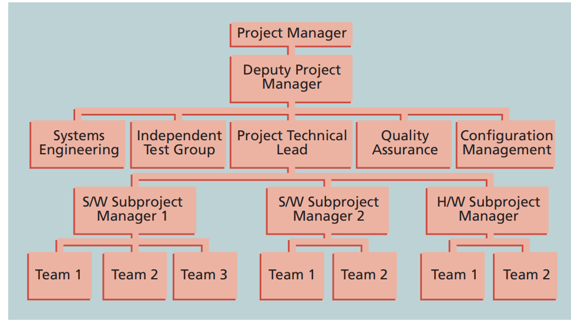
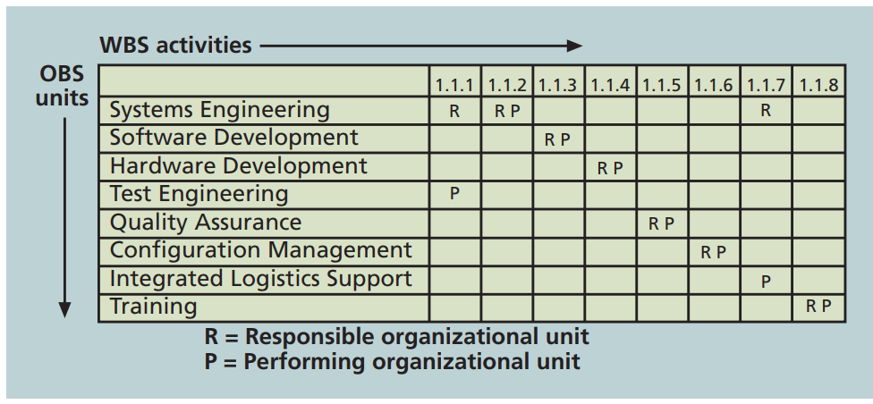
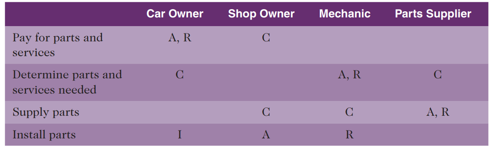
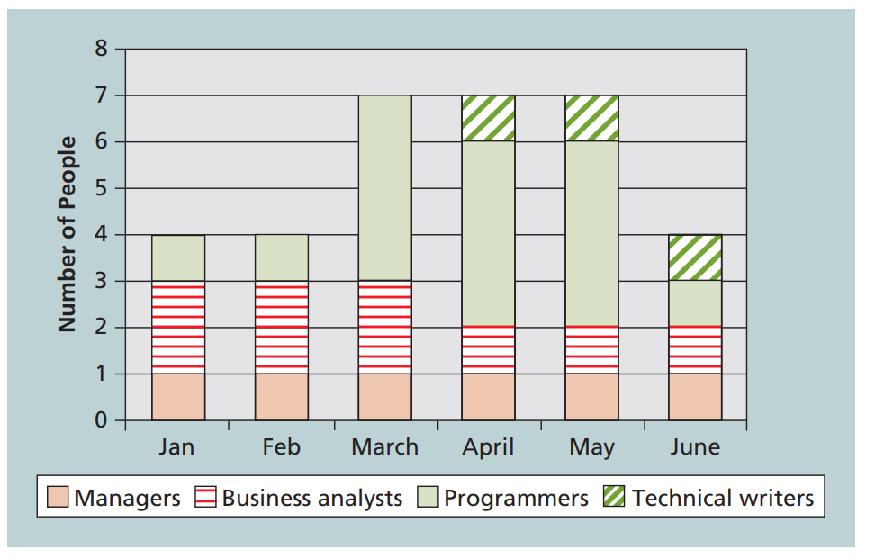
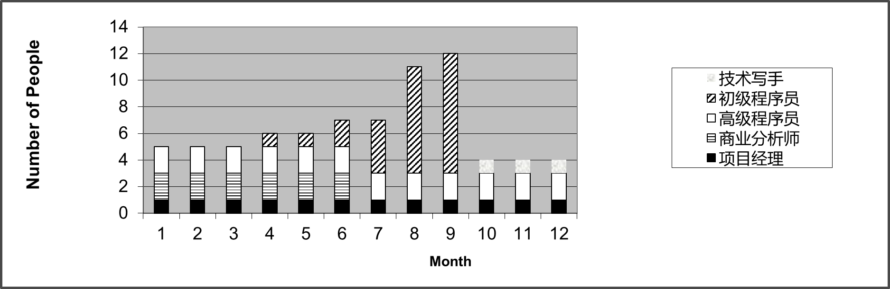

[TOC]

## 讨论题

### 4

What is emotional intelligence (EI)? Why is it important to develop EI skills?  

EI是一种自我情绪控制能力的指数，由美国心理学家彼得·沙洛维于1991年创立，属于发展心理学范畴。情商是一种认识、了解、控制情绪的能力或者是理解他人情感以改善自身表现的能力。但也有人质疑情商是否是一种智力能力的扩展表现。跟智商不一样，情绪商数可以经过指导而有改善。

一些文章和书籍表明做为项目经理发展他们的情绪智力(EI)非常重要。例如，Anthony C.Mersino,PMP,《项目经理的情商：你需要取得杰出成果的人际技能》一书的作者，提及EI在项目经理致力于团队建设、协作、谈判和关系发展时能够发挥重要作用。EI也正在成为更受人追捧的特点。根据CareerBuilder..com对2600多名美国招聘经理和人力资源专业人士的调查:

1. 71%的受访者表示，他们更看重员工的EI而不是IQ;
2. 59%的人说他们不会雇佣IQ高但EI低的人;
3. 75%的人表示，他们更有可能提拔EI高的员工，而不是智商高的员工.

### 6

Describe situations in which it would be appropriate to create a project organizational chart, a responsibility assignment matrix, a RACI chart, and a resource histogram. Describe what these charts or matrices look like.

#### project organizational chart

在确定了项目所需的重要技能和人员类型后，项目经理应与高层管理人员和项目团队成员合作，为项目创建组织结构图。

例如，在本章开头的案例中，一个项目经理可能负责与F-44飞机相关的每一个项目，而飞机的每个主要部件，比如雷达系统，可能都有自己专门的项目经理。请注意，项目人员包括项目副经理、子项目经理和团队。图表上的其他方框表示支持项目的每个职能部门，如系统工程质量保证和配置管理，以及外部独立的测试组。副项目经理负责管理一个大型项目可能被划分成的子项目。

####  responsibility assignment matrix

在开发了OBS之后，项目经理可以开发一个责任分配矩阵。职责分配矩阵(RAM)将WBS中描述的项目工作映射到负责执行工作的人员，如OBS中描述的那样。

RAM根据所需的详细程度将工作分配给负责和执行的组织、团队或个人。对于较小的项目，最好将个人分配到WBS活动中。对于非常大的项目，将工作分配给组织单位或团队会更有效。

#### RACI chart

RACI图表可以用来显示项目干系人的四个关键作用：

1. 责任：谁来负责这个任务？
2. 授权：谁签署？谁负责？
3. 咨询：谁有完成任务的关键信息
4. 通知：谁需要被告知让任务状态和结果

例如，一个机械师负责修理一辆汽车，但店主负责把修理工作做好。车主和零件供应商可能是其他利益相关者，他们在不同的工作活动中扮演着不同的角色，如表所示。项目经理可以使用RACI代码或任何其他代码来帮助澄清不同组织单位或特定涉众在完成工作中所扮演的角色

#### resource histogram

（staffing management plan ）人员配置管理计划描述了何时以及如何将人员添加到项目团队和从项目团队中撤出。详细程度可能因项目类型而异。例如，如果一个项目预计在一年内平均需要100人，那么人员配置管理计划将描述在项目中工作所需的人员类型，例如Java程序员、业务分析师和技术作家，以及每个月所需的每种类型的人员数量。该计划还将描述如何在项目结束后获得、培训、奖励和重新分配这些资源。所有这些问题对于满足项目、员工和组织的需求都很重要。

人员配备管理计划通常需要一个资源直方图（resource histogram），是一种柱状图，显示了随着时间的推移分配给项目的资源数量。下图提供了一个可能用于六个月IT项目的直方图示例。这些列表示每个领域所需的人员数量一经理、业务分析师、程序员和技术作家。通过堆这些列，可以看到每个月所需的总人数。还可以为物理资源创建一个资源直方图。例如，如果一个项目涉及大量的培训，那么就需要规划该部分项目所需的教室空间和用品。在确定了资源需求之后项目资源管理的下一步就是获取资源。

### 7

Discuss the difference between resource loading and resource leveling, and provide an example of when you would use each technique.

resource loading是指一段特定时间内存在的任务对单种的资源的需求量；其帮助项目经理了解项目对组织资源和个人日程安排的需求。项目经理经常使用资源直方图，来描述资源负载在各个时期的变化。资源直方图对确定资源需求或确定人员配备问题方面非常有帮助。

resource leveling是一种资源管理者通过平滑进度（推迟）来解决资源冲突的技术。例如可以通过延迟非关键任务来消除过度分配，并且不导致总体进度延迟；此外，可以将需要延迟项目完成日期以减少或消除超额分配。

因此resource leveling是通过在允许范围调控任务，来最小化resource loading的阶段性变化。

## 练习题

### 3

| Resource   | 1    | 2    | 3    | 4    | 5    | 6    | 7    | 8    | 9    | 10   | 11   | 12   |
| ---------- | ---- | ---- | ---- | ---- | ---- | ---- | ---- | ---- | ---- | ---- | ---- | ---- |
| 项目经理   | 1    | 1    | 1    | 1    | 1    | 1    | 1    | 1    | 1    | 1    | 1    | 1    |
| 商业分析师 | 2    | 2    | 2    | 2    | 2    | 2    | 0    | 0    | 0    | 0    | 0    | 0    |
| 高级程序员 | 2    | 2    | 2    | 2    | 2    | 2    | 2    | 2    | 2    | 2    | 2    | 2    |
| 初级程序员 | 0    | 0    | 0    | 1    | 1    | 2    | 4    | 8    | 9    | 0    | 0    | 0    |
| 技术写手   | 0    | 0    | 0    | 0    | 0    | 0    | 0    | 0    | 0    | 1    | 1    | 1    |

### 7

Research recruiting and retention strategies at three different companies. Make sure that the strategies use contrasting approaches. For example, ànd out how Google treats its workers, and compare the approach with that of Foxconn or another company in the news.What distinguishes one company from another in this area? Are strategies such as signing bonuses, tuition reimbursement, and business casual dress codes standard for new IT workers? What strategies appeal most to you? Summarize your ideas in a short paper that cites at least three references.

在招聘和保留人才方面，不同公司采取的策略各异。以Google为例，该公司以提供丰厚的薪酬和福利，创新的工作环境以及职业发展机会而著称，这有助于吸引并留住顶尖人才。Google的招聘过程非常严格，候选人需通过多轮面试，并经常涉及智力挑战和问题解决能力的测试。并且Google非常重视企业文化的契合度，寻找具有“Google性格”的人才，即具备较高的智力、谦逊品德和团队合作精神的人。

与之不同，一些制造业公司如Foxconn，则可能更加注重技能和经验，以及能够适应快速、高压的生产环境的能力。这些公司可能更多地依赖于直接的技术水平和生产效率，而不适合Google那样的奖金福利和创新激励措施。

在IT行业，常见的招聘和保留策略包括签约奖金、学费报销和更加自由的着装要求等。这些策略可以提高职位的吸引力，增加员工的忠诚度和满意度。例如，学费报销可以吸引那些希望继续从事教育和专业发展的应聘者。

对我个人而言，最吸引人的策略是那些支持职业成长和个人发展的措施，如提供继续教育的机会、职业发展计划以及健康和福利的综合支持。这些措施不仅能提高员工的满意度和忠诚度，也有助于其个人职业成长，从而为公司创造更多的价值。

## 快速检验

1、2、3、4、5、6、7、8、9、10

1. a; 2. a; 3. d; 4. c; 5. b; 6. d; 7. c; 8. b; 9. a; 10. b  