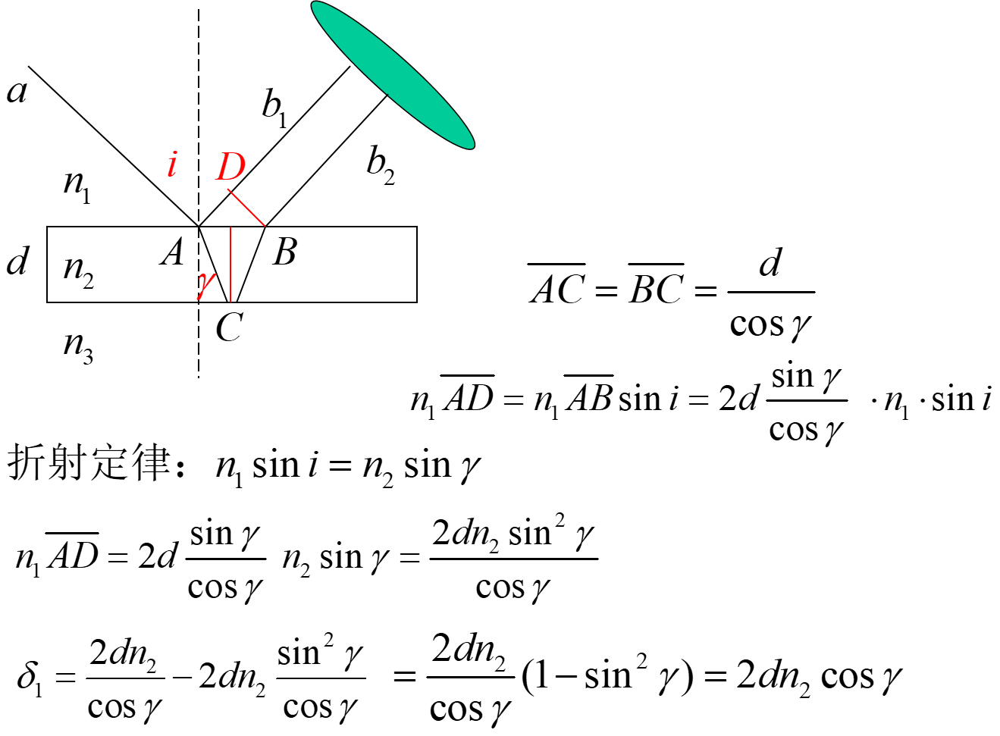
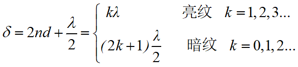

# 机械波

## 和差化积公式

$$
cosa + cosb = 2cos\frac{a + b}{2}cos\frac{a - b}{2}\\
sina + sinb = 2sin\frac{a + b}{2}cos\frac{a - b}{2}\\
cosa - cosb = -2sin\frac{a + b}{2}sin\frac{a - b}{2}\\
sina + sinb = 2sin\frac{a + b}{2}cos\frac{a - b}{2}
$$

## 波函数

存在某个简谐波，某时刻的波形如图所示

- 沿着传播方向较为领先，相位超前，振动时间较少 ，相位要减，这是13号点，假设O点的相位为

- 设的参考点不在原点O处质点，而是在距原点O处为x的点上，其振动方程为
  $$
  y_{x_0}=A\cos(\omega t+\phi)
  $$
  那么相应的波函数为式中，减号对应波沿x轴正方向传播，加号对应波沿x轴负方向传播
  $$
  y=A\cos[\omega(t\pm\frac{x-x_0}{u})+\phi]
  $$
  应当注意的是，无论是**横波还是纵波，皆可用上述波函数**表示。对于横波，质点离开平衡位置的位移y与波的传播方向x轴垂直：而对于纵波，位移y沿x轴方向。

  某个质点的振动*ω*和整个波函数的*ω*相同

## 机械波的能量

- 在波的传播过程中，波传播路径上任一小段质量元dx的动能、势能和总能量都随时间t做周期性变化，并且质量元的动能和势能与时间关系式是相同的，**两者不仅同相，而且大小总是相等**的。
- 即两者**同时达到最大值，又同时变为零**。这与孤立的做简谐运动的弹簧振子的能量情况是截然不同的，后者动能最大时，势能为最小；势能最大时，动能为最小。产生这种不同的原因是在波动中与势能相联系的是质点的相对位移质量元的形变。
- 某一给定点来说，**总能量随t做周期性**变化。这说明沿着波传播的方向，每**一体积元先从后面体积元处获得能量，使自己的能量逐渐增大，又逐渐地把自身的能量传递给前面的体积元**。形象地说，就是任一体积元都在不断地接受或放出能量，这就是波动传播能量的机理。

### 弹性体的形变规律-模量

- 拉伸、压缩形变

## 干涉波

当两个同频率同介质中，波源干涉叠加后，某点振幅是增强还是取决于两个波源在该点的相位差，相位差为**奇数个pi则相消**，**偶数个半周期为相增大**（如何通过波长数计算则需要注意波源初相位是否是同相）

### 驻波

态或相位逐点传播。这时既看不到波形的传播，也没有能量的传播。严格地说，**驻波并不是振动的传播，而是某一有限区域的介质中各质元做稳定的振动**，因此它与我们前面所说的向前传播振动状态或能量的所谓行波不同，所以称之为驻波。

#### 7.6.1驻波的产生

振幅、频率、传播速度都相同的两列相干波，同一条直线沿相反方向传播叠加而成==特殊的干涉

#### 7.6.2驻波方程

**线性波公式为y=Acos[ω (t-x/u)+φ]，其传播方向为x轴正方向**
**若为y=Acos[ω (t+x/u)+φ]，其传播方向为x轴负方向**
$$
正向： y_1=A\cos(\omega t-2\pi\frac{x}{\lambda})
正向： y_1=A\cos(\omega t-\omega\frac{x}{u})
$$

$$
负向：y_2=A\cos(\omega t+2\pi\frac{x}{\lambda})
$$

$$
y=y_1+y_2
 =2A\cos2\pi\frac{x}{\lambda}\cos\omega t
$$

驻波的振幅和位置有关、个点在做同频率的简谐运动

波腹、波节

相邻两波节之间质点振动同相位，任一波节两侧振动相位相反，在波节处产生 **π**的相位跃变(与行波不同，无相位的传播)

#### 初相位不为0

<msub><mi>y</mi><mn>1</mn></msub><mo>=</mo><msub><mi>A</mi><mn>1</mn></msub><mi>cos</mi><mo>&amp;#x2061;</mo><mo stretchy=&quot;false&quot;>(</mo><mi>&amp;#x03C9;</mi><mi>t</mi><mo>&amp;#x2212;</mo><mi>k</mi><mi>x</mi><mo>+</mo><msub><mi>&amp;#x03C6;</mi><mrow class=&quot;MJX-TeXAtom-ORD&quot;><mn>10</mn></mrow></msub><mo stretchy=&quot;false&quot;>)</mo></math>" role="presentation"><svg xmlns:xlink="http://www.w3.org/1999/xlink" width="27.3ex" height="2.725ex" viewBox="0 -852.5 11754.2 1173.4" role="img" focusable="false" aria-hidden="true" style="vertical-align: -0.745ex;"><g stroke="currentColor" fill="currentColor" stroke-width="0" transform="matrix(1 0 0 -1 0 0)"><use xlink:href="#MJMATHI-79" x="0" y="0"></use><use transform="scale(0.707)" xlink:href="#MJMAIN-31" x="693" y="-213"></use><use xlink:href="#MJMAIN-3D" x="1222" y="0"></use><g transform="translate(2278,0)"><use xlink:href="#MJMATHI-41" x="0" y="0"></use><use transform="scale(0.707)" xlink:href="#MJMAIN-31" x="1061" y="-213"></use></g><g transform="translate(3649,0)"><use xlink:href="#MJMAIN-63"></use><use xlink:href="#MJMAIN-6F" x="444" y="0"></use><use xlink:href="#MJMAIN-73" x="945" y="0"></use></g><use xlink:href="#MJMAIN-28" x="4989" y="0"></use><use xlink:href="#MJMATHI-3C9" x="5378" y="0"></use><use xlink:href="#MJMATHI-74" x="6001" y="0"></use><use xlink:href="#MJMAIN-2212" x="6584" y="0"></use><use xlink:href="#MJMATHI-6B" x="7585" y="0"></use><use xlink:href="#MJMATHI-78" x="8106" y="0"></use><use xlink:href="#MJMAIN-2B" x="8901" y="0"></use><g transform="translate(9902,0)"><use xlink:href="#MJMATHI-3C6" x="0" y="0"></use><g transform="translate(654,-150)"><use transform="scale(0.707)" xlink:href="#MJMAIN-31"></use><use transform="scale(0.707)" xlink:href="#MJMAIN-30" x="500" y="0"></use></g></g><use xlink:href="#MJMAIN-29" x="11364" y="0"></use></g></svg><math xmlns="http://www.w3.org/1998/Math/MathML"><msub><mi>y</mi><mn>1</mn></msub><mo>=</mo><msub><mi>A</mi><mn>1</mn></msub><mi>cos</mi><mo>⁡</mo><mo stretchy="false">(</mo><mi>ω</mi><mi>t</mi><mo>−</mo><mi>k</mi><mi>x</mi><mo>+</mo><msub><mi>φ</mi><mrow class="MJX-TeXAtom-ORD"><mn>10</mn></mrow></msub><mo stretchy="false">)</mo></math>y_1=A_1\cos(\omega t-kx+\varphi_{10}) 和 <msub><mi>y</mi><mn>2</mn></msub><mo>=</mo><msub><mi>A</mi><mn>2</mn></msub><mi>cos</mi><mo>&amp;#x2061;</mo><mo stretchy=&quot;false&quot;>(</mo><mi>&amp;#x03C9;</mi><mi>t</mi><mo>+</mo><mi>k</mi><mi>x</mi><mo>+</mo><msub><mi>&amp;#x03C6;</mi><mrow class=&quot;MJX-TeXAtom-ORD&quot;><mn>20</mn></mrow></msub><mo stretchy=&quot;false&quot;>)</mo></math>" role="presentation"><svg xmlns:xlink="http://www.w3.org/1999/xlink" width="27.3ex" height="2.725ex" viewBox="0 -852.5 11754.2 1173.4" role="img" focusable="false" aria-hidden="true" style="vertical-align: -0.745ex;"><g stroke="currentColor" fill="currentColor" stroke-width="0" transform="matrix(1 0 0 -1 0 0)"><use xlink:href="#MJMATHI-79" x="0" y="0"></use><use transform="scale(0.707)" xlink:href="#MJMAIN-32" x="693" y="-213"></use><use xlink:href="#MJMAIN-3D" x="1222" y="0"></use><g transform="translate(2278,0)"><use xlink:href="#MJMATHI-41" x="0" y="0"></use><use transform="scale(0.707)" xlink:href="#MJMAIN-32" x="1061" y="-213"></use></g><g transform="translate(3649,0)"><use xlink:href="#MJMAIN-63"></use><use xlink:href="#MJMAIN-6F" x="444" y="0"></use><use xlink:href="#MJMAIN-73" x="945" y="0"></use></g><use xlink:href="#MJMAIN-28" x="4989" y="0"></use><use xlink:href="#MJMATHI-3C9" x="5378" y="0"></use><use xlink:href="#MJMATHI-74" x="6001" y="0"></use><use xlink:href="#MJMAIN-2B" x="6584" y="0"></use><use xlink:href="#MJMATHI-6B" x="7585" y="0"></use><use xlink:href="#MJMATHI-78" x="8106" y="0"></use><use xlink:href="#MJMAIN-2B" x="8901" y="0"></use><g transform="translate(9902,0)"><use xlink:href="#MJMATHI-3C6" x="0" y="0"></use><g transform="translate(654,-150)"><use transform="scale(0.707)" xlink:href="#MJMAIN-32"></use><use transform="scale(0.707)" xlink:href="#MJMAIN-30" x="500" y="0"></use></g></g><use xlink:href="#MJMAIN-29" x="11364" y="0"></use></g></svg><math xmlns="http://www.w3.org/1998/Math/MathML"><msub><mi>y</mi><mn>2</mn></msub><mo>=</mo><msub><mi>A</mi><mn>2</mn></msub><mi>cos</mi><mo>⁡</mo><mo stretchy="false">(</mo><mi>ω</mi><mi>t</mi><mo>+</mo><mi>k</mi><mi>x</mi><mo>+</mo><msub><mi>φ</mi><mrow class="MJX-TeXAtom-ORD"><mn>20</mn></mrow></msub><mo stretchy="false">)</mo></math>y_2=A_2\cos(\omega t+kx+\varphi_{20}) 

<mi>y</mi><mo>=</mo><msub><mi>y</mi><mn>1</mn></msub><mo>+</mo><msub><mi>y</mi><mn>2</mn></msub><mo>=</mo><msub><mi>A</mi><mn>0</mn></msub><mo stretchy=&quot;false&quot;>[</mo><mi>cos</mi><mo>&amp;#x2061;</mo><mo stretchy=&quot;false&quot;>(</mo><mi>&amp;#x03C9;</mi><mi>t</mi><mo>&amp;#x2212;</mo><mi>k</mi><mi>x</mi><mo>+</mo><msub><mi>&amp;#x03C6;</mi><mrow class=&quot;MJX-TeXAtom-ORD&quot;><mn>10</mn></mrow></msub><mo stretchy=&quot;false&quot;>)</mo><mo>+</mo><mi>cos</mi><mo>&amp;#x2061;</mo><mo stretchy=&quot;false&quot;>(</mo><mi>&amp;#x03C9;</mi><mi>t</mi><mo>+</mo><mi>k</mi><mi>x</mi><mo>+</mo><msub><mi>&amp;#x03C6;</mi><mrow class=&quot;MJX-TeXAtom-ORD&quot;><mn>20</mn></mrow></msub><mo stretchy=&quot;false&quot;>)</mo><mo stretchy=&quot;false&quot;>]</mo></math>" role="presentation"><svg xmlns:xlink="http://www.w3.org/1999/xlink" width="59.159ex" height="2.725ex" viewBox="0 -852.5 25471.1 1173.4" role="img" focusable="false" aria-hidden="true" style="vertical-align: -0.745ex;"><g stroke="currentColor" fill="currentColor" stroke-width="0" transform="matrix(1 0 0 -1 0 0)"><use xlink:href="#MJMATHI-79" x="0" y="0"></use><use xlink:href="#MJMAIN-3D" x="775" y="0"></use><g transform="translate(1831,0)"><use xlink:href="#MJMATHI-79" x="0" y="0"></use><use transform="scale(0.707)" xlink:href="#MJMAIN-31" x="693" y="-213"></use></g><use xlink:href="#MJMAIN-2B" x="2998" y="0"></use><g transform="translate(3998,0)"><use xlink:href="#MJMATHI-79" x="0" y="0"></use><use transform="scale(0.707)" xlink:href="#MJMAIN-32" x="693" y="-213"></use></g><use xlink:href="#MJMAIN-3D" x="5221" y="0"></use><g transform="translate(6277,0)"><use xlink:href="#MJMATHI-41" x="0" y="0"></use><use transform="scale(0.707)" xlink:href="#MJMAIN-30" x="1061" y="-213"></use></g><use xlink:href="#MJMAIN-5B" x="7481" y="0"></use><g transform="translate(7760,0)"><use xlink:href="#MJMAIN-63"></use><use xlink:href="#MJMAIN-6F" x="444" y="0"></use><use xlink:href="#MJMAIN-73" x="945" y="0"></use></g><use xlink:href="#MJMAIN-28" x="9099" y="0"></use><use xlink:href="#MJMATHI-3C9" x="9489" y="0"></use><use xlink:href="#MJMATHI-74" x="10111" y="0"></use><use xlink:href="#MJMAIN-2212" x="10695" y="0"></use><use xlink:href="#MJMATHI-6B" x="11696" y="0"></use><use xlink:href="#MJMATHI-78" x="12217" y="0"></use><use xlink:href="#MJMAIN-2B" x="13012" y="0"></use><g transform="translate(14013,0)"><use xlink:href="#MJMATHI-3C6" x="0" y="0"></use><g transform="translate(654,-150)"><use transform="scale(0.707)" xlink:href="#MJMAIN-31"></use><use transform="scale(0.707)" xlink:href="#MJMAIN-30" x="500" y="0"></use></g></g><use xlink:href="#MJMAIN-29" x="15475" y="0"></use><use xlink:href="#MJMAIN-2B" x="16087" y="0"></use><g transform="translate(17087,0)"><use xlink:href="#MJMAIN-63"></use><use xlink:href="#MJMAIN-6F" x="444" y="0"></use><use xlink:href="#MJMAIN-73" x="945" y="0"></use></g><use xlink:href="#MJMAIN-28" x="18427" y="0"></use><use xlink:href="#MJMATHI-3C9" x="18816" y="0"></use><use xlink:href="#MJMATHI-74" x="19439" y="0"></use><use xlink:href="#MJMAIN-2B" x="20023" y="0"></use><use xlink:href="#MJMATHI-6B" x="21023" y="0"></use><use xlink:href="#MJMATHI-78" x="21545" y="0"></use><use xlink:href="#MJMAIN-2B" x="22340" y="0"></use><g transform="translate(23340,0)"><use xlink:href="#MJMATHI-3C6" x="0" y="0"></use><g transform="translate(654,-150)"><use transform="scale(0.707)" xlink:href="#MJMAIN-32"></use><use transform="scale(0.707)" xlink:href="#MJMAIN-30" x="500" y="0"></use></g></g><use xlink:href="#MJMAIN-29" x="24803" y="0"></use><use xlink:href="#MJMAIN-5D" x="25192" y="0"></use></g></svg><math xmlns="http://www.w3.org/1998/Math/MathML"><mi>y</mi><mo>=</mo><msub><mi>y</mi><mn>1</mn></msub><mo>+</mo><msub><mi>y</mi><mn>2</mn></msub><mo>=</mo><msub><mi>A</mi><mn>0</mn></msub><mo stretchy="false">[</mo><mi>cos</mi><mo>⁡</mo><mo stretchy="false">(</mo><mi>ω</mi><mi>t</mi><mo>−</mo><mi>k</mi><mi>x</mi><mo>+</mo><msub><mi>φ</mi><mrow class="MJX-TeXAtom-ORD"><mn>10</mn></mrow></msub><mo stretchy="false">)</mo><mo>+</mo><mi>cos</mi><mo>⁡</mo><mo stretchy="false">(</mo><mi>ω</mi><mi>t</mi><mo>+</mo><mi>k</mi><mi>x</mi><mo>+</mo><msub><mi>φ</mi><mrow class="MJX-TeXAtom-ORD"><mn>20</mn></mrow></msub><mo stretchy="false">)</mo><mo stretchy="false">]</mo></math>y=y_1+y_2=A_0[\cos(\omega t-kx+\varphi_{10})+\cos(\omega t+kx+\varphi_{20})] 

<mi>y</mi><mo>=</mo><msub><mi>y</mi><mn>1</mn></msub><mo>+</mo><msub><mi>y</mi><mn>2</mn></msub><mo>=</mo><msub><mi>A</mi><mn>0</mn></msub><mo stretchy=&quot;false&quot;>[</mo><mi>cos</mi><mo>&amp;#x2061;</mo><mo stretchy=&quot;false&quot;>(</mo><mi>&amp;#x03C9;</mi><mi>t</mi><mo>&amp;#x2212;</mo><mi>k</mi><mi>x</mi><mo>+</mo><msub><mi>&amp;#x03C6;</mi><mrow class=&quot;MJX-TeXAtom-ORD&quot;><mn>10</mn></mrow></msub><mo stretchy=&quot;false&quot;>)</mo><mo>+</mo><mi>cos</mi><mo>&amp;#x2061;</mo><mo stretchy=&quot;false&quot;>(</mo><mi>&amp;#x03C9;</mi><mi>t</mi><mo>+</mo><mi>k</mi><mi>x</mi><mo>+</mo><msub><mi>&amp;#x03C6;</mi><mrow class=&quot;MJX-TeXAtom-ORD&quot;><mn>20</mn></mrow></msub><mo stretchy=&quot;false&quot;>)</mo><mo stretchy=&quot;false&quot;>]</mo><mo>=</mo><mn>2</mn><msub><mi>A</mi><mn>0</mn></msub><mi>cos</mi><mo>&amp;#x2061;</mo><mrow><mo>(</mo><mi>&amp;#x03C9;</mi><mi>t</mi><mo>+</mo><mfrac><mrow><msub><mi>&amp;#x03C6;</mi><mrow class=&quot;MJX-TeXAtom-ORD&quot;><mn>10</mn></mrow></msub><mo>+</mo><msub><mi>&amp;#x03C6;</mi><mrow class=&quot;MJX-TeXAtom-ORD&quot;><mn>20</mn></mrow></msub></mrow><mn>2</mn></mfrac><mo>)</mo></mrow><mi>cos</mi><mo>&amp;#x2061;</mo><mrow><mo>(</mo><mi>k</mi><mi>x</mi><mo>+</mo><mfrac><mrow><msub><mi>&amp;#x03C6;</mi><mrow class=&quot;MJX-TeXAtom-ORD&quot;><mn>20</mn></mrow></msub><mo>&amp;#x2212;</mo><msub><mi>&amp;#x03C6;</mi><mrow class=&quot;MJX-TeXAtom-ORD&quot;><mn>10</mn></mrow></msub></mrow><mn>2</mn></mfrac><mo>)</mo></mrow></math>" role="presentation"><svg xmlns:xlink="http://www.w3.org/1999/xlink" width="80.494ex" height="7.911ex" viewBox="0 -852.5 34656.9 3405.9" role="img" focusable="false" aria-hidden="true" style="vertical-align: -5.931ex; max-width: 65200px;"><g stroke="currentColor" fill="currentColor" stroke-width="0" transform="matrix(1 0 0 -1 0 0)"><use xlink:href="#MJMATHI-79" x="0" y="0"></use><use xlink:href="#MJMAIN-3D" x="775" y="0"></use><g transform="translate(1831,0)"><use xlink:href="#MJMATHI-79" x="0" y="0"></use><use transform="scale(0.707)" xlink:href="#MJMAIN-31" x="693" y="-213"></use></g><use xlink:href="#MJMAIN-2B" x="2998" y="0"></use><g transform="translate(3998,0)"><use xlink:href="#MJMATHI-79" x="0" y="0"></use><use transform="scale(0.707)" xlink:href="#MJMAIN-32" x="693" y="-213"></use></g><use xlink:href="#MJMAIN-3D" x="5221" y="0"></use><g transform="translate(6277,0)"><use xlink:href="#MJMATHI-41" x="0" y="0"></use><use transform="scale(0.707)" xlink:href="#MJMAIN-30" x="1061" y="-213"></use></g><use xlink:href="#MJMAIN-5B" x="7481" y="0"></use><g transform="translate(7760,0)"><use xlink:href="#MJMAIN-63"></use><use xlink:href="#MJMAIN-6F" x="444" y="0"></use><use xlink:href="#MJMAIN-73" x="945" y="0"></use></g><use xlink:href="#MJMAIN-28" x="9099" y="0"></use><use xlink:href="#MJMATHI-3C9" x="9489" y="0"></use><use xlink:href="#MJMATHI-74" x="10111" y="0"></use><use xlink:href="#MJMAIN-2212" x="10695" y="0"></use><use xlink:href="#MJMATHI-6B" x="11696" y="0"></use><use xlink:href="#MJMATHI-78" x="12217" y="0"></use><use xlink:href="#MJMAIN-2B" x="13012" y="0"></use><g transform="translate(14013,0)"><use xlink:href="#MJMATHI-3C6" x="0" y="0"></use><g transform="translate(654,-150)"><use transform="scale(0.707)" xlink:href="#MJMAIN-31"></use><use transform="scale(0.707)" xlink:href="#MJMAIN-30" x="500" y="0"></use></g></g><use xlink:href="#MJMAIN-29" x="15475" y="0"></use><use xlink:href="#MJMAIN-2B" x="16087" y="0"></use><g transform="translate(17087,0)"><use xlink:href="#MJMAIN-63"></use><use xlink:href="#MJMAIN-6F" x="444" y="0"></use><use xlink:href="#MJMAIN-73" x="945" y="0"></use></g><use xlink:href="#MJMAIN-28" x="18427" y="0"></use><use xlink:href="#MJMATHI-3C9" x="18816" y="0"></use><use xlink:href="#MJMATHI-74" x="19439" y="0"></use><use xlink:href="#MJMAIN-2B" x="20023" y="0"></use><use xlink:href="#MJMATHI-6B" x="21023" y="0"></use><use xlink:href="#MJMATHI-78" x="21545" y="0"></use><use xlink:href="#MJMAIN-2B" x="22340" y="0"></use><g transform="translate(23340,0)"><use xlink:href="#MJMATHI-3C6" x="0" y="0"></use><g transform="translate(654,-150)"><use transform="scale(0.707)" xlink:href="#MJMAIN-32"></use><use transform="scale(0.707)" xlink:href="#MJMAIN-30" x="500" y="0"></use></g></g><use xlink:href="#MJMAIN-29" x="24803" y="0"></use><use xlink:href="#MJMAIN-5D" x="25192" y="0"></use><use xlink:href="#MJMAIN-3D" x="25748" y="0"></use><use xlink:href="#MJMAIN-32" x="26805" y="0"></use><g transform="translate(27305,0)"><use xlink:href="#MJMATHI-41" x="0" y="0"></use><use transform="scale(0.707)" xlink:href="#MJMAIN-30" x="1061" y="-213"></use></g><g transform="translate(28676,0)"><use xlink:href="#MJMAIN-63"></use><use xlink:href="#MJMAIN-6F" x="444" y="0"></use><use xlink:href="#MJMAIN-73" x="945" y="0"></use></g><g transform="translate(0,-1833)"><use xlink:href="#MJSZ2-28"></use><use xlink:href="#MJMATHI-3C9" x="597" y="0"></use><use xlink:href="#MJMATHI-74" x="1220" y="0"></use><use xlink:href="#MJMAIN-2B" x="1803" y="0"></use><g transform="translate(2582,0)"><g transform="translate(342,0)"><rect stroke="none" width="2738" height="60" x="0" y="220"></rect><g transform="translate(60,601)"><use transform="scale(0.707)" xlink:href="#MJMATHI-3C6" x="0" y="0"></use><g transform="translate(462,-180)"><use transform="scale(0.5)" xlink:href="#MJMAIN-31"></use><use transform="scale(0.5)" xlink:href="#MJMAIN-30" x="500" y="0"></use></g><use transform="scale(0.707)" xlink:href="#MJMAIN-2B" x="1462" y="0"></use><g transform="translate(1584,0)"><use transform="scale(0.707)" xlink:href="#MJMATHI-3C6" x="0" y="0"></use><g transform="translate(462,-180)"><use transform="scale(0.5)" xlink:href="#MJMAIN-32"></use><use transform="scale(0.5)" xlink:href="#MJMAIN-30" x="500" y="0"></use></g></g></g><use transform="scale(0.707)" xlink:href="#MJMAIN-32" x="1686" y="-540"></use></g></g><use xlink:href="#MJSZ2-29" x="5782" y="-1"></use><g transform="translate(6547,0)"><use xlink:href="#MJMAIN-63"></use><use xlink:href="#MJMAIN-6F" x="444" y="0"></use><use xlink:href="#MJMAIN-73" x="945" y="0"></use></g><g transform="translate(7886,0)"><use xlink:href="#MJSZ2-28"></use><use xlink:href="#MJMATHI-6B" x="597" y="0"></use><use xlink:href="#MJMATHI-78" x="1119" y="0"></use><use xlink:href="#MJMAIN-2B" x="1913" y="0"></use><g transform="translate(2692,0)"><g transform="translate(342,0)"><rect stroke="none" width="2738" height="60" x="0" y="220"></rect><g transform="translate(60,601)"><use transform="scale(0.707)" xlink:href="#MJMATHI-3C6" x="0" y="0"></use><g transform="translate(462,-180)"><use transform="scale(0.5)" xlink:href="#MJMAIN-32"></use><use transform="scale(0.5)" xlink:href="#MJMAIN-30" x="500" y="0"></use></g><use transform="scale(0.707)" xlink:href="#MJMAIN-2212" x="1462" y="0"></use><g transform="translate(1584,0)"><use transform="scale(0.707)" xlink:href="#MJMATHI-3C6" x="0" y="0"></use><g transform="translate(462,-180)"><use transform="scale(0.5)" xlink:href="#MJMAIN-31"></use><use transform="scale(0.5)" xlink:href="#MJMAIN-30" x="500" y="0"></use></g></g></g><use transform="scale(0.707)" xlink:href="#MJMAIN-32" x="1686" y="-540"></use></g></g><use xlink:href="#MJSZ2-29" x="5892" y="-1"></use></g></g></g></svg><math xmlns="http://www.w3.org/1998/Math/MathML"><mi>y</mi><mo>=</mo><msub><mi>y</mi><mn>1</mn></msub><mo>+</mo><msub><mi>y</mi><mn>2</mn></msub><mo>=</mo><msub><mi>A</mi><mn>0</mn></msub><mo stretchy="false">[</mo><mi>cos</mi><mo>⁡</mo><mo stretchy="false">(</mo><mi>ω</mi><mi>t</mi><mo>−</mo><mi>k</mi><mi>x</mi><mo>+</mo><msub><mi>φ</mi><mrow class="MJX-TeXAtom-ORD"><mn>10</mn></mrow></msub><mo stretchy="false">)</mo><mo>+</mo><mi>cos</mi><mo>⁡</mo><mo stretchy="false">(</mo><mi>ω</mi><mi>t</mi><mo>+</mo><mi>k</mi><mi>x</mi><mo>+</mo><msub><mi>φ</mi><mrow class="MJX-TeXAtom-ORD"><mn>20</mn></mrow></msub><mo stretchy="false">)</mo><mo stretchy="false">]</mo><mo>=</mo><mn>2</mn><msub><mi>A</mi><mn>0</mn></msub><mi>cos</mi><mo>⁡</mo><mrow><mo>(</mo><mi>ω</mi><mi>t</mi><mo>+</mo><mfrac><mrow><msub><mi>φ</mi><mrow class="MJX-TeXAtom-ORD"><mn>10</mn></mrow></msub><mo>+</mo><msub><mi>φ</mi><mrow class="MJX-TeXAtom-ORD"><mn>20</mn></mrow></msub></mrow><mn>2</mn></mfrac><mo>)</mo></mrow><mi>cos</mi><mo>⁡</mo><mrow><mo>(</mo><mi>k</mi><mi>x</mi><mo>+</mo><mfrac><mrow><msub><mi>φ</mi><mrow class="MJX-TeXAtom-ORD"><mn>20</mn></mrow></msub><mo>−</mo><msub><mi>φ</mi><mrow class="MJX-TeXAtom-ORD"><mn>10</mn></mrow></msub></mrow><mn>2</mn></mfrac><mo>)</mo></mrow></math>y=y_1+y_2=A_0[\cos(\omega t-kx+\varphi_{10})+\cos(\omega t+kx+\varphi_{20})]=2A_0\cos\left(\omega t+\frac{\varphi_{10}+\varphi_{20}}{2}\right)\cos\left(kx+\frac{\varphi_{20}-\varphi_{10}}{2}\right) 

此时默认A1=A2=A0

#### 波腹、波节

固定端：反射处为波节，振幅为0，会发生半波损失

​	解题先求反射处的振动方程，+pi，然后求反射波波函数；再求驻波波形函数

自由端：反射处为波腹

当波从**波疏介质垂直入射到波密介质**，反射波有相位的突变，即有半波损失，分界面处形成驻波的波节-固定端；反
之，当波从**波密介质垂直入射到波疏介质**时，无半波损失，分界面处形成驻波的波腹部，为自由端

### 7.6.4振动的简正🍜

两端固定的弦线形成驻波时，波长入，和弦线长 /lambda 
应满足l=n

n=1,2,·由此频率
2
21
决定的各种振动方式称为弦线振动的简正模式.

## 多普勒

### 波源不动，观察者以v_b相对于介质运动(v_b≠0\v_s=0)

观察者迎波而行、远离时v_b取负值即可

$$
f=(1+\frac{v_b}{u})f_0
$$

### 观察者不动，波源以速度v_s，相对于介质运动(v_b=0\v_s≠0)

注意波相对于观察者（观察者相对于介质静止）的速度仍为u，于是观察者接收到的频率
$$
\nu_2=\frac{u}{\lambda'}=(\frac{u}{u-v_s})\nu_0
$$
上式为波源靠近观察者，如果背离，则v_s前为正号

### 观察者和波源同时相对于介质运动(v_s≠0/v_b≠0)

使用时应注意上述对公式中“±”的规定。若**波源趋近观察者**，v_s前取**“-”**；若波源**背离观察者，v_s前取“+”**。若观察者趋近波源，v_b前取“+”；反之，v_b前取“-”。若v_B和v_s不在波源与观察者的连线上，则将速度在连线上的分量作为值代入

**接近为上+下-，原理上-下+；上观察，下波源**

### 振动合成-拍

两个不同频率的谐振动合成，拍
$$
x = 2 A \cos(\frac{\omega_2 - \omega_1}{2}t)\cos(\frac{\omega_2 + \omega_1}{2}t + \phi_0)
$$
这个是利用和差化积公式求得的，可以看道，振幅是在不断变化的，振幅变化的频率称为**拍频**
$$
\tau = \frac{2\pi}{|\omega_2 - \omega_1|}
\nu^\prime = \nu_2 - \nu_1
$$

# 光波——干涉

## 基础概念

### 名词解释

可见光的范围400nm-760nm；频率是7.5*10^14-4.3*10^14Hz

### 发光机制

普通光源（除去激光源之外的各种发光物体）**发光机制**是自发辐射

1. **间歇性：**各原子发光是断断续续的，一次跃迁发出的是有限长的光波列。
2. **随机性：**每次发光是随机的，所发出各波列的振动方向和振动初相位都不相同。
3. **独立**：不同原子发的光/同一原子先后发的光都是独立的；两独立光源的两束光不产生干涉

### 相干光

把**同一波列**设法分成**两部分**所获得的两列光波才是**相干光**

**利用普通光源获得相干光的基本原理：**

把由光源上同一点发的光分为两部分，然后再使这两部分叠加起来

由于这两部分光的相应部分实际上都是来自同一发光原子的同一次发光，因而满足相干条件而成为相干光。

#### 获取相干光的方法

获取相干光的方法之一：**分波阵面（等相面）法**

惠更斯原理（惠更斯作图法)：

由狭缝S发出的同一波阵面的光同时到达狭缝（很小）1和2，1和2相当于两个子波源。因它们发出的光来自于同一波阵面，因而是相干光。

空间相干性

#### 合成光在P点的光振动方程是：

## 杨氏双缝干涉实验

白光是彩色条纹；x位条纹间距；D是双缝和光屏的距离；d是双缝宽度

## 光程

### 光程差

### 薄透镜

- 平行光通过透镜后，光线会聚在焦点，形成一亮点。
- 在焦点处各光线是**同相**的。
- 平行光波A、B、C到达F点后，各光线光程相同，相差为0，干涉加强
- 不改变光程差

## 分振幅干涉、薄膜干涉

只要两个反射面是异或的波疏、波密介质就有附加波程差

### 结论

1. 反射光：

   

   
   $$
   \frac{n_1}{n_2}=\frac{\lambda_2}{\lambda_1}
   $$
   
2. 透射光：

二者明亮相反，因为能量守恒

## 等厚干涉

### 劈尖薄膜干涉

**劈尖：**夹角很小的介质薄片或薄膜

在**棱边处**d=0，由于半波损失而形成**暗纹**。等厚条纹是一些与棱边平行的明暗相间的直条纹。

#### 相邻明纹、暗纹距离、厚度差

**厚度差**

**距离**

#### 凹陷检测

### 牛顿环

介质是空气n=1

#### 应用-牛顿环检测曲率半径

****

## **等倾干涉**

#### 固定薄膜的厚度不变，**点光源**照明时的干涉条纹分析

倾角*i*相同的光线对应同一条干涉条纹

**条纹特点:r环= f tgi**

一系列内疏外密同心圆环

#### **面光源照明时，干涉条纹的分析**

# 光的衍射

### 光栅衍射

**光栅有****N****条狭缝**

**相邻两主极大明纹之间有****N-****1****条暗纹。** 

**相邻两主极大明纹之间有****N****-2****条次级明纹 。**

a是缝宽

k1Lamda1=k2lambda2 重叠

# 偏振

自然和圆偏振光经过偏振片不会发生光强变化，，线性和部分偏振会变化；

自然光即使经过四分之一偏振片也不会I变化
