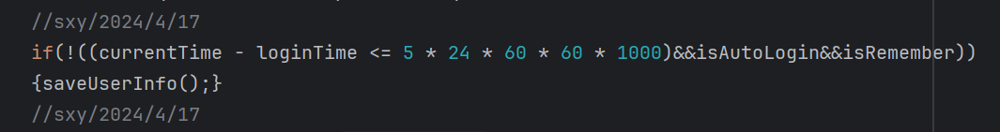

# 石夏源-代码修改部分

## 文档逻辑

1. 功能模块划分做为主要二级目录，三级是修改的具体类以及对应的路径位置，四级是具体修改了哪个函数；布局文件没有函数层；类中函数的添加（主要是屏幕适配）置于类中靠前位置；
2. ，每个图对应一个代码块（图上，代码块在下紧随其后）

## 修改部分作了标记-大致预览


## 实现第一次使用软件进入欢迎页面

添加了三张图片（可能多余）：

res/drawable/firstentry_background2.jpg
res/drawable/firstentry_background.jpg
res/drawable/firstentry_background3.jpg


### MainActivity.java

### res/layout/firstentry-欢迎界面的布局


```
<?xml version="1.0" encoding="utf-8"?>
<androidx.constraintlayout.widget.ConstraintLayout xmlns:android="http://schemas.android.com/apk/res/android"
    xmlns:app="http://schemas.android.com/apk/res-auto"
    android:id="@+id/firstentry_fragment_container"
    android:layout_width="match_parent"
    android:layout_height="match_parent"
    android:visibility="visible">

    <ImageView
        android:id="@+id/background_image"
        android:layout_width="0dp"
        android:layout_height="0dp"
        android:src="@drawable/firstentry_background2"
        android:scaleType="centerCrop"
        app:layout_constraintBottom_toBottomOf="parent"
        app:layout_constraintEnd_toEndOf="parent"
        app:layout_constraintStart_toStartOf="parent"
        app:layout_constraintTop_toTopOf="parent" />

    <Button
        android:id="@+id/firstentry_button"
        android:layout_width="@dimen/button_width"
        android:layout_height="@dimen/button_height"
        android:background="@drawable/firstentry_button_background"
        android:text="进入"
        android:textColor="#0E0A0A"
        android:textSize="@dimen/text_size"
        app:layout_constraintBottom_toBottomOf="parent"
        app:layout_constraintEnd_toEndOf="parent"
        app:layout_constraintStart_toStartOf="parent"
        app:layout_constraintTop_toTopOf="parent" />

</androidx.constraintlayout.widget.ConstraintLayout>
```

### res/drawable/firstentry_button_background.xml-欢迎界面按钮


```
<?xml version="1.0" encoding="utf-8"?>
<selector xmlns:android="http://schemas.android.com/apk/res/android">
    <item android:state_pressed="true">
        <shape>
            <solid android:color="#0756F3"/>
            <corners android:radius="100dp"/>
        </shape>
    </item>
    <item>
        <shape>
            <solid android:color="#F3EEEE"/>
            <corners android:radius="100dp"/>
        </shape>
    </item>
</selector>


```

### java/com/example/sql/WelcomeFirstTimeActivity.java--欢迎界面的活动


```
package com.example.sql;
import android.os.Bundle;
import android.view.View;
import android.widget.Button;
import androidx.appcompat.app.AppCompatActivity;
import android.content.pm.ActivityInfo;


public class WelcomeFirstTimeActivity extends AppCompatActivity {

    @Override
    protected void onCreate(Bundle savedInstanceState) {
        
        super.onCreate(savedInstanceState);
        setContentView(R.layout.firstentry);


        Button firstEntryButton = findViewById(R.id.firstentry_button);
        firstEntryButton.setOnClickListener(new View.OnClickListener() {
            @Override
            public void onClick(View v) {
                setRequestedOrientation(ActivityInfo.SCREEN_ORIENTATION_PORTRAIT);
                finish();
            }
        });


    }
    @Override
    public void onBackPressed() {
        finishAffinity();
    }
}


```


## 实现自动登录以及定时退出

### res/layout/qita.xml

退出登录按钮-功能未实现


```
<!-- sxy/5/10退出登录 -->
        <RelativeLayout
            android:id="@+id/logout"
            android:layout_width="match_parent"
            android:layout_height="wrap_content"
            android:padding="16dp"

            android:background="@drawable/profile_background"
            android:clickable="true"
            android:focusable="true">

            <TextView
                android:id="@+id/logout1"
                android:layout_width="wrap_content"
                android:layout_height="wrap_content"
                android:layout_centerVertical="true"
                android:text="     退出登录"
                android:textSize="18sp"
                android:textColor="@color/primary_text"/>

            <ImageView
                android:id="@+id/logout_arrow"
                android:layout_width="24dp"
                android:layout_height="24dp"
                android:layout_alignParentEnd="true"
                android:layout_centerVertical="true"
                android:src="@drawable/ic_forward"/>
        </RelativeLayout>
```

### MainActivity.java

#### void OnCreate()-根据登陆状态跳到不同界面以及是否自动登录


```
//sxy/2024/4/16/12:36
        boolean isFirstLaunch = sharedPreferences.getBoolean("is_first_launch", true);

        if (isFirstLaunch) {
            // 如果是首次进入，跳转到欢迎界面
            Intent intent = new Intent(this,WelcomeFirstTimeActivity.class);
            startActivity(intent);
            setContentView(R.layout.activity_main);

            // 更新首次进入的标记
            SharedPreferences.Editor editor = sharedPreferences.edit();
            //测试用
            editor.putBoolean("is_first_launch", false);
            editor.apply();
            //加载欢迎界面

        }
        else
        {//sxy/2024/4/15 auto log
            long loginTime = sharedPreferences.getLong("login_time", System.currentTimeMillis());
            long currentTime = System.currentTimeMillis();
            if (currentTime - loginTime >= 10 * 1000) {
                // 清除用户的登录信息
                SharedPreferences.Editor editor = sharedPreferences.edit();
                editor.remove("email");
                editor.remove("password");
                editor.putLong("login_time",0);
                editor.apply();
                // 跳转到登录界面
                setContentView(R.layout.activity_main);

            }
           else

            {
                setContentView(R.layout.activity_main);
                login();
            }

        }
        //sxy/2024/4/16/12:36
```


#### void saveUserInfo()


```
 //sxy2024/4/15 maintance 保存登录时间
            long loginTime = System.currentTimeMillis();
            editor.putLong("login_time", loginTime);
            //test auto log
            editor.putBoolean("auto_login", true);
            editor.apply();
            //sxy2024/4/15
```

#### void login()


```
 //sxy/2024/4/17
                long loginTime = sharedPreferences.getLong("login_time",0 );
                long currentTime = System.currentTimeMillis();
                Boolean isAutoLogin = sharedPreferences.getBoolean("auto_login", false);
                Boolean isRemember = sharedPreferences.getBoolean("remember_password", false);
                //sxy/2024/4/17

                String userEmail;
                String password;

                //sxy/2024/4/17
                if((currentTime - loginTime <= 5 * 24 * 60 * 60 * 1000)&&isAutoLogin&&isRemember&&loginTime!=0)
                {
                     userEmail = sharedPreferences.getString("email", "");
                     password = sharedPreferences.getString("password", "");

                }
                //sxy/2024/4/17
```



```
 //sxy/2024/4/17
                    if(!((currentTime - loginTime <= 5 * 24 * 60 * 60 * 1000)&&isAutoLogin&&isRemember))
                    {saveUserInfo();}
                    //sxy/2024/4/17
```


```
 //sxy/2024/4/17
                                if(!((currentTime - loginTime <= 5 * 24 * 60 * 60 * 1000)&&isAutoLogin&&isRemember))
                                {saveUserInfo();}
                                //sxy/2024/4/17
```

### java/com/example/sql/wxapi/WXEntryActivity.java

#### void onResp（BaseResp baseResp）


```
//sxy/2024/4/15/maintance 保存登录时间
SharedPreferences sharedPreferences = getSharedPreferences("user_info", MODE_PRIVATE);
SharedPreferences.Editor editor = sharedPreferences.edit();
long loginTime = System.currentTimeMillis();
editor.putLong("login_time", loginTime);
editor.apply();
//sxy/2024/4/15
```

## [屏幕适配问题解决--此处有链接](https://github.com/JessYanCoding/AndroidAutoSize)

### [使用以及原理个人理解--附有原文链接](https://juejin.cn/post/6844903661819133960)

#### 原理

​	这是这个包的定位：A low-cost Android screen adaptation solution (今日头条屏幕适配方案终极版，一个极低成本的 Android 屏幕适配方案).

​	这个方案是通过修改dp对应的大小来实现适配的，简单来说就是，将屏幕依据纵向或者横向的长度，将屏幕划分为固定的块数，即假定我们根据高度适配，设计图高度是100dp，那在任何设备中纵向dp数目都是100，每个dp的实际大小会改变，那么设计图中各个以dp为单位的元素就会自动等比例缩放，适配过程是依据高或者宽，避免因为手机屏幕宽高比例的多样性让元件比例不协调

​	原理公式如下：

**当前设备屏幕总宽度（单位为像素）/ 设计图总宽度（单位为 dp) = density**

#### 使用

​	这个布局控制大致三层的控制：全局-Activity-Fragment；基本每一个界面布局都可以是选择是使用全局适配布局或者是自定义适配或者是放弃屏幕适配

​	做为补充：可以在 **pt、in、mm** 这三个冷门单位中，选择一个作为副单位，副单位是用于规避修改 **DisplayMetrics#density** 所造成的对于其他使用 **dp** 布局的系统控件或三方库控件的不良影响，使用副单位后可直接填写设计图上的像素尺寸，不需要再将像素转化为 **dp**

​	大佬md文档的简单使用示例：（[仓库](https://github.com/JessYanCoding/AndroidAutoSize/blob/master/README-zh.md)中还有demo源码做为参考）

##### Activity


- **当某个 Activity 的设计图尺寸与在 AndroidManifest 中填写的全局设计图尺寸不同时，可以实现 CustomAdapt 接口扩展适配参数**

```
public class CustomAdaptActivity extends AppCompatActivity implements CustomAdapt {

    @Override
    public boolean isBaseOnWidth() {
        return false;
    }

    @Override
    public float getSizeInDp() {
        return 667;
    }
}
```


- **当某个 Activity 想放弃适配，请实现 CancelAdapt 接口**

```
public class CancelAdaptActivity extends AppCompatActivity implements CancelAdapt {

}
```


##### Fragment


- **首先开启支持 Fragment 自定义参数的功能**

```
AutoSizeConfig.getInstance().setCustomFragment(true);
```


- **当某个 Fragment 的设计图尺寸与在 AndroidManifest 中填写的全局设计图尺寸不同时，可以实现 CustomAdapt 接口扩展适配参数**

```
public class CustomAdaptFragment extends Fragment implements CustomAdapt {

    @Override
    public boolean isBaseOnWidth() {
        return false;
    }

    @Override
    public float getSizeInDp() {
        return 667;
    }
}
```


- **当某个 Fragment 想放弃适配，请实现 CancelAdapt 接口**

```
public class CancelAdaptFragment extends Fragment implements CancelAdapt {

}
```

### [另一位大佬的仓库--此处有其博客链接](https://blankj.com/2018/12/18/android-adapt-screen-killer/)

​	这是此处大佬的仓库的优势，由于我们项目中暂时貌似没有必要使用这个，就选择理解容易，上手快的上一个大佬的仓库了，但是这里还是标记出来，这也是我摸索过程的途径之地

​	

### 3. 不会影响系统 View 和三方 View 的大小

这点其实在无侵入性中已经表现出来了，由于头条的方案是直接修改 `DisplayMetrics#density` 的 `dp` 适配，这样会导致系统 `View` 尺寸和原先不一致，比如 `Dialog`、`Toast`、 尺寸，同样，三方 `View` 的大小也会和原先效果不一致，这也就是我选择 `pt` 适配的原因之一。

### 4. 不会失效

这一点是最值得吹牛的，因为不论头条的适配还是 [AndroidAutoSize](https://github.com/JessYanCoding/AndroidAutoSize)，都会存在 `DisplayMetrics#density` 被还原的情况，需要自己重新设置回去，最显著的就是界面中存在 `WebView` 的话，由于其初始化的时候会还原 `DisplayMetrics#density` 的值导致适配失效，当然这点已经有解决方案了，但还会有很多其他情况会还原 `DisplayMetrics#density` 的值导致适配失效。而我这方案就是为了解决这个痛点，不让 `DisplayMetrics` 中的值被还原导致适配失效。

### build.gradle--引入仓库


```
//sxy/屏幕适配
implementation 'com.github.JessYanCoding:AndroidAutoSize:v1.2.1'
```

### settings.gradle


```
dependencyResolutionManagement {
    repositoriesMode.set(RepositoriesMode.FAIL_ON_PROJECT_REPOS)
    repositories {
        google()
        mavenCentral()
        maven { url "https://jitpack.io" }

    }
}
```

### AndroidManifest.xml


```
<!--        sxy//5/10/屏幕适配-->
<meta-data
    android:name="design_width_in_dp"
    android:value="360"/>
<meta-data
    android:name="design_height_in_dp"
    android:value="640"/>
<!--        sxy//5/10/屏幕适配-->
```

### java/com/example/sql/MainActivity.java


```
//sxy/5/10/屏幕适配
@Override
public boolean isBaseOnWidth() {
    return false;
}

@Override
public float getSizeInDp() {
    return 700;
}
//sxy/5/10
```

### java/com/example/sql/QitaActivity.java


```
//sxy/5/10/屏幕适配
AutoSize.initCompatMultiProcess(this);
//sxy/5/10/屏幕适配
```

### java/com/example/sql/VipActivity.java


```
//sxy/5/10/屏幕适配统一方案
@Override
public boolean isBaseOnWidth() {
    return false;
}

@Override
public float getSizeInDp() {
    return 760;
}
//sxy/5/10/屏幕适配统一方案
```

### java/com/example/sql/RegisterActivity.java


```
//sxy/5/10/屏幕适配统一方案
@Override
public boolean isBaseOnWidth() {
    return false;
}

@Override
public float getSizeInDp() {
    return 800;
}
//sxy/5/10
```

## 使用细节优化

#### java/com/example/sql/Xuanfu.java

在任何一个主界面（下方导航栏的三个界面）点击返回退到桌面


```
//sxy/2024/4/16/7:38pm--点击返回结束所有活动结束应
@Override
public void onBackPressed() {
    moveTaskToBack(true);
} // 关闭所有Activity并结束应用

//sxy/2024/4/16/7:38pm
```

进入页面默认导航栏显示，设定为中间按钮，默认显示突出


```
//sxy/5/10 设置默认选中项
bottomNavigationView.setSelectedItemId(R.id.nav_main);
//sxy/5/10 设置默认选中项
```


# 任务

## 进入应用-界面

过ppt，选择自己的身份

剧情，时间分裂、时间守护；掌握时间=等于掌握自律时间；

要写剧本；

## 剧本-第一幕

夜晚，淅淅沥沥的雨声，摇曳着街灯穿过窗户，印在泛黄的纸上。

天如白昼，随之是震耳雷声。

夜色涌回时，却带着一团光亮，一呼一吸，慢慢地飘着。

（球状闪电 宏原子）正确，可惜你意识得太晚了

只一刹那，那团光亮便扑到你的脸上

奇怪的是，什么异样也没有。

你接着握起笔，写起来

艹，还是很难

我并没有变聪明

--纸上忽明忽暗的变化--

你一抬头，玻璃杯上竟然有着电流

（不、科学     玻璃、不导电）

两团光闪到你的面前，一团纯白，一团深蓝。

“你是谁？”你颤抖着问。

纯白的光微微闪烁，仿佛叹息了一声。然后，光中浮现出一个身影，是一个女子，身着古朴的长袍，神情坚定而温柔。“我是北嫣，时间守护者。”

深蓝的光随即变幻，出现了一位男子，身披黑色斗篷，眼中闪烁着冷酷的光芒。“我是南屿，时间分裂者。”

你下意识地后退一步，手中的笔掉落在地，发出清脆的声响。你意识到自己正置身于一个超越理解的时空漩涡中。

北嫣向前一步，声音如同微风拂过你的耳畔。“我们本不该出现在你面前，但四维时空的坍缩将你卷入了这个世界。现在，你有了改变时间的力量。”

南屿冷笑一声，声音如同冰冷的利刃。“你的力量并非天赐，而是因为我们的战斗导致的时空裂缝。你有选择的机会：加入我，重塑时间，掌控未来；或者跟随她，维护这脆弱的时间线。”

你感到一阵头晕目眩，意识到自己的每一个选择将会对未来产生深远的影响。你深吸一口气，努力让自己冷静下来。


你沉默片刻，低头看着地上的笔。那是一支普通的笔，但在此刻，它似乎象征着你的选择权。

你抬起头，看向面前的两团光亮。你知道，自己的决定将改变一切。

“我……”你开口，声音在雨夜中显得格外清晰。

### 选择一：加入时间守护者

“我选择加入你，北嫣。”你坚定地说。

北嫣微笑着点头，光芒包裹住你，你感受到一股温暖的力量流遍全身。“欢迎你，新的时间守护者。”

### 选择二：加入时间分裂者

“我选择跟随你，南屿。”你说道。

南屿的眼中闪过一丝欣喜，深蓝色的光芒环绕住你，你感受到一股强大的力量。“明智的选择，我们将重塑时间。”

无论你的选择是什么，你知道，你的旅程才刚刚开始。你将面对无数的挑战和抉择，而每一步都将深刻影响时空的命运。

#### 后续、二者互相说服对方

南屿想消灭二战，重塑时间；北嫣不希望改变；

## 任务二——版本整合

四个版本：

1. 学长——版本一
   1. 拍照和文本识别
   2. 拍照识别文字——提供给ai赖回答——给个引导思路
2. 基础版本——注销功能；
3. 我自己的版本——布局解决；一些交互逻辑优化——
4. 第四个版本（理论最新）——更新的原画；添加了嘴遁玩法；drawable也做了修改（直接覆盖即可）
   1. 有一个单独的java对话共功能
   2. 文字在一个文件中，按文字搜索定位
   3. 布局问题：锁住竖屏
   4. 键盘覆盖，图片不压缩，输入框向上移动
   5. 

### 最终版本

1. 功能：拍照识别文字交给ai对话
2. 原画更新
3. 注销、退出登录
4. 布局解决
5. ai对话，关键字识别，好感度kong'z

## 任务三——网页ai对话部署完善

前端已经没问题，只需要将后端代码部署到服务器上即可

# 后端服务器操作


测试代码前关闭，之后打开


### 


