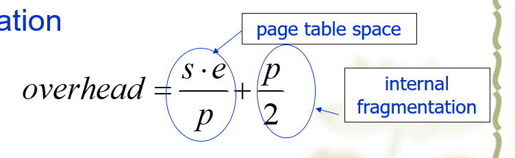

---

---

# 操作系统笔记

## 第二章作业题笔记

For round robin, during the first 10 minutes each job gets 1/5 of the CPU. At the end of 10 minutes, C finishes. During the next 8 minutes, each job gets 1/4 of the CPU, after which time D finishes. Then each of the three remaining jobs gets 1/3 of the CPU for 6 minutes, until B finishes, and so on. The finishing times for the five jobs are 10, 18, 24, 28, and 30, for an average of 22 minutes. For priority scheduling, B is run first. After 6 minutes it is finished. The other jobs finish at 14, 24, 26, and 30, for an average of 18.8 minutes. If the jobs run in the order A through E, they finish at 10, 16, 18, 22, and 30, for an average of 19.2 minutes. Finally, shortest job first yields finishing times of 2, 6, 12, 20, and 30, for an average of 14 minutes.

rr中关键计算每个任务完成的时间节点，不必在意切片的宽度

“turnaround time”：完成作业需要的时间

## Scheduling in Real-Time Systems

Real-time systems are generally categorized as **hard real time**, meaning there are absolute deadlines that must be met—or else!—and **soft real time**, meaning that missing an occasional deadline is undesirable, but nevertheless tolerable.

event streams.Depending on how much time each event requires for processing,handling all of them may not even be possible.For example,if there are m periodic events and event i occurs with period P;and requires Ci sec of CPU time to handle each event,then the load can be handled only if

## 数据竞争

**数据竞争**发生在多个线程或进程同时修改共享数据时，最终的结果依赖于线程的执行顺序。

--保护措施：通常使用**互斥锁**（例如上面代码中的`w_mutex`）来保护这类共享变量。互斥锁确保在任何给定时间内，**只有一个线程**可以修改计数器：

- 当线程开始修改计数器之前，它必须首先获取锁。
- 在修改完成后，它释放锁，允许其他线程进行修改。

这种方法可以有效避免并发环境中的数据竞争和错误更新，是多线程程序设计中常用的同步技术。

# CHAPTER 3 Memory Management

## Fetch Strategies

## PAGE

### Page Replacement

#### Review of Page Replacement Algorithms

-Optimal-不可行，作为参考
-FlFO：可能换出常用的页

Second-chance、Clock
-NRU、LRU、NFU、Aging
-Vorking Set、

WSClock

**Two Best Algorithms:Aging and WSClock**

### Design Issues for paging systems

load control：

​	系统颠簸thrash不可避免-因为不同的进程会竞争内存空间

解决方案：减少竞争内存的进程数量-负载控制

### Page Size

#### small

优势：内部碎片少；内存中更少未使用的程序

劣势：一个程序需要更多的页，页表会更大

#### 最优

页表和内部碎片的开销overhead：

s average process size in bytes
p page size in bytes
e page entry size in bytes

当满足如下关系时候，开销最小：

### Shared Pages

单独的指令和数据空间，更加容易共享；如图PT中是多个PCB，存储不同的进程ID等信息，多个进程指向同一个数据页表

如果某个进程对共享数据进行修改时需要复制一份数据；只读是不需要的

### Cleaning Policy

当内存中空闲frame太少的时候，选择页剔除，让内存中一直有frame可用

替换算法：

​	使用循环链表-clock

​	按照一般的页面置换算法逻辑，但是有两个不同的指针ptr，（front 	hand、back hand）

### Implementation Issues for paging systems

### Page Fault Handling

1. Hardware traps to kernel,saving the PC on the stack
2. General registers saved
3. OS determines which virtual page needed
4. OS checks validity of address,seeks page frame
5. If selected frame is dirty,write it to disk,suspend the process
6. OS brings schedules new page in from disk.
7. While page loading,process still suspend
8. Disk interrupts,page tables updated
9. Faulting instruction backed up to when it began
10. Faulting process scheduled
11. Registers restored
12. Program continues

## Segmentation

每个页-（一维地址空间）大小固定，如果某段程序变量太多会与其它程序的地址空间冲突

为此，有了段-二维地址空间，多个段地址空间完全独立，增减互不影响

### Segmentation Architecture

Logical address consists of two parts:
<virtual segment-number,offset>

### Implementation of Pure Segmentation

会产生外部碎片，不属于任何段

## Segmentation with paging

需要段表，但段表项不同，页表起始位置放在段表项中

An address has three components

一个段由
逻辑空间片叫page，物理空间的片叫page frame.