# 顺序逻辑设计 sequential logic design

## Finite State Machines

### Analysis of Schematic3.5

例题

Alyssa P.Hacker arrives home,but her keypad lock has been rewired and her old code no longer works.
A piece of paper is taped to it showing the circuit diagram.
Alyssa thinks the circuit could be a finite state machine and decides to derive the state transition diagram to see if it helps her get in the door.

1. Examine circuit, stating **inputs, outputs, and state bits.**检查电路，说明输入、输出和状态位。

  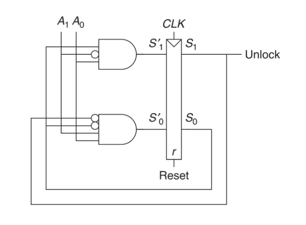

2. Write next state and output **equations.**写出下一个状态和输出方程。

  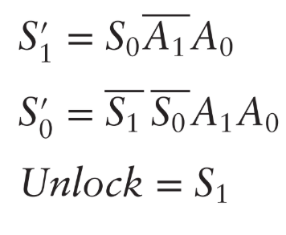

3. Create next state and output **tables.**创建下一个状态和输出表。

  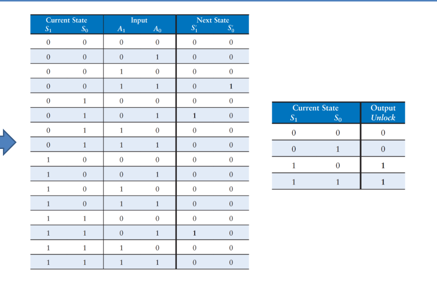

4. **Reduce** the next state table to eliminate unreachable states.

  化简状态表以消除不可达状态。或者合并与输入无关的状态变化

  

  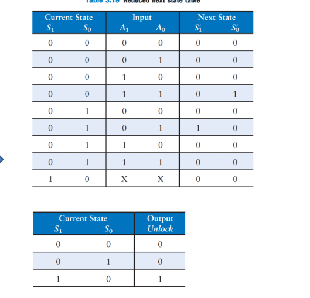

5. Assign each valid state bit combination a **name.**为每个有效的状态位组合指定一个名称。S（S'）按照位组合重新命名和A直接写成十进制无关就为叉

6. **Rewrite** next state and output tables with state names.用状态名重写下一个状态和输出表

  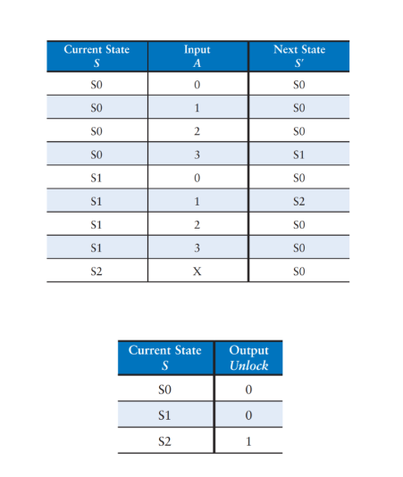

7. Draw state **transition diagram**.绘制状态转换图。当面临多个输入转换状态相同的时候，可以使用不等于号反向合并

  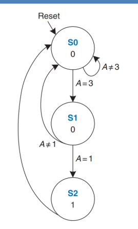

8. **State** in words **what the FSM does**.用文字描述FSM的功能。

  

### Timing of sequential logic


### Dynamic Discipline


#### input timing constrains输入--D

1. Setup time(建立时间)：t（setup）=time before clock edge data

   must be stable (i.e. not changing)

2. Hold time(保持时间)：t（hold）=time after clock edge data

   must be stable

   **以上升沿中心位界定**

3. Aperture time(孔径时间)：t（a）=time around clock edge data

   must be stable (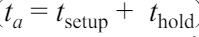)

   **aperture time包括setup时间和hold时间，setup在时钟沿前，hold在时钟沿之后**

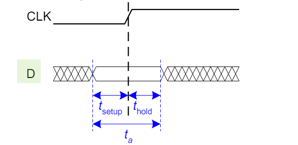

#### 输出时间约束out timing constraints--Q

以时钟沿中心位置为起始

1. Propagation delay(传播延迟)：t(pcq)=time after clock edge that the output  is guaranteed to be stable (i.e.,to stop changing)
2. Contamination delay(最小延迟)：t(ccq)=time after clock edge that might be unstable (i.e.,start changing)

二者皆在时钟沿之后，propagation延迟之后确保输出稳定，但是Contamination（污染）延迟，之后可能会有不稳定情况

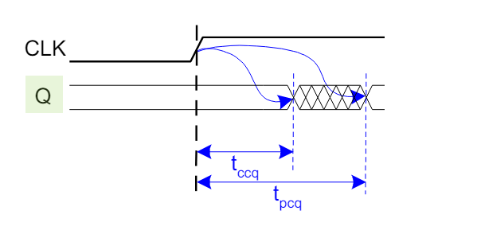

#### Dynamic Discipline(动态约束)

1. inputs must be stable

   - at least t（setup） **before** the clock edge

   - at least until t（hold） **after** the clock edge

2. The delay **between register**s Q1->D2 has a minimum and maximum delay,dependent on the delays of the circuit elements

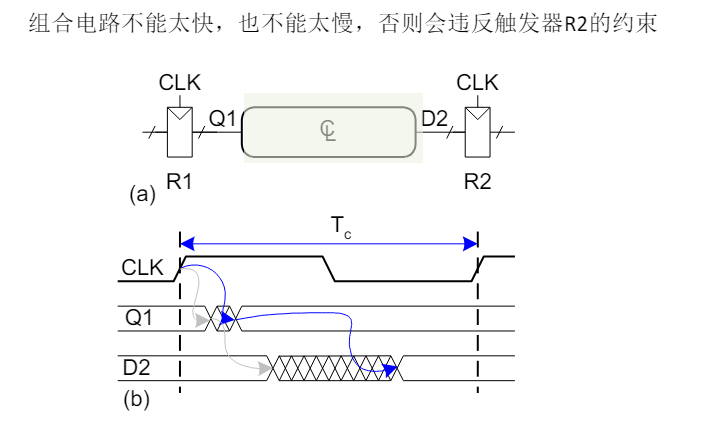

## Parallelism（流水线、并行）

token-任务处理输入产出输出

latency-一个任务从开始到结束的时间

throughput-单位时间内完成任务的数量--也是使用并行的目的（提高吞吐量）

# chapter4HDL(Hardware   Description Languages)

## Introduction

### 两种主要的HDL

SystemVerilog

- developed in 1984 by Gateway Design Automation
- IEEE standard(1364)in 1995
- Extended in 2005(IEEE STD 1800-2009)
- IEEE STD1800-2012

VHDL 2008

- Developed in 1981 by the Department of Defense
- IEEE standard (1076)in 1987
- Updated in 2008(IEEE STD 1076-2008)

### System Veriloag

Two types of Modules:
1.Behavioral:describe what a module does
2.Structural:describe how it is built from simpler modules

### 两种常用的逻辑电路门电路风格

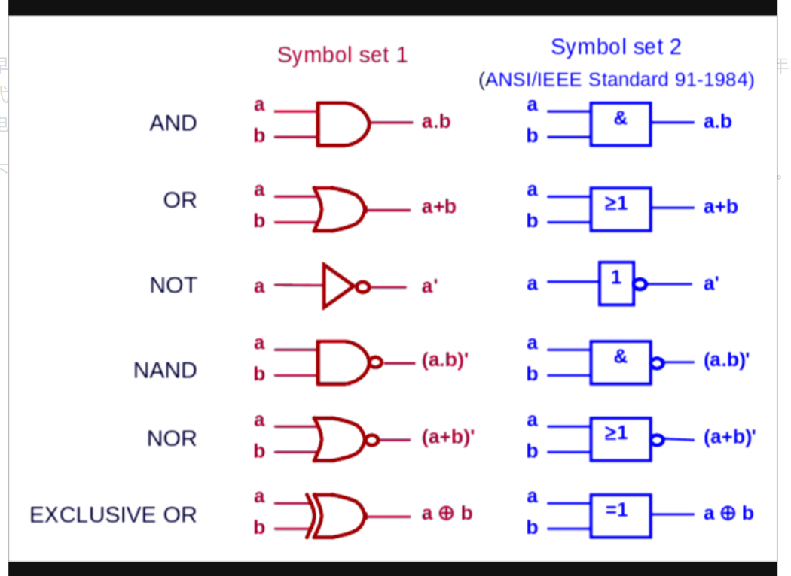

左边为传统的逻辑门电路符号，右边为IEEE标准中定义的逻辑门电路符号

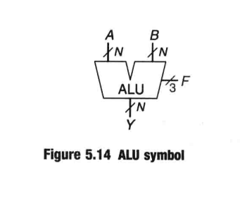

### homework 4.1

Sketch a schematic of the circuit described by the following HDL code. Simplify the schematic so that it shows a minimum number of gates

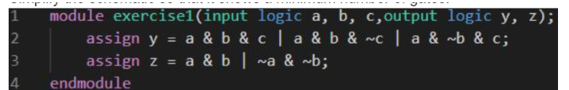

assign y = a & b | (a & ~b & c);

assign z = (a & b) | (~a & ~b);

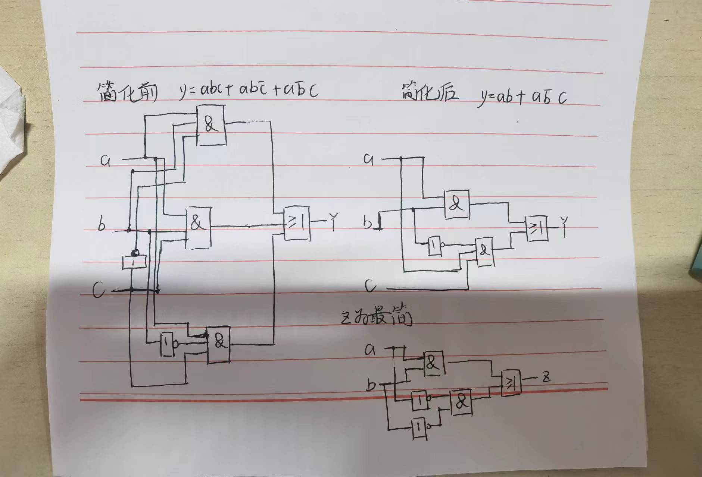

## Combinational Logic-4.2

#### 名词解释：

- **Flaoting：**悬空。当我们提到一个输出“悬空”（Floating）或者输出端处于“浮动状态”时，通常指的是该输出端没有明确连接到任何逻辑电平（高电平或低电平）或电气驱动。这种状态可能导致输出端的电压处于不确定的状态，也就是说，该信号既不被拉高到一个确定的高电平，也不被拉低到一个确定的低电平，而是处于介于两者之间的任意电平。

- **tri：**是一种数据类型**，用于定义三态逻辑。三态逻辑允许信号处于高电平（1）、低电平（0）、高阻态（Z）中的任一状态。高阻态通常用于使输出断开，让其他设备能够驱动相同的信号线。在SystemVerilog中，`tri` 类型通常用于模拟共享的总线或信号线。

  - 示例：

  - module tri_state_buffer(
        input logic enable,
        input logic data_in,
        output tri data_out
    );

        // 三态缓冲区
        assign data_out = enable ? data_in : 1'bz;

    endmodule

#### 数据类型

在Verilog和SystemVerilog中，`wire`、`reg`和`logic`是用来声明变量类型的关键字，它们在硬件描述语言中用于定义信号的不同行为和用途。下面详细解释这三种类型的特性和区别。

##### Wire

`wire`类型在Verilog中用于表示连续赋值的信号。`wire`类型的信号不能被过程块（如`always`块）中的语句赋值，但可以通过`assign`语句或连接到模块端口来赋值。

- 特性

  ：

  - 用于组合逻辑。
  - 不能存储值（无记忆性），值是由连接到其上的信号或赋值语句驱动的。
  - 默认为`wire`类型，适合用作模块间连接或实现连续赋值。

##### Reg

`reg`类型在Verilog中用于声明在`always`块或`initial`块中赋值的变量。尽管叫做`reg`（寄存器），它并不一定对应于物理上的寄存器；这更多是一种数据存储的抽象，表示可以保持其值直到被再次赋值。

- 特性

  ：

  - 可以在`always`块中赋值，适用于定义时序逻辑或可以在过程块内部改变的组合逻辑。
  - 能够保存状态（具有记忆性）。
  - 在使用`always`块时，常用来存储中间计算结果或实现存储元件。

##### **Logic**

`logic`是SystemVerilog引入的类型，它是`wire`和`reg`的超集，旨在简化信号类型的选择和使用，以及提高代码的可读性和可维护性。

- 特性

  ：

  - 可以在连续赋值和过程块中使用，非常灵活。
  - 支持四值逻辑：0（低）、1（高）、X（不确定）和Z（高阻态）。
  - 既可以像`wire`一样被连续赋值，也可以像`reg`一样在`always`块中被赋值。
  - 在SystemVerilog中，推荐使用`logic`而非`reg`和`wire`，除非特定环境（如与遗留代码互操作）要求使用后者。

  使用举例：

  `logic[7:0]` 表示一个由8个单独的逻辑位组成的向量，其中每个位都是 `logic` 类型。这意味着这个向量中的每一位都能独立地表示四个可能的状态：0（逻辑低），1（逻辑高），X（不确定），和Z（高阻态-High-Z or Tri-state）

  `logic` 类型而没有方括号或任何范围指示符，那么它表示一个单比特的四状态逻辑类型。

##### 区别总结

- **用途和行为**：`wire`适合组合逻辑和外部连接，不能在过程块中赋值；`reg`适合时序逻辑或需要保持状态的组合逻辑；而`logic`可以通用于所有情况，提供了更高的灵活性和简便性。
- **代码兼容性**：`wire`和`reg`是Verilog的一部分，而`logic`是SystemVerilog的特性。
- **推荐使用**：对于新项目，特别是使用SystemVerilog的项目，推荐使用`logic`以简化代码和增强可维护性。

#### HDL语言特性

- Case sensitive大小写敏感

  -Example:reset and Reset are not the same sign

- No names that start with numbers(不可以数字大头)

  -Example:2mux is an invalid name

- ·Whitespace ignored

- Comments:

  ​	单行注释//   //

  ​	多行注释/*   */

  ​	同c++

  


#### assign和always语句

- **assign语句**用于连续赋值，主要用于实现组合逻辑。它直接将表达式的结果赋值给`wire`、`logic`类型的变量。这种赋值是非阻塞的，保证了在输入信号变化时输出也会立即更新

  ```
  assign <目标信号> = <表达式>;
  module xor_gate(
      input wire a,
      input wire b,
      output wire result
  );
      assign result = a ^ b;  // 对a和b进行异或运算
  endmodule
  
  ```

- **always**语句用于描述在特定触发事件发生时才执行的行为，这包括时序逻辑和组合逻辑。它可以使用**阻塞(`=`)或非阻塞(`<=`)**赋值，根据设计需求来模拟硬件的行为。

  - `always @(*)`是一种常见的语法结构，用于定义一个always块，这种块会在**任何变量变化**时触发执行。这种类型的always块主要用于实现组合逻辑，因为它不依赖于时钟信号或其他明确的时序事件。

  ```
  always @(触发事件) begin
      <语句序列>
  end
  module d_flip_flop(
      input wire clk,
      input wire d,
      output reg q
  );
      always @(posedge clk) begin
          q <= d;  // 在时钟上升沿时更新q的值
      end
  endmodule
  
  ```

#### 优先级表

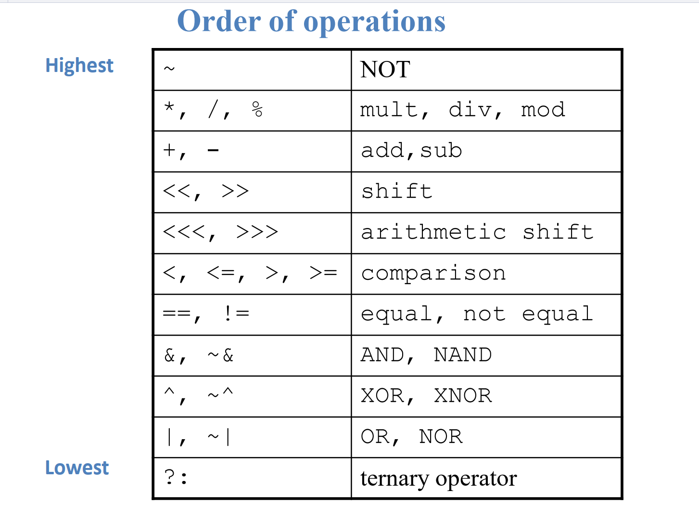

#### 例题

Write an HDL module that computes a four-input XOR function. The input is a[3:0],and the output is y. Write a testbench for the module. Finish 3 Implementations of the module xor4: (1)Use assignment statement. (2)Use always statement. (3)Use structuarl model.Hint:use three 2-input XOR gates

让我们将对测试平台的启动、初始块（`initial`）、始终块（`always`）和编译加载过程的详细说明整合到之前提供的测试平台示例中，并将之前的三种实现方式的代码和测试平台一起呈现，以便提供一个完整的概述。

##### 三种实现方式

1. **使用赋值语句的实现**
```verilog
module xor4_using_assign(
    input [3:0] a,
    output wire y
);
    assign y = a[0] ^ a[1] ^ a[2] ^ a[3];
endmodule
```

2. **使用always语句的实现**
```verilog
module xor4_using_always(
    input [3:0] a,
    output reg y
);
    always @(*) begin
        y = a[0] ^ a[1] ^ a[2] ^ a[3];
    end
endmodule
```

3. **使用结构化模型的实现**
```verilog
module xor4_using_structural(
    input [3:0] a,
    output wire y
);
    wire temp1, temp2;
    xor (temp1, a[0], a[1]);
    xor (temp2, a[2], a[3]);
    xor (y, temp1, temp2);
endmodule
```

##### 测试平台（Testbench）包括注释说明

```verilog
module testbench;
    reg [3:0] a;     // 定义一个4位的寄存器a作为输入信号
    wire y;          // 定义一个线网y作为输出信号

    // 实例化被测试的模块，命名为uut，即Unit Under Test
    xor4_using_assign uut(
        .a(a),       // 将测试平台的信号a连接到uut模块的输入端口a
        .y(y)        // 将uut模块的输出端口y连接到测试平台的信号y
    );

    // 生成时钟信号，模拟周期性的测试信号
    always #5 a[0] = ~a[0];  // 产生一个周期为10个时间单位的时钟信号

    // 初始块开始，初始化仿真环境
    initial begin
        a = 4'b0000;  // 初始化输入信号a为0
        // 使用$monitor在控制台上实时显示仿真时间和信号的值
        $monitor("Time = %g, Input a = %b, Output y = %b", $time, a, y);

        // 循环16次，对应于4位二进制的所有可能值
        repeat (16) begin
            #10 a = a + 1; // 每10个时间单位后，将输入a增加1，模拟周期性输入变化
        end
        
        #10;  // 确保最后一个状态可以被监控到
        $finish;  // 结束仿真，是仿真环境中的一个命令，用于结束当前的仿真过程
    end
endmodule
```

##### 说明
- **仿真启动**：仿真开始于编译加载后自动执行`initial`和`always`块。
- **`$monitor`**：在整个仿真期间持续监视指定的信号，并在任何变量改变时输出当前的仿真时间和变量状态。
- **`repeat`** 和 `#10`：使用这些构造来模拟真实的输入条件和测试全部可能的输入情况。
- **`$finish`**：用于在测试完成后清楚地结束仿真过程。

以上就是完整的三种XOR门实现和测试平台的综合展示，带有详细的注释，有助于理解每部分代码的功能和测试过程的启动方式。

# 第五章 Digital Building Blocks

## Arithmetic Circuits

### multibit adders

Types of carry propagate adders(CPAs):

1. Ripple--carry(行波进位加法器 (slow)
2. Carry-lookahead(先行进位加法器) (fast)
3. Prefix*(前缀加法器)(faster)

### LookAhead ADDER

Compute carry out (Cout) for k-bit blocks using generate and propagate signals • 

Some definitions:

– Column i produces a carry out by either generating a carry out or propagating a carry in to the carry out – Generate (Gi) and propagate (Pi) signals for each column:

• Column i will generate a carry out if Ai AND Bi are both 1.

Gi = AiBi（如果AB都是1，自己会产生进位）

• Column i will propagate a carry in to the carry out if Ai OR Bi is 1.

Pi = Ai + Bi (P代表AB和是1时传播下一位的进位)

• The carry out of column i (Ci) is:

Ci = A i Bi + (Ai + Bi )Ci-1 = Gi + Pi Ci-1

### Prefix Adder*

### delay

#### Ripple-Carry Adder Delay

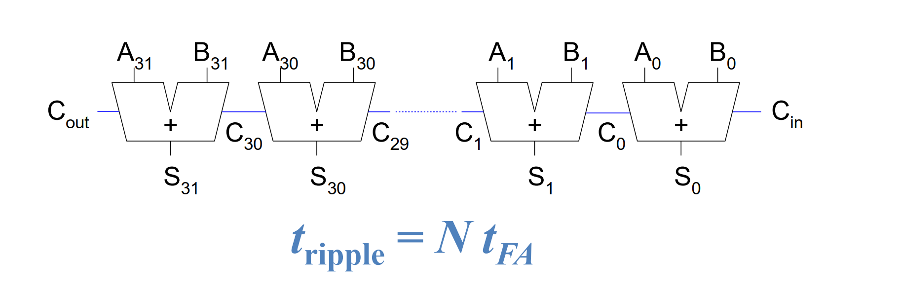

where 
$$
t_{FA}
$$
 is the delay of a 1-bit full adder

#### Carry Lookahead Adder

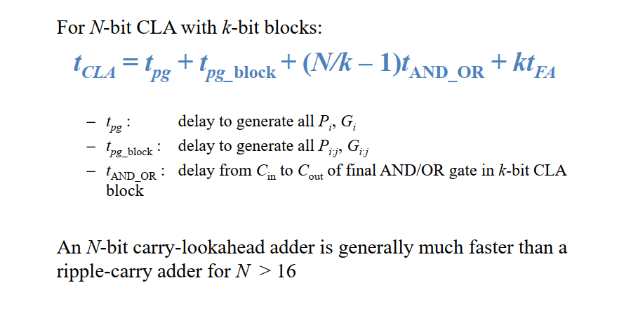

### Comparator比较器

**An equality comparator** produces a single output indicating whether A is equal to B(A==B).A magnitude comparator produces one or more outputs indicating the relative values of A and B.

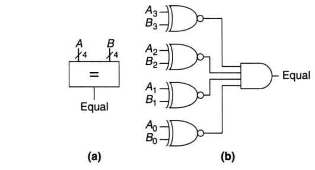

**Magnitude comparison**大小比较： is usually done by computing A-B and looking a**t the sign(most significant bit)of the result** as shown in Figure 5.12.If the result is **negative (i.e.,the sign bit is 1)**,then A is less than B.Otherwise A is greater than or equal to B.

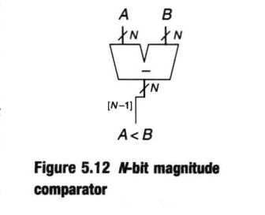

### Shifters


- Logical shifter:shifts value to **left or right** and fills empty spaces with 0's
  - -EX:11001>>2=00110
  - -EX:11001<<2=00100
- Arithmetic shifter:same as logical shifter,**but on right shift,fills empty spaces with the old most significant bit(msb).**
  - -EX:11001>>>2=11110
  - -EX:11001<<<2=00100
  - for multiplying and dividing signed numbers
  - 左移N位代表乘以2的N次方；右移代表除以2的N次方
- Rotator:rotates bits in a circle,such that bits shifted off one end are shifted into the other end
  - -EX:11001ROR2=01110
  - -EX:11001ROL2 =00111
