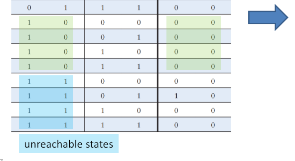
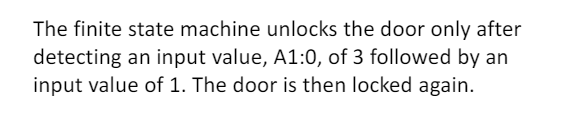

# 顺序逻辑设计 sequential logic design

## Finite State Machines

### Analysis of Schematic3.5

例题

Alyssa P.Hacker arrives home,but her keypad lock has been rewired and her old code no longer works.
A piece of paper is taped to it showing the circuit diagram.
Alyssa thinks the circuit could be a finite state machine and decides to derive the state transition diagram to see if it helps her get in the door.

1. Examine circuit, stating **inputs, outputs, and state bits.**检查电路，说明输入、输出和状态位。

  

2. Write next state and output **equations.**写出下一个状态和输出方程。

  

3. Create next state and output **tables.**创建下一个状态和输出表。

  

4. **Reduce** the next state table to eliminate unreachable states.

  化简状态表以消除不可达状态。或者合并与输入无关的状态变化

  

  

5. Assign each valid state bit combination a **name.**为每个有效的状态位组合指定一个名称。S（S'）按照位组合重新命名和A直接写成十进制无关就为叉

6. **Rewrite** next state and output tables with state names.用状态名重写下一个状态和输出表

  

7. Draw state **transition diagram**.绘制状态转换图。当面临多个输入转换状态相同的时候，可以使用不等于号反向合并

  

8. **State** in words **what the FSM does**.用文字描述FSM的功能。

  

### Timing of sequential logic

### Dynamic Discipline

#### input timing constrains输入--D

1. Setup time(建立时间)：t（setup）=time before clock edge data

   must be stable (i.e. not changing)

2. Hold time(保持时间)：t（hold）=time after clock edge data

   must be stable

   **以上升沿中心位界定**

3. Aperture time(孔径时间)：t（a）=time around clock edge data

   must be stable ()

   **aperture time包括setup时间和hold时间，setup在时钟沿前，hold在时钟沿之后**

#### 输出时间约束out timing constraints--Q

以时钟沿中心位置为起始

1. Propagation delay(传播延迟)：t(pcq)=time after clock edge that the output  is guaranteed to be stable (i.e.,to stop changing)
2. Contamination delay(最小延迟)：t(ccq)=time after clock edge that might be unstable (i.e.,start changing)

二者皆在时钟沿之后，propagation延迟之后确保输出稳定，但是Contamination（污染）延迟，之后可能会有不稳定情况

#### Dynamic Discipline(动态约束)

1. inputs must be stable

   - at least t（setup） **before** the clock edge

   - at least until t（hold） **after** the clock edge

2. The delay **between register**s Q1->D2 has a minimum and maximum delay,dependent on the delays of the circuit elements

## Parallelism（流水线、并行）

token-任务处理输入产出输出

latency-一个任务从开始到结束的时间

throughput-单位时间内完成任务的数量--也是使用并行的目的（提高吞吐量）

# chapter4HDL(Hardware Description Languages)