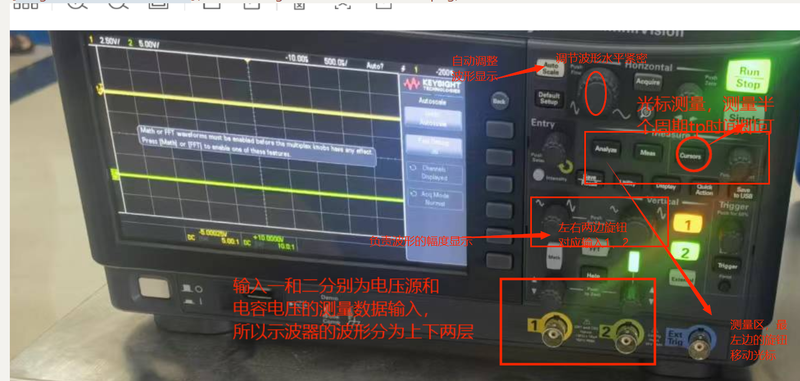
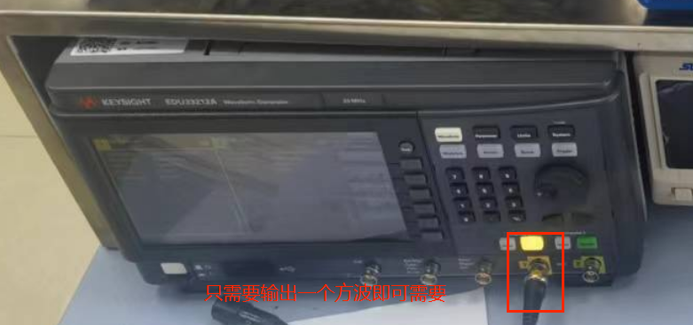
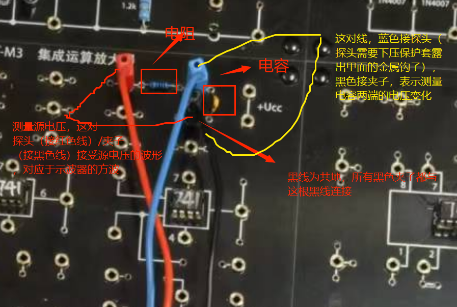
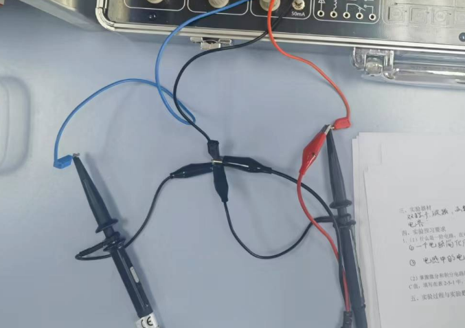
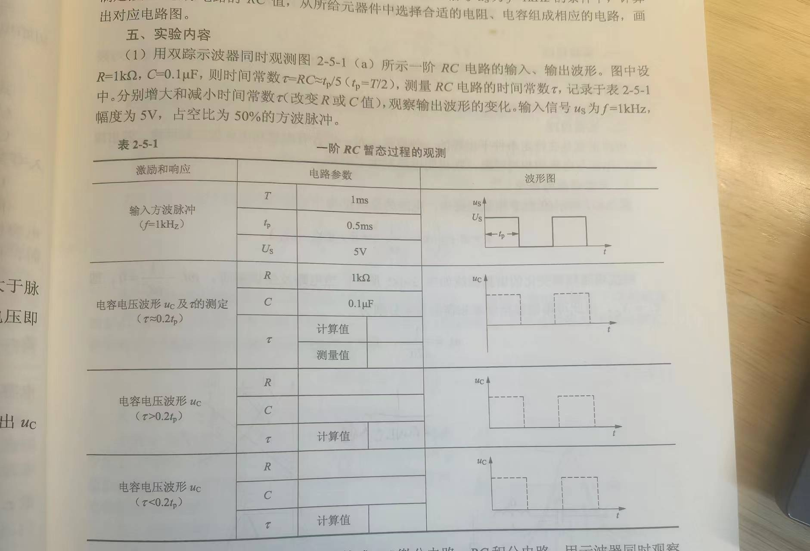
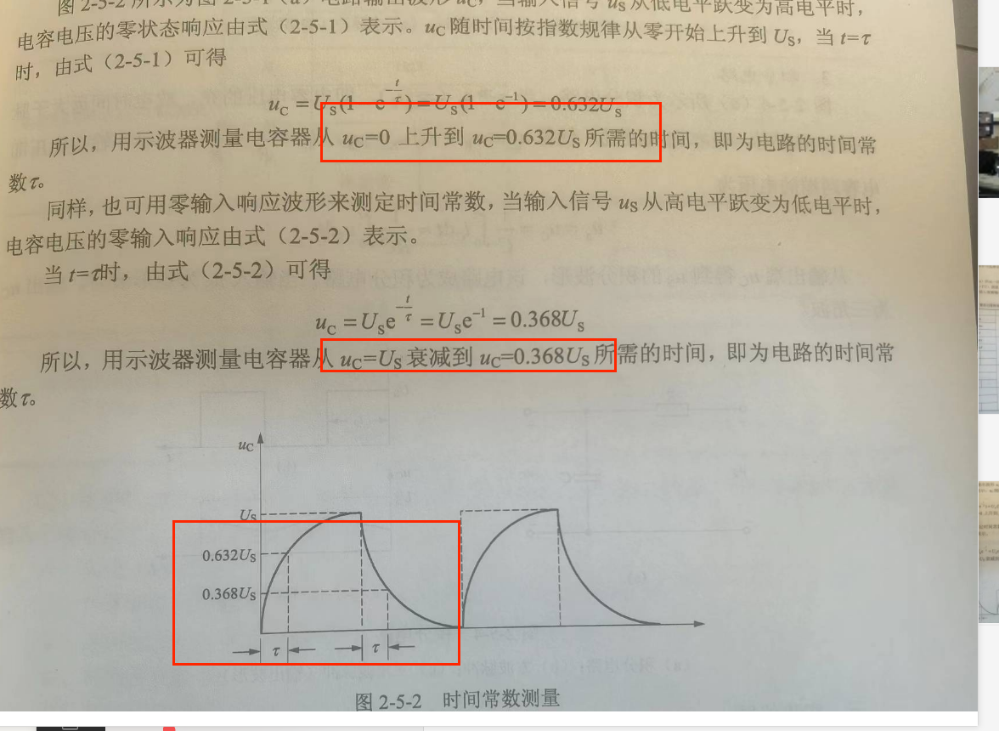
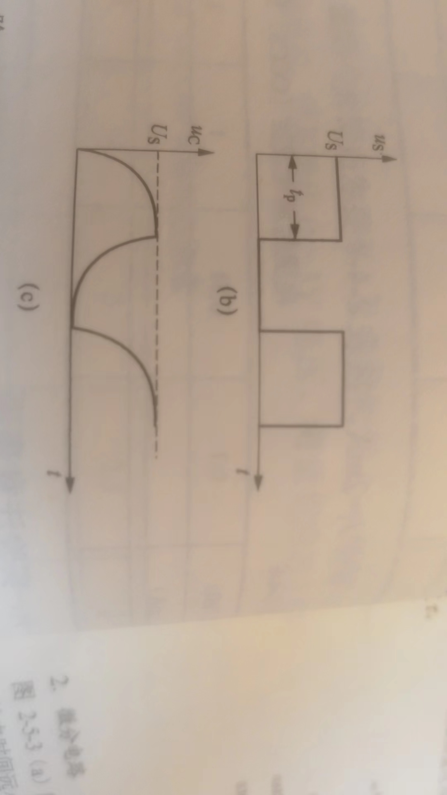
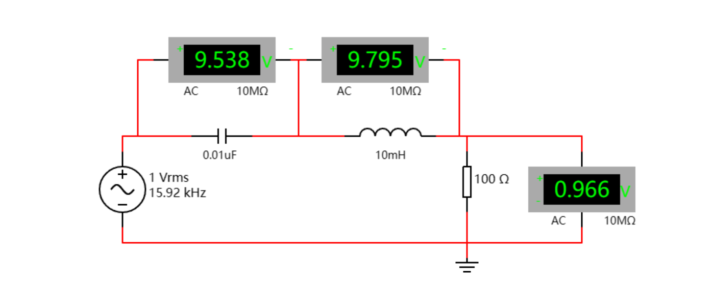
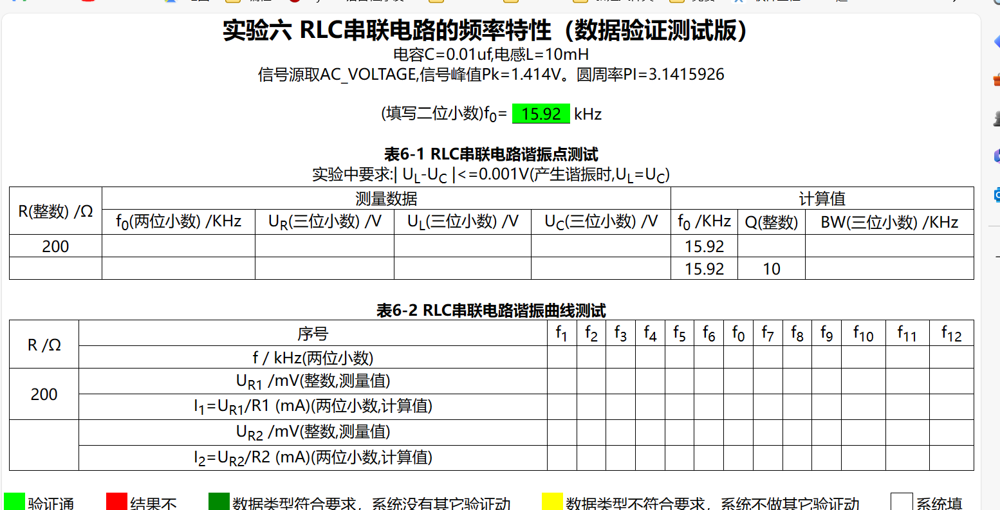

# 实验五：一阶RC电路暂态过程的研究

示波器

生成器

实验箱：

接线：

如图试验箱的红色线引出接生成器（方波5v的有效值RMP）的红色夹子，做为输出；

蓝色引线接着一个示波器的探头内部挂钩（表示电容电压的输入）

同时也接着示波器的一个黑色探头（源电压测量）所有的表笔（三个）的三个黑色夹子接在试验箱引出的黑色导线上，表示共地；

数据读取：

时间常数在示波器中表示为半波周期的五分之一

在第一个波形中可以看到电容电压从0上升到Us，据此测量时间常数的测量值，计算值取第二行的公式即可

操作大概步骤：

调整RC值，即替换电容电阻，使其满足不同情况测量电容端电压（测量时间常数用和测量积分电路用）、电阻端电压（微分电路用）

时间常数的测量如下图所示：有两种

计算值为：时间常数=RC或者L/R

Us为电源电压的幅度即有效值为5V（***V*rms 是电压的有效值，*V*peak 是峰值电压）**

tp\Us解释

# 实验六：RLC串联谐振电路的研究（仿真）

主要是使用仿真软件画图即可

然后按照要求修改参数进行记录填表即可

