# [思维导图框架](./思维导图/编译原理.xmind)

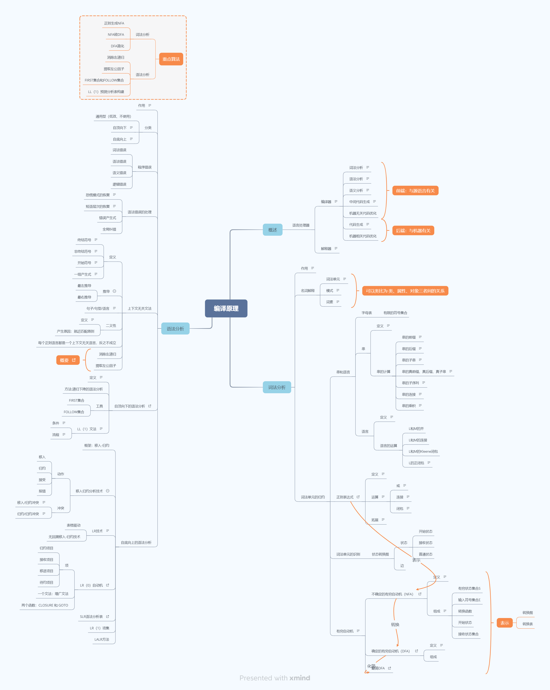

## 思维导图文本描述--编译原理

### 概述

#### 语言处理器

- 编译器

  进行翻译工作

  - 词法分析

    词法分析器读入组成源程序的字符流，并且将他们组织成有意义的词素序列，对于每个词素（lexeme），词法分析器产生词法单元（token）输出

  - 语法分析

    由产生的词法单元生成语法树

  - 语义分析

    使用语法树和符号表中的信息来检查源程序是否和语言定义的语义一致，同时收集类型信息，并把信息存放在语法树或符号表中。

  - 中间代码生成

    把源程序翻译成目标代码，一个便难以企可能会构造出一个或多个中间表示

  - 机器无关代码优化

  - 代码生成

    输入中间表示形式，映射到目标语言

  - 机器相关代码优化

- 解释器

  直接执行语句

### 词法分析

#### 作用

读入源程序字符流、组成词素，输出词法单元序列。
过滤空白、换行、制表符、注释等。
将词素添加到符号表中。
实现时通常和语法分析器处于同一趟中。

#### 名词解释

- 词法单元

  <词法单元名、属性值（可选）>
  词法单元名说明词法单位的类型，当该类型词法单元实例不唯一时，使用属性值进一步加以区分。语法分析器通过词法单元名即可确定词法单元序列的结构。

- 模式

  描述了一个词法单元的词素可能具有的形式
  关键词的模式就是组成该关键字的字符序列

- 词素

  源程序中跟某个词法单元模式相匹配的字符序列
  被词法分析器识别为该词法单元的一个实例

#### 词法单元的归约

- 串和语言

  - 字母表

    - 有限的符号集合

  - 串

    - 定义

      买某个字母表上的一个串是该字母表中符号的一个有穷序列。串的长度通常被记为s。

      长度为0的串被称为空串，记为ε

    - 串的计算

      - 串的前缀

        从尾部删除0个或多个符号后得到的串

      - 串的后缀

        从头部删除0个或多个符号后得到的串

      - 串的子串

        删除某个前缀和某个后缀后得到的串

      - 串的真前缀、真后缀、真子串

        既不等于ε，也不等于前缀、后缀、子串本身

      - 串的子序列

        从s中删除0个或多个符号后得到的串，符号不必相邻

      - 串的连接

        x=dog  y=cat
        xy=dogcat

      - 串的乘积

        s¹=s    
        s²=ss   
        s³=sss

  - 语言

    - 定义

      语言式某个给定字母表上任意可数的串集合

    - 语言的运算

      - L和M的并

      - L和M的连接

      - L和M的Kleene闭包

      - L的正闭包

        不包括Lº，也就是说如果L中不包含ε时，L的正闭包必不包含ε

- [正则表达式](https://blog.csdn.net/qq_40294512/article/details/89003655)

  - 定义

    用于描述一种语言。例如用letter代表任意字母，digit代表数位等
    正则表达式可以由较小的正则表达式按照规则递归构建，每个正则表达式r表示一个语言L(r)，其中有如下规则：
    ε是一个正则表达式，L(ε)={ε}，即改语言只包含空串
    如果a是Σ上的一个符号，那么a是一个正则表达式，并且L(a) = {a}

  - 运算

    (r) | (s)是一个正则表达式，表示语言L(r) ∪ L(s)

    (r) (s)是一个正则表达式，表示语言L(r) L(s)

    (r)*是一个正则表达式，表示语言L(r)*

    (r)是一个正则表达式，表示语言L(r)

    - 或

      交换律、结合律

    - 连接

      交换律、分配律

    - 闭包

      闭包中一定包含ε、幂等性

  - 拓展

    一个或多个实例r+
    零个或一个实例r？

- 词法单元的识别

  - 状态转换图

    - 状态

      - 开始状态

      - 接收状态

      - 普通状态

    - 边

- 有穷自动机

  是一种识别器，对输入的串回答yes or no，分为两类，这两种自动机是别的语言集合相同，都是正则语言。

  - [不确定的有穷自动机（NFA）](https://blog.csdn.net/qq_40294512/article/details/89004777)

    - 定义

      对其边上的标号没有限制，一个符号标记离开同一状态多条边，并且空串也可以作为标号

    - 组成

      五元组 M=(S, Σ, aδ, S0, F)

      - 有穷状态集合S

      - 输入符号集合Σ

      - 转换函数

      - 开始状态

      - 接收状态集合

  - [确定的有穷自动机（DFA）](https://blog.csdn.net/qq_40294512/article/details/89004777)

    - 定义

      对于每个状态及自动机输入字母表中的每个符号，有且只有一条离开该状态，以改符号为标号的边

    - 组成

  - [最简DFA](https://blog.csdn.net/qq_40294512/article/details/89004777)

### 语法分析

#### 作用

语法分析器从词法分析器获得一个由词法单元组成的串，并验证这个串可以由源语言的文法生成。

#### 分类

- 通用型（低效、不使用）

- 自顶向下

  代表文法：LL文法

- 自底向上

  代表文法：LR文法

#### 程序错误

- 词法错误

- 语法错误

- 语义错误

- 逻辑错误

#### 语法错误的处理

- 恐慌模式的恢复

  一旦发现错误就不断丢弃输入中的符号，一次丢弃一个，直到找到同步词法单元集合中的元素为止。

- 短语层次的恢复

  在余下的输入上进行局部性纠正

- 错误产生式

- 全局纠错

#### 上下文无关文法

- 定义

  - 终结符号

    终结符号是组成串的基本符号。例如特殊符号等等

  - 非终结符号

    非终结符号是组成串的集合的语法变量。非终结符号给出了语言的层次结构

  - 开始符号

    开始符号表示的串集合就是这个文法的生成语言。

  - 一组产生式

    描述了将终结符号和非终结符号组合成串的方法。每个产生式由以下几个元素构成：
    一个被称为产生式头/左部的非终结符号
    符号->
    一个由零个或多个终结符或非终结符组成的产生式体/右部

- [推导](https://blog.csdn.net/qq_40294512/article/details/89363560)

  从开始符号出发，每个重写步骤把一个非终结符替换为它的某个产生式体

  - 最左推导

  - 最右推导

- 句子/句型/语言

  如果S=>a，其中S是文法G的开始符号，我们就说a是G的一个句型。

  句子是不包含非终结符号的句型。

  语言式一个文法所有句子的集合。

- 二义性

  - 定义

    如果一个文法可以为某个句子生成多个语法分析树，那么就说他是二义性的。

  - 产生原因：就近匹配原则

- 每个正则语言都是一个上下文无关语言，反之不成立

- 消除左递归

- 提取左公因子

#### [自顶向下的语法分析](https://blog.csdn.net/qq_40294512/article/details/89397905)

- 定义

  自顶向下的语法分析可以被看做是为输入串构造语法分析树的问题
  也可以被看做是寻找输入串的最左推导的问题

- 方法:递归下降的语法分析

- 工具

  - FIRST集合

  - FOLLOW集合

- LL（1）文法

  从左向右扫描输入，产生最左推导，每步只需要向前看一个输入符号的语法分析动作

  - 条件

    不存在终结符号a使得α和β都能够推导出以a开头的串
    α和β中最多有一个可以推导出空串
    如果β=》ε，那么α不能推导出任何以FOLLOW（A）中某个终结符号开头的串。

  - 流程

    处理左递归
    提取左公因子
    求FIRST和FOLLOW集合
    构建预测分析表

#### 自底向上的语法分析

- 框架：移入-归约

- [移入归约分析技术](https://blog.csdn.net/qq_40294512/article/details/92621101)

  使用一个栈来保存文法符号，并使用一个缓冲区来存放需要进行语法分析的其他符号。

  - 动作

    - 移入

    - 归约

    - 接受

    - 报错

  - 冲突

    - 移入/归约冲突

      存在移入动作。归约动作的判断问题

    - 归约/归约冲突

      存在多个归约动作

- LR技术

  从左向右扫描，最右推导序列的技术

  - 表格驱动

  - 无回溯移入-归约技术

- [LR（0）自动机](https://www.jianshu.com/p/bf8d63791f57)

  - 项

    - 归约项目

    - 接收项目

    - 移进项目

    - 待约项目

  - 一个文法：增广文法

  - 两个函数：CLOSURE 和 GOTO

- [SLR语法分析表](https://blog.csdn.net/qq_40294512/article/details/92621351)

- LR（1）项集

- LALR方法

### 重点算法

#### 词法分析

- 正则生成NFA

- NFA转DFA

- DFA简化

#### 语法分析

- 消除左递归

- 提取左公因子

- FIRST集合和FOLLOW集合

- LL（1）预测分析表构建


# 作业以及课程笔记归纳

## 正则表达式符号

正则表达式是一种用于匹配和操作文本的强大工具，它是由一系列字符和特殊字符组成的模式，用于描述要匹配的文本模式。

正则表达式可以在文本中查找、替换、提取和验证特定的模式。

例如：

- **runoo+b**，可以匹配 **runoob、runooob、runoooooob** 等，**+** 号代表前面的字符必须至少出现一次（1次或多次）[**尝试一下 »**](https://www.runoob.com/try/try-regex.php?texts=runoob|runooob|runoooooob&tips=runoo%2Bb)。
- **runoo\*b**，可以匹配 **runob、runoob、runoooooob** 等，***** 号代表前面的字符可以不出现，也可以出现一次或者多次（0次、或1次、或多次）[**尝试一下 »**](https://www.runoob.com/try/try-regex.php?texts=runoob|runooob|runoooooob&tips=runoo*b)。
- **colou?r** 可以匹配 **color** 或者 **colour**，**?** 问号代表前面的字符最多只可以出现一次（0次或1次）[**尝试一下 »**](https://www.runoob.com/try/try-regex.php?texts=color|colour|colour123&tips=colou%3Fr)。

## [词法分析](https://www.jianshu.com/p/a6e823e18ada)

### 词法分析--regx->DFA（汤姆逊构造法-子集构造法-最小化算法）

#### 步骤1: 汤姆逊构造法构建NFA

对于正则表达式 `a|ε`，我们分别为 `a` 和 `ε` 构建NFA，然后合并。

1. **构造 `a` 的NFA**：

   - 创建两个状态：`q0` 和 `q1`。
   - 添加从 `q0` 到 `q1` 的转移，标记为 `a`。

   图示如下：

   ```
   q0 --a--> q1
   ```

2. **构造 `ε` 的NFA**：

   - 创建两个状态 `q2` 和 `q3`。
   - 添加从 `q2` 到 `q3` 的ε转移。

   图示如下：

   ```
   q2 --ε--> q3
   ```

3. **合并 `a` 和 `ε` 的NFA**：

   - 创建一个新的起始状态 `q_start` 和一个新的接受状态 `q_accept`。
   - 添加从 `q_start` 到 `q0` 和 `q2` 的ε转移。
   - 添加从 `q1` 和 `q3` 到 `q_accept` 的ε转移。

   最终的NFA图示如下：

   ```
   q_start --ε--> q0 --a--> q1 --ε--> q_accept
             \                          ^
              \--ε--> q2 --ε--> q3 --ε-/
   ```

#### 步骤2: 子集构造法将NFA转换为DFA

现在我们使用子集构造法将上述NFA转换为DFA。

1. **初始状态**：

   - DFA的起始状态是NFA起始状态通过ε移动可达的所有状态的集合：`{q_start, q0, q2, q3, q_accept}`。

2. **计算转移**：

   - 从状态 `{q_start, q0, q2, q3, q_accept}` 输入 `a`：
     - 只有 `q0` 有标记为 `a` 的出边，它通向 `q1`。从 `q1` 可以通过ε到达 `q_accept`。因此，新的状态是 `{q1, q_accept}`。

3. **终止状态**：

   - 任何包含 `q_accept` 的状态都是DFA的接受状态。

   最终DFA的状态和转移如下：

   - 状态 `{q_start, q0, q2, q3, q_accept}`，标记为接受状态。
   - 状态 `{q1, q_accept}`，标记为接受状态。
   - 转移：`{q_start, q0, q2, q3, q_accept} --a--> {q1, q_accept}`。

DFA 图示：

```
{q_start, q0, q2, q3, q_accept} --a--> {q1, q_accept}
{q_start, q0, q2, q3, q_accept} ------------------- (为接受状态)
{q1, q_accept} ------------------- (为接受状态)
```

通过这一过程，我们已经从正则表达式 `a|ε` 构造出了DFA，该DFA有效地识别由 `a` 或空串 `ε` 组成的语言。

继续从上述的DFA最小化过程，我们将使用常见的状态最小化技术，通常包括初始划分（区分接受状态和非接受状态）并迭代地细化状态分区直到达到稳定状态。这一过程旨在合并所有行为相同的状态，从而简化DFA。

#### 步骤3: 状态最小化

由于在构造的DFA中，所有状态都是接受状态，这通常意味着每个状态在语言接受方面的行为都相同。但是，我们需要仔细检查这些状态对于所有输入符号的反应是否确实相同。

1. **初始状态划分**：
   - 由于 `{q_start, q0, q2, q3, q_accept}` 和 `{q1, q_accept}` 都是接受状态，我们可以开始考虑它们是否能够被进一步合并。这取决于它们对输入符号 `a` 的反应是否相同。

2. **检查转移**：
   - 从 `{q_start, q0, q2, q3, q_accept}` 输入 `a`，结果状态是 `{q1, q_accept}`。
   - 从 `{q1, q_accept}` 输入 `a` 时，由于没有定义从 `q1` 出发的 `a` 转移，这可以被视为一个死状态或沉默状态。这意味着这两个状态集在响应 `a` 时行为不同。

3. **无法进一步合并**：
   - 因为在接受字符 `a` 时，两个状态集的行为不同（一个转移到另一个，另一个无响应），我们无法将这两个状态合并。

4. **最终最小化DFA**：
   - 最小化后的DFA与前面生成的DFA相同，因为没有进一步的合并机会。

##### 最小化DFA的示意图和描述：

```
{q_start, q0, q2, q3, q_accept} --a--> {q1, q_accept}
{q_start, q0, q2, q3, q_accept} ------------------- (为接受状态)
{q1, q_accept} ------------------- (为接受状态)
```

- **状态**：
  - `{q_start, q0, q2, q3, q_accept}`：在没有输入时即可接受输入串（因为包含起始状态和接受状态）。
  - `{q1, q_accept}`：仅在接受字符 `a` 后接受输入串。


## 语法分析

### chapter 2 exercise p232


Textbook p206 exercise 4.2.2 d) 

(1)   Give a LM derivation, a RM derivation and a parser tree for the string; Justify whether the grammar is ambiguous or not

(2)   left factor and eliminate left recursion the grammar

(3)   Justify whether the rewritten grammar is LL(1) grammar or not.

(4)   construct LL(1) parsing table and analyze the string.


Every construct that can be described by a regular expression can be described by a grammar,but not vice-versa**.Alternatively,every regular language is a context-free language,but not vice-versa.上下文无关文法>正则表达式**

### Ambiguity


a grammar that produces more than one parse tree for some sentence is said to be ambiguous.Put another way,an ambiguous grammar is one that produces more than one leftmost derivation or more than one rightmost derivation for the same sentence

有多个解析树，或者有多于一个最左推导或者最有推导，即这个语法有歧义（如果没有歧义，左右推导得出的语法树相同，且验证需要多个句子列举测试）

### 句子和句型、句柄、活前缀

#### 句子（Sentence）

句子是特殊类型的句型，它不包含任何非终结符，只由终结符组成。句子是文法生成的最终产品，

#### 句型（Sentential Form）

句型是指从文法的起始符号（通常是非终结符）出发，通过一系列的产生式规则替换（应用文法中的规则），得到的一个由终结符和/或非终结符组成的字符串。句型代表了生成某个特定句子的过程中的一个中间状态，这个状态可能还包含一些非终结符（即还可以继续进行产生式规则的替换）。

句子只能由终结符，句型还可以有非终结符（可以是起始符号），句子为特殊的句型

#### 短语phrase

一个短语就是可以被规约为一个非终结符的串（可以是多部归约）

如果是一步规约，就是**简单短语**

#### handle

Formally: a **handle** of a **right-sentential form** γ is a production A → β and a position in γ where β may be found and replaced by A to produce the previous right-sentential form in a rightmost derivation of γ. i.e., if S ⇒∗rm αAw ⇒rm αβw then **A → β** in the position following α is a handle of αβw

Because γ is a right-sentential form, the substring to the **right of a handle** contains **only terminal symbols.**

最左简单短语是句柄，与上述定义不冲突

#### viable prefix（（规范）可行/活前缀）

出现在bottom up**解析栈中的即为可行前缀**，即**空串**代表初始状态也是一个可行前缀

规范前缀: 一个规范句型的一个前缀称为规范前缀, 如果该前缀后面的符号串不包含非终极符

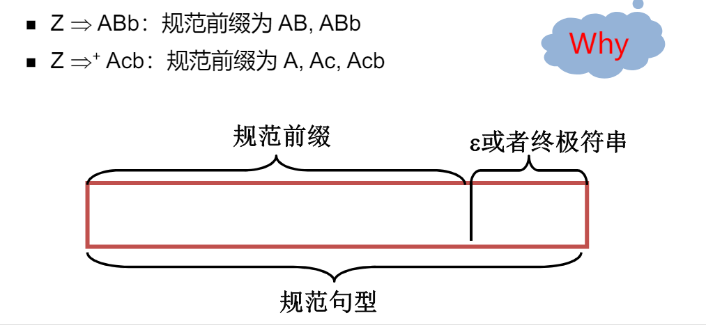

- 规范前缀不包含简单短语;
- 或者该规范前缀只包含一个简单短语,而且是在该规范前缀的最后(这个简单短语就是句柄); 

换句话说，**规范活前缀不含句柄之后的任何符号**

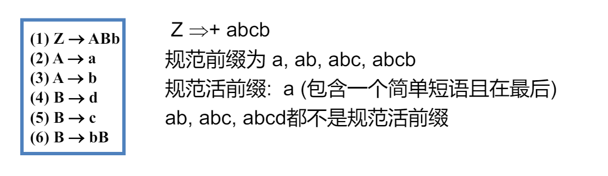

分类：

- 非归态(移入)活前缀：规范活前缀不包含简单短语, 而且是在该规范活前缀的最后句柄尚未形成，需要继续移进若干符号后才能形成句柄
- 归态活前缀：只包含一个简单短语, 尾部正好是句柄之尾，此时可以进行规约。规约后又成为另一句型的活前缀
- 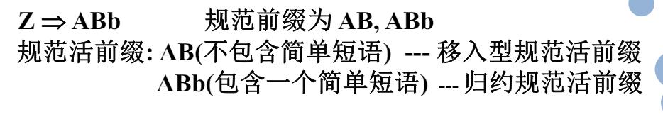

### Elimination of Left Recursion

general case：

First,group the productions as

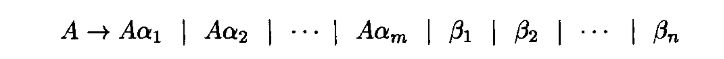

where no βi begins with an A.Then,replace the A-productions by


但是上述算法解决不了涉及>=2个左递归的情况 it does not eliminate left recursion involving derivations of two or more steps：

for example：    

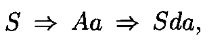

### Left Factoring

When the choice between two alternative A-productions is not clear,we may be able to rewrite the productions to defer the decision until enough of the input has  been seen that we can make the right choice.

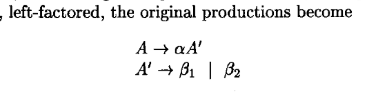

### Recursive-descent

General recursive-descent may require backtracking;that is,it may require repeated scans over the input.一般的递归下降需要回溯，即重复扫描输入

#### [LL（1）grammer](https://www.cnblogs.com/Fortunater/articles/12883910.html)

##### first set


如果ε在FIRST(α)中，这表明存在至少一种从α开始的推导，使得α最终推导为一个空字符串。

##### follow set


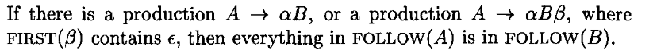

这里切记**左边是右边的子集**

第一步中，**$**加入到起始非终结符的follow set集合中

follow set只针对于**非终结**符号

##### lookahead sets


Predictive parsers,that is,**recursive-descent** parsers needing no backtracking, can be constructed for a class of grammars called **LL(1)**.

- The first "L"in LL(1)stands for scanning the input from left to right从左到右扫描输入
- the second "L"for producinga leftmost derivation,最左推导的产生式
-  the "1"for using one input symbol of lookahead at each step to make parsing action decisions.

老师ppt对**LL(1)前提**的简化版，易于理解
A grammar is LL(1)grammar if the following conditions are satisfied:
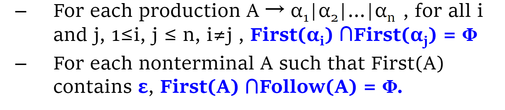

##### [select集合](https://www.cnblogs.com/Fortunater/articles/12883910.html)

###### **SELECT 集的定义**

Select（A–>B）就是求这个产生式中A可能推导出起始符号集合**（不包含空串ε）。**

**注：** 注意区分 FIRST 集 FOLLOW 时是对 α 还是 A

> 给定文法 G，对于产生式 A→α，α ∈ V*，则可选集 SELECT(A→α) 有：
> （1）若 α ≠ ε，且 α ≠+> ε，则 SELECT(A→α) = FIRST(α)
> （2）若 α ≠ ε，但 α =+> ε，则 SELECT(A→α) = FIRST(α) ∪ FOLLOW(A)
> （3）若 α = ε，则 SELECT(A→α) = FOLLOW(A)

###### **描述：**

- 第 1 条是，当 α ≠ ε，且通过1次或多次推不出 ε，SELECT(A→α) = FIRST(α)

- 第 2 条是，当 α ≠ ε，但 α 经有限步可推出 ε，SELECT(A→α) = FIRST(α) ∪ FOLLOW(A)
  （注意是一个 α，一个 A）

- 第 3 条是，当 α = ε，SELECT 集就等于左部 A 的 FOLLOW 集

  解题时，先判断是否为 ε，是则用第（3）条，否则再判断能否通过1次或多次推出 ε，是则用第（2）条，否则用第（1）条

  求 FIRST，FOLLOW，SELECT 集详细例题可参考：
  [《编译原理》-用例题理解-自顶向下语法分析及 FIRST，FOLLOW，SELECT集，LL(1)文法](https://www.cnblogs.com/xpwi/p/10987443.html)

##### LL（1）文法判别--select集，更加快速-法一

观察所有Select集**，若左部相同的产生式的Select集的交集不为空，**则不符合LL(1)文法，否则满足。

**拿上述例子为例：**Select(A->+TA) = {+}，Select(A->ε) = {#, )}。 Select(A->+TA) ∩ Select(A->ε) = ф；

 Select(B->*FB) = {*}，Select(B->*ε) = {+, #, )}。Select(B->\*FB) ∩ Select(B->*ε) =ф

 综上所述每个产生式的Select集没有交集，故上述的例子所示文法为LL(1)文法

##### LL(1)文法的识别/判断-4部-的方法-法二

1. 求出可空非终止符的集合（nullable nonterminal）

2. 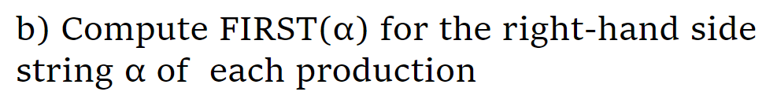

3. 

4. 

example：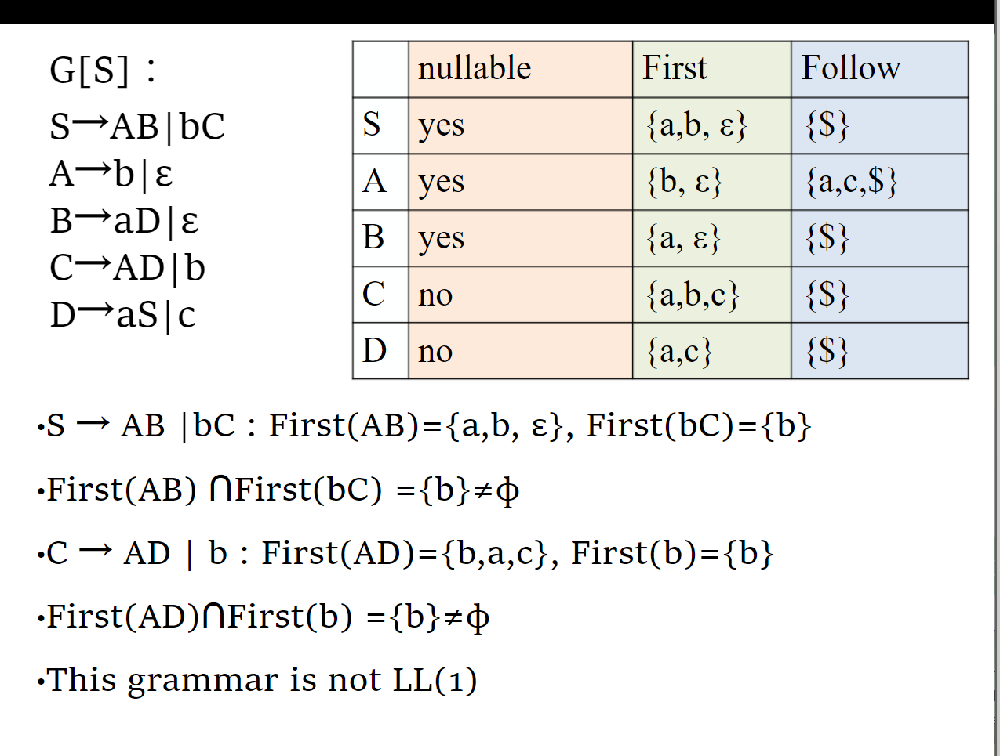

只需要知道每个非终结符的first、follow的set以及可空非终结符（求first要用），其余的可以借助规则迅速推导，结合以下条件判断即可


一定不是LL(1)的情况：有左递归或者左公因子之一，一定不是LL(1）;但是二者皆没有不能保证一定是LL（1）文法

### 预测分析表的构造利用select集合

**预测分析表大白话理解：**

- 定义与作用：预测分析表根据Select集建立，把产生式放到对应的非终结符和终结符所确定的表位置中。作用即根据分析栈中的栈顶元素和符号串的串首字符选择正确的产生式。

**举例构造**


```
E->TA
A->+TA|ε
T->FB
B->*FB|ε
F->i|(E)
```

- Select集


```
Select(E->TA)= ['i', '(']
Select(A->+TA)= ['+']
Select(A->ε)= ['#', ')']
Select(T->FB)= ['i', '(']
Select(B->*FB)= ['*']
Select(B->ε)= ['+', '#', ')']
Select(F->i)= ['i']
Select(F->(E))= ['(']
```

- 预测表

  将每个产生式放到产生式左部非终结符所对应的行，列表中各个终结符所对应的列，最终得


```
---------------------------------------------------------
|       |   +   |   *   |   i   |   (   |   )   |   #   |
---------------------------------------------------------
|   E   |       |       |  TA   |  TA   |       |       |
---------------------------------------------------------
|   A   |  +TA  |       |       |       |   ε   |   ε   |
---------------------------------------------------------
|   T   |       |       |  FB   |  FB   |       |       |
---------------------------------------------------------
|   B   |   ε   |  *FB  |       |       |   ε   |   ε   |
---------------------------------------------------------
|   F   |       |       |   i   |  (E)  |       |       |
---------------------------------------------------------
```

### [construction of Predictive parsing table](https://www.cnblogs.com/xpwi/p/11065006.html) 

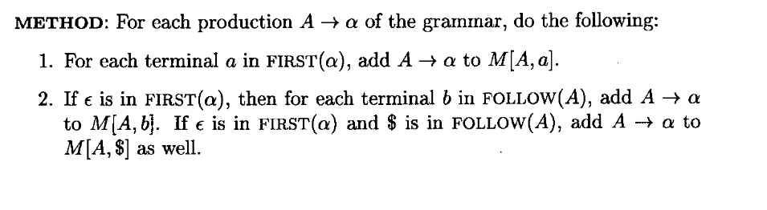

### Model of a table-driven predictive parser

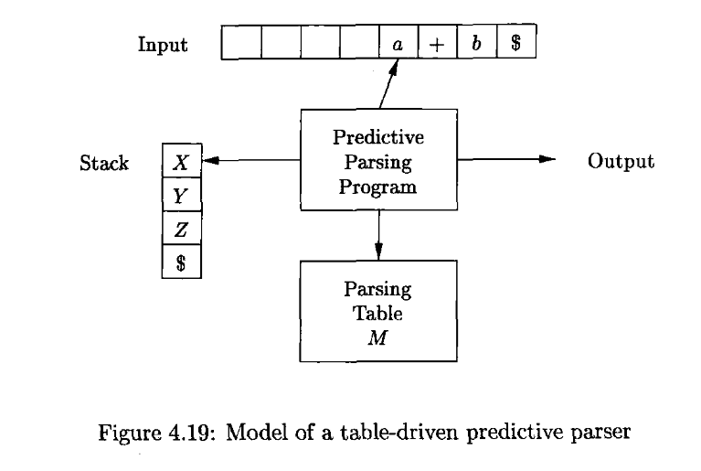

栈中最开始存放start symbol，input buffer存放输入，$代表栈底或者输入结束

METHOD:Initially,the parser is in a configuration with **w$**in the input buffer and the start symbol S of G on top of the stack,above $The program in Fig.4.20 uses the predictive parsing table M to produce a predictive parse for the input.

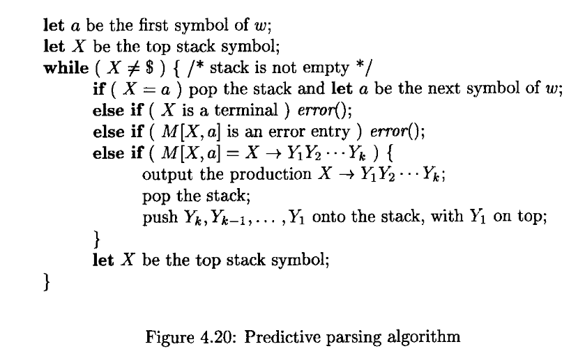

注意产生式右部压栈的时候，最开始的在栈顶（即Y1在栈顶），每次循环判断栈顶是否与输入buffer中当前所指的终结符匹配，匹配则弹栈，输入后移，栈中存放待处理的元素

### Bottom-Up Parsing

#### LR（0）

每个规范集合确实可以被看作是一个状态

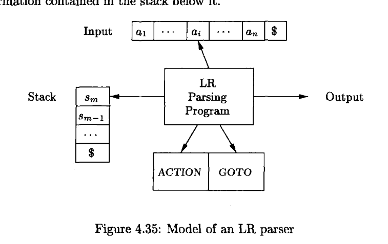

在LR(0)分析器中，决定是执行规约（reduction）操作还是移进（shift）操作，完全依赖于当前的栈顶状态和即将处理的输入符号。栈顶状态含有一组LR(0)项，这些项指导解析器如何响应输入符号。下面是如何根据栈顶状态来决定采取何种操作的过程：

##### 栈顶状态和解析决策

1. **查看栈顶状态**：
   - 每个状态是一组LR(0)项的集合，其中每一项都是一个产生式规则，带有一个“点”表示当前解析的进度。

2. **分析栈顶状态中的项**：
   - 如果点后面有符号（即点不在末尾），这意味着解析器在这个状态下期待看到某个特定的输入符号。
   - 如果点在末尾，这意味着对应的产生式可以进行规约。

3. **决定操作**：
   - **移进操作（Shift）**：如果栈顶状态中存在形如 `A -> α.Xβ` 的项，且当前的输入符号是 `X`，那么解析器将执行移进操作。解析器将输入符号 `X` 和转移到的新状态压入栈中。
   - **规约操作（Reduction）**：如果栈顶状态中存在形如 `A -> α.` 的项（点在末尾），无论当前输入符号是什么，解析器都将执行规约操作。规约时，根据产生式 `A -> α`，将栈顶的若干状态（与产生式右侧 `α` 的长度相等）弹出栈，然后把产生式左侧的非终结符 `A` 压入栈中。接着，解析器查看新的栈顶状态和非终结符 `A` 对应的转移，将转移后的状态压入栈中。

##### 示例

假设栈顶状态包含以下项：
- `S -> .AB`
- `A -> a.`
- `B -> b.`

并假设当前输入符号是 `a`：
- 因为存在项 `A -> a.` 且点在末尾，根据这个产生式进行规约操作，把 `a` 规约为非终结符 `A`。
- 如果输入符号是 `b`，且存在项 `B -> .b`，则进行移进操作。

##### 注意
实际的LR(0)解析器还需要一个分析表（parsing table），其中包含了对于每个状态和输入符号组合应采取的动作（移进、规约、接受或错误）。这个表是根据所有状态和所有输入符号预先计算和填充的。

##### 移进-规约冲突的发生条件

移进-规约冲突发生在以下情况下：

1. **移进冲突**：当前状态的一个项形如 `A -> α.Xβ`，其中 `X` 是当前的输入符号，这意味着根据当前的输入符号，解析器可能会选择执行移进操作。
2. **规约冲突**：同一状态还有另一个项形如 `B -> γ.`，点在末尾，这意味着可以根据这个产生式规约，无论当前的输入符号是什么。

当这两种情形在同一状态中同时出现时，解析器无法仅凭当前信息决定是应该移进还是规约，因此产生冲突。

#### 4.5.2 SLR

##### LR（0）存在的问题

移进-规约冲突发生在以下情况下：

1. **移进冲突**：当前状态的一个项形如 `A -> α.Xβ`，其中 `X` 是当前的输入符号，这意味着根据当前的输入符号，解析器可能会选择执行移进操作。
2. **规约冲突**：同一状态还有另一个项形如 `B -> γ.`，点在末尾，这意味着可以根据这个产生式规约，无论当前的输入符号是什么。

当这两种情形在同一状态中同时出现时，LR（0）解析器无法仅凭当前信息决定是应该移进还是规约，因此产生冲突。

使用LR（0）的状态集即可

The SLR method begins with LR(0)items and LR(O)automata；

That is,given a grammar,G,we augment G to produce G' with a new start symbol S'.From G',we construct C,the canonical collection
of sets of items for G'together with the GOTO function增广文法->规范集合

当LR（0）遇到既可规约也可以shift的情况的时候，由于无法判断上下文情况，它不知道当如果规约，当前的是否为句柄，即

##### slr基本思想

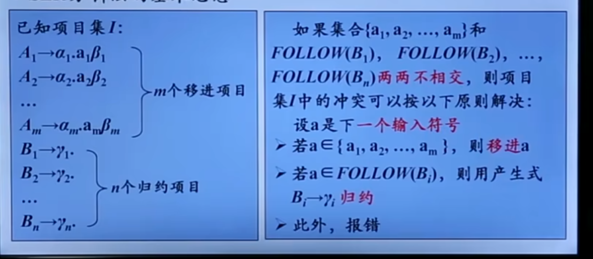

##### [SLR（1）分析表构建](https://www.jianshu.com/p/ad8af79e49b5)

语法分析表由两部分组成，一个语法分析**动作函数ACTION**和一个**转换函数GOTO**

1. ACTION函数有两个参数：一个是状态i,另一个是终结符号a(或是输入标记符号$)，ACTION[i,a]有四种形式

   - 移入j，j是一个状态
   - 归约A->β
   - 接受
   - 报错

2. 我们把定义在项集上的GOTO函数拓展为定义在状态集上的函数：如果**GOTO[Ii，A]=Ij**,那
   么GOTO也把状态i和一个非终结符号A映射到状态j。

3. 构建表示，我们约定：

   1. si表示移入并将状态压栈
   2. rj表示按照编号j的产生式归约
   3. acc表示接受
   4. 空白表示报错

4. 示例文法

   E ——> E + T | T
   T ——> T * F | F
   F ——> ( E ) | **id**

   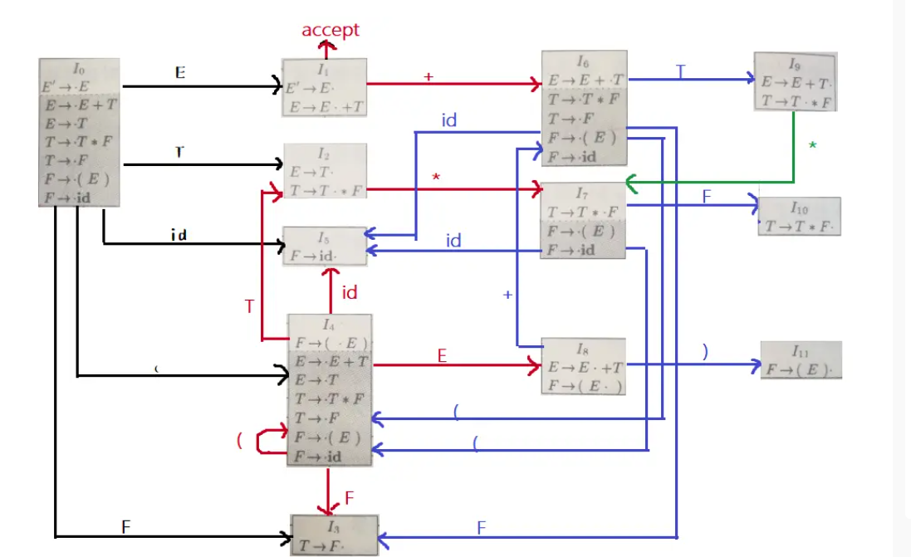

   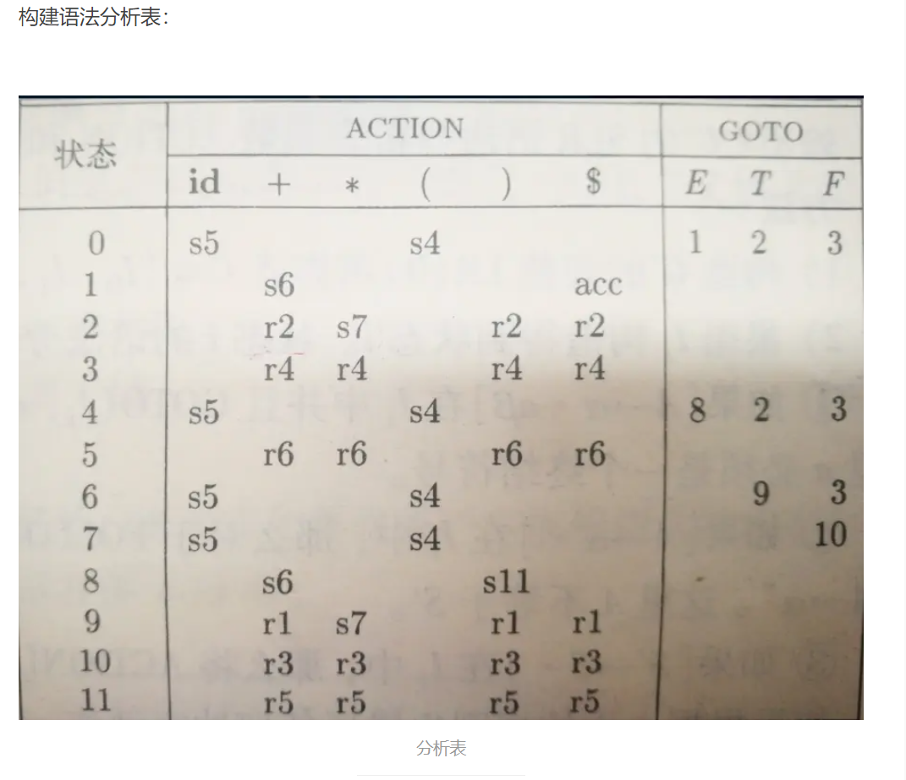

##### [SLR分析器（过程）](https://www.cnblogs.com/aishanyishi/p/10305031.html)

普通的shift、reduce 才会是一个STACK（没有引入ITEM状态），只是不断shifit直到能够reduce，reduce到不能reduce再继续shift；

分为四列：状态栈、符号栈、输入、action

1. 状态栈、符号栈不作为action判断依据，action取决于**状态栈顶和input最左部分**在解析表中对应的action表项；
2. GOTO用于规约后添加新状态到状态站栈中，判断依据为reduce使用的产生式的左部以及去除R（为reduce产生式右部长度）个状态后的状态栈的顶部

- LR分析器由三个部分组成：
- 其中:SP为栈指针，S[i]为状态栈，X[i]为文法符号栈。状态转换表用GOTO[i，X]=j表示，规定当栈顶状态为i，遇到当前文法符号为X时应转向状态j，X为终结符或非终结符。
- ACTION[i，a]规定了栈顶状态为i时遇到输入符号a应执行。动作有四种可能：

(1)移进：

action[i，a]= Sj：状态j移入到状态栈，把a移入到文法符号栈，其中i,j表示状态号。

(2)**归约**：

action[i，a]=rk：当在栈顶形成句柄时，则归约为相应的非终结符A，即文法中有A- B的产生式，若**B的长度为R**(即|B|=R)，则从**状态栈和文法符号栈中自顶向下去掉R个符号**，即栈指针SP减去R，并把A移入文法符号栈内，j=GOTO[i,A]移进状态栈，其中**i为修改指针后的栈顶状态**。

(3)接受acc:

当归约到文法符号栈中只剩文法的开始符号S时，并且输入符号串已结束即当前输入符是'$'，则为分析成功。

(4)报错:

当遇到状态栈顶为某一状态下出现不该遇到的文法符号时，则报错，说明输入端不是该文法能接受的符号串。

#### LR（1）

##### SLR存在的问题

SLR只是简单地考察下一个输入符号b是否属于与归约项目A→a相关联的FOLLOW(A),但b∈FOLLOW(A)只是归约的一个**必要条件**，而**非充分条件**

##### LR（1）提出

对于产生式
$$
A→\alpha
$$
的归约，在不同使用位置，会要求不同的后继符号,在特定位置，A的后继符集合是**FOLLOW(A)的子集**;SLR仅仅判断是否是在FOLLOW中，扩大了规约条件的范围；也导致SLR会出现归约和移进的冲突

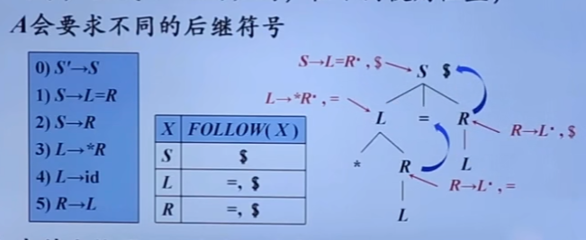

将一般形式为A→aB,a的项称为LR(1)项，其中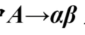是
一个产生式，**a**是一个**终结符**（这里将$视为一个特殊的终结符）它表示在当前状态下，A后面必须紧跟终结符，称为该项的**展望符(lookahead)**

1. LR(1)中的1指的是项的第二个分量的长度,形如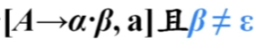项中，展望符a没有任何作用
2. 但是一个形如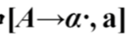的项在只有在**下一个输入符号等于a**时才可以按照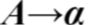进行归约
3. 这样的a的集合总是FOLLOW(A)的子集，而且它通常是一个真子集


##### LR(1)自动机

规范集合构建,不再依靠宽泛的识别下一个输入，而是利用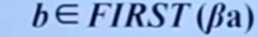

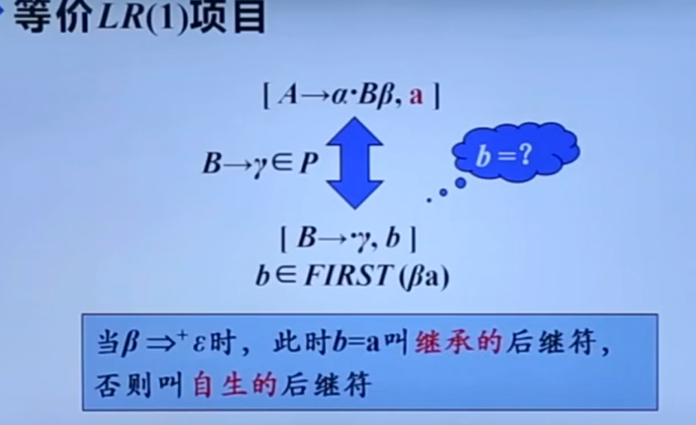

细化状态，状态增多：解决方案-

如果除展望符外，两个LR(1)项目集是相同的，则称这两个LR(1)项目是同心的，然后就可以在LALR中进行合并-只要项目的第一个分量相同就可以进行合并

##### LR（1）分析表构造算法

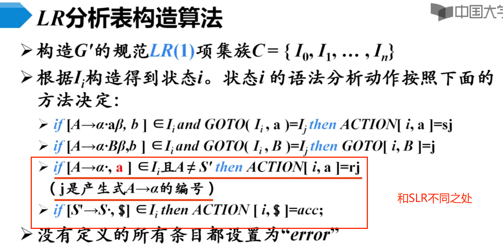

##### 总结

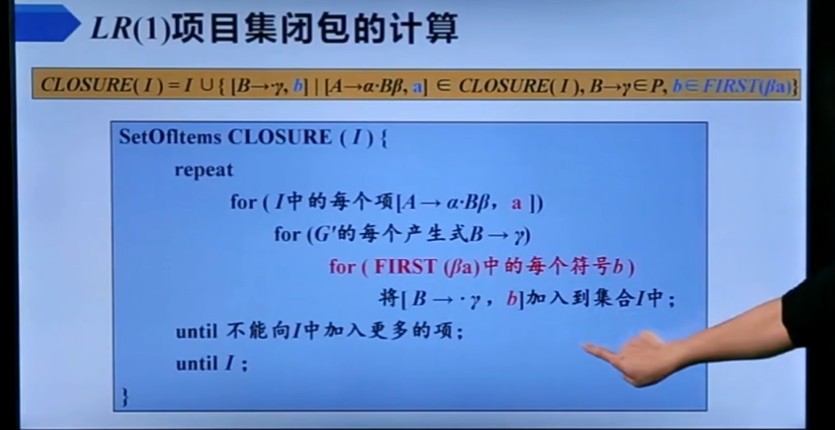

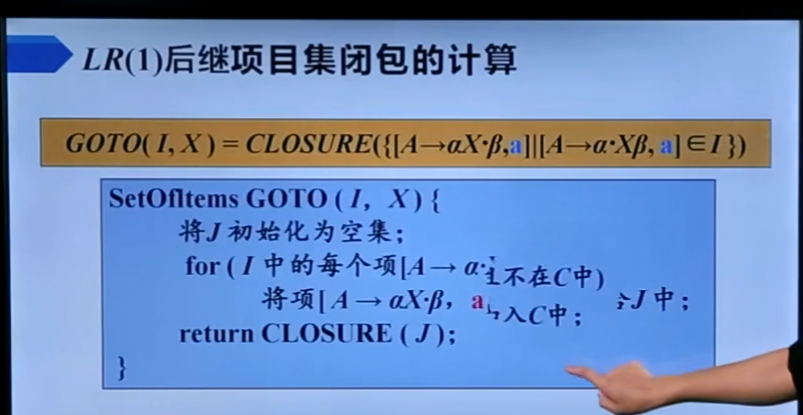’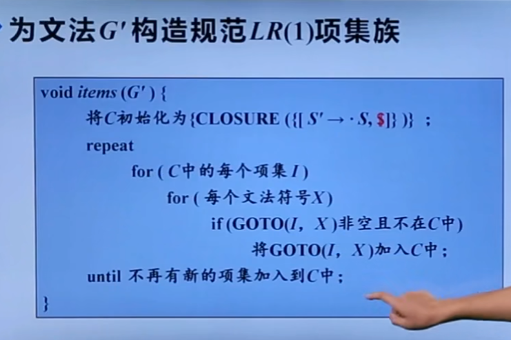

#### LALR

LR(1)对LR(0)进行分裂，状态增多，太多

##### LALR(lookahead-LR)分析的基本思想

1. 寻找具有相同核心（行为不冲突）的LR(1)项集，并将这些项集合并为一个项集。所谓项集的核心就是其第一分量的集合
2. 然后根据合并后得到的项集族构造语法分析表
3. 如果分析表中没有语法分析动作冲突，给定的文
   法就称为LALR(1)文法，就可以根据该分析表
   进行语法分析

如果除展望符外，两个LR(1)项目集是相同的，则称这两个LR(1)项目是同心的，然后就可以在LALR中进行合并-只要项目的第一个分量相同就可以进行合并，合为同一个状态

##### 归约-归约冲突

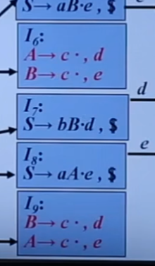


**状态6和9**合并后会产生归约冲突，由于合并时其实是合并展望符，其只在归约时起作用；即不会对移进产生影响，那么**不会产生移进-归约**冲突（前提是合并前确保无冲突）

##### 推迟错误发现

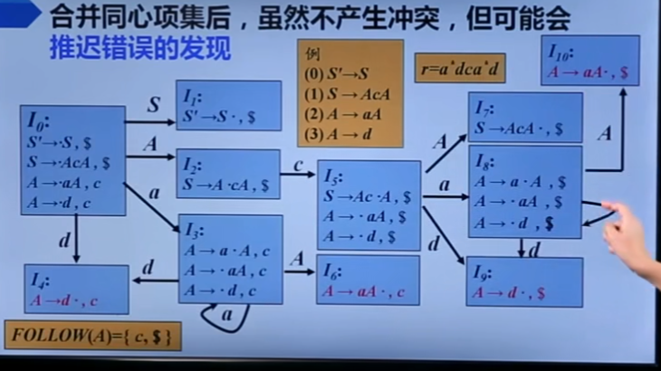

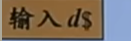

例如输入如上图所示内容，由正则表达式可得，这个式子显然是错误的；在没有合并时，I4会直接报错；但是合并同心项目集I4、I9后，会进行归约操作，露出状态一（I0），进入到I2，然后才会报错

LALR分析法可能会作多余的归约动作，但绝不会作错误的移进操作

##### LALR(1)特点

- 形式上与LR(1)相同

- 大小上与LR(O)/SLR相当，合并同心，实际上就是LR（0）项目集

- 分析能力介于SLR和LR(1)二者之间

  SLR<LALR(1)<LR(1)

- 合并后的展望符集合仍为FOLLOW集的子集

#### 二义性文法

每个二义性文法都不是LR的
某些类型的二义性文法在语言的描述和实现中很有用，因为非二义性文法总是需要引入额外的非终结符号

>更简短、更自然

但是仍然可以进行LR分析，只是需要严格控制条件：

##### 二义性分析LR举例

1. 这里就是需要使用优先级和结合性的来解决冲突，例如状态7遇到输入+时，由于+是左结合，必须先处理栈内，则需要进行归约而不是移进；状态7遇到\*时，由于\*优先级高，则需要先移进，而不是归约栈内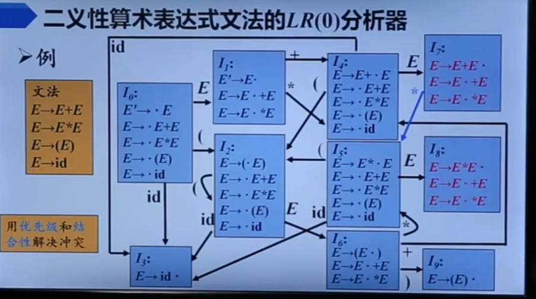

2. 就近原则消除歧义

   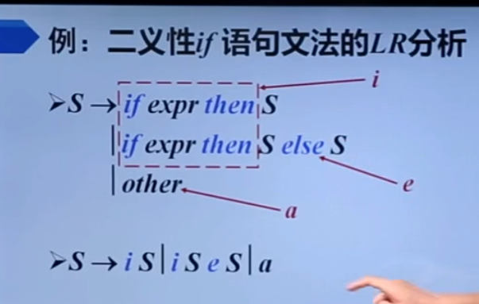

   状态4遇到e时，既可reduce也可以shift，但是选择移进else,以便让它与前面的then（因为else的出现必须有if做为前置条件，而if then捆绑出现）配对

   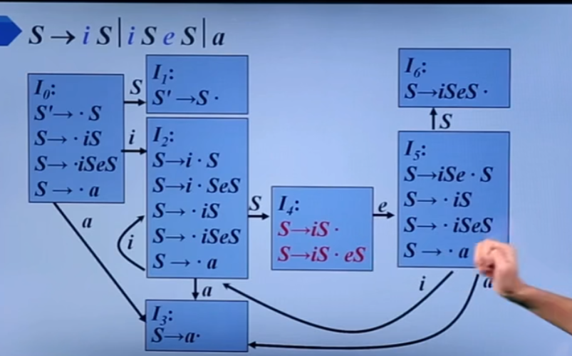

##### 二义性文法的使用

应该保守地使用二义性文法，并且必须在严格控制之下使用，因为稍有不慎就会导致语法分析器所识别的语言出现偏差

#### 语法错误恢复

##### panic恐慌模式恢复

检查栈

##### 短语层次

检查住转换表

构造错误恢复例过

## 语义分析

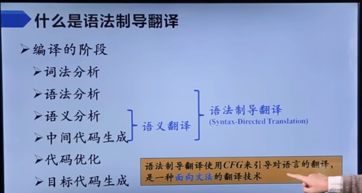

语法制导翻译使用CFG来引导对语言的翻译，是一种面向文法的翻译技术，它是在进行语法分析的同时也进行语义分析


### 综合属性和继承属性定义

•**综合属性**(synthesized attribute)：在分析树结点N上的非终结符号A的属性值由N对应的产生式所关联的语义规则来定义。

–通过N的**子结点或N本身**的属性值来定义

•**继承属性(i**nherited attribute)：结点N的属性值由N的父结点所关联的语义规则来定义。

–依赖于N的**父结点、N本身和N的兄弟结点**上的属性值。

•不允许N的继承属性通过N的子结点上的属性来定义，但是允许N的综合属性依赖于N本身的继承属性。

•终结符号有综合属性（由词法分析获得），但是没有继承属性。

如果一条语义规则的作用和求值无关，如打印一个值或向符号表中添加记录，则成为生成式左侧非终结符的**虚拟综合属性**

**常见的虚拟综合属性**：

- print(any)
  - 打印any
- addtype(id.entry, type)
  - 在符号表中为符号id添加符号类型（变量类型）type
  - id.entry指明符号id在符号表中的入口

没有虚拟综合属性的文法称为**属性文法**（即只需要计算属性的文法

### 依赖图画法

综合属性放在对应节点的右侧

继承属性放在节点左侧

箭头从被依赖者出发

虚从综合属性是不标记符号

### 属性值计算顺序

有向图线性拓扑排序（依赖者序号大于被依赖者），顺序可以调换-可能序列不唯一；

1. 只有综合属性的SDD，任意从顺序自底向上计算节点属性
2. 同时具备**继承、综合属性**的SDD不一定存在一个顺序对各个节点的属性进行求值（存在环形）

如果没有环，至少存在一个拓扑顺序

### S-SDD

只使用综合属性的SDD（S属性定义）

每个节点属性依赖于子节点的属性值，可以在自底向上的语法中实现

### L-SDD

L属性的SDD，

直观定义：一个产生式所关联的各个属性之间，依赖图的边**可以从左到右**，不能是从右到左（Left）

#### 正式定义

一个SDD是L-属性定义，当且仅当它的每个属性要么是一个综合属性，要么是满足如下条件的继承属
性：

假设存在一个产生式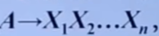,其右部符号X:(1≤i≤)的继承属性仅依赖于下列属性：

- A的**继承属性**（父亲节点的属性)，如果依赖父节点的综合属性会成环
- 产生式中Xi**左边**的符号X1,X2,…,Xi-1为属性
- X本身的属性，但X的全部属性不可以在依赖图中形成环

每一个S属性定义一定是L属性定义

### SDT

语法制导翻译方案是在**产生式右部**嵌入了程序片段（称之为语义动作）的CFG

SDT是SDD的具体实施方案

SDT可在语法分析中实现：

- 基本文法可以使用LR分析技术，且SDD是S属性
- 基本文法可以使用LL分析技术，且SDD是L属性的

### S-SDD->SDT

综合属性定义转换，每个产生式语义动作需要所在产生式右部末尾即可，成为SDT

如果其基本文法可以使用LR分析技术，则SDT可以在LR语法分析过程中实现

当**归约**发生时进行相应语义动作（此时产生式右边已经处理完）

扩展的LR语法分析栈，使用附加域来存放综合属性值

需要注意

SLR的语法分析栈规则															

#### 将语义动作中的抽象定义式，改写成具体可执行的栈操作

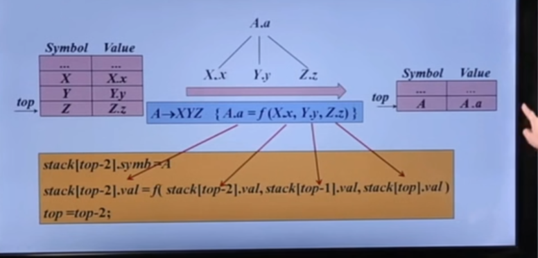

#### 例子：自底向上的语法分析栈中实现桌面计算器


### L-SDD->SDT

- 将计算某个非终结符号A的**继承属性**（inh）的动作插入到产生式**右部中紧靠在A的本次出现之前**的位置上
- 将计算一个产生式左部符号的**综合属性**（syn）的动作放置在这个产生式右部的**最右端**

如果其基本文法可以使用LL分析技术（具有），那么它的SDT可以在LL或者LR语法分析过程中实现


#### 非递归的预测分析过程中实现语法制导翻译

终结符只有继承属性，属性的值由词法分析提供

扩展语法分析栈

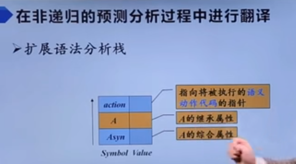

##### 语义动作——分析栈中的每一个记录都对应着一段执行代码

1. 综合记录出栈时，要将综合属性值复制给后面特定的语义动作
2. 变量展开时（即变量本身的记录出栈时），如果其含有继承属性，则要将继承属性值复制给后面特的语义动作

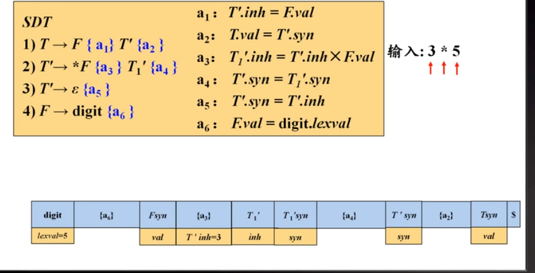

#### 在递归预测的分析过程中进行分析

F（继承属性）=综合属性

为每个非终结符号A构造一个函数，A的继承属性对应该函数的一个形参，函数的返回值是A的综合属性值

##### 算法

- 为每个非终结符A构造一个函数，A的每个继承属性对应该函数的一个形参，函数的返回值是A的综合属性值。对出现在A产生式中的每个文法符号的每个属性都设置一个局部变量

- 非终结符A的代码根据当前的输入决定使用哪个产生式

- 与每个产生式有关的代码执行如下动作：从左到右考虑
  产生式右部的词法单元、非终结符及语义动作

  - 对于带有**综合属性**x的词法单元X,把的值保存在局部变量X.x中；然后产生一个匹配X的调用，并继续输入

  - 对于非终结符B,产生一个右部带有函数调用的赋值语句c:B(b1,b2,,b),其中，b1,b2,,bk是代表B的继承属性的变量，C是代表B的综合属性的变量

  - 一对于每个动作，将其代码复制到语法分析器，并把对属性的引用改为对相应变量的引用

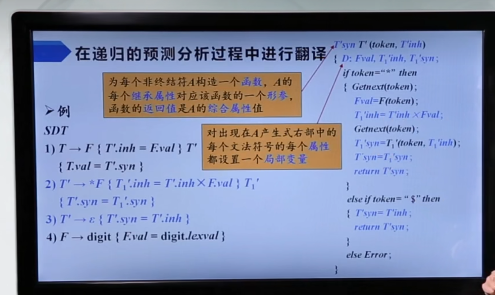

#### L——属性定义的自底向上翻译

以LL文法为基础的L-SDD。可以修改这个文法，并在LR语法分析过程中计算这个新文法之上的SDD

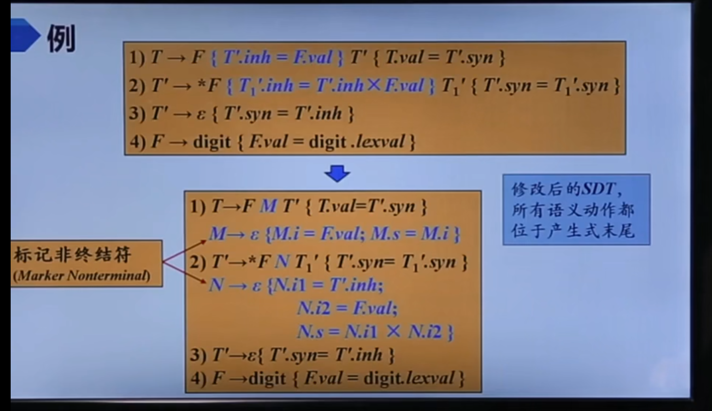

##### 为SDT中的语义动作编写执行代码

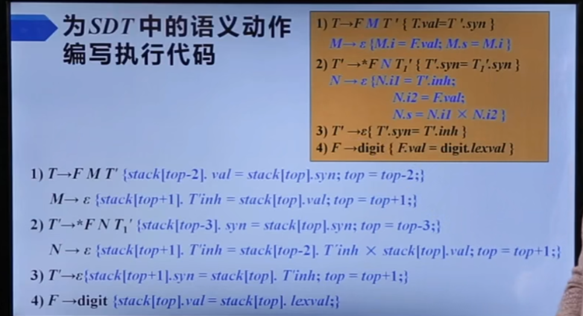

##### 给定一个以LL文法为基础的L-属性定义，可以修改这个文法，并在LR语法分析过程中计算这个新文法之上的SDD

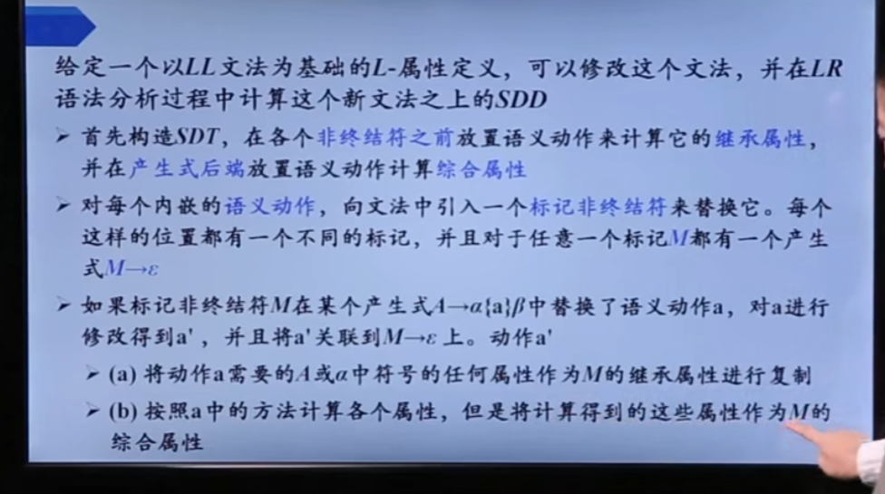

- 首先构造SDT,在各个非终结符之前放置语义动作来计算它的继承属性，并在产生式后端放置语义动作计算综合属性
- 对每个内嵌的语义动作，向文法中引入一个标记非终结符来替换它。每个这样的位置都有一个不同的标记，并且对于任意一个标记M都有一个产生式M→8
- 如果标记非终结符M在某个产生式A→a{aB中替换了语义动作a,对a进行修改得到a',并且将a'关联到M一→8上。动作a
  (a)将动作a需要的A或a中符号的任何属性作为M的继承属性进行复制
  (b)按照中的方法计算各个属性，但是将计算得到的这些属性作为M的综合属性

## 中间代码生成

### 三地址码的定义

三地址码简介
三地址码（Three Address Code）是一种最常用的中间语言，编译器可以通过它来改进代码转换效率。每个三地址码指令，都可以被分解为一个四元组（4-tuple）的形式：（运算符，操作数1，操作数2，结果）。由于每个陈述都包含了三个变量，即每条指令最多有三个操作数，所以它被称为三地址码。

### 三地址码和三地址指令的区别

三地址指令和三地址码都是编译器在生成目标代码的中间步骤中使用的一种表示形式，它们都用于表示一些基本的操作，如算术运算、逻辑运算、数据移动等。这两者的主要区别在于它们的使用场景和表示方式。

1. 三地址指令：这是一种更接近于机器语言的表示形式，通常用于目标代码的生成。三地址指令通常包含一个操作码和三个操作数，其中一个操作数用于存储操作的结果。例如，`ADD R1, R2, R3` 是一个三地址指令，表示将寄存器 R2 和 R3 中的值相加，然后将结果存储在寄存器 R1 中。

2. 三地址码：这是一种更接近于高级语言的表示形式，通常用于编译器的优化阶段。三地址码通常包含一个操作符和三个操作数，其中一个操作数用于存储操作的结果。例如，`x = y + z` 是一个三地址码，表示将变量 y 和 z 的值相加，然后将结果赋值给变量 x。

总的来说，三地址指令和三地址码都是编译器在生成目标代码的过程中使用的中间表示形式，但它们在表示方式和使用场景上有所不同。

### 类型表达式（Type Expression）

- **基本类型**是类型表达式char
- 可以为类型表达式命名，**类型名**也是类型表达式
- 将**类型构造符**(type constructor)作用于类型表达式可以构成新的类型表达式
  - 数组构造符array
    - 若T是类型表达式，则ar四(I,T)是类型表达式(I是一个整数)
  - 指针构造符（pointer）
  - 笛卡尔乘积构造符 *
  - 函数构造符号 ->
  - 记录构造符 record

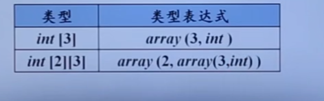

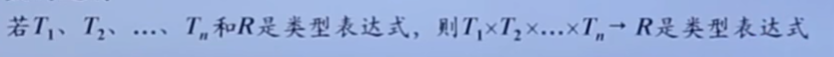

R是返回值类型，T是参数值类型


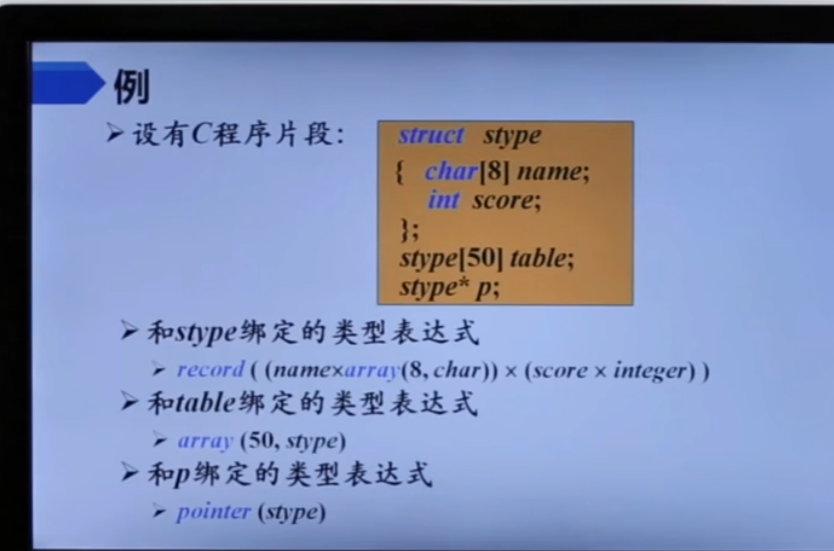

### 声明语句


局部变量的存储分配

对于声明语句，语义分析的主要任务就是收集标识符的**类型**等属性信息，并为每一个名字分配一个**相****对地址**

- 从类型表达式可以知道该类型在运行时刻所需的存储单元数量称为类型的宽度(width)
- 在编译时刻，可以使用类型的宽度为每一个名字分配一个相对地址

名字的类型和相对地址信息保存在相应的符号表记录中

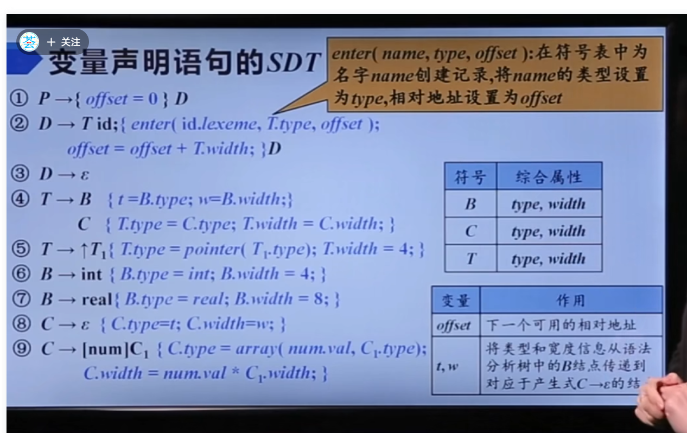

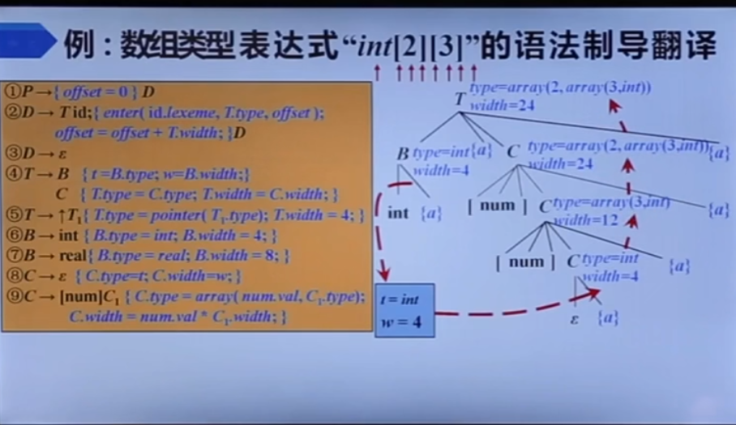

### 赋值语句

生成对表达式求值的三地址码


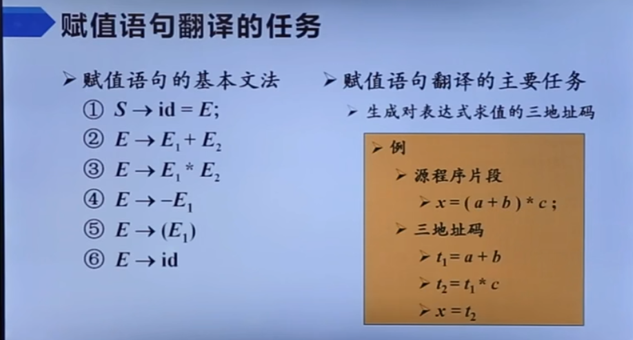

赋值语句的SDT


code是非终结符号对应的的三地址码

addr存放表达式的值的存放地址

#### 增量翻译

在增量方法中，gen()不仅要构造出一个新的三地址指令，还要将它添加到至今为止已生成的指今序列之后


例子：


### 数组引用的翻译-

将数组引用翻译成三地址码时要解决的主要问题是确定数组元素的存放地址，也就是数组元素的**寻址**


### 控制流语句及其SDT


#### 例子

不是LL（1）文法，不能实现自顶向下


#### 通用SDT实现方法

从左到右的深度优先


##### 例子


### 布尔表达式的SDT


### 布尔表达式的回填（Backpatch）

不需要将标号重新处理，变为指令

#### 基本思想

生成一个跳转指令时，暂时不指定该跳转指令的目标标号。这样的指令都被放入由跳转指令组成的列表中。**同一个列表中的所有跳转指令具有相同的目标标号**。等到能够确定正确的目标标号时，才去填充这些指令的目标标号

#### 非终结符B的综合属性

1. B.truelist:指向一个包含跳转指令的列表，这些指令最终获得的目标标号就是当B为真时控制流应该转向的指令的标号
2. B.falselist::指向一个包含跳转指令的列表，这些指令最终获得的目标标号就是当B为假时控制流应该转向的指令的标号

#### 函数


### 控制流语句的回填——不熟悉——做题——和回填的区别


### switch语句翻译

#### 翻译一——不高效


#### 翻译二——高效

将测试代码集中在一起

在代码生成阶段，根据分支的个数以及这些值是否在一个较小的范围内，这种条件跳转指令序列可以被翻译成最高效的路分支


### 过程调用语句


# 问题

## 消除左递归，出现大于等于两个递归的情况

二义性分析LR举例

语法错误恢复

### 控制流

#### label

•Labels

•TAC allows for **named** **labels** indicating particular points in the code that can be jumped to.

•There are two control flow instructions:

–**Goto**  **label****;**

–**if** **value**  **Goto** **label****;**

•Note that **If** is always paired with **Goto**.

#### if while

•If- and While-statements

 if-stmt  → if (exp) stmt 

 | if (exp) stmt else stmt

 while-stmt → while (exp) stmt

•The chief problem in generating code for such statements is to translate the structured control features into an “unstructured” equivalent involving jumps


#### newlabel

•Functions used in code generation

 newlabel() returns a new label each time it is called

•Attributes

•E.true(E.false) is the label to which control flows if E is true(false)

•S.next is a label that is attached to the first three-address instruction to be executed after the code for S

•S.begin is a label that is attached to the first instruction generated of code for S


#### code


## AST

解析树具体表现形式
例如：
5+（12*1）根据对应的文法生成的解析树为：

得出产生式：

E -> E+E
E -> E*E
E -> (E)
E -> number
由上总结出解析树的一些特质：

解析树的根节点为文法开始符号
解析树内部节点可以表示一个产生式的应用
叶节点既可以是非终结符也可以是终结符。从左到右的叶节点得到的符号串成为这棵树的产出。
抽象语法树的具体表现形式
上图中得到的是一个具体语法树结构，该图中有些节点看上去有点冗余，这种节点叫做单继承节点，即我们可以将它简单化，如下图：

上图就是一个压缩之后的解析树，也就是抽象语法树。由此可以总结出一些解析树和抽象语法树的不同之处：

1. AST不含有语法细节，比如冒号、括号、分号
2. AST会压缩单继承节点
3. 操作符会变成内部节点，不再以叶子节点出现在树的末端

————————————————

                            版权声明：本文为博主原创文章，遵循 CC 4.0 BY-SA 版权协议，转载请附上原文出处链接和本声明。

原文链接：https://blog.csdn.net/weixin_44480652/article/details/115053849

### AST 节点类型对照表

| 序号 | 类型原名称           | 中文名称      | 描述                                                  |
| ---- | -------------------- | ------------- | ----------------------------------------------------- |
| 1    | Program              | 程序主体      | 整段代码的主体                                        |
| 2    | VariableDeclaration  | 变量声明      | 声明一个变量，例如 var let const                      |
| 3    | FunctionDeclaration  | 函数声明      | 声明一个函数，例如 function                           |
| 4    | ExpressionStatement  | 表达式语句    | 通常是调用一个函数，例如 console.log()                |
| 5    | BlockStatement       | 块语句        | 包裹在 {} 块内的代码，例如 if (condition){var a = 1;} |
| 6    | BreakStatement       | 中断语句      | 通常指 break                                          |
| 7    | ContinueStatement    | 持续语句      | 通常指 continue                                       |
| 8    | ReturnStatement      | 返回语句      | 通常指 return                                         |
| 9    | SwitchStatement      | Switch 语句   | 通常指 Switch Case 语句中的 Switch                    |
| 10   | IfStatement          | If 控制流语句 | 控制流语句，通常指 if(condition){}else{}              |
| 11   | Identifier           | 标识符        | 标识，例如声明变量时 var identi = 5 中的 identi       |
| 12   | CallExpression       | 调用表达式    | 通常指调用一个函数，例如 console.log()                |
| 13   | BinaryExpression     | 二进制表达式  | 通常指运算，例如 1+2                                  |
| 14   | MemberExpression     | 成员表达式    | 通常指调用对象的成员，例如 console 对象的 log 成员    |
| 15   | ArrayExpression      | 数组表达式    | 通常指一个数组，例如 [1, 3, 5]                        |
| 16   | NewExpression        | New 表达式    | 通常指使用 New 关键词                                 |
| 17   | AssignmentExpression | 赋值表达式    | 通常指将函数的返回值赋值给变量                        |
| 18   | UpdateExpression     | 更新表达式    | 通常指更新成员值，例如 i++                            |
| 19   | Literal              | 字面量        | 字面量                                                |
| 20   | BooleanLiteral       | 布尔型字面量  | 布尔值，例如 true false                               |
| 21   | NumericLiteral       | 数字型字面量  | 数字，例如 100                                        |
| 22   | StringLiteral        | 字符型字面量  | 字符串，例如 vansenb                                  |
| 23   | SwitchCase           | Case 语句     | 通常指 Switch 语句中的 Case                           |

## 编译阶段


