# 网络层-数据平面

路由是全局功能：规划当前主机到目标主机的路径，依靠路由表，控制平面

转发是局部功能：选择端口功能，对到来的数据报和具体的网络交换设备进行局部交换，数据平面

网络连接

流表是网络设备中的一个关键组件，尤其在现代网络架构如SDN（Software Defined Networking）中扮演着非常重要的角色。流表包含了一系列的流表项（flow entries），这些表项基于预定义的规则来处理经过网络设备的数据流。

## 流表

### 流表的功能和操作

流表的核心功能是根据数据包的头部信息（如源地址、目的地址、端口号等）进行数据包的查找、转发或丢弃等操作。具体的操作可以包括：

1. **匹配**：流表中的每条记录都包含一套匹配规则，例如IP地址、传输协议和端口号等。当数据包到达时，系统会根据这些参数在流表中查找匹配的条目。
   
2. **动作执行**：每条流表项还定义了一系列的动作，这些动作在匹配成功时执行。动作可能包括转发、修改、丢弃或将数据包发送到控制器等。

3. **统计**：流表项通常还会收集流量统计信息，如通过该条目的数据包数量和数据字节数，这对于网络管理和监控是非常有用的。

### 流表在不同技术中的应用

1. **传统路由器和交换机**：
   - 在传统的网络设备中，流表可能被实现为路由表或MAC地址表，用于决定如何处理进入的数据包。

2. **软件定义网络（SDN）**：
   - 在SDN架构中，流表的概念被扩展并广泛应用。例如，OpenFlow协议定义了一种标准化方式来管理设备的流表。SDN控制器可以动态修改流表，实现灵活的网络流量管理。

3. **网络功能虚拟化（NFV）**：
   - 在NFV环境中，流表可以帮助虚拟网络功能（VNF）更有效地处理经过虚拟设备的流量。

### 流表的管理和挑战

管理流表主要涉及流表的维护、优化和扩展。在大型或动态的网络环境中，流表的大小和复杂性可能导致资源消耗和性能瓶颈。挑战包括：

- **资源限制**：硬件设备中的流表空间是有限的，过多的流表项可能耗尽资源。
- **性能问题**：流表查找速度直接影响网络性能。高效的查找算法和硬件加速（如使用TCAM）是提高性能的关键。
- **动态更新**：在SDN环境中，流表需要频繁更新以响应网络策略变化，如何快速而准确地更新成为一个挑战。

总结来说，流表是现代网络设备中处理和转发数据包的基础设施，特别是在SDN和其他高度可编程的网络环境中，流表的管理和优化是保证网络高效运行的关键。

## IP

### IP分组

在网络通信中，理解IP分组（IP packet）和帧（frame）的概念及其结构非常重要。以下是这两个基本网络单位的举例说明：

### IP分组举例

IP分组是在互联网协议（如IPv4或IPv6）上构建的数据传输单位。一个典型的IPv4分组包含以下几个关键部分：

1. **头部（Header）**：通常20-60字节，包含诸如版本、头部长度、服务类型、总长度、标识、标志、片偏移、生存时间（TTL）、协议、头部校验和、源IP地址和目的IP地址等信息。
2. **数据（Payload）**：跟随头部的数据部分，可以包含来自各种应用程序的数据。

假设您正在使用HTTP协议浏览网页，浏览器会发送一个IP分组，其中包含HTTP请求信息。一个简化的例子如下：

- **源IP地址**：192.168.1.100
- **目的IP地址**：93.184.216.34（例如，一个网站的服务器IP）
- **生存时间（TTL）**：64
- **协议**：TCP（因为HTTP基于TCP）
- **数据**：包含HTTP请求的详细信息，如`GET / HTTP/1.1`

### 帧举例

帧是数据链路层的传输单位，包括从一个网络设备到另一个网络设备的物理地址信息。以太网帧是最常见的类型之一，其结构包括：

1. **目的MAC地址**：接收设备的硬件地址。
2. **源MAC地址**：发送设备的硬件地址。
3. **类型**：表明上层协议，通常是IP。
4. **数据**：这部分包括网络层的数据包，如IP分组。
5. **校验序列**（Frame Check Sequence, FCS）：用于错误检测。

一个具体的以太网帧示例可能包含以下内容：

- **目的MAC地址**：01:23:45:67:89:AB
- **源MAC地址**：98:76:54:32:10:FE
- **类型**：0x0800（表示载荷是IPv4数据包）
- **数据**：包含上面举例的整个IP分组。
- **校验序列**：一组用于错误检测的数据。

### 数据流向

当数据从一个应用程序传送到另一个地点时，它首先被封装成一个或多个IP分组（网络层），然后每个IP分组被封装到一个或多个帧中（数据链路层），通过物理网络进行传输。在接收端，这个过程被逆向执行，帧被解码以提取IP分组，然后IP分组被进一步处理以恢复原始的应用数据。

这些基本单位确保了网络通信的有效性和可靠性，是网络工程和数据通信领域的核心概念。

### ip数据报格式

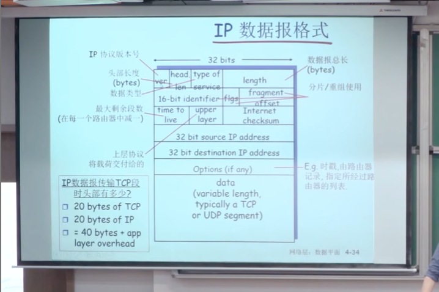

每一行4个字节，一共五行，固定头部20个字节；types of service是数据报类型，方便调度

第二行用于分片和重组，

TTL，time to leave；每过一个路由器，减一，抛弃后发回ICMP数据报到源主机

### Fragment分片和重组

MTU-最大传输单元=fragment的body大小，body部分承载IP数据报/分组（也有头部和body），输入输出大小不一致，不能直接切合分片会丢失头部信息

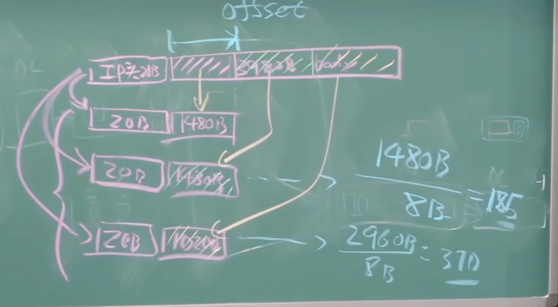

三片同个ID，来自同一分组，切片是8个字节最小单位；用offset来解决先传后到的问题；目标主机来重组，如果一定时间收不到全部分组，就会抛弃

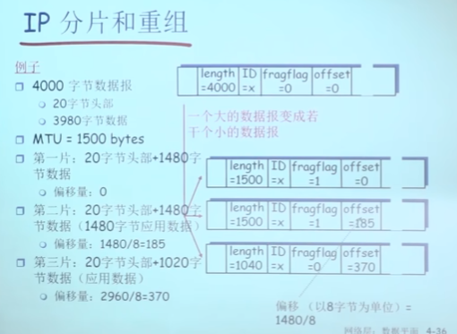

fragflag来标识是否还有下一片；0--最后一片

### IP编址

▣IP地址：32位标示，对主机或者路由器的**接口**编址

路由器至少两个IP地址，

▣接口：主机/路由器和物理链路的连接处
	路由器通常拥有多个接口>=2
	主机也有可能有多个接口，插多个网卡，或者在一个网卡上虚拟多个ip地址
	IP地址和每一个接口关联
▣一个IP地址和一个接口相关联

在IP子网内部，一跳可达

### 子网-Subnets

Ip地址前缀相同，拥有相同的子网号

▣IP地址
子网部分（高位bts)
主机部分（地位bits)
▣什么是子网subnet)？一个子网内的节点（主机或者路由器)它们的**IP地址的高位部分**相同,这些节点构成的网络的一部分叫做子网无需路由器介入，子网内各主机可以在物理上相互直接到达，可以借助交换机，IP层片直接可达

在局域网内，一般通过交换机连接多个主机，多点连接；长途链路是点对点连接

### **IP地址分类**

全0和全1的主机号和网络号弃置

o Class A:126 networks 16 million hosts
o Class B:16382networks.64 K hosts
o Class C:2 million networks 254 host
o Class D:multicast
o Class E:reserved for future

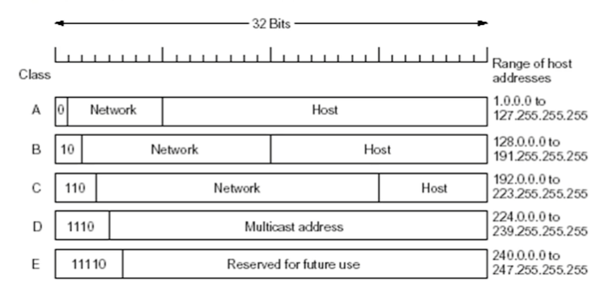

A、B、C为单播；D为单播；E为预留

a类第一个字节是网络号；路由是针对网络号转发，而不是单个地址，以网络为单位进行路由

#### 特殊IP地址

约定：
·子网部分：全为0--本网络
·主机部分：全为0--本主机
·主机部分：全为1-广播地址，这个网络的所有主机

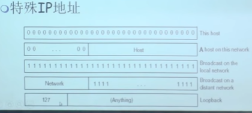

目标地址是127.X.X.X是回路地址，到了ip层会反转朝上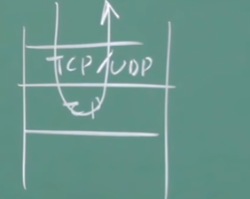

### 内网地址

只在局部网络有意义，内网地址不会向外转发，用于区分不同的设备

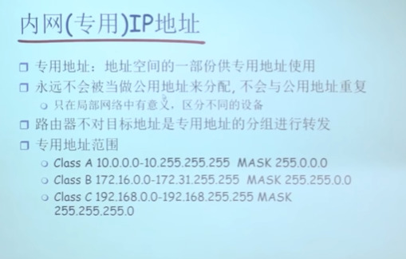

### IP编址 CIDR classless interdomain routing（无类域间路由）

路由器中路由信息计算以网络为单位，只需要关注网络号

(无类域间路由)--解决一般的五类ip划分，主机部分不是过大就是太小，避免资源浪费，需要任意划分网络号长度
	子网部分可以在任意的位置
	地址格式：a.b.c.d/×,其中×是地址中子网号的长度

其中为了识别网络号部分，需要对应的**子网掩码**，网络号部分取1，主机号部分取0，然后和ip地址取与运算，就可以提出子网号

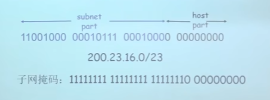

从IP分组提取IDA，与mask取与后尝试与DSN匹配，子获取下一跳hop的IP地址，得出MAC地址，交给链路层，通过相应接口转发；如果没有匹配项则通过默认表项转发地址，通常是一个网络的出口

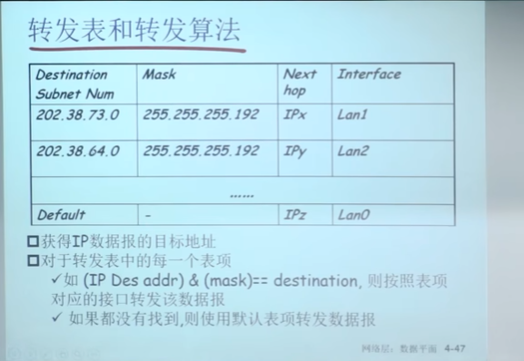

### 如何获得一个IP地址

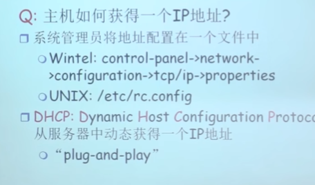

动态获得IP地址，自动配置地址，只有上网的时候才分配地址，最大化利用地址；

#### DHCP 动态主机配置协议

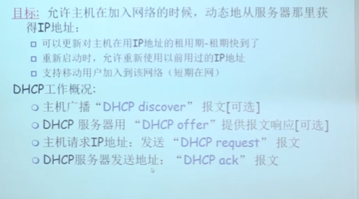

主机上网时，进行广播，找到可用的DHCP server

#### DHCP client-server scenario

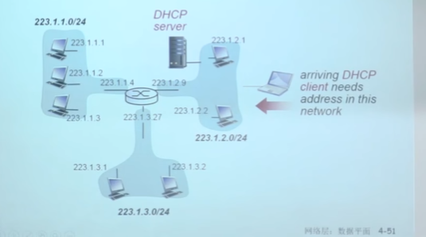

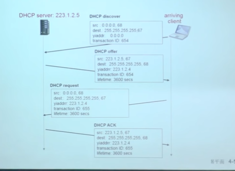

没有获得ip地址的时候，本主机使用32位全0地址，目标地址使用32全1

#### DHCP实例

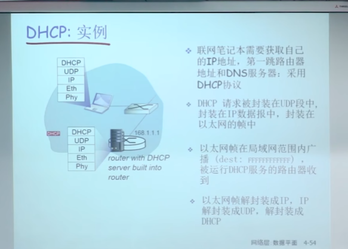

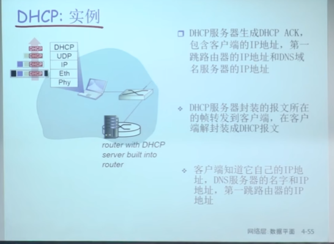

第一次是广播，第二次是单播；

在 DHCP 的交互过程中，通常涉及以下四个基本步骤，称为 DORA 过程：

1. **Discover**（发现）：
   - 客户端向网络广播一个 DHCP DISCOVER 消息，寻找可用的 DHCP 服务器。
2. **Offer**（提供）：
   - DHCP服务器收到 DISCOVER 消息后，向客户端广播一个 DHCP OFFER 消息，提供 IP 地址和其他配置信息。
3. **Request**（请求）：
   - 客户端从一个或多个服务器收到 OFFER 后，选择其中一个（通常是第一个响应的服务器）并向该服务器发送 DHCP REQUEST 消息，请求所提供的配置信息。
4. **Acknowledgement**（确认）：
   - DHCP服务器接收到客户端的 REQUEST 消息后，发送 DHCP ACK 消息作为响应，确认对 IP 地址和配置参数的租约。这个 ACK 消息包含了客户端需要的所有配置信息，如 IP 地址、子网掩码、默认网关、DNS服务器地址等。

#### ISP如何获得地址块

ICANN:Internet Corporation for Assigned Names and Numbers

- 分配地址
- 管理DNS
- 分配域名，解决冲突

#### DNS和IP地址的关系

- DNS的核心作用是将域名转换为IP地址。当你在浏览器中输入一个网址时，DNS服务器将这个域名解析成相应的IP地址，以便路由器和交换机能够理解如何将你的请求路由到正确的服务器。

www.example.com为域名对应唯一的IP地址192.168.1.1

#### ipv4 ipv6

1. **IPv4**：基于32位地址方案，例如 `192.168.1.1`。
2. **IPv6**：基于128位地址方案，以应对IPv4地址耗尽的问题，例如 `2001:0db8:85a3:0000:0000:8a2e:0370:7334`。

#### 默认网关-端口-数据链路层

在网络通信中，理解默认网关、端口以及数据链路层之间的关系有助于掌握数据是如何在网络中传输的。这些概念在网络结构中起着各自独特而又相互关联的角色。

##### 默认网关

默认网关是一个网络设备（通常是路由器），它在本地网络（如家庭或办公室网络）中扮演着数据包的中转站角色，用于转发出站数据包至外部网络（如互联网）。当一个设备尝试发送数据到一个不在同一局域网（LAN）内的IP地址时，它会将数据发送到默认网关，由网关进一步路由到目的地。

##### 端口

端口是一个与IP地址结合使用的数字标识，用于区分同一台计算机上的不同网络服务或应用程序。例如，HTTP通常使用端口80，而HTTPS使用端口443。在网络通信中，端口确保正确的程序或服务能接收到特定的网络消息。

##### 数据链路层

数据链路层是OSI模型的第二层，负责在直接连接的网络设备之间进行数据帧的传输。它处理从一个节点到另一个节点的物理接口的通信，包括错误检测和帧的重传。这一层在物理层（传输媒介）之上提供了一个可靠的数据传输服务。

##### 它们之间的关系

1. **数据链路层与默认网关**：
   - 当数据包需要被发送到本地网络外部时，数据链路层负责将数据包传输到配置的默认网关。这通常涉及MAC地址寻址，因为默认网关具有一个物理地址，数据链路层通过这个地址将数据帧直接传送给网关。

2. **端口与默认网关**：
   - 虽然端口操作主要在传输层进行，但当数据从默认网关传出或传入时，端口信息确保数据能被正确地传递到目的地服务。例如，从互联网访问某网站时，默认网关将传入的HTTP或HTTPS请求基于端口转发到内网的正确服务器。

3. **数据链路层与端口**：
   - 数据链路层主要关注帧的传输而不直接处理端口信息。端口信息被封装在网络层以上的数据包中，数据链路层确保这些包在局域网中从一端传到另一端，无论包含何种端口信息。

##### 总结

默认网关作为数据出入局域网的中转点，端口作为区分服务的标识，以及数据链路层作为实现物理传输的媒介，这三者在网络通信中各司其职，共同确保数据能从发送者高效、准确地传送到接收者。理解它们各自的功能及相互之间的关系，对于设计和维护网络系统非常重要。

### 路由聚集-层次编址Hierarchical Addressing-Route Aggregation

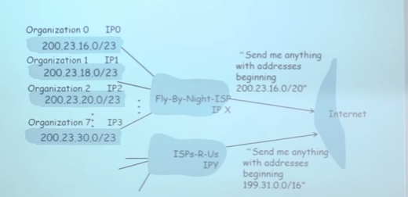

子网前缀相同的可以打包--内聚；

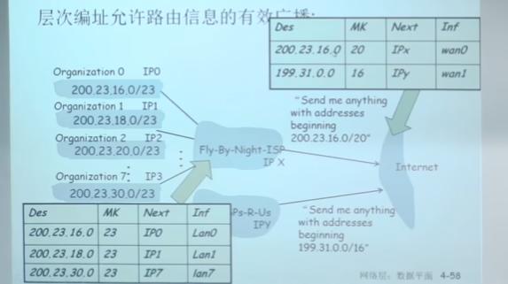

特殊路由信息

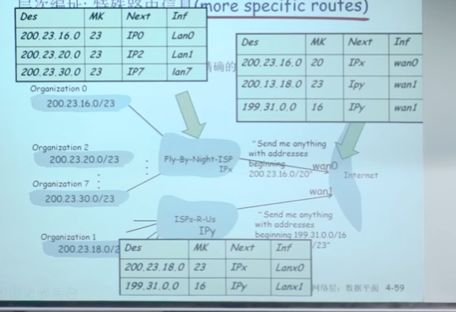

200.23.18.7同时右上角匹配第一个和第二表项，但是**最长匹配**-最精确，则是，匹配到第二项200.13.18.0/23，并且允许路由聚集空洞存在，即连续地址中某几个地址不进行聚合，而是单独独立聚集出来；则有些地址不会匹配到该聚集中。

### NAT：Network Address Translation

只有几个或者只有一个有效IP

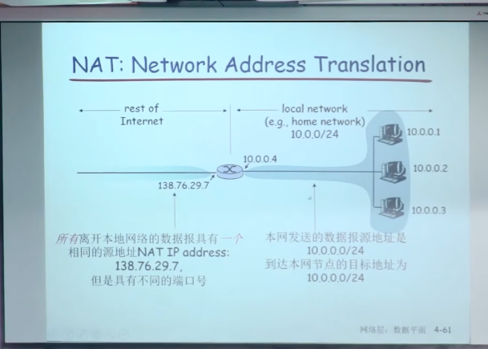

从本地网络时出去时换成机构统一地址；返回时，把机构统一源地址换成内网地址，则在路由器中需要记录；

#### 使用统一IP（唯一有效IP）动机

- 不需要从ISP分配一块地址，可用一个IP地址用于所有的（局域网）设备-省钱。
- 可以在局域网改变设备的地址情况下而无须通知外界
- 可以改变ISP(地址变化)而不需要改变内部的设备地址
- 局域网内部的设备没有明确的地址，对外是不可见的-安全

#### 实现

NAT路由器必须：

1. 外出数据包：替换**源地址和端口号**为NAT IP地址和新的端口号，目标IP和端口不变；远端的C/S将会用NAP IP地址，新端口号作为目标地址
2. 记住每个转换替换对（在NAT转换表中）：源IP,端口  vs NAP IP,新端口
3. 进入数据包：替换**目标IP地址和端口号，**采用存储在NAT表中的mapping表项，用（源IP,端口）

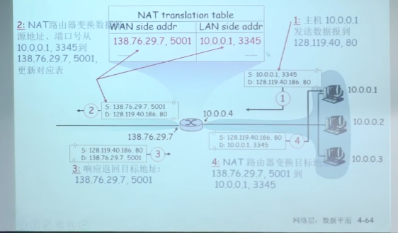

出去的时候，没有问题；但是外网访问的时候会有问题（端口有16-bit端口字段 6w个，支持多个会话，一个局域网）

#### 争议 NAT--主要是内网穿透

1. 路由器只应该对第3层-网络层做信息处理，而这里对端口号-传输层(4层)作了处理

2. 违反了end-to-end原则

   1. 端到端原则：复杂性放到网络边缘
      1. 无需借助中转和变换，就可以直接传送到目标主机
   2. NAT可能要被一些应用设计者考虑，eg.P2 P applications
   3. 外网的机器无法主动连接到内网的机器上

3. 地址短缺问题可以被IPv6解决

4. NAT穿越：如果客户端需要连接在NAT后面的服务器，如何操作

   1. 口客户端需要连接地址为10.0.0.1的服务器

      1. 服务器地址10.0.0.1LAN本地地址（客户端不能够使用其作为目标地址)
      2. 整网只有一个外部可见地址：
         138.76.29.7

   2. 1. 方案1：静态配置NAT:转发进来的对服务器特定端口连接请求，固定好

         e.g,(123.76.29.7,port2500)总是转发到10.0.0.1port25000

      2. 方案2：Universal Plug and Play(UPnP)Internet Gateway Device(IGD)协议.

         允许NATted主机可以：获知网络的公共IP地址(138.76.29.7)；列举存在的端口映射；增/删端口映射（在租用时间内）i.e.,自动化静态NAT端口映射配置

      3. 方案3：中继(used in Skype)
         oNAT后面的服务器建立和中继的连接
         o外部的客户端链接到中继
         o中继在2个连接之间桥接

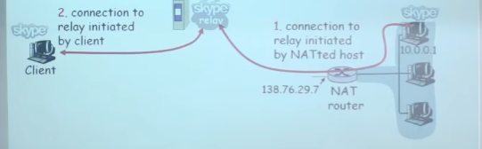

### IPV6--128位

1. 初始动机：32-bi计地址空间将会被很快用完
2. 另外的动机：
   1. 头部格式改变帮助加速处理和转发
      1. TTL-1
      2. 头部checksum
      3. 分片
   2. 头部格式改变帮助QoS--Quality of Service
3. IPv6数据报格式：
   1. 固定的40字节头部
   2. 数据报传输过程中，不允许分片。当链路MTU装不下分组，丢弃这个分组，通过ICMPv6协议错误报告，告知源主机，需要重新分组，路由器不进行分配

#### IPV6 头部Cont-与IPV4不同

1. Priority:标示流中数据报的优先级
2. Flow Label标示数据报在一个"flow.”(“fIow“"的概念没有被严格的定义)--同一个IP发出的数据，
3. Next header:标示上层协议

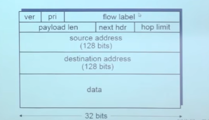

payload len载荷长度

next hdr下一个头部（数据应该交给哪一个上层协议处理）

hop limit=ipv4的TTL 跳限制

#### 相比ipv4的其它变化

1. Checksum:被移除掉，降低在每一段中的处理速度
2. Options:允许，但是在头部之外，被“Next Header”字段标示
3. ICMPv6,ICMP的新版本
   1. 附加了报文类型，e.g.“Packet Too Big'
   2. 多播组管理功能（ICMP协议整合到ICMP）

#### IPV4->IPV6的平滑过渡--Tunneling

隧道：IPv4路由器之间传输的IPv4数据报中携带IPv6数据报

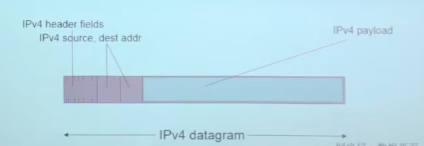

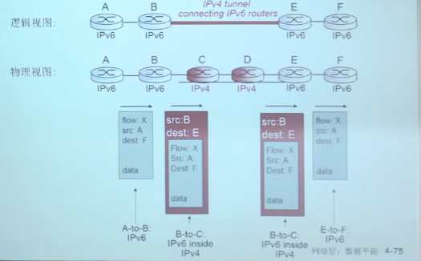

## 通用转发和SDN

### 路由器的网络层功能：

分布式实现路由功能；垂直实现数据平面和控制平面功能

- 转发：对于到来的分组按照路由表决定如何转发，**数据平面**
- 路由：决定路径，计算路由表；处在**控制平面**

还有其他种类繁多网络设备（中间盒）：

- 交换机；防火墙；NAT;IDS;负载均衡设备

- 未来：不断增加的需求和相应的网络设备。

- 需要不同的设备去实现不同的网络功能

  - 每台设备集成了控制平面和数据平面的功能

  - 控制平面分布式地实现了各种控制平面功能

  - 升级和部署网络设备非常困难

### 网络设备控制平面的实现方式特点

- 互联网网络设备：传统方式都是通过分布式，每台设备的方法来实现数据平面和控制平面功能
  - 垂直集成：每台路由器或其他网络设备，包括：
    - 硬件、在私有的操作系统
    - 互联网标准协议IP,RIP,IS-IS,OSPF,BGP的私有实现
      从上到下都由一个厂商提供（代价大、被设备上“绑架”“）
  - 每个设备都实现了数据平面和控制平面的事情
    - 控制平面的功能是分布式实现的
  - 设备基本上只能（分布式升级困难）按照固定方式工作，控制逻辑固化。不同的网络功能需要不同的middleboxes”:防火墙、负载均衡设备、NAT boxes,
- （数据+控制平面）集成>（控制逻辑）分布->固化
  - 代价大；升级困难；管理困难等

### 传统方式实现网络功能的问题

- 垂直集成>昂贵、不便于创新的生态

- 分布式、固化设备功能==网络设备种类繁多

  - 无法改变路由等工作逻辑，无法实现流量工程等高级特性
  - 配置错误影响全网运行；升级和维护会涉及到全网设备：管理困难
  - 要增加新的网络功能，需要设计、实现以及部署新的特定设备，设备种类繁多

  2005：开始重新思考网络控制平面的处理方式

1. 集中：远程的控制器集中实现控制逻辑
2. 远程：数据平面和控制平面的分离

### SDN

逻辑上集中的控制平面

一个不同的（通常是远程）控制器和CA交互，控制器决定分组转发的逻辑（可编程），CA所在设备执行逻辑。

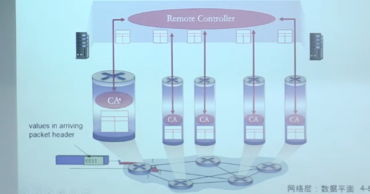

#### SDN的主要思路

- 网络设备数据平面和控制平面分离
- 数据平面-分组交换机
  1. 将路由器、交换机和目前大多数网络设备的功能进一步抽象成：按照流表（由控制平面设置的控制逻辑）进行PDU(帧、分组)的动作（包括转发、丢弃、拷贝、泛洪（广播）、阻塞)
  2. 统一化设备功能：SDN交换机（分组交换机），执行控制逻辑
- 控制平面-控制器+网络应用
  - 分离、集中
  - 计算和下发控制逻辑：**流表**

#### SDN控制平面和数据平面分离的优势

- **水平集成**控制平面的开放实现（而非私有实现)，创造出好的产业生态，促进发展
  - 分组交换机、控制器和各种控制逻辑网络应用app可由不同厂商生产，专业化，引入竞争形成良好生态
- **集中式**实现控制逻辑，网络管理容易：
  - 集中式控制器了解网络状况，编程简单，传统方式困难
  - 避免路由器的误配置
- 基于流表的**匹配+行动**（openflow-南向接口标准）的工作方式允许“可编程的”分组交换机
  - 实现流量工程等高级特性
  - 在此框架下实现各种新型（未来）的网络设备
- 可以定制路由路径，流量工程相对简单，可以同时走多条道；传统方式困难，路径完全取决于边的代价，只能走一条道

#### SDN架构

##### SDN架构：数据平面交换机

数据平面交换机

1. 快速，简单，商业化交换设备采用硬件实现通用转发功能

2. 流表被控制器计算和安装

3. 基于**南向API**(例如OpenFlow),SDN控制器访问基于流的交换机

   1. 定义了哪些可以被控制哪些不能

4. 也定义了和控制器的协议(egOpenFlow)

   

##### SDN架构：SDN控制器

SDN控制器（网络OS）：

1. 维护网络状态信息
2. 通过上面的**北向API**和网络控制应用交互
3. 通过下面的**南向API**和网络交换机交互
4. 逻辑上集中，但是在实现上通常由于性能、可扩展性、容错性以及鲁棒性采用分布式方法

##### SDN架构：控制应用

网络控制应用：

1. 控制的大脑：采用下层提供的服务(SDN控制器提供的API),实现网络功能
   1. 路由器交换机
   2. 接入控制防火墙
   3. 负载均街
   4. 其他功能
2. 非绑定：可以被第三方提供,与控制器厂商以通常上不同，与分组交换机厂商也可以不同

#### 通用转发SDN

每个路由器包含一个流表，由逻辑上集中的控制器集中和下发

#### OpenFlow数据平面抽象

1. 流：由分组（帧）头部字段所定义

2. 通用转发：简单的分组处理规则

   1. pattern模式：将分组头部字段和流表进行匹配
   2. 行动：对于匹配上的分组，可以是丢产、转发、修改，将匹配的分组发送给控制器

   1. 优先权Priority:几个模式匹配了，优先采用哪个，消除歧义

3. 计数器Counters:.#bytes以及#packets

#### OVERflow抽象

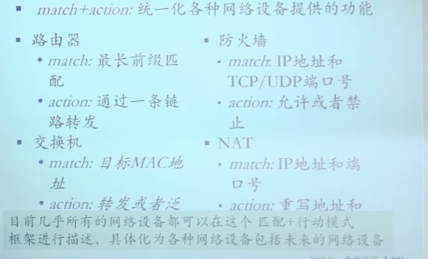

#### 流表结构

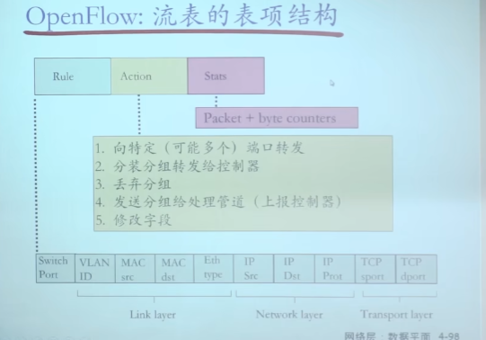

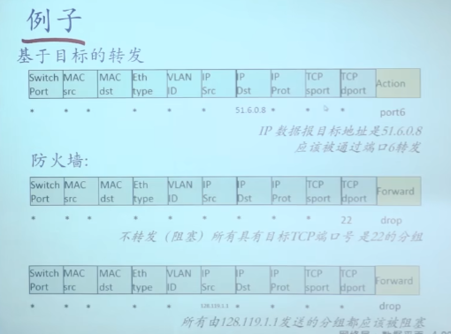

## 总结——网络层数据平面

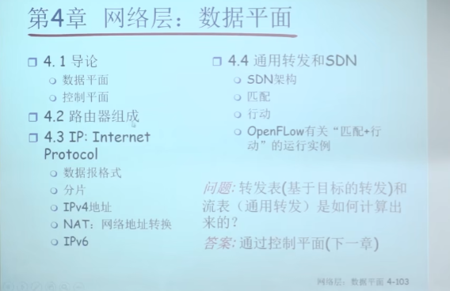

# 网络层——控制平面

路由器之间的最优路径=子网之间的最优路径

图抽象，边和路径的代价

最优化原则=汇集树（sink tree）

路由的原则-正确、简单、健壮（robustness）

自动化是鲁棒性、

路由选择算法：稳定、公平、最优（也是次优）

1. 路由算法类别：全局（每个路由器知道全局拓扑）、分布式（只知道邻居，通过邻居汇集数据、迭代）
2. 动态-自适应变化 非自适应-路由表提前计算好

## 路由选择算法

迪杰斯特拉-链路状态算法ls——linked state

通过泛洪获取网络拓扑，边的代价

发现邻居：通过所有interface发送广播

广播风暴：记录顺序号、TTL

可靠泛洪：需要返回确认信息，不接受确认一直发送

动态路由选择：

- 距离矢量路由选择算法（distance vector routing）DV
  - 每个路由器维护一张表
  - 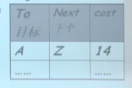 
  - 和邻居交换路由表（互通有无）
  - 距离矢量算法Bellman Ford（取当前邻居、邻居到目标最优值之和，这些和的最小值，不断迭代，分布式计算）
    - 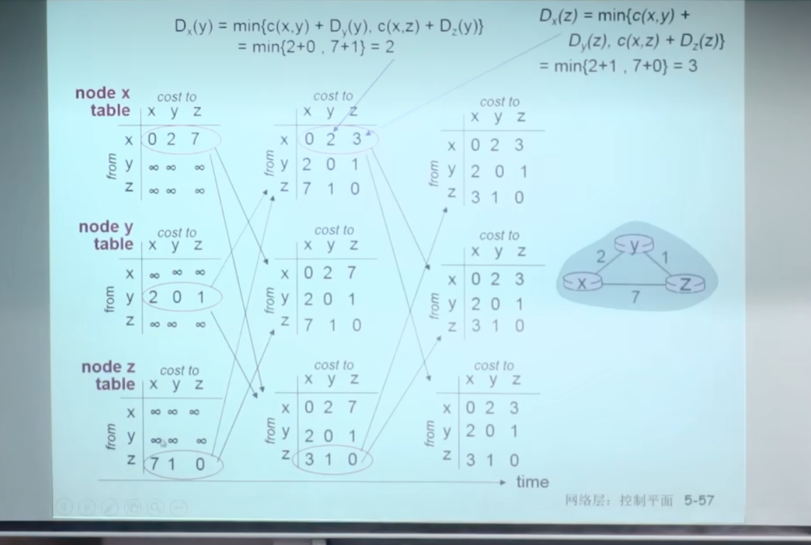
  - 每个节点将自己的计算机额u共传输给邻居
  - 异步迭代
    - 我到邻居cost变化需要计算；邻居传值触发我的计算
  - 分布：每个节点只是在自己的DV值改变后向邻居通报
  - 好消息传得快（链路打通，更短路径）
  - 坏消息传得慢（链路断掉了，会形成环）-无穷计算
  - 无穷计算解决spilt horizon算法-水平分裂——水平分裂在环中也不好用
- 链路状态路由选择（link state routing）LS
  - 迪杰斯特拉算法
  - 拿到整个网络拓扑，一次性计算

### LS和DV算法的比较

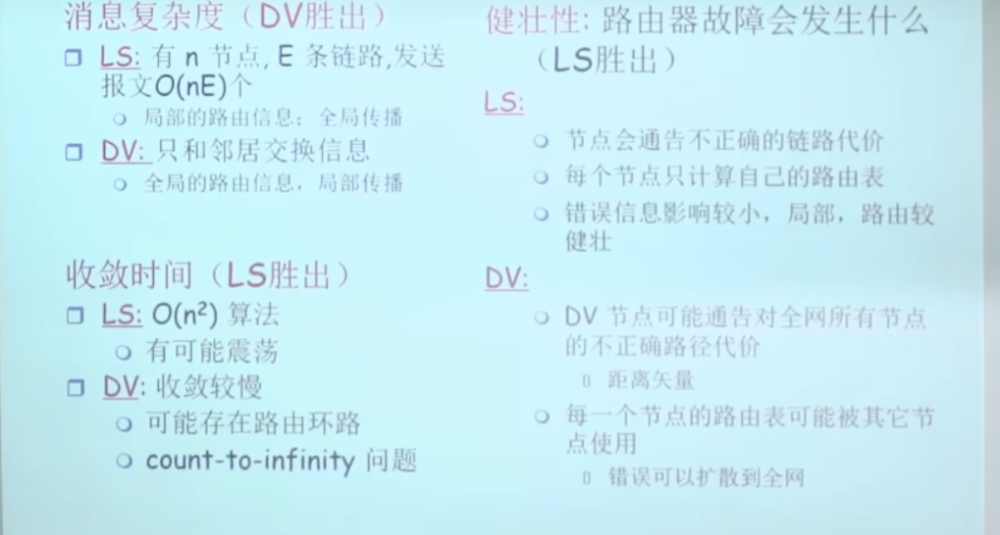

LS的链路状态需要泛洪

为何ls一个发疯不会导致全部发疯

### 协议最终具体

自治系统内部使用——RIP：DV算法（16、30定期/请求触发，25）
