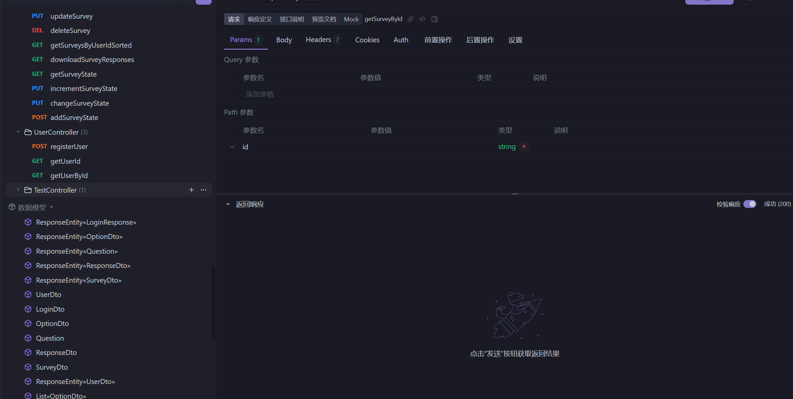
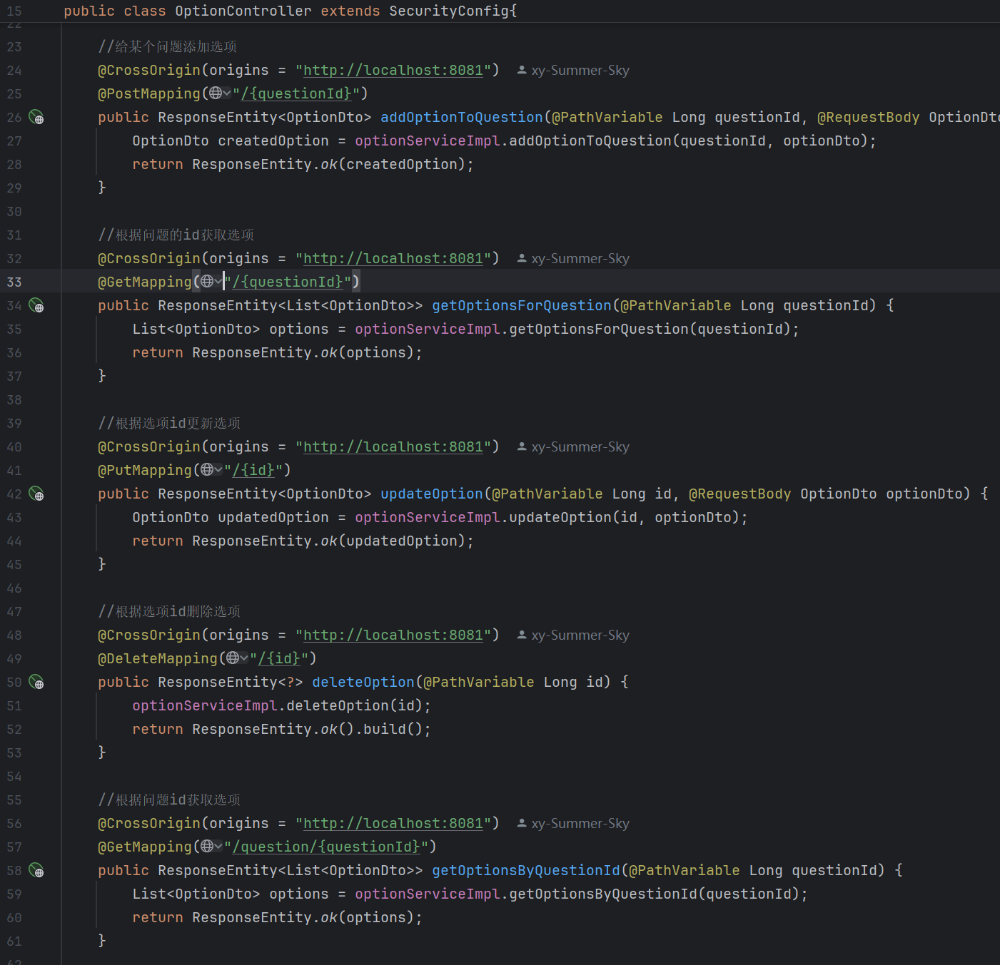
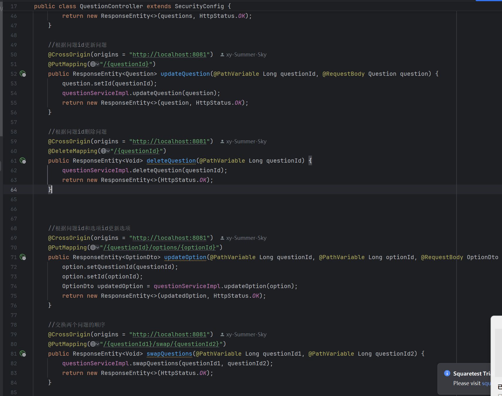
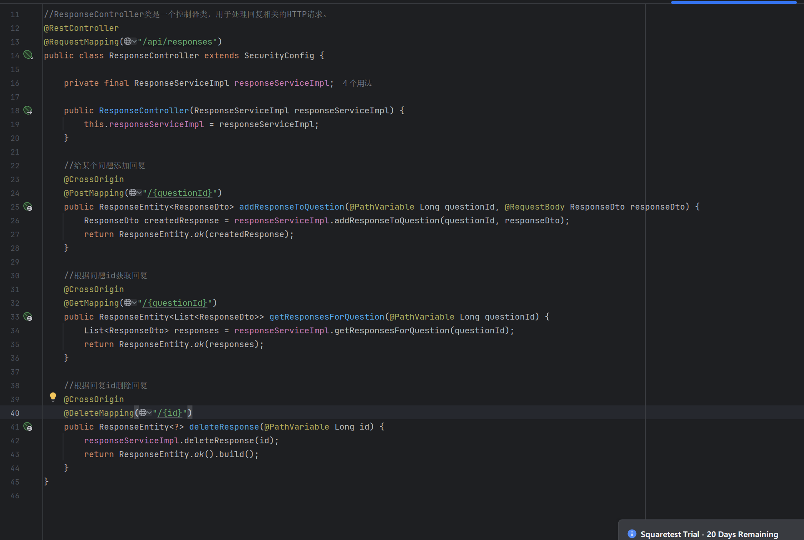
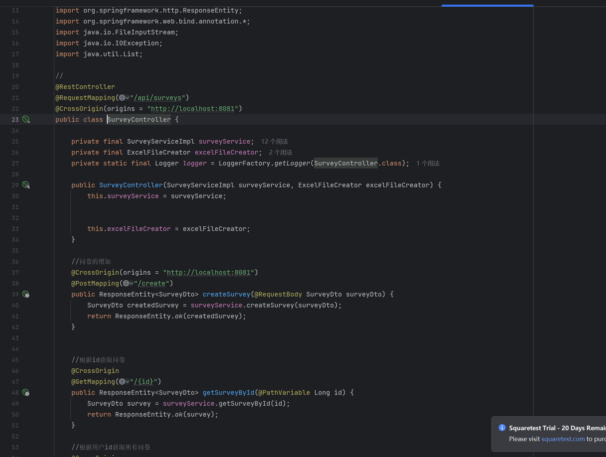
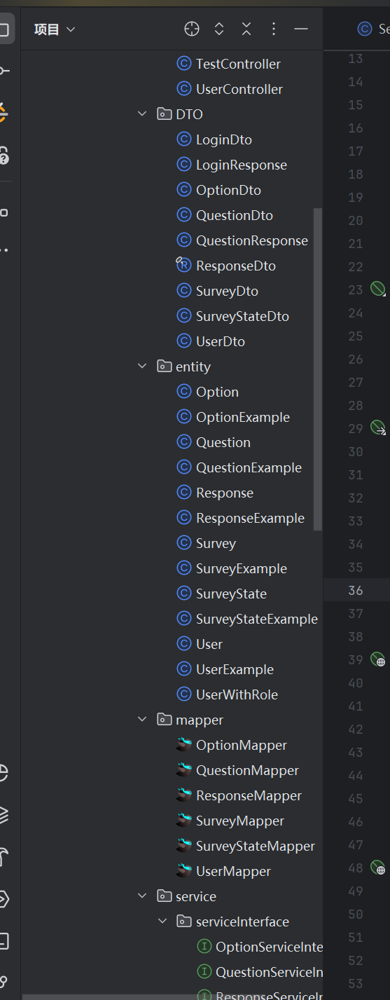
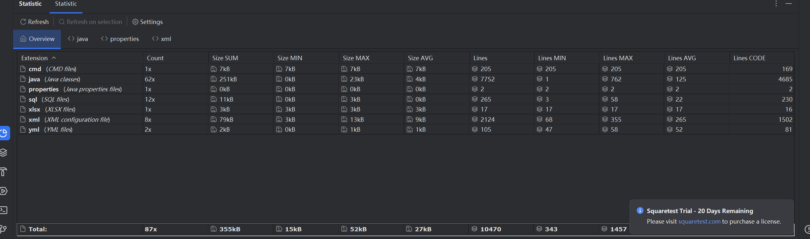
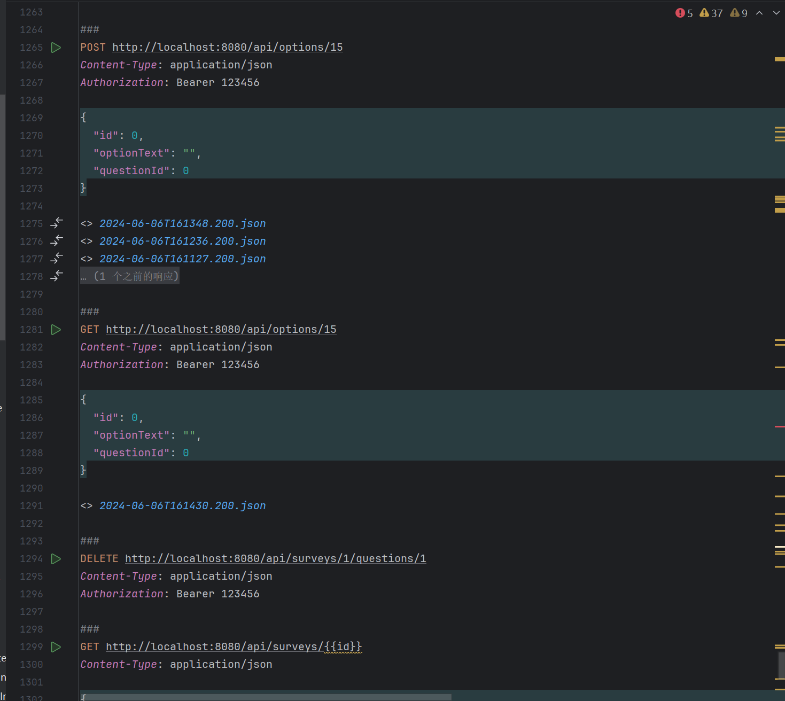
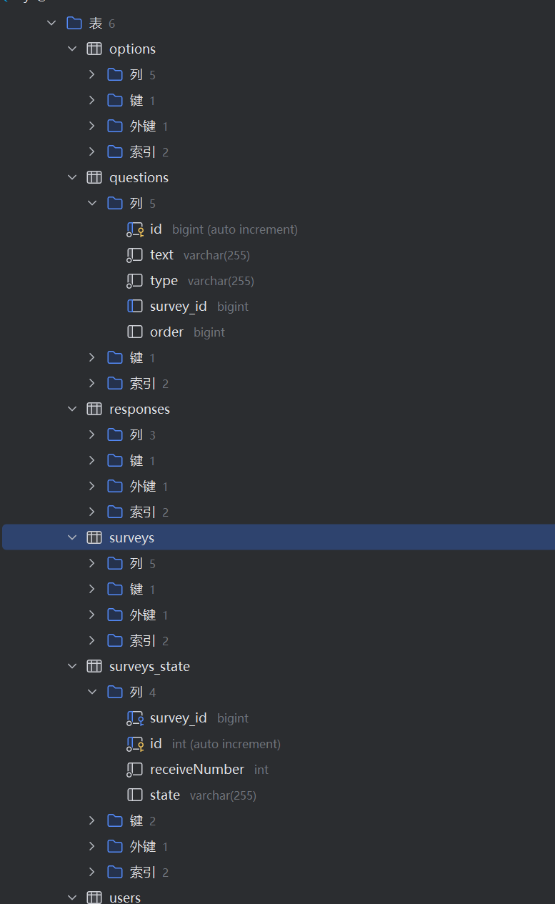
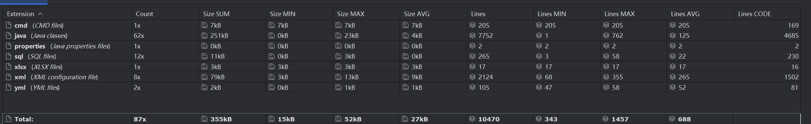

#                                 			个人周报

​												 4组 石夏源 202230091036

## 成果概要

本阶段进行了大量的功能开发，进行集中的功能实现，做为前后端的统筹，除了功能的实现规划，我实际工作中主要在于spring boot框架的后端数据库操作的api实现，同时和前端进行对接。

## 技术成功展示

成功沿用SSM框架这个标准MVC模式，通过在controller层提供简单直观的api和前端进行交互对接，同时在APIFOX软件进行api的实时同步共享以及api功能测试。

### API共享

### Controller层的代码实现

#### OptionController层

#### QuestionController

#### ResponseController层

#### SurveyController层

#### 项目层次结构（目录结构）

#### 代码统计（后端全部代码）

#### 在IDE中进行http请求测试过程截图

#### 数据库表结构截图

在数据库设计过程中，为了避免一些id对应错误，从用户到到选项/回答引入了一系列外键依赖，增加数据的可靠性

### 代码数据统计

## 开发遇到的困难/坚决

### 数据库操作的熟悉

在开发过程中，由于对数据库中一些关键字的不熟悉（最经典的order），在书写过程中忘记加反引号，导致的各种错误

对数据库text类型的数据，进行传输时，变量类型的不匹配、查询方法的错误使用，导致数据的丢失（我觉得这也是分层复杂的一个比较容易导致问题的点）

### http请求控制

在提出使用SpringSecurity和DynamicRoleFilter对http请求进行过滤和权限控制时，由于网络安全方面的知识欠缺，在和实际开发此功能的同学商议时遇到较大障碍，（例如如何区分游客、问卷创建者、开发人员的身份，以及对不同身份的人具体应该开放哪些api），并且在实际开发过程中由于知识的不全面，常误操作对测试过程造成较大阻碍。

但经过一番调教，我们约定开发者使用统一的内部的api，并且，经过配置，开发者可以无阻碍的使用所有api以开发测试。

### 响应式数据对页面的动态刷新困扰

在和前端开发者进行对接商议时，我们发现，在数据库数据发生更改或者重新获取数据用于动态渲染页面时，总是会发生数据刷新不及时，甚至在预计有数据的的位置访问不到相应的数据。

基于此，我们决定将数据传输对象进行更改合并，让前端的数据获取和刷新减少循环、嵌套深度，尽力保证一次性全部相关数据的获取，将一定的操作放在后端服务层进行处理来反馈给前端

### 剪枝

在没有进行正式对接前，我们各自独立开发，后端有许多多余、重复的api实现，以及一些api的可用性不高，同时造成前端开发时对api产生混淆，多个api的组合使用，增加代码量

在不断的对接过程中，我进一步区分DTO和DAO层，避免将不必要的数据传送到前端，将DAO数据进行各种组合、拆分为更加适配需求的DTO，它们的差异化不断增大，各自服务于不同的需求，并且抛弃一些多余的api，对简单功能的api进行合并。

## 收获

开发过程中，我深刻理解了分层开发、前后端分离开发模式的优势所在，将功能和数据进行封装，前端和后端分别对应不同的数据模型，我选择将这二中数据模型的转换放在Service层，这样开发中利用数据库对应的数据库实体类，对数据进行直接快捷的操作，当数据传输模型因为前端或者后端的不同的要求需要做出改变时，对数据库层的影响很小，只需要在Service进行合适的转换即可；同时前后端分离，前端直接调用api，并且参考apifox共享的相关数据传输模型，可以与后端进行隔绝，无需理会后端的实现逻辑，当后端逻辑功能发生改变，只要api和数据传输模型(dto)不发生变化，前端开发就不会受到影响，前后端可以更加专注于自己负责板块的实现。

在和前端对接过程中，我也了解到，（vue3）前端的路由、页面跳转、事件监听、组件渲染

这种开发模式，极大的简化了代码的修改复杂程度，更加灵活多变，各个层次分工明确，代码不混杂在一起，从程序员角度也真是一种美如画的开发过程，

