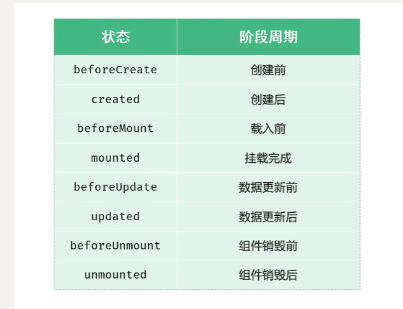
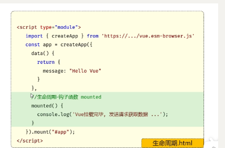

# 缩写术语

**Ajax：****Asynchronous JavaScript And XML**使用异步的方式与服务器通信，不需要中断操作。

**Axios**：ajax i/o system。 是一个基于 Promise 的 HTTP 库，可以用在浏览器和 node.js 中；是请求资源的模块；通过promise对**ajax的封装**。简单来说就是ajax技术实现了局部数据的刷新，aios实现了对ajax的封装，aios有的ajax都有，ajax有axios不一定有。

**Promise：是现代 JavaScript 中异步编程的基础。它是一个由**异步函数返回的对象**，可以指示操作当前所处的状态。在 Promise 返回给调用者的时候，操作往往还没有完成，但 Promise 对象提供了方法来处理操作最终的成功或失败。

**XML:**简介：XML,全称为可扩展标记语言(e**X**tensible **M**arkup **L**anguage),是一种用于描述、传输和存储数据的语言。它被设计用来**传输和存储**数据，与HTML不同，XML的主要目的不在于显示数据，而是**强调数据的结构性。**它是一种标记语言，使用类似HTML的标签表示数据的结构和其他信息。XML提供了一种独立于应用程序或供应商的描述和交换结构化数据的统一方法，非常适合万维网传输。它是互联网环境下跨平台、内容依赖的技术，也
是当今处理分布式结构化信息的有效工具。

HTML：网页结构

CSS：

# Vue 生命周期

生命周期的八个阶段：每个阶段会自动执行一个生命周期方法（钩子），让开发者有机会在特定的阶段执行自己的代码--**常用mounted**，mounted与函数并列——用来发送（异步请求）请求、获取数据库信息，来渲染信息

# Ajax--

